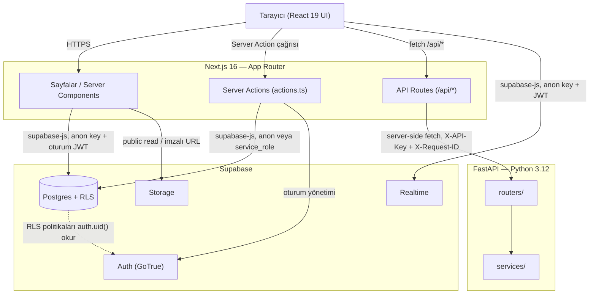
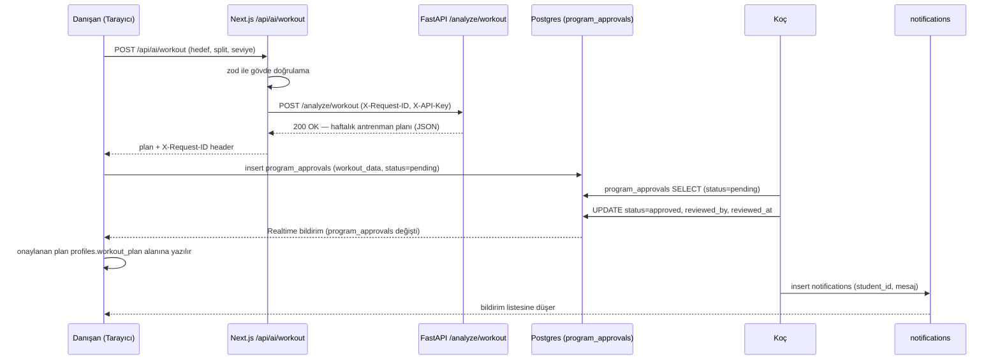

# Closed-Loop Coaching Hub

Koçların danışanlarını antrenman, beslenme ve ilerleme verisi üzerinden uçtan uca yönettiği; yapay zeka destekli plan önerilerinin daima bir koç onayından geçtiği ("closed-loop") online fitness koçluğu platformu.


> `<KULLANICI_ADI>/<REPO_ADI>` yer tutucusunu bu deponun gerçek GitHub sahibi/adıyla değiştirin (rozetin çalışması için gereklidir).

## İçindekiler

1. [Özellikler](#özellikler)
2. [Mimari](#mimari)
3. [Teknoloji Yığını](#teknoloji-yığını)
4. [Hızlı Başlangıç](#hızlı-başlangıç)
5. [Ortam Değişkenleri](#ortam-değişkenleri)
6. [Geliştirme Komutları](#geliştirme-komutları)
7. [Test](#test)
8. [Veritabanı ve RLS](#veritabanı-ve-rls)
9. [Docker ile Çalıştırma](#docker-ile-çalıştırma)
10. [Dağıtım](#dağıtım)
11. [Güvenlik](#güvenlik)
12. [Proje Yapısı](#proje-yapısı)
13. [Katkı ve Lisans](#katkı-ve-lisans)

---

## Özellikler

### Koç (`admin`) perspektifinden

- Tüm danışanların profilini, ilerleme geçmişini ve form-check fotoğraflarını tek panelden görme.
- Danışanların önerdiği AI antrenman/beslenme planlarını **onaylama veya reddetme** (`program_approvals`) — hiçbir plan koç onayı olmadan danışanın aktif programına yazılmaz.
- Duyuru ve bireysel bildirim gönderme.
- Danışanlarla gerçek zamanlı, çevrimiçi durumu görünen birebir sohbet.
- Danışan hesabı oluşturma/yönetme (rol ataması dahil).

### Danışan (`student`) perspektifinden

- **Form check**: haftalık kilo girişi + önden/arkadan poz fotoğrafı; geçmiş kayıtlarla **before/after** kıyaslama.
- Kilo ve makro (protein/karbonhidrat/yağ) trendlerini grafiklerle (Recharts/Chart.js) izleme.
- **Canlı gym modu**: antrenman sırasında set bazlı ağırlık/tekrar/RPE girişi (`workout_logs`).
- Hedef, split tipi ve seviyeye göre **AI antrenman planı** ve antropometrik verilere göre **AI beslenme planı (BMR/TDEE + makro dağılımı)** üretimi.
- Üretilen programı koç onayına gönderme; onaylanınca profile yazılır ve bildirim düşer.
- Günlük su/sodyum/makro girişi (günde tek kayıt, `daily_logs`).
- Ardışık form-check günlerine dayalı **streak (seri) takibi**.
- Koçla gerçek zamanlı sohbet ve okunmamış bildirim rozeti.
- **PWA**: ana ekrana eklenebilir, `workout_logs`/`profiles` verisi için çevrimdışı önbellek (`next-pwa`, `NetworkFirst`); form-check fotoğrafları cihazda tutulmaz (`NetworkOnly`).
- Koyu tema (`next-themes`, sistem tercihiyle uyumlu + manuel toggle).

---

## Mimari

Next.js sunucu tarafı; Supabase'e (Postgres/Auth/Storage/Realtime) doğrudan, Python AI servisine ise **yalnızca kendi API route'ları üzerinden proxy** ile bağlanır. Tarayıcı FastAPI'yi hiçbir zaman doğrudan görmez.



**Danışan AI antrenman planı ister → koç onaylar** akışı:



Derinlemesine mimari kararlar, veri modeli ve ADR'ler için bkz. [`docs/ARCHITECTURE.md`](docs/ARCHITECTURE.md).

---

## Teknoloji Yığını

| Katman                    | Teknoloji                            | Sürüm             | Amaç                                         |
| ------------------------- | ------------------------------------ | ----------------- | -------------------------------------------- |
| Frontend framework        | Next.js (App Router)                 | 16.2.10           | SSR/RSC, routing, server actions, API routes |
| UI kütüphanesi            | React                                | 19.2.4            | Bileşen modeli                               |
| Dil                       | TypeScript (strict)                  | ^5.7.2            | Tip güvenliği                                |
| Stil                      | Tailwind CSS                         | ^3.4.19           | Utility-first CSS                            |
| Veri çekme/önbellek       | TanStack Query                       | ^5.62.11          | Sunucu state yönetimi, cache invalidation    |
| Form + doğrulama          | React Hook Form + Zod                | ^7.54.2 / ^3.24.1 | Form state ve şema doğrulama                 |
| Bildirim (toast)          | Sonner                               | ^1.7.2            | Kullanıcıya geri bildirim                    |
| Grafikler                 | Recharts, Chart.js + react-chartjs-2 | ^3.9.1 / ^4.5.1   | Kilo/makro trend grafikleri                  |
| Tema                      | next-themes                          | ^0.4.6            | Koyu/açık tema                               |
| PWA                       | next-pwa                             | ^5.6.0            | Service worker, çevrimdışı önbellek          |
| Loglama (frontend)        | pino                                 | ^9.6.0            | Yapılandırılmış JSON log                     |
| Backend veritabanı        | Supabase (Postgres)                  | 15.8.x            | Veri, Auth, Storage, Realtime                |
| İstemci SDK               | @supabase/supabase-js                | ^2.110.0          | Supabase erişimi                             |
| AI servisi                | FastAPI                              | ≥0.115            | Antrenman/beslenme/öneri motoru              |
| AI servis dili            | Python                               | ≥3.12             | —                                            |
| AI servis doğrulama       | Pydantic + pydantic-settings         | ≥2.9 / ≥2.6       | Şema ve ayar doğrulama                       |
| AI servis loglama         | structlog                            | ≥24.4             | Yapılandırılmış JSON log                     |
| AI servis rate limit      | slowapi                              | ≥0.1.9            | İstek sınırlama                              |
| Paket yöneticisi (Python) | uv                                   | —                 | Bağımlılık/venv yönetimi                     |
| Birim/bileşen test        | Vitest + Testing Library             | ^2.1.8            | Frontend testleri                            |
| Backend test              | pytest + pytest-cov                  | ≥8.3              | FastAPI testleri                             |
| E2E test                  | Playwright                           | ^1.49.1           | Uçtan uca senaryolar                         |
| CI                        | GitHub Actions                       | —                 | Lint/type-check/test/build/docker            |
| Konteynerleştirme         | Docker + docker compose              | —                 | Yerel/prod paketleme                         |

---

## Hızlı Başlangıç

### Önkoşullar

- **Node.js ≥ 20.11** (bkz. `package.json#engines`)
- **Python ≥ 3.12**
- **[uv](https://docs.astral.sh/uv/)** — Python paket/venv yöneticisi
- **[Supabase CLI](https://supabase.com/docs/guides/cli)** — yerel Postgres/Auth/Storage/Studio için
- Docker (opsiyonel — bkz. [Docker ile Çalıştırma](#docker-ile-çalıştırma))

### Adımlar (macOS/Linux — bash)

```bash
# 1) Depoyu klonlayın
git clone <repo-url>
cd my-coaching-appv2

# 2) Frontend bağımlılıklarını yükleyin
npm ci

# 3) Ortam değişkenlerini kopyalayıp doldurun
cp .env.example .env.local
# .env.local dosyasını açıp Supabase proje bilgilerinizi girin

# 4) Yerel Supabase yığınını başlatın (Postgres + Auth + Storage + Studio)
npx supabase start

# 5) Migration'ları uygulayın (+ yerel seed verisi)
npm run db:migrate
# not: db:migrate `supabase db push` çalıştırır; TAMAMEN sıfırdan + seed için
# `supabase db reset` kullanın (bkz. supabase/README.md — bu komut veriyi SİLER)

# 6) TypeScript tiplerini üretin
npm run db:types

# 7) AI backend bağımlılıklarını kurun
cd ai_backend
uv sync
cd ..
```

İki ayrı terminalde geliştirme sunucularını başlatın:

```bash
# Terminal 1 — Next.js (http://localhost:3000)
npm run dev

# Terminal 2 — FastAPI (http://localhost:8000, --reload ile hot-reload)
cd ai_backend
uv run uvicorn app.main:app --reload
```

### Adımlar (Windows — PowerShell)

```powershell
git clone <repo-url>
Set-Location my-coaching-appv2

npm ci

Copy-Item .env.example .env.local
# .env.local dosyasını açıp Supabase proje bilgilerinizi girin

npx supabase start
npm run db:migrate
npm run db:types

Set-Location ai_backend
uv sync
Set-Location ..
```

İki ayrı PowerShell penceresinde:

```powershell
# Pencere 1
npm run dev

# Pencere 2
Set-Location ai_backend
uv run uvicorn app.main:app --reload
```

Uygulama `http://localhost:3000`, AI servisi `http://localhost:8000` (Swagger: `/docs`) adresinde çalışır.

---

## Ortam Değişkenleri

### Next.js (`.env.local`, kaynak: `.env.example`, doğrulama: `src/env.ts` ile zod)

| Değişken                        | Zorunlu mu                                  | Varsayılan              | Kullanıldığı yer           | Açıklama                                                                                                              |
| ------------------------------- | ------------------------------------------- | ----------------------- | -------------------------- | --------------------------------------------------------------------------------------------------------------------- |
| `NEXT_PUBLIC_SUPABASE_URL`      | Evet                                        | —                       | İstemci + sunucu           | Supabase proje URL'i. Build-time'da tarayıcı paketine gömülür.                                                        |
| `NEXT_PUBLIC_SUPABASE_ANON_KEY` | Evet                                        | —                       | İstemci + sunucu           | Supabase anon/public anahtarı. RLS ile korunur, istemciye açık olması güvenlidir.                                     |
| `SUPABASE_SERVICE_ROLE_KEY`     | Yalnızca admin server action'ları için      | —                       | **Yalnızca sunucu**        | RLS'yi bypass eden servis rolü anahtarı.                                                                              |
| `AI_BACKEND_URL`                | Hayır                                       | `http://localhost:8000` | Sunucu (`/api/ai/*` proxy) | FastAPI servisinin adresi.                                                                                            |
| `AI_BACKEND_API_KEY`            | Hayır (FastAPI `API_KEY` ayarlıysa gerekli) | —                       | Sunucu                     | FastAPI'ye `X-API-Key` header'ı olarak iletilir.                                                                      |
| `NEXT_PUBLIC_APP_URL`           | Hayır                                       | `http://localhost:3000` | İstemci + sunucu           | Mutlak URL üretimi (ör. e-posta linkleri).                                                                            |
| `NODE_ENV`                      | Hayır                                       | `development`           | Sunucu                     | `development` \| `test` \| `production`.                                                                              |
| `LOG_LEVEL`                     | Hayır                                       | `info`                  | Sunucu                     | pino log seviyesi.                                                                                                    |
| `RATE_LIMIT_WINDOW_MS`          | Hayır                                       | `60000`                 | Sunucu (`proxy.ts`)        | Genel `/api/*` rate limit penceresi (ms).                                                                             |
| `RATE_LIMIT_MAX_REQUESTS`       | Hayır                                       | `60`                    | Sunucu (`proxy.ts`)        | Pencere başına genel istek sınırı. AI uçları (`/api/ai/*`) bundan bağımsız, sabit **20 istek/dakika** ile sınırlıdır. |

> **UYARI: `SUPABASE_SERVICE_ROLE_KEY` ASLA `NEXT_PUBLIC_` öneki ALMAMALI ve istemci koduna (bileşen, hook, `'use client'` dosyası) ASLA import EDİLMEMELİDİR.** Bu anahtar RLS'yi tamamen atlar; sızması tüm veritabanının ele geçirilmesi anlamına gelir. Kod tabanında yalnızca `src/lib/supabase/admin.ts` içinde, `server-only` paketiyle korunmuş şekilde kullanılmalıdır.

### FastAPI (`ai_backend/.env`, kaynak: `ai_backend/app/core/config.py`)

| Değişken       | Varsayılan              | Açıklama                                                                                                      |
| -------------- | ----------------------- | ------------------------------------------------------------------------------------------------------------- |
| `APP_NAME`     | `Coaching AI Backend`   | OpenAPI başlığı.                                                                                              |
| `VERSION`      | `1.0.0`                 | Uygulama sürümü.                                                                                              |
| `ENVIRONMENT`  | `development`           | `development` \| `staging` \| `production`. Production'da hata mesajları generic'e döner.                     |
| `CORS_ORIGINS` | `http://localhost:3000` | Virgülle ayrılmış izinli origin listesi (allowlist — `*` değil).                                              |
| `API_KEY`      | _(boş)_                 | Ayarlanırsa `/analyze/*` ve `/recommendations` için `X-API-Key` header'ı zorunlu olur.                        |
| `RATE_LIMIT`   | `60/minute`             | Genel istek sınırı. `/analyze/*` ve `/recommendations` ayrıca `20/minute` ile sınırlıdır; `/health*` muaftır. |
| `LOG_LEVEL`    | `INFO`                  | structlog log seviyesi.                                                                                       |
| `DATA_DIR`     | `ai_backend/data`       | CSV veri dosyalarının okunacağı dizin.                                                                        |

(`LOG_JSON` ve `is_production` gibi ek dahili ayarlar için `ai_backend/app/core/config.py` dosyasına bakın.)

---

## Geliştirme Komutları

### Next.js (`package.json`)

| Komut                   | Ne yapar                                                                          |
| ----------------------- | --------------------------------------------------------------------------------- |
| `npm run dev`           | Geliştirme sunucusu (`next dev --webpack`).                                       |
| `npm run build`         | Production build (`output: 'standalone'`).                                        |
| `npm run start`         | Production build'i çalıştırır.                                                    |
| `npm run lint`          | ESLint flat config (`eslint.config.mjs`) ile lint çalıştırır.                     |
| `npm run lint:fix`      | ESLint, otomatik düzeltmeyle.                                                     |
| `npm run type-check`    | `tsc --noEmit` — derleme yapmadan tip kontrolü.                                   |
| `npm run test`          | Vitest, tek seferlik çalıştırma.                                                  |
| `npm run test:watch`    | Vitest, izleme modu.                                                              |
| `npm run test:coverage` | Vitest, kapsam raporuyla.                                                         |
| `npm run test:e2e`      | Playwright E2E testleri.                                                          |
| `npm run test:e2e:ui`   | Playwright, arayüzlü mod.                                                         |
| `npm run format`        | Prettier ile tüm dosyaları biçimlendirir.                                         |
| `npm run format:check`  | Prettier biçim kontrolü (yazmadan).                                               |
| `npm run db:types`      | Yerel Supabase şemasından `src/types/database.ts` üretir.                         |
| `npm run db:migrate`    | `supabase db push` — bekleyen migration'ları uygular.                             |
| `npm run clean:foods`   | `data/daily_food_nutrition_dataset.csv` → `data/clean_foods.csv` dönüşümü.        |
| `npm run ci`            | `lint && type-check && test && build` — CI'nin frontend job'unun yerel karşılığı. |

### AI Backend (`ai_backend/`)

| Komut                                  | Ne yapar                                         |
| -------------------------------------- | ------------------------------------------------ |
| `uv sync`                              | Bağımlılıkları kurar (`pyproject.toml`'dan).     |
| `uv run uvicorn app.main:app --reload` | Geliştirme sunucusu (`http://localhost:8000`).   |
| `uv run pytest`                        | Testler + kapsam raporu (`--cov-fail-under=70`). |
| `uv run ruff check .`                  | Lint.                                            |
| `uv run ruff format --check .`         | Biçim kontrolü.                                  |
| `uv run mypy app`                      | Statik tip kontrolü (strict).                    |

---

## Test

Test piramidi üç katmandan oluşur:

1. **Vitest (birim/bileşen)** — `vitest.config.ts`. Ortam: jsdom. Kapsam eşikleri (`v8` provider): `lines 60`, `functions 60`, `branches 55`, `statements 60`. Çalıştırma: `npm run test:coverage`; HTML rapor `coverage/index.html`, terminalde `text` özeti.
2. **pytest (backend)** — `ai_backend/pyproject.toml` → `--cov=app --cov-report=term-missing --cov-fail-under=70`. Çalıştırma: `cd ai_backend && uv run pytest`.
3. **Playwright (E2E)** — `playwright.config.ts`, senaryolar `tests/e2e/` altında (chromium + Mobile Chrome projeleri). Örnek akış: **giriş yap → günlük veri girişi (`daily_logs`) → dashboard'da güncellenmiş veriyi doğrula**. Çalıştırma: `npm run test:e2e`; rapor `playwright-report/index.html`. `webServer` ayarı testten önce otomatik `npm run build && npm run start` çalıştırır.

CI, her PR'da bu üç katmanı da çalıştırır (bkz. `.github/workflows/ci.yml`); `test:e2e` yalnızca `pull_request` event'inde tetiklenir.

---

## Veritabanı ve RLS

**Tablolar:** `profiles`, `notifications`, `form_checks`, `daily_logs`, `workout_logs`, `program_approvals`, `messages`, `exercises`, `food_database`.

**Rol modeli:** Veritabanı enum'u `user_role` yalnızca `admin` ve `student` değerlerini alır. Ürün dilinde **`admin` = koç**, **`student` = danışan**. Mevcut veriyi ve uygulama kodunu bozmamak için enum değerleri değiştirilmemiştir; "koç/danışan" yalnızca dokümantasyon ve UI metni düzeyinde bir eşlemedir.

**Yetkilendirmenin tek kaynağı Row Level Security'dir.** Uygulama kodu (server action, API route, client component) hiçbir yerde rol kontrolünü kendi başına yapıp veriye erişim kararı vermez — tüm SELECT/INSERT/UPDATE/DELETE, Postgres'teki RLS politikaları tarafından süzülür. `anon` (oturumsuz) rolünden `public` şemadaki tüm tablo/fonksiyon yetkileri REVOKE edilmiştir.

Migration ve tip üretimi:

```bash
npm run db:migrate   # bekleyen migration'ları uzak/yerel projeye uygular
npm run db:types     # src/types/database.ts dosyasını yeniden üretir
```

CSV import (referans katalogları `exercises`/`food_database` için) dahil tüm detaylar, RLS tablosu, storage bucket politikaları ve bilinen uyumsuzluklar için bkz. [`supabase/README.md`](supabase/README.md).

---

## Docker ile Çalıştırma

```bash
docker compose up --build
```

| Servis                    | Port    | Not                                                                                                                                                                     |
| ------------------------- | ------- | ----------------------------------------------------------------------------------------------------------------------------------------------------------------------- |
| `web` (Next.js)           | `3000`  | `ai-backend` servisi `healthy` olana kadar başlamaz.                                                                                                                    |
| `ai-backend` (FastAPI)    | `8000`  | `/health` üzerinden healthcheck.                                                                                                                                        |
| `supabase-db` (opsiyonel) | `54322` | Yalnızca izole/CI smoke test için minimal Postgres — **gerçek yerel geliştirme için bunun yerine `npx supabase start` kullanın** (Auth/Storage/Studio dahil tam yığın). |

`web` servisi `.env.local` dosyasını `env_file` olarak okur; `AI_BACKEND_URL` compose içinde `http://ai-backend:8000` olarak override edilir (konteynerler arası servis adı çözümlemesi). `NEXT_PUBLIC_*` değişkenleri **build-time**'da gömüldüğü için `docker build --build-arg NEXT_PUBLIC_SUPABASE_URL=...` gibi build-arg olarak geçirilmelidir (bkz. `Dockerfile`).

---

## Dağıtım

Frontend Vercel'e, AI backend Railway veya Fly.io'ya, veritabanı Supabase'e dağıtılır. Adım adım kılavuz, ortam değişkeni matrisi ve dağıtım sonrası kontrol listesi için bkz. [`docs/DEPLOYMENT.md`](docs/DEPLOYMENT.md).

---

## Güvenlik

- **HTTP güvenlik başlıkları** (`next.config.mjs`): CSP, HSTS (`max-age=63072000; includeSubDomains; preload`), `X-Frame-Options: DENY`, `X-Content-Type-Options: nosniff`, `Referrer-Policy`, `Permissions-Policy`.
- **Rate limiting**: Next.js `proxy.ts` tüm `/api/*` yollarına IP+yol bazlı bellek-içi limit uygular (`/api/health` muaf, `/api/ai/*` dakikada 20 istekle daha sıkı sınırlıdır); FastAPI tarafında aynı prensip `slowapi` ile (`RATE_LIMIT`, `/analyze/*` ve `/recommendations` için ayrıca 20/dakika).
- **Girdi doğrulama**: tüm API route ve server action girdileri zod şemalarıyla (`src/lib/validation/schemas.ts`) doğrulanır; FastAPI tarafında Pydantic modelleri aynı rolü üstlenir.
- **Service-role anahtarı sunucudan çıkmaz**: `src/lib/supabase/admin.ts` `server-only` paketiyle işaretlidir; istemci bundle'ına import edilirse build hatası verir.
- **Hata mesajlarında stack trace sızdırılmaz**: AI proxy (`src/lib/api/proxy.ts`) upstream hata detaylarını yalnızca sunucu loguna yazar, istemciye genel bir mesaj + `request_id` döner; FastAPI production modunda da generic hata mesajına düşer (`ENVIRONMENT=production`).
- **RLS**: satır düzeyi izolasyonun tek kaynağı; bkz. [Veritabanı ve RLS](#veritabanı-ve-rls).
- **Uçtan uca izlenebilirlik**: her AI proxy isteği bir `X-Request-ID` üretir, hem Next.js hem FastAPI loglarında bu kimlikle görünür.

### Zafiyet Bildirimi

Bir güvenlik açığı bulduysanız lütfen **genel bir GitHub issue AÇMAYIN**. Bunun yerine depo sahibiyle özel olarak iletişime geçin (bkz. GitHub profili) ve mümkünse yeniden üretim adımlarını, etkilenen dosya/satırı ve önerilen düzeltmeyi paylaşın.

---

## Proje Yapısı

```
src/
  app/                 App Router: layout, page (dashboard), login, profile, users,
                       error/global-error/not-found/loading, actions.ts (server actions)
  app/api/health       sağlık kontrolü (Docker HEALTHCHECK)
  app/api/ai/{workout,nutrition,recommendations}   FastAPI'ye sunucu tarafı proxy
  components/          DashboardTabs, AdminUserManagement, NotificationForm, ThemeToggle
  components/tabs/     Announcements, Stats, FormCheck, DailyLog, Nutrition, Workout, Messages
  components/ui/       Skeleton, ErrorBoundary, QueryState, EmptyState
  hooks/               TanStack Query hook'ları (useSession, useProfile, usePlans, useAi, ...)
  lib/supabase/        client.ts (tarayıcı), server.ts, admin.ts (service role, server-only)
  lib/api/             merkezi fetch client + ApiError + AI sözleşme tipleri + proxy yardımcısı
  lib/query/           QueryClient yapılandırması ve queryKeys
  lib/validation/      zod şemaları
  lib/                 logger.ts (pino), rate-limit.ts, utils.ts
  types/               database.ts (Supabase üretimi), domain.ts, index.ts
  env.ts               zod ile runtime env doğrulaması
  proxy.ts             /api/* için rate limiting
ai_backend/app/        main.py (factory), core/, routers/, services/, schemas/, data/
supabase/migrations/   şema, fonksiyon/trigger, RLS politikaları, storage
data/                  CSV kaynak dosyaları (exercises, foods)
tests/e2e/             Playwright senaryoları
```

---

## Katkı ve Lisans

Katkı süreci, dal adlandırma, commit kuralları ve PR beklentileri için bkz. [`CONTRIBUTING.md`](CONTRIBUTING.md).

**Lisans:** Bu proje MIT Lisansı ile lisanslanmıştır. Tam metin ve telif bildirimi için bkz. [`LICENSE.txt`](LICENSE.txt).
