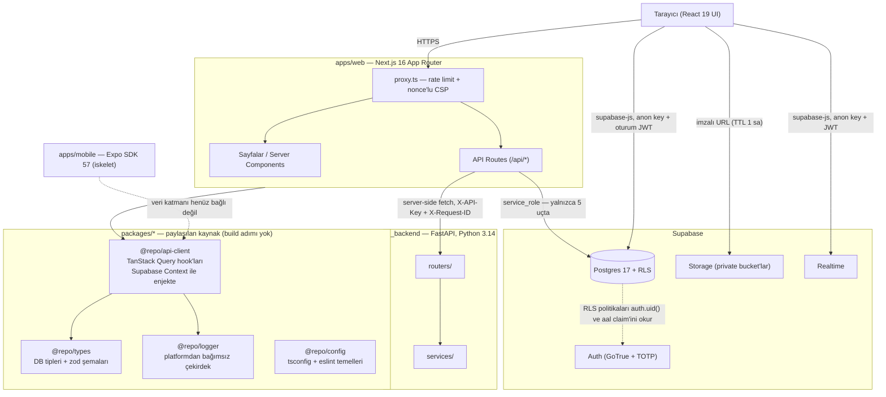
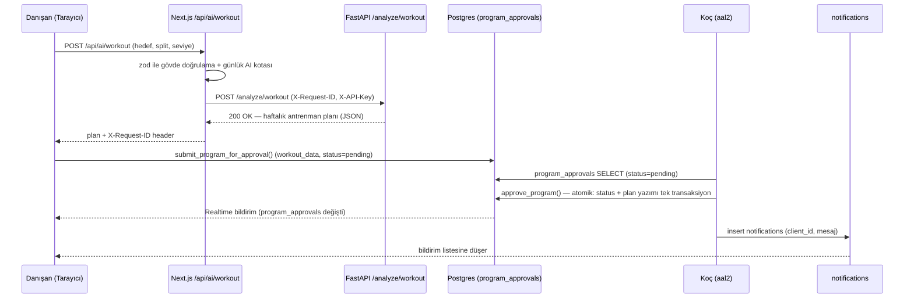

# Closed-Loop Coaching Hub

Koçların danışanlarını antrenman, beslenme ve ilerleme verisi üzerinden uçtan uca yönettiği; yapay zeka destekli plan önerilerinin daima bir koç onayından geçtiği ("closed-loop") online fitness koçluğu platformu.

[](https://github.com/ayberkaarda/Online-Coaching-AppV2/actions/workflows/ci.yml)


---

## In brief (English)

**Closed-Loop Coaching Hub** is a coaching platform where a coach manages clients' training, nutrition and progress data, and where every AI-generated plan must pass through explicit coach approval before it becomes a client's active program — the "closed loop" in the name. It is a pnpm + Turborepo monorepo: two apps (`apps/web` on Next.js 16 / React 19, `apps/mobile` on Expo SDK 57) and four shared packages (`config`, `types`, `api-client`, `logger`), backed by Supabase (Postgres 17, Auth, Storage, Realtime) and a separate FastAPI service on Python 3.14 that the browser can never reach directly.

Three engineering choices are worth a reviewer's attention. **First, authorization lives entirely in the database:** the browser talks to Supabase directly, so a route-level check would be bypassable — mandatory coach MFA is therefore enforced as a `RESTRICTIVE` RLS policy on 16 tables that fails closed when the `aal` claim cannot be read ([ADR-0026](docs/adr/0026-totp-mfa-ve-aal2-kapisi.md)). **Second, destructive and privacy-critical operations are fail-closed by construction:** `delete_account()` refuses to delete anything at all if a single storage object survives the pre-pass, so a half-deleted account is impossible at the schema level ([ADR-0025](docs/adr/0025-hesap-silme-ve-service-role-sunucu-yolu.md)), and the activity-log consent gate sits _inside_ the only write function rather than in front of it. **Third, the boundaries are tested, not asserted:** 868 Vitest unit/component tests, 144 SQL scenarios that exercise RLS from a real authenticated session, and 54 Playwright end-to-end tests, all gated by a six-job GitHub Actions pipeline.

This is a **portfolio project**. It is not deployed publicly, has no users, and is not maintained as a commercial product; the code, the 26 ADRs and the documentation exist to show how the decisions were made. Most of the documentation below is in Turkish — that is where the depth is, and it is deliberate rather than an oversight.

---

## İçindekiler

1. [Öne çıkan mühendislik kararları](#öne-çıkan-mühendislik-kararları)
2. [Özellikler](#özellikler)
3. [Mimari](#mimari)
4. [Teknoloji Yığını](#teknoloji-yığını)
5. [Hızlı Başlangıç](#hızlı-başlangıç)
6. [Ortam Değişkenleri](#ortam-değişkenleri)
7. [Geliştirme Komutları](#geliştirme-komutları)
8. [Test](#test)
9. [Veritabanı ve RLS](#veritabanı-ve-rls)
10. [Docker ile Çalıştırma](#docker-ile-çalıştırma)
11. [Dağıtım](#dağıtım)
12. [Güvenlik](#güvenlik)
13. [Proje Yapısı](#proje-yapısı)
14. [Katkı ve Lisans](#katkı-ve-lisans)

> **Bu bir portfolyo projesidir.** Yayında değildir, gerçek kullanıcısı yoktur ve ticari bir ürün olarak sürdürülmemektedir. Depoda ilginç olan şey özellik listesi değil, kararların nasıl alındığıdır: 26 ADR, 34 migration ve her sınırın arkasındaki test paketi. Aşağıdaki ilk bölüm tam da bunun için var.

---

## Öne çıkan mühendislik kararları

26 ADR'nin tamamını okumaya gerek yok; incelemeye değer altı karar aşağıda. Her biri gerçek bir kısıttan doğdu ve hepsinin kaynağı depoda.

### 1. MFA kapısı route'ta değil, RLS'te

**[ADR-0026](docs/adr/0026-totp-mfa-ve-aal2-kapisi.md) · [`supabase/migrations/20260819120000_mfa_aal2_gate.sql`](supabase/migrations/20260819120000_mfa_aal2_gate.sql)**

Tek koçlu modelde koç hesabı **her danışanın** ölçümlerini, fotoğraflarını ve yazışmalarını açan tek anahtardır, ve o kapıyı bugüne dek yalnızca bir parola tutuyordu. Kapıyı bir Next.js route'una koymak işe yaramazdı: tarayıcı Supabase'e `supabase.from(...)` ile **doğrudan** gidiyor, arada BFF yok — route kontrolü basit bir `fetch` ile atlanır. Bu yüzden zorunlu TOTP, danışan verisi taşıyan 16 tabloya kurulmuş tek kalıplı bir **RESTRICTIVE** RLS politikasıdır: koçun JWT'sinde `aal2` yoksa sorgu boş küme döner. `aal` claim'i hiç okunamıyorsa da boş küme döner — **fail-closed**; danışan tarafı ise hiç etkilenmez (opt-in).

### 2. Yarım silinmiş hesap şema seviyesinde imkânsız

**[ADR-0025](docs/adr/0025-hesap-silme-ve-service-role-sunucu-yolu.md) · [`supabase/migrations/20260819100000_account_deletion.sql`](supabase/migrations/20260819100000_account_deletion.sql)**

Supabase, `storage.objects`'ten SQL ile satır silmeyi platform trigger'ıyla **yasaklıyor** (`storage.protect_delete()`), yani fiziksel dosya silme tek başına veritabanı transaksiyonunun dışında kalmak zorunda. Bu, "auth kullanıcısı gitti ama vücut fotoğrafı S3'te duruyor" senaryosunu doğal bir olasılık hâline getirir. Çözüm sırayı sözleşmeye bırakmak yerine **dayatmak** oldu: `delete_account()` çağrıldığında geriye tek bir storage nesnesi kalmışsa `raise` eder ve **hiçbir şey silinmez**. Denetim kaydı (`account_deletions`) kasıtlı olarak uid, e-posta, ad ve IP taşımaz — silinen kişiyi işaret eden bir silme kaydı unutulma hakkını yerine getirmiş sayılmazdı.

### 3. Rıza kapısı, yazma fonksiyonunun içinde

**Faz 4.8 · [`supabase/migrations/20260820090000_activity_log.sql`](supabase/migrations/20260820090000_activity_log.sql) · [`20260820140000_coach_activity_summary.sql`](supabase/migrations/20260820140000_coach_activity_summary.sql)**

Koçun danışan aktivitesini görebilmesi (sekme görüntüleme, giriş/çıkış, günlük giriş) KVKK anlamında açık rıza gerektirir. Rıza kontrolü çağıranın önüne değil, tek yazma yolu olan `record_activity()`'nin **içine** kondu: rıza yoksa fonksiyon istisna fırlatır, hiçbir satır yazılmaz. Rıza geri çekildiğinde kullanıcının tüm `activity_*` satırları **aynı anda** silinir (kapat = durdur **ve** sil). Mahremiyet sınırı da arayüzde değil veri katmanındadır: koç ham tabloya hiç gitmez, `coach_activity_summary()` RPC'sini çağırır ve o fonksiyon `returns table(day date, ...)` imzasıyla gün hassasiyetinden daha incesini **döndüremez** — geliştirici konsolunu açan bir koç bile danışanın saatini göremez. Fonksiyon bilerek `SECURITY INVOKER`'dır, böylece `aal2` kapısı burada da geçerli kalır.

### 4. Üç katmanlı, fail-closed hosted hedef guard'ı

**[`apps/web/src/env.server.ts`](apps/web/src/env.server.ts) · [ADR-0020](docs/adr/0020-hosted-senkronizasyon-stratejisi.md)**

Bu kod tabanındaki en pahalı kaza, "yerelde çalıştığını sanan" bir `pnpm run build && pnpm run start`'ın `service_role` ile barındırılan projeye yazmasıdır — RLS baypas edildiği için hiçbir politika onu durduramaz. Guard üç katmanda kuruldu: Katman 0 `.env.local`'ın yerel yığını göstermesi, Katman 1 `playwright.config.ts`'in hedef iddiası, Katman 2 sunucu tarafında `*.supabase.co|com` hedefini görüp `ALLOW_HOSTED_TARGET=1` yoksa **fırlatan** bir kontrol. Kritik ayrıntı: guard bilinçli olarak `NODE_ENV`'e koşullanmadı — tehlikeli yol tam da `next start` (yani `NODE_ENV=production`) üzerinden geçtiği için, `NODE_ENV !== 'production'` koşullu bir guard korumaya çalıştığı senaryoda kendini kapatırdı. Bunun bir regresyon testi var.

### 5. Supabase istemcisi enjekte edilir, import edilmez

**[ADR-0024](docs/adr/0024-api-client-supabase-enjeksiyonu.md) · [`packages/api-client/src/context.tsx`](packages/api-client/src/context.tsx)**

`@repo/api-client` paketi 18 TanStack Query hook'u taşıyor ve bunları hem web hem mobil tüketecek. Paket Supabase istemcisini **modül seviyesinde import etmez**; `SupabaseClientProvider` ile dışarıdan alır. Sebep somut: web'in oturum deposu cookie tabanlıdır (`@supabase/ssr`), mobilin `SecureStore` olacaktır — modül seviyesinde bir singleton, web'in cookie deposunu Metro grafiğine sızdırırdı. Aynı disiplin bildirim katmanına da uygulandı: paket `sonner` gibi DOM'a bağlı bir toast kütüphanesi import etmez, `NotifierProvider` portunun arkasından çağırır. `pino` de aynı sebeple `@repo/logger` yerine `apps/web`'de bırakıldı.

### 6. Eski tasarım dili tek yönlü mandalla kilitli

**[ADR-0018](docs/adr/0018-kimlik-gecisi-iki-katman-ve-ci-ratchet.md) · [`scripts/identity-ratchet.mjs`](scripts/identity-ratchet.mjs)**

Görsel kimlik geçişini tek bir dev "restyle PR"ında yapmak diff'i incelenemez hâle getirirdi; "zamanla düzelir" demek ise iki dilin kalıcı olarak yan yana yaşaması demekti. Üçüncü yol: eski dilin izlerini (`font-black`, `bg-gradient-to-*`, `rounded-3xl`, ham marka moru, JSX emoji) sayan bir grep script'i CI'da koşuyor ve **tavanın üstüne çıkan her PR kırmızı oluyor**. Tavan asla otomatik yükselmez; bir PR sayacı düşürdüğünde yeni değer baseline olur. Bugünkü durum: `font-black` 49 → 25, gradyan 14 → 12, `rounded-3xl` 17 → 15, ham `#8b5cf6` ve emoji **0'da kilitli**. Ham rengin ondalık RGB yazımı (`139, 92, 246`) için ayrı bir sayaç var — hex sayacı onu yakalamıyordu.

---

## Özellikler

### Koç (`coach`) perspektifinden

- Tüm danışanların profilini, ilerleme geçmişini ve form-check fotoğraflarını tek panelden görme; kilo/ölçü trendini 7/30/90 günlük pencerelerde izleme.
- Danışanların ürettiği AI antrenman/beslenme planlarını **onaylama veya reddetme** (`program_approvals`) — hiçbir plan koç onayı olmadan danışanın aktif programına yazılmaz.
- Duyuru ve bireysel bildirim gönderme; danışanlarla gerçek zamanlı, ek dosya destekli birebir sohbet.
- **Zorunlu TOTP çok faktörlü kimlik doğrulama** — koç hesabı `aal2` olmadan hiçbir danışan verisi göremez (bkz. [karar #1](#1-mfa-kapısı-routeta-değil-rlste)).
- Danışan için **şifre sıfırlama tetikleme**: koç danışan adına oturum açamaz (impersonation yok); sıfırlama bağlantısı danışanın kendi e-postasına gider ve işlem `coach_actions` denetim tablosuna yazılır — denetim yazımı başarısız olursa sıfırlama fail-closed iptal edilir.
- Rıza vermiş danışanlar için **gün hassasiyetinde etkinlik özeti** (bkz. [karar #3](#3-rıza-kapısı-yazma-fonksiyonunun-içinde)).
- **Yok:** danışan hesabı oluşturma akışı. Bu iş için yazılmış `service_role` tabanlı server action'lar hiçbir yerden çağrılmadığı için kaldırılmıştı (`docs/DISCOVERY.md` §2.5) ve yerine bir arayüz gelmedi; hesaplar bugün Supabase tarafında elle açılıyor. Çok-koçlu izolasyon (koç-danışan atama tablosu) da yok — borç kütüğünde **B-058** olarak izleniyor.

### Danışan (`client`) perspektifinden

- **Form check**: haftalık kilo girişi + önden/arkadan poz fotoğrafı; geçmiş kayıtlarla **before/after** karşılaştırma (sürgülü kıyas bileşeni). Fotoğraflar private bir Supabase Storage bucket'ında (`form-checks-media`) tutulur ve yalnızca **imzalı (signed) adres** ile, 1 saatlik TTL ile sunulur.
- Kilo, ölçü ve makro (protein/karbonhidrat/yağ) trendlerini Recharts grafikleriyle izleme; ayrı bir ilerleme fotoğrafı arşivi (`progress_photos`).
- **Canlı gym modu**: antrenman sırasında set bazlı ağırlık/tekrar/RPE girişi (`workout_logs`), sürümlenmiş plan yapısı üzerinden.
- Hedef, split tipi ve seviyeye göre **AI antrenman planı**, antropometrik verilere göre **AI beslenme planı (BMR/TDEE + makro dağılımı)** üretimi; üretilen program koç onayına gider, onaylanınca profile yazılır ve bildirim düşer.
- Günlük su/sodyum/makro girişi (günde tek kayıt, `daily_logs`) ve ardışık form-check günlerine dayalı **streak takibi**.
- Koçla gerçek zamanlı sohbet, okunma durumu ve okunmamış bildirim rozeti; sunucu tarafında magic-byte doğrulamasından geçmiş ek dosyalar.
- **Kendi verisi üzerinde kontrol**: opt-in TOTP MFA, `/verilerim` altında etkinlik kaydının tam ayrıntılı görünümü, rızayı tek tıkla geri çekme ve **hesabı + tüm verisini kalıcı silme** (bkz. [karar #2](#2-yarım-silinmiş-hesap-şema-seviyesinde-imkânsız)).
- **PWA**: ana ekrana eklenebilir, `workout_logs`/`profiles` verisi için çevrimdışı önbellek (`next-pwa`, `NetworkFirst`); form-check fotoğrafları cihazda tutulmaz (`NetworkOnly`).
- Koyu tema (`next-themes`, sistem tercihiyle uyumlu + manuel toggle).

### Mobil (`apps/mobile`)

Expo SDK 57 / React Native 0.86 üzerinde **iskelet**: `expo-router` ile 5 sekme + oturum açma ekranı, paylaşılan `@repo/types` ve `@repo/logger` bağlı. Veri katmanı **bilerek** henüz bağlanmadı (bkz. [ADR-0023](docs/adr/0023-monorepo-kesim-plani.md)); CI'da tip kontrolü, lint, `expo-doctor` ve `expo export` ile ayrı bir job olarak koşuyor. Android emülatöründe gerçek smoke koşusu yapıldı.

---

## Mimari

pnpm + Turborepo monorepo. Next.js sunucu tarafı; Supabase'e (Postgres/Auth/Storage/Realtime) doğrudan, Python AI servisine ise **yalnızca kendi API route'ları üzerinden proxy** ile bağlanır. Tarayıcı FastAPI'yi hiçbir zaman doğrudan görmez.



**Danışan AI antrenman planı ister → koç onaylar** akışı:



Derinlemesine mimari kararlar, veri modeli ve ADR indeksi için bkz. [`docs/ARCHITECTURE.md`](docs/ARCHITECTURE.md) ve [`docs/adr/`](docs/adr/).

---

## Teknoloji Yığını

| Katman                    | Teknoloji                    | Sürüm              | Amaç                                                   |
| ------------------------- | ---------------------------- | ------------------ | ------------------------------------------------------ |
| Monorepo görev koşucusu   | Turborepo                    | 2.10.11            | Görev grafiği, önbellek (2 app + 4 paket)              |
| Paket yöneticisi (JS)     | pnpm                         | 10.34.5            | `package.json#packageManager` ile sabitli              |
| Çalışma zamanı            | Node.js                      | 24 LTS             | `engines.node: >=24.19.0`                              |
| Frontend framework        | Next.js (App Router)         | 16.3.1             | SSR/RSC, routing, API routes — **webpack'e pinli**     |
| UI kütüphanesi            | React                        | 19.2.4             | Bileşen modeli                                         |
| Dil                       | TypeScript (strict)          | 6.0.3              | Tüm workspace'lerde tek majör (B-051)                  |
| Stil                      | Tailwind CSS                 | ^3.4.19            | Utility-first CSS + `src/design/tokens.ts`             |
| Veri çekme/önbellek       | TanStack Query               | ^5.62.11           | Sunucu state yönetimi, cache invalidation              |
| Form + doğrulama          | React Hook Form + Zod        | ^7.54.2 / ^3.24.1  | Form state ve şema doğrulama                           |
| Grafikler                 | Recharts                     | ^3.9.1             | Kilo/ölçü/makro trend grafikleri (Chart.js kaldırıldı) |
| İkonlar                   | lucide-react                 | ^1.31.0            | Emoji yerine ikon seti (ADR-0016)                      |
| Bildirim (toast)          | Sonner                       | ^1.7.2             | Yalnızca `apps/web`; pakete port arkasından verilir    |
| Tema                      | next-themes                  | ^0.4.6             | Koyu/açık tema, nonce zinciriyle uyumlu                |
| PWA                       | next-pwa                     | ^5.6.0             | Service worker, çevrimdışı önbellek                    |
| Loglama (frontend)        | pino                         | ^9.6.0             | Yapılandırılmış JSON log + `REDACT_PATHS`              |
| Mobil                     | Expo SDK / React Native      | 57 / 0.86.2        | `expo-router` ile iskelet istemci                      |
| Veritabanı                | Supabase (Postgres)          | 17.6.x             | Veri, Auth, Storage, Realtime — 21 tablo, 34 migration |
| İstemci SDK               | @supabase/supabase-js + ssr  | ^2.110.0 / ^0.12.4 | Supabase erişimi, cookie tabanlı oturum (ADR-0022)     |
| AI servisi                | FastAPI                      | ≥0.115             | Antrenman/beslenme/öneri motoru                        |
| AI servis dili            | Python                       | 3.14               | `pyproject` tabanı ≥3.12; CI/mypy/ruff 3.14'e pinli    |
| AI servis doğrulama       | Pydantic + pydantic-settings | ≥2.9 / ≥2.6        | Şema ve ayar doğrulama                                 |
| AI servis loglama         | structlog                    | ≥24.4              | Yapılandırılmış JSON log                               |
| AI servis rate limit      | slowapi                      | ≥0.1.9             | İstek sınırlama                                        |
| Paket yöneticisi (Python) | uv                           | —                  | Bağımlılık/venv yönetimi                               |
| Birim/bileşen test        | Vitest + Testing Library     | ^2.1.8             | 868 test / 68 dosya                                    |
| Backend test              | pytest + pytest-cov          | ≥8.3               | FastAPI testleri (`--cov-fail-under=70`)               |
| E2E test                  | Playwright                   | ^1.49.1            | 10 spec dosyası, chromium + Mobile Chrome              |
| CI                        | GitHub Actions               | —                  | 6 job + `required-checks` kapısı                       |
| Konteynerleştirme         | Docker + docker compose      | —                  | Çok aşamalı build, `output: 'standalone'`              |

> **Next.js neden webpack'e pinli:** `next-pwa` v5 Turbopack ile çalışmıyor ve PWA çevrimdışı önbelleği projenin kabul kriterlerinden biri. Karar ve alternatifleri: [ADR-0006](docs/adr/0006-next-pwa-korunmasi.md), [ADR-0012](docs/adr/0012-pwa-webpack-build.md).

---

## Hızlı Başlangıç

### Önkoşullar

- **Node.js 24 LTS** (`package.json#engines` → `>=24.19.0`)
- **pnpm ≥ 10** — kesin sürüm `package.json#packageManager` alanında (`pnpm@10.34.5`) sabitlidir; pnpm 10 bu alanı okuyup kendini o sürüme ayarlar. Kurulum: `npm i -g pnpm@10.34.5` (corepack Node 25 ile dağıtımdan çıkarıldığı için kullanılmıyor).
- **Python 3.14** ve **[uv](https://docs.astral.sh/uv/)**
- **[Supabase CLI](https://supabase.com/docs/guides/cli)** — yerel Postgres/Auth/Storage/Studio için (Docker gerektirir)
- Docker (yerel Supabase yığını için zaten gerekli; uygulama konteynerleri opsiyonel)

> **pnpm tuzağı:** bu depoda script'lere bayrak geçirirken `--` ayırıcısı **kullanılmaz**. Doğru kullanım `pnpm run test:e2e --ui`, `pnpm run test --reporter=verbose` biçimindedir.

### Adımlar (macOS/Linux — bash)

```bash
# 1) Depoyu klonlayın
git clone <repo-url>
cd my-coaching-appv2

# 2) Tüm workspace bağımlılıklarını yükleyin (kökten, tek komut)
pnpm install --frozen-lockfile

# 3) Ortam değişkenlerini kopyalayıp doldurun
cp apps/web/.env.example apps/web/.env.local
# .env.local'ı açıp Supabase proje bilgilerinizi girin.
# Yerel geliştirmede NEXT_PUBLIC_SUPABASE_URL yerel yığını göstermeli
# (http://127.0.0.1:54321) — hosted bir adres girerseniz sunucu guard'ı
# ALLOW_HOSTED_TARGET=1 olmadan ilk istekte bilinçli olarak düşer.

# 4) Yerel Supabase yığınını başlatın (Postgres + Auth + Storage + Studio)
npx supabase start

# 5) Migration'ları uygulayın
pnpm run db:migrate
# not: db:migrate `supabase db push` çalıştırır. TAMAMEN sıfırdan + seed için
# `supabase db reset` gerekir — bu komut yereldeki TÜM VERİYİ SİLER.

# 6) TypeScript tiplerini üretin (packages/types/src/database.ts)
pnpm run db:types

# 7) AI backend bağımlılıklarını kurun
cd ai_backend && uv sync && cd ..
```

İki ayrı terminalde geliştirme sunucularını başlatın:

```bash
# Terminal 1 — Next.js (http://localhost:3000)
pnpm run dev

# Terminal 2 — FastAPI (http://localhost:8000, --reload ile hot-reload)
cd ai_backend
uv run uvicorn app.main:app --reload
```

### Adımlar (Windows — PowerShell)

```powershell
git clone <repo-url>
Set-Location my-coaching-appv2

pnpm install --frozen-lockfile

Copy-Item apps/web/.env.example apps/web/.env.local
# .env.local dosyasını açıp Supabase proje bilgilerinizi girin

npx supabase start
pnpm run db:migrate
pnpm run db:types

Set-Location ai_backend
uv sync
Set-Location ..
```

İki ayrı PowerShell penceresinde:

```powershell
# Pencere 1
pnpm run dev

# Pencere 2
Set-Location ai_backend
uv run uvicorn app.main:app --reload
```

Uygulama `http://localhost:3000`, AI servisi `http://localhost:8000` (Swagger: `/docs`) adresinde çalışır.

> **Koç hesabıyla giriş yapacaksanız:** `aal2` kapısı yüzünden TOTP kaydı zorunludur ve yerel GoTrue'da TOTP varsayılan olarak **kapalı** gelir. `supabase/config.toml` içinde MFA/TOTP açılıp yığın yeniden başlatılmadan koç akışı çalışmaz (ayrıntı: [ADR-0026](docs/adr/0026-totp-mfa-ve-aal2-kapisi.md) "Kalan risk").

### Mobil (opsiyonel)

```bash
pnpm --filter mobile run start   # Expo geliştirme sunucusu
pnpm run mobile:type-check
pnpm run mobile:lint
```

---

## Ortam Değişkenleri

### Next.js (`apps/web/.env.local`, kaynak: `apps/web/.env.example`)

Doğrulama iki dosyaya bölünmüştür: istemciye de gömülen değerler [`apps/web/src/env.shared.ts`](apps/web/src/env.shared.ts), yalnızca sunucuda yaşayanlar [`apps/web/src/env.server.ts`](apps/web/src/env.server.ts) (`import 'server-only'` taşır). İkisi de zod ile fail-fast doğrular.

| Değişken                        | Zorunlu mu                         | Varsayılan              | Kullanıldığı yer           | Açıklama                                                                                                                                             |
| ------------------------------- | ---------------------------------- | ----------------------- | -------------------------- | ---------------------------------------------------------------------------------------------------------------------------------------------------- |
| `NEXT_PUBLIC_SUPABASE_URL`      | Evet                               | —                       | İstemci + sunucu           | Supabase proje URL'i. Build-time'da tarayıcı paketine gömülür.                                                                                       |
| `NEXT_PUBLIC_SUPABASE_ANON_KEY` | Evet                               | —                       | İstemci + sunucu           | Supabase anon/publishable anahtarı. RLS ile korunur, istemciye açık olması güvenlidir.                                                               |
| `SUPABASE_SERVICE_ROLE_KEY`     | **Evet, beş sunucu ucu için**      | —                       | **Yalnızca sunucu**        | RLS'yi baypas eden servis rolü anahtarı — aşağıdaki uyarıya bakın. Ayarlı değilse ilgili uçlar `503` döner.                                          |
| `ALLOW_HOSTED_TARGET`           | Hosted/production hedefte **evet** | _(boş)_                 | Sunucu                     | `1` değilse `*.supabase.co\|com` hedefli her sunucu isteği fail-closed reddedilir (bkz. [karar #4](#4-üç-katmanlı-fail-closed-hosted-hedef-guardı)). |
| `AI_BACKEND_URL`                | Hayır                              | `http://localhost:8000` | Sunucu (`/api/ai/*` proxy) | FastAPI servisinin adresi.                                                                                                                           |
| `AI_BACKEND_API_KEY`            | Production'da **evet**             | —                       | Sunucu                     | FastAPI'ye `X-API-Key` olarak iletilir. `NODE_ENV=production` iken yoksa uygulama fail-fast eder.                                                    |
| `NEXT_PUBLIC_APP_URL`           | Hayır                              | `http://localhost:3000` | İstemci + sunucu           | Mutlak URL üretimi (ör. e-posta linkleri).                                                                                                           |
| `NODE_ENV`                      | Hayır                              | `development`           | Sunucu                     | `development` \| `test` \| `production`.                                                                                                             |
| `LOG_LEVEL`                     | Hayır                              | `info`                  | Sunucu                     | pino log seviyesi.                                                                                                                                   |
| `RATE_LIMIT_WINDOW_MS`          | Hayır                              | `60000`                 | Sunucu (`proxy.ts`)        | Genel `/api/*` rate limit penceresi (ms).                                                                                                            |
| `RATE_LIMIT_MAX_REQUESTS`       | Hayır                              | `60`                    | Sunucu (`proxy.ts`)        | Pencere başına genel istek sınırı. `/api/ai/*` bundan bağımsız, sabit **20 istek/dakika**.                                                           |
| `TRUSTED_PROXY_COUNT`           | Hayır                              | `0`                     | Sunucu                     | `X-Forwarded-For` zincirinde kaç hop'a güvenileceği. **Varsayılan 0 = hiçbir başlığa güvenilmez.**                                                   |
| `AI_QUOTA_DAILY_LIMIT`          | Hayır                              | `20`                    | Sunucu                     | Kullanıcı başına günlük AI proxy isteği (üç uç tek paylaşılan kova).                                                                                 |

> **UYARI — `SUPABASE_SERVICE_ROLE_KEY`.** Bu anahtar RLS'yi **tamamen** baypas eder; sızması tüm veritabanının ele geçirilmesi demektir. ASLA `NEXT_PUBLIC_` öneki almamalı ve istemci koduna (bileşen, hook, `'use client'` dosyası) import edilmemelidir.
>
> [ADR-0025](docs/adr/0025-hesap-silme-ve-service-role-sunucu-yolu.md)'ten bu yana anahtar **çalışma zamanında kullanılıyor** — beş sunucu ucunda ve her birinde dar bir iş için:
>
> | Uç                                      | Neden `service_role` gerekiyor                                               |
> | --------------------------------------- | ---------------------------------------------------------------------------- |
> | `POST /api/account/delete`              | Storage API ile fiziksel dosya silme + `delete_account()` çağrısı            |
> | `POST /api/attachments/verify`          | Magic-byte doğrulama damgasını yazma (istemci kendi kendini doğrulayamamalı) |
> | `POST /api/activity`                    | `record_activity()` — EXECUTE yalnızca `service_role`'de                     |
> | `PUT/DELETE /api/activity/consent`      | `grant_activity_consent()` / `revoke_activity_consent()`                     |
> | `POST /api/coach/reset-client-password` | `auth.admin.generateLink()` ile kurtarma bağlantısı üretme                   |
>
> Disiplin: anahtarı okuyan tek dosya `env.server.ts`'tir ve `import 'server-only'` taşır (yanlışlıkla istemciden import edilirse **build-time** hatası verir); `service_role`'ün EXECUTE hakkı sayılı fonksiyonla sınırlıdır ve denetim tablolarında doğrudan tablo yetkisi bile yoktur; anahtar yapılandırılmamışsa uçlar `503` döner — **sessizce "yaptım" demezler**; hiçbir log satırı anahtarı, token'ı veya hata gövdesini taşımaz.

### FastAPI (`ai_backend/.env`, kaynak: `ai_backend/app/core/config.py`)

| Değişken       | Varsayılan              | Açıklama                                                                                                      |
| -------------- | ----------------------- | ------------------------------------------------------------------------------------------------------------- |
| `APP_NAME`     | `Coaching AI Backend`   | OpenAPI başlığı.                                                                                              |
| `VERSION`      | `1.0.0`                 | Uygulama sürümü.                                                                                              |
| `ENVIRONMENT`  | `development`           | `development` \| `staging` \| `production`. Production'da hata mesajları generic'e döner.                     |
| `CORS_ORIGINS` | `http://localhost:3000` | Virgülle ayrılmış izinli origin listesi (allowlist — `*` değil).                                              |
| `API_KEY`      | _(boş)_                 | Ayarlanırsa `/analyze/*` ve `/recommendations` için `X-API-Key` header'ı zorunlu olur.                        |
| `RATE_LIMIT`   | `60/minute`             | Genel istek sınırı. `/analyze/*` ve `/recommendations` ayrıca `20/minute` ile sınırlıdır; `/health*` muaftır. |
| `LOG_LEVEL`    | `INFO`                  | structlog log seviyesi.                                                                                       |
| `DATA_DIR`     | `ai_backend/data`       | CSV veri dosyalarının okunacağı dizin.                                                                        |

---

## Geliştirme Komutları

### Kök (`package.json`) — Turborepo üzerinden

Aşağıdaki komutlar `--filter=!mobile` ile web + paketleri kapsar; mobil ayrı `mobile:*` script'leriyle koşar.

| Komut                                                          | Ne yapar                                                                      |
| -------------------------------------------------------------- | ----------------------------------------------------------------------------- |
| `pnpm run dev`                                                 | `apps/web` geliştirme sunucusu (`next dev --webpack`).                        |
| `pnpm run build`                                               | Tüm workspace'lerde `build` (`output: 'standalone'`).                         |
| `pnpm run start`                                               | Production build'i çalıştırır.                                                |
| `pnpm run lint`                                                | ESLint flat config; `apps/web` + `packages/*`.                                |
| `pnpm run type-check`                                          | `tsc --noEmit` — derleme yapmadan tip kontrolü.                               |
| `pnpm run type-check:e2e`                                      | E2E dosyaları için ayrı tsconfig ile tip kontrolü.                            |
| `pnpm run test`                                                | Vitest, tek seferlik çalıştırma.                                              |
| `pnpm run test:coverage`                                       | Vitest, kapsam raporuyla (`coverage/index.html`).                             |
| `pnpm run test:e2e`                                            | Playwright E2E testleri (`pnpm run test:e2e --ui` ile arayüzlü).              |
| `pnpm run test:rls`                                            | 144 RLS senaryosunu yerel Postgres konteynerinde psql ile koşar.              |
| `pnpm run test:transform`                                      | Veri dönüşümü SQL testleri.                                                   |
| `pnpm run ratchet`                                             | Kimlik ratchet'i — eski tasarım dili sayaçlarını doğrular (ADR-0018).         |
| `pnpm run format`                                              | Prettier ile tüm dosyaları biçimlendirir.                                     |
| `pnpm run format:check`                                        | Prettier biçim kontrolü (yazmadan).                                           |
| `pnpm run db:migrate`                                          | `supabase db push` — bekleyen migration'ları uygular.                         |
| `pnpm run db:types`                                            | Yerel şemadan `packages/types/src/database.ts` üretir.                        |
| `pnpm run db:backup-hosted`                                    | Barındırılan projenin şema + veri + rol yedeğini alır.                        |
| `pnpm run clean:foods`                                         | `data/daily_food_nutrition_dataset.csv` → `data/clean_foods.csv` dönüşümü.    |
| `pnpm run db:import-catalog`                                   | `exercises` / `food_database` referans kataloglarını yükler.                  |
| `pnpm run mobile:type-check` / `mobile:lint` / `mobile:export` | `apps/mobile` kapıları.                                                       |
| `pnpm run ci`                                                  | `lint && type-check && test && build` — CI frontend job'unun yerel karşılığı. |

### AI Backend (`ai_backend/`)

| Komut                                  | Ne yapar                                         |
| -------------------------------------- | ------------------------------------------------ |
| `uv sync`                              | Bağımlılıkları kurar (`pyproject.toml`'dan).     |
| `uv run uvicorn app.main:app --reload` | Geliştirme sunucusu (`http://localhost:8000`).   |
| `uv run pytest`                        | Testler + kapsam raporu (`--cov-fail-under=70`). |
| `uv run ruff check .`                  | Lint.                                            |
| `uv run ruff format --check .`         | Biçim kontrolü.                                  |
| `uv run mypy app`                      | Statik tip kontrolü (strict).                    |

---

## Test

Test piramidi dört katmandan oluşur; sayılar en son tam koşumdan alınmıştır.

| Katman                     | Kapsam                                                 | Komut                    | Durum                                 |
| -------------------------- | ------------------------------------------------------ | ------------------------ | ------------------------------------- |
| **Vitest** (birim/bileşen) | jsdom, `apps/web` + `packages/*`                       | `pnpm run test:coverage` | **868 test / 68 dosya**, satır %67.17 |
| **RLS** (SQL)              | `supabase/tests/rls.test.sql`, gerçek oturum JWT'siyle | `pnpm run test:rls`      | **144 senaryo**                       |
| **pytest** (backend)       | `ai_backend/tests`                                     | `uv run pytest`          | eşik `--cov-fail-under=70`            |
| **Playwright** (E2E)       | 10 spec, chromium + Mobile Chrome                      | `pnpm run test:e2e`      | **54 geçen**, 4 atlanan               |

Birkaç ayrıntı:

- **Kapsam eşikleri tek yönlü mandaldır** (`vitest.config.ts`): `lines 60`, `functions 60`, `branches 55`, `statements 60`. Ölçülen değer (%67.17) eşiğin üstünde; eşik düşürülmez.
- **RLS testleri iddia değil ölçümdür.** Senaryolar gerçek bir `authenticated` JWT'si üstlenip (`set local request.jwt.claims`) sorguları koşturur; "koç `aal1`'de kaç satır görüyor" sorusunun cevabı bir yorum satırı değil, test çıktısındaki sayıdır.
- **E2E gerçek yığına karşı koşar.** `webServer` testten önce `pnpm run build && pnpm run start` çalıştırır; CI'da ayrıca `supabase start` + `supabase db reset` ile temiz bir veritabanı kurulur. Koç spec'leri `aal2` fixture'ı üzerinden TOTP kodu üretir (`otplib`).
- **`e2e` job'u yalnızca `pull_request` event'inde tetiklenir** — push'ta kritik yol uzamasın diye.

---

## Veritabanı ve RLS

**21 public tablo, 34 migration.** Danışan verisi taşıyan 16 tablo `aal2` kapısının kapsamındadır; kalan beşi katalog (`exercises`, `food_database`) ve denetim/damga tablolarıdır (`account_deletions`, `coach_actions`, `message_attachment_verifications` — hepsi RLS + FORCE ve **sıfır politika** ile herkese kapalı, tek yazarları `SECURITY DEFINER` fonksiyonlar).

**Rol modeli:** `user_role` enum'u `coach` ve `client` değerlerini alır ([ADR-0013](docs/adr/0013-rollerin-coach-client-olarak-yeniden-adlandirilmasi.md)). Bilinçli istisna: AI backend tel protokolündeki `student_id` alanı değişmedi, çünkü `ai_backend/app/schemas/recommendations.py` bu adı bekliyor.

**Yetkilendirmenin tek kaynağı Row Level Security'dir.** Uygulama kodu hiçbir yerde rol kontrolünü kendi başına yapıp veriye erişim kararı vermez — tüm SELECT/INSERT/UPDATE/DELETE Postgres'teki politikalardan süzülür. `anon` rolünden `public` şemadaki tüm tablo/fonksiyon yetkileri REVOKE edilmiştir; tüm tablolarda RLS hem `enabled` hem `forced`'tır (tablo sahibi de baypas edemez).

**Salt-eklemeli migration kuralı:** var olan bir migration düzenlenmez, yenisi yazılır. Her migration dosyası neden var olduğunu, hangi ölçüme dayandığını ve nasıl geri alınacağını (`-- DOWN` bloğu) kendi içinde taşır.

```bash
pnpm run db:migrate   # bekleyen migration'ları uygular
pnpm run db:types     # packages/types/src/database.ts dosyasını yeniden üretir
pnpm run test:rls     # 144 senaryo
```

CSV import, RLS politika tablosu, storage bucket politikaları ve bilinen uyumsuzluklar için bkz. [`supabase/README.md`](supabase/README.md).

---

## Docker ile Çalıştırma

```bash
docker compose up --build
```

| Servis                    | Port    | Not                                                                                                                                                                     |
| ------------------------- | ------- | ----------------------------------------------------------------------------------------------------------------------------------------------------------------------- |
| `web` (Next.js)           | `3000`  | `ai-backend` servisi `healthy` olana kadar başlamaz. `apps/web/.env.local` dosyasını `env_file` olarak okur.                                                            |
| `ai-backend` (FastAPI)    | `8000`  | `/health` üzerinden healthcheck.                                                                                                                                        |
| `supabase-db` (opsiyonel) | `54322` | Yalnızca izole/CI smoke test için minimal Postgres — **gerçek yerel geliştirme için bunun yerine `npx supabase start` kullanın** (Auth/Storage/Studio dahil tam yığın). |

`Dockerfile` çok aşamalıdır (`node:24-alpine`) ve monorepo'dan yalnızca web dilimini kurar (`pnpm install --frozen-lockfile --filter web...`). `AI_BACKEND_API_KEY` her iki serviste de zorunludur; tanımlı değilse compose açık bir hatayla durur (sessizce anahtarsız ayağa kalkmaz). `NEXT_PUBLIC_*` değişkenleri **build-time**'da gömüldüğü için `docker build --build-arg NEXT_PUBLIC_SUPABASE_URL=...` biçiminde geçirilmelidir.

---

## Dağıtım

Proje **yayında değildir**; aşağıdaki kılavuz hazırlanmış ama uygulanmamış bir dağıtım yoludur. Hedef topoloji: frontend Vercel, AI backend Railway veya Fly.io, veritabanı Supabase. Adım adım kılavuz, ortam değişkeni matrisi ve dağıtım sonrası kontrol listesi için bkz. [`docs/DEPLOYMENT.md`](docs/DEPLOYMENT.md).

**Deploy sözleşmesi:** gerçek bir hosted hedefe çıkarken `ALLOW_HOSTED_TARGET=1` ayarlanmak **zorundadır**; aksi halde uygulama ilk istekte bilinçli olarak düşer (bkz. [karar #4](#4-üç-katmanlı-fail-closed-hosted-hedef-guardı)).

---

## Güvenlik

- **RLS**, yetkilendirmenin tek kaynağıdır; koç için `aal2` (MFA) zorunluluğu da bir RLS politikasıdır, route kontrolü değil. Bkz. [Veritabanı ve RLS](#veritabanı-ve-rls).
- **HTTP güvenlik başlıkları**: HSTS (`max-age=63072000; includeSubDomains; preload`), `X-Frame-Options: DENY`, `X-Content-Type-Options: nosniff`, `Referrer-Policy`, `Permissions-Policy`, `X-DNS-Prefetch-Control` statik olarak `next.config.mjs`'te; **nonce tabanlı CSP** ise her istek için `proxy.ts`'te üretilir (ADR-0022).
- **Oturum deposu cookie**, `localStorage` değil (`@supabase/ssr`) — XSS ile token okunmasına karşı yüzey daralması (ADR-0022).
- **Rate limiting üç katmanlı**: `/api/*` için IP+yol bazlı bellek-içi limit (`/api/health` muaf), `/api/ai/*` için dakikada 20, ve kullanıcı başına **günlük AI kotası**. Giriş ucunda ayrıca normalize edilmiş e-posta başına 10 başarısız deneme / 15 dakika — anahtarın IP değil e-posta olması bilinçli: `TRUSTED_PROXY_COUNT=0` iken IP tabanlı kilit tüm kullanıcıları kilitleyen bir DoS koluna dönüşürdü.
- **`X-Forwarded-For`'a varsayılan olarak güvenilmez** (`TRUSTED_PROXY_COUNT=0`); istemci bu başlığı serbestçe ayarlayabildiği için güvenilir hop sayısı açıkça verilmeden hiçbir IP çözümlemesi yapılmaz.
- **Girdi doğrulama**: tüm API route girdileri zod şemalarıyla (`@repo/types/schemas`), FastAPI tarafında Pydantic modelleriyle doğrulanır.
- **Dosya yükleme**: yüklenen ekler sunucu tarafında **magic-byte** ile doğrulanır (uzantıya/`Content-Type`'a güvenilmez) ve doğrulama damgası TOCTOU'ya kapalı bir eTag ile bağlanır; indirme `Content-Disposition: attachment` ile yapılır.
- **Storage mahremiyeti**: `avatars`, `form-checks-media`, `progress-photos` ve `message-attachments` bucket'ları **private**'tır. Kolonlar tam URL değil bucket içi yol saklar; okuma yalnızca **imzalı adres** (TTL 3600 sn) üzerinden yapılır ve `anon` rolü hiçbir storage nesnesini okuyamaz.
- **Hata mesajlarında stack trace sızdırılmaz**: AI proxy upstream hata detaylarını yalnızca sunucu loguna yazar, istemciye genel bir mesaj + `request_id` döner.
- **Log maskeleme**: `@repo/logger` içindeki `REDACT_PATHS` listesi token/anahtar/e-posta alanlarını maskeler; `service_role` yolları buna **güvenmez**, hassas alanı loga hiç koymaz.
- **Uçtan uca izlenebilirlik**: her AI proxy isteği bir `X-Request-ID` üretir, hem Next.js hem FastAPI loglarında bu kimlikle görünür.
- **CI güvenlik kapısı**: semgrep, gitleaks (haftalık tam geçmiş taraması dahil), `pnpm audit --prod --audit-level=high` ve `pip-audit`.

Güvenlik açığı bildirimi için bkz. [`SECURITY.md`](SECURITY.md) — lütfen **genel bir GitHub issue açmayın**.

---

## Proje Yapısı

```
apps/
  web/                        Next.js 16 App Router uygulaması
    src/app/                  layout, page (dashboard), login, profile, users,
                              verilerim, forgot-password, reset-password
    src/app/api/              health · ai/{workout,nutrition,recommendations} ·
                              account/delete · activity{,/consent} ·
                              attachments/verify · auth/sign-in ·
                              coach/reset-client-password
    src/components/           DashboardTabs, CoachUserManagement, NotificationForm
    src/components/tabs/      Announcements, Stats, FormCheck, DailyLog, Nutrition,
                              Workout, Messages
    src/components/security/  CoachMfaGate, SecuritySection (TOTP kaydı)
    src/components/activity/  ActivityConsent, ClientActivityLog, CoachActivitySummary
    src/components/progress/  ProgressPhotos, BeforeAfterSlider
    src/components/workout/   GymMode
    src/design/tokens.ts      light/dark tasarım token'ları (ADR-0015)
    src/lib/                  supabase/, api/ (proxy, rate limit, kota), security/,
                              logger.ts (pino dallanması), notifier.ts
    src/env.{shared,server}.ts  zod ile env doğrulaması + hosted hedef guard'ı
    src/proxy.ts              /api/* rate limiting + nonce'lu CSP
    tests/unit/               Vitest (68 dosya)
    tests/e2e/                Playwright (10 spec)
  mobile/                     Expo SDK 57 iskeleti (expo-router, 5 sekme)
packages/
  config/                     paylaşılan tsconfig + eslint temelleri
  types/                      database.ts (Supabase üretimi) + zod şemaları
  api-client/                 TanStack Query hook'ları, Supabase Context enjeksiyonu,
                              storage/upload yardımcıları, query key fabrikaları
  logger/                     platformdan bağımsız logger çekirdeği + REDACT_PATHS
ai_backend/app/               main.py (factory), core/, routers/, services/, schemas/
supabase/
  migrations/                 34 migration — şema, fonksiyon/trigger, RLS, storage
  tests/rls.test.sql          144 RLS senaryosu
docs/
  adr/                        26 mimari karar kaydı
  archive/                    17 faz anlatısı (kapanan fazlar buraya taşınır)
  ARCHITECTURE.md, DEPLOYMENT.md, DISCOVERY.md, PROGRESS.md, ops/, security/
scripts/                      identity-ratchet, katalog import, hosted yedek, E2E temizlik
data/                         CSV kaynak dosyaları (exercises, foods)
```

---

## Katkı ve Lisans

Süreç, dal adlandırma, commit kuralları ve PR beklentileri: [`CONTRIBUTING.md`](CONTRIBUTING.md). Sürüm geçmişi: [`CHANGELOG.md`](CHANGELOG.md). Güvenlik politikası: [`SECURITY.md`](SECURITY.md).

**Lisans:** MIT — tam metin ve telif bildirimi için bkz. [`LICENSE.txt`](LICENSE.txt).
