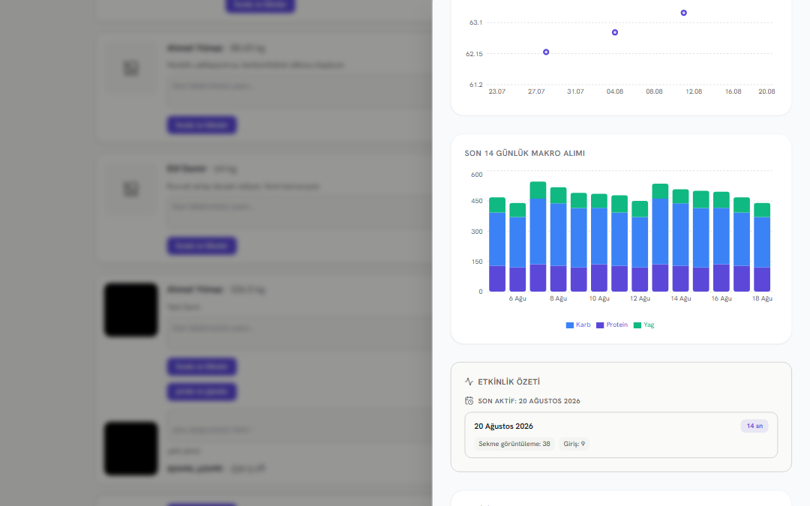
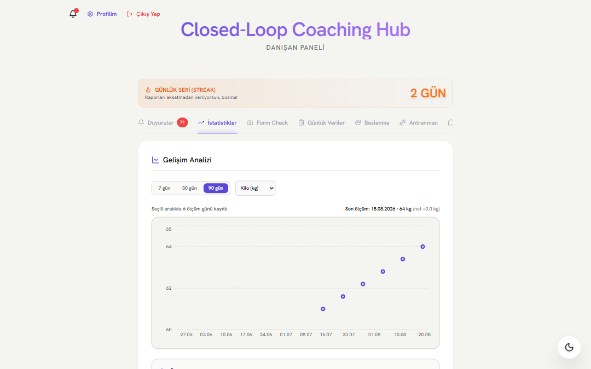
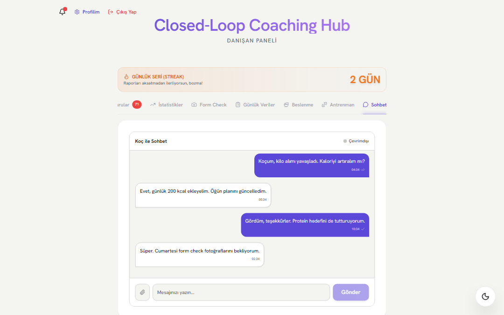
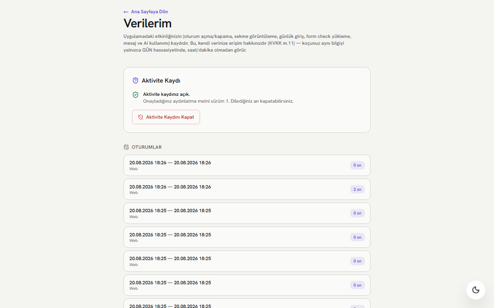
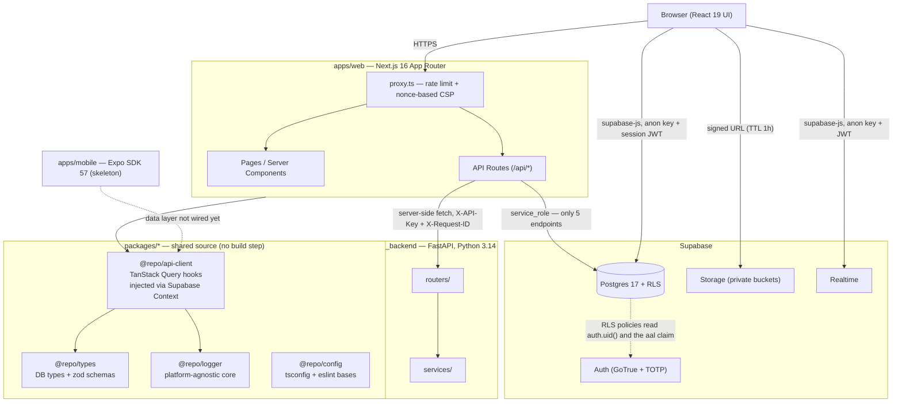
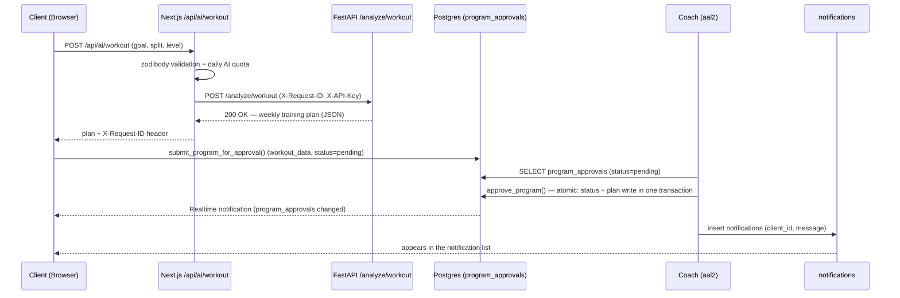

# Sarmal

An online one-on-one fitness coaching platform: a coach manages clients' training, nutrition and progress data, and every AI-generated plan has to pass an explicit coach approval before it becomes a client's active program.

[](https://github.com/ayberkaarda/Online-Coaching-AppV2/actions/workflows/ci.yml)


---

## Why "Sarmal"

_Sarmal_ is Turkish for _spiral_, and it names the thing the product is actually about. The coaching loop closes — coach assigns a plan, client trains, a report comes back, the coach responds — but a loop that closed onto itself would just be a circle, and training that returns exactly where it started is not progress. Each completed turn should start the next one a level higher. That is a spiral.

The product's signature UI element is a **ring**, and it stays one: the ring on screen is a single turn of that spiral. It is governed by a single-meaning rule — the ring encodes loop state and nothing else, and decorative use (avatar frames, button ornaments, background patterns) is forbidden. The rule is written down in [ADR-0017](docs/adr/0017-imza-oge-halka.md), which also lists the exact three places a ring is allowed to appear. There is no "spiral chart" anywhere in the UI, and adding one would break the same rule.

## What it is

Sarmal is a pnpm + Turborepo monorepo: two apps (`apps/web` on Next.js 16 / React 19, `apps/mobile` on Expo SDK 57) and four shared packages (`config`, `types`, `api-client`, `logger`), backed by Supabase (Postgres 17, Auth, Storage, Realtime) and a separate FastAPI service on Python 3.14 that the browser can never reach directly.

Three engineering choices are worth a reviewer's attention. **First, authorization lives entirely in the database:** the browser talks to Supabase directly, so a route-level check would be bypassable — mandatory coach MFA is therefore enforced as a `RESTRICTIVE` RLS policy on 16 tables that fails closed when the `aal` claim cannot be read ([ADR-0026](docs/adr/0026-totp-mfa-ve-aal2-kapisi.md)). **Second, destructive and privacy-critical operations are fail-closed by construction:** `delete_account()` refuses to delete anything at all if a single storage object survives the pre-pass, so a half-deleted account is impossible at the schema level ([ADR-0025](docs/adr/0025-hesap-silme-ve-service-role-sunucu-yolu.md)), and the activity-log consent gate sits _inside_ the only write function rather than in front of it. **Third, the boundaries are tested, not asserted:** 868 Vitest unit/component tests, 144 SQL scenarios that exercise RLS from a real authenticated session, and 54 Playwright end-to-end tests, all gated by a six-job GitHub Actions pipeline.

**This is a portfolio project.** It is not deployed publicly, has no users, and is not maintained as a commercial product. The interesting part of the repository is not the feature list but the record of how the decisions were made: 26 ADRs, 34 migrations, and a test suite behind every boundary. The section right after the table of contents is there for exactly that.

> **A note on language.** This README is in English; **the documentation under `docs/` is in Turkish** — the ADRs, the phase log (`docs/PROGRESS.md`), the security audit and the archive. That is a deliberate choice, not an oversight: these documents are written as reasoning, not as reference material, and they are more precise in the author's first language. Filenames, code, commit messages, schema identifiers and inline code comments are English or English-derived, so the repository stays navigable without Turkish; the depth in `docs/` needs a translator.

---

## Contents

1. [Engineering decisions](#engineering-decisions)
2. [Screenshots](#screenshots)
3. [Features](#features)
4. [Architecture](#architecture)
5. [Tech stack](#tech-stack)
6. [Quick start](#quick-start)
7. [Environment variables](#environment-variables)
8. [Development commands](#development-commands)
9. [Testing](#testing)
10. [Database and RLS](#database-and-rls)
11. [Running with Docker](#running-with-docker)
12. [Deployment](#deployment)
13. [Security](#security)
14. [Project structure](#project-structure)
15. [Contributing and license](#contributing-and-license)

---

## Engineering decisions

You do not need to read all 26 ADRs. The six decisions below are the ones worth reviewing; each came out of a real constraint, and each is traceable to something in the repository.

### 1. The MFA gate is in RLS, not in a route

**[ADR-0026](docs/adr/0026-totp-mfa-ve-aal2-kapisi.md) · [`supabase/migrations/20260819120000_mfa_aal2_gate.sql`](supabase/migrations/20260819120000_mfa_aal2_gate.sql)**

In a single-coach model the coach account is the one key that opens every client's measurements, photos and messages — and until now a password was the only thing holding that door. Putting the gate in a Next.js route would not have worked: the browser reaches Supabase **directly** through `supabase.from(...)`, with no BFF in between, so a route check falls to a plain `fetch`. Mandatory TOTP is therefore a single-shape **RESTRICTIVE** RLS policy installed on the 16 tables that carry client data: if the coach's JWT does not carry `aal2`, the query returns the empty set. If the `aal` claim cannot be read at all, it returns the empty set as well — **fail-closed**. The client side is untouched; MFA there is opt-in.

### 2. A half-deleted account is impossible at the schema level

**[ADR-0025](docs/adr/0025-hesap-silme-ve-service-role-sunucu-yolu.md) · [`supabase/migrations/20260819100000_account_deletion.sql`](supabase/migrations/20260819100000_account_deletion.sql)**

Supabase **forbids** deleting rows from `storage.objects` in SQL via a platform trigger (`storage.protect_delete()`), which means physical file deletion has to happen outside the database transaction. That turns "the auth user is gone but the body photo is still in S3" into a natural outcome rather than an edge case. Rather than leaving the ordering to convention, it is **enforced**: if a single storage object survives the pre-pass when `delete_account()` runs, the function raises and **nothing is deleted at all**. The audit row (`account_deletions`) deliberately carries no uid, e-mail, name or IP — a deletion record that points at the deleted person would not count as honoring the right to be forgotten.

### 3. The consent gate is inside the write function

**Phase 4.8 · [`supabase/migrations/20260820090000_activity_log.sql`](supabase/migrations/20260820090000_activity_log.sql) · [`20260820140000_coach_activity_summary.sql`](supabase/migrations/20260820140000_coach_activity_summary.sql)**

For the coach to see client activity (tab views, sign-in/out, daily log entries), Turkish data protection law (KVKK) requires explicit consent. The consent check does not sit in front of the caller; it sits **inside** `record_activity()`, the only write path: with no consent the function raises and no row is written. When consent is withdrawn, every `activity_*` row belonging to that user is deleted in the **same** operation (off = stop **and** erase). The privacy boundary is likewise in the data layer rather than the UI: the coach never touches the raw table, it calls the `coach_activity_summary()` RPC, and that function's `returns table(day date, ...)` signature **cannot** return anything finer than day precision — a coach with the devtools console open still cannot see a client's clock time. The function is deliberately `SECURITY INVOKER`, so the `aal2` gate applies here too.

### 4. A three-layer, fail-closed hosted-target guard

**[`apps/web/src/env.server.ts`](apps/web/src/env.server.ts) · [ADR-0020](docs/adr/0020-hosted-senkronizasyon-stratejisi.md)**

The most expensive accident available in this codebase is a `pnpm run build && pnpm run start` that believes it is local while writing to the hosted project with `service_role` — RLS is bypassed, so no policy can stop it. The guard is built in three layers: layer 0 is `.env.local` pointing at the local stack, layer 1 is the target assertion in `playwright.config.ts`, layer 2 is a server-side check that sees a `*.supabase.co|com` target and **throws** unless `ALLOW_HOSTED_TARGET=1`. The detail that matters: the guard is deliberately **not** conditioned on `NODE_ENV`, because the dangerous path runs through `next start` (that is, `NODE_ENV=production`) — a guard gated on `NODE_ENV !== 'production'` would switch itself off in precisely the scenario it exists for. There is a regression test for that.

### 5. The Supabase client is injected, never imported

**[ADR-0024](docs/adr/0024-api-client-supabase-enjeksiyonu.md) · [`packages/api-client/src/context.tsx`](packages/api-client/src/context.tsx)**

`@repo/api-client` carries 18 TanStack Query hooks, and both web and mobile will consume them. The package **never imports the Supabase client at module level**; it receives one from the outside through `SupabaseClientProvider`. The reason is concrete: the web session store is cookie-based (`@supabase/ssr`), mobile's will be `SecureStore`, and a module-level singleton would leak the web cookie store into the Metro graph. The same discipline applies to notifications: the package does not import a DOM-bound toast library such as `sonner`, it calls through the `NotifierProvider` port. `pino` stayed in `apps/web` instead of `@repo/logger` for the same reason.

### 6. The old design language is locked behind a one-way ratchet

**[ADR-0018](docs/adr/0018-kimlik-gecisi-iki-katman-ve-ci-ratchet.md) · [`scripts/identity-ratchet.mjs`](scripts/identity-ratchet.mjs)**

Doing the visual identity migration as one large "restyle PR" would have made the diff unreviewable; saying "it will sort itself out over time" would have meant two design languages living side by side permanently. The third option: a grep script counts the traces of the old language (`font-black`, `bg-gradient-to-*`, `rounded-3xl`, the raw brand purple, JSX emoji) and runs in CI, turning **every PR that goes above the ceiling red**. The ceiling never rises on its own; when a PR lowers a counter, the new value becomes the baseline. Where it stands today: `font-black` 49 → 25, gradients 14 → 12, `rounded-3xl` 17 → 15, raw `#8b5cf6` and emoji **locked at 0**. The raw color has a separate counter for its decimal RGB spelling (`139, 92, 246`) — the hex counter was not catching it.

---

## Screenshots

The frames are generated automatically against **demo accounts** on the local Supabase stack (`supabase/seed.sql` — coach `coach@example.com`, client `client2@example.com`): [`scripts/capture-screenshots.mjs`](scripts/capture-screenshots.mjs) signs in with Playwright, raises the coach session to `aal2` with a real TOTP code, and writes a fixed 1440×900 desktop frame (scaled to 0.75 for file size, 1080×675 PNG) into `docs/screenshots/`. The script is **not** a test and is not wired into CI — it is run by hand when the UI changes (`node scripts/capture-screenshots.mjs [--only=<frame>]`). Every name, e-mail and measurement visible is seed data; no real personal data is involved. The UI is in Turkish.



**The coach's view stops at day precision.** The summary shows a date and how many tab views / sign-ins happened that day, with **no hour or minute stamp anywhere** — that limit comes from the `coach_activity_summary()` RPC signature, not from what this page chose to render. Opening the page at all requires an `aal2` coach session; an `aal1` coach sees the same layout filled with empty data.



**One series, two readers.** The client is looking at their own weight series: 6 measurement days in the selected window, net +3.0 kg. The range selector (7/30/90 days) and the metric selector change the **view** only; there is a single source series, and the coach sees that same series read-only.



**Proof of a fixed RLS regression.** Coach–client chat is realtime (Supabase Realtime) and read state is tracked per message. The client being able to read the coach's profile row depended on an RLS correction; this screen is the tested evidence that it holds (`tests/e2e/messaging.spec.ts`).



**The same records, at full resolution, for the person they belong to.** `/verilerim` ("my data") is the KVKK Art. 11 access right: with consent **on**, sessions and events are listed **with hour and minute stamps** — deliberately asymmetric with the day-level coach summary two frames up. Together the two screens are the visual proof of one privacy decision: the client sees everything, the coach sees the day. "Turn off activity logging" does not merely stop collection; it deletes the existing rows at that moment (see [decision #3](#3-the-consent-gate-is-inside-the-write-function)).

---

## Features

### From the coach's (`coach`) perspective

- One panel for every client's profile, progress history and form-check photos; weight and measurement trends over 7/30/90-day windows.
- **Approving or rejecting** the AI training/nutrition plans clients generate (`program_approvals`) — no plan is written into a client's active program without coach approval.
- Announcements and individual notifications; realtime one-to-one chat with clients, with file attachments.
- **Mandatory TOTP multi-factor authentication** — without `aal2`, a coach account sees no client data at all (see [decision #1](#1-the-mfa-gate-is-in-rls-not-in-a-route)).
- **Triggering a password reset for a client**: the coach cannot sign in as the client (no impersonation); the reset link goes to the client's own e-mail address and the action is written to the `coach_actions` audit table — if the audit write fails, the reset is cancelled fail-closed.
- **Day-precision activity summary** for clients who have given consent (see [decision #3](#3-the-consent-gate-is-inside-the-write-function)).
- **Not built:** a client account creation flow. The `service_role`-based server actions written for it were removed because nothing ever called them (`docs/DISCOVERY.md` §2.5), and no UI replaced them; accounts are created by hand on the Supabase side today. Multi-coach isolation (a coach-client assignment table) does not exist either — it is tracked as **B-058** in the debt register.

### From the client's (`client`) perspective

- **Form check**: weekly weight entry plus front/back pose photos, with **before/after** comparison against past records (a slider component). Photos live in a private Supabase Storage bucket (`form-checks-media`) and are served only through **signed URLs** with a one-hour TTL.
- Weight, measurement and macro (protein/carbs/fat) trends in Recharts charts, plus a separate progress photo archive (`progress_photos`).
- **Live gym mode**: per-set weight/reps/RPE entry during a workout (`workout_logs`), driven by the versioned plan structure.
- **AI training plans** from goal, split type and level, and **AI nutrition plans** from anthropometric data (BMR/TDEE + macro split). The generated program goes to the coach for approval; on approval it is written to the profile and a notification is sent.
- Daily water/sodium/macro entry (one record per day, `daily_logs`) and **streak tracking** based on consecutive form-check days.
- Realtime chat with the coach, read state and an unread notification badge; attachments that have passed server-side magic-byte verification.
- **Control over their own data**: opt-in TOTP MFA, the full-resolution activity log under `/verilerim`, one-click consent withdrawal, and **permanent deletion of the account and all its data** (see [decision #2](#2-a-half-deleted-account-is-impossible-at-the-schema-level)).
- **PWA**: installable to the home screen, offline cache for `workout_logs`/`profiles` data (`next-pwa`, `NetworkFirst`); form-check photos are never held on the device (`NetworkOnly`).
- Dark theme (`next-themes`, follows the system preference with a manual toggle).

### Mobile (`apps/mobile`)

A **skeleton** on Expo SDK 57 / React Native 0.86: 5 tabs plus a sign-in screen via `expo-router`, wired to the shared `@repo/types` and `@repo/logger`. The data layer is **deliberately** not connected yet (see [ADR-0023](docs/adr/0023-monorepo-kesim-plani.md)); CI runs it as a separate job with type checking, lint, `expo-doctor` and `expo export`. A real smoke run was done on the Android emulator.

---

## Architecture

A pnpm + Turborepo monorepo. The Next.js server talks to Supabase (Postgres/Auth/Storage/Realtime) directly, but reaches the Python AI service **only through its own API routes acting as a proxy**. The browser never sees FastAPI directly.



The **client requests an AI training plan → coach approves** flow:



For architectural decisions in depth, the data model and the ADR index, see [`docs/ARCHITECTURE.md`](docs/ARCHITECTURE.md) and [`docs/adr/`](docs/adr/) — both in Turkish.

---

## Tech stack

| Layer                    | Technology                   | Version            | Purpose                                                  |
| ------------------------ | ---------------------------- | ------------------ | -------------------------------------------------------- |
| Monorepo task runner     | Turborepo                    | 2.10.11            | Task graph, caching (2 apps + 4 packages)                |
| Package manager (JS)     | pnpm                         | 10.34.5            | Pinned through `package.json#packageManager`             |
| Runtime                  | Node.js                      | 24 LTS             | `engines.node: >=24.19.0`                                |
| Frontend framework       | Next.js (App Router)         | 16.3.1             | SSR/RSC, routing, API routes — **pinned to webpack**     |
| UI library               | React                        | 19.2.4             | Component model                                          |
| Language                 | TypeScript (strict)          | 6.0.3              | One major across every workspace (B-051)                 |
| Styling                  | Tailwind CSS                 | ^3.4.19            | Utility-first CSS + `src/design/tokens.ts`               |
| Data fetching/cache      | TanStack Query               | ^5.62.11           | Server state, cache invalidation                         |
| Forms + validation       | React Hook Form + Zod        | ^7.54.2 / ^3.24.1  | Form state and schema validation                         |
| Charts                   | Recharts                     | ^3.9.1             | Weight/measurement/macro trend charts (Chart.js removed) |
| Icons                    | lucide-react                 | ^1.31.0            | Icon set in place of emoji (ADR-0016)                    |
| Toasts                   | Sonner                       | ^1.7.2             | `apps/web` only; handed to the package behind a port     |
| Theming                  | next-themes                  | ^0.4.6             | Dark/light theme, compatible with the nonce chain        |
| PWA                      | next-pwa                     | ^5.6.0             | Service worker, offline cache                            |
| Logging (frontend)       | pino                         | ^9.6.0             | Structured JSON logs + `REDACT_PATHS`                    |
| Mobile                   | Expo SDK / React Native      | 57 / 0.86.2        | Skeleton client with `expo-router`                       |
| Database                 | Supabase (Postgres)          | 17.6.x             | Data, Auth, Storage, Realtime — 21 tables, 34 migrations |
| Client SDK               | @supabase/supabase-js + ssr  | ^2.110.0 / ^0.12.4 | Supabase access, cookie-based sessions (ADR-0022)        |
| AI service               | FastAPI                      | ≥0.115             | Training/nutrition/recommendation engine                 |
| AI service language      | Python                       | 3.14               | `pyproject` floor ≥3.12; CI/mypy/ruff pinned to 3.14     |
| AI service validation    | Pydantic + pydantic-settings | ≥2.9 / ≥2.6        | Schema and settings validation                           |
| AI service logging       | structlog                    | ≥24.4              | Structured JSON logs                                     |
| AI service rate limiting | slowapi                      | ≥0.1.9             | Request limiting                                         |
| Package manager (Python) | uv                           | —                  | Dependency/venv management                               |
| Unit/component tests     | Vitest + Testing Library     | ^2.1.8             | 868 tests / 68 files                                     |
| Backend tests            | pytest + pytest-cov          | ≥8.3               | FastAPI tests (`--cov-fail-under=70`)                    |
| E2E tests                | Playwright                   | ^1.49.1            | 10 spec files, chromium + Mobile Chrome                  |
| CI                       | GitHub Actions               | —                  | 6 jobs + a `required-checks` gate                        |
| Containerization         | Docker + docker compose      | —                  | Multi-stage build, `output: 'standalone'`                |

> **Why Next.js is pinned to webpack:** `next-pwa` v5 does not work with Turbopack, and the PWA offline cache is one of the project's acceptance criteria. The decision and its alternatives: [ADR-0006](docs/adr/0006-next-pwa-korunmasi.md), [ADR-0012](docs/adr/0012-pwa-webpack-build.md).

---

## Quick start

### Prerequisites

- **Node.js 24 LTS** (`package.json#engines` → `>=24.19.0`)
- **pnpm ≥ 10** — the exact version is pinned in `package.json#packageManager` (`pnpm@10.34.5`), and pnpm 10 reads that field and switches itself to it. Install with `npm i -g pnpm@10.34.5` (corepack is not used, since it was unbundled in Node 25).
- **Python 3.14** and **[uv](https://docs.astral.sh/uv/)**
- **[Supabase CLI](https://supabase.com/docs/guides/cli)** — for the local Postgres/Auth/Storage/Studio stack (requires Docker)
- Docker (already required for the local Supabase stack; the application containers are optional)

> **pnpm gotcha:** in this repository, flags are passed to scripts **without** a `--` separator. The correct form is `pnpm run test:e2e --ui`, `pnpm run test --reporter=verbose`.

### Steps (macOS/Linux — bash)

```bash
# 1) Clone the repository
git clone <repo-url>
cd my-coaching-appv2

# 2) Install every workspace dependency (one command, from the root)
pnpm install --frozen-lockfile

# 3) Copy the environment file and fill it in
cp apps/web/.env.example apps/web/.env.local
# Open .env.local and enter your Supabase project details.
# In local development NEXT_PUBLIC_SUPABASE_URL must point at the local stack
# (http://127.0.0.1:54321) — if you enter a hosted address, the server guard
# deliberately fails on the first request unless ALLOW_HOSTED_TARGET=1.

# 4) Start the local Supabase stack (Postgres + Auth + Storage + Studio)
npx supabase start

# 5) Apply the migrations
pnpm run db:migrate
# note: db:migrate runs `supabase db push`. A full from-scratch reset + seed
# needs `supabase db reset` — that command DELETES ALL LOCAL DATA.

# 6) Generate the TypeScript types (packages/types/src/database.ts)
pnpm run db:types

# 7) Install the AI backend dependencies
cd ai_backend && uv sync && cd ..
```

Start the development servers in two separate terminals:

```bash
# Terminal 1 — Next.js (http://localhost:3000)
pnpm run dev

# Terminal 2 — FastAPI (http://localhost:8000, hot reload via --reload)
cd ai_backend
uv run uvicorn app.main:app --reload
```

### Steps (Windows — PowerShell)

```powershell
git clone <repo-url>
Set-Location my-coaching-appv2

pnpm install --frozen-lockfile

Copy-Item apps/web/.env.example apps/web/.env.local
# Open .env.local and enter your Supabase project details

npx supabase start
pnpm run db:migrate
pnpm run db:types

Set-Location ai_backend
uv sync
Set-Location ..
```

In two separate PowerShell windows:

```powershell
# Window 1
pnpm run dev

# Window 2
Set-Location ai_backend
uv run uvicorn app.main:app --reload
```

The app runs at `http://localhost:3000` and the AI service at `http://localhost:8000` (Swagger: `/docs`).

> **If you intend to sign in as the coach:** the `aal2` gate makes TOTP enrollment mandatory, and TOTP is **off** by default in the local GoTrue. Until MFA/TOTP is enabled in `supabase/config.toml` and the stack is restarted, the coach flow will not work (details: [ADR-0026](docs/adr/0026-totp-mfa-ve-aal2-kapisi.md), "Kalan risk").

### Mobile (optional)

```bash
pnpm --filter mobile run start   # Expo development server
pnpm run mobile:type-check
pnpm run mobile:lint
```

---

## Environment variables

### Next.js (`apps/web/.env.local`, template: `apps/web/.env.example`)

Validation is split across two files: values that also ship to the client live in [`apps/web/src/env.shared.ts`](apps/web/src/env.shared.ts), server-only values in [`apps/web/src/env.server.ts`](apps/web/src/env.server.ts) (which carries `import 'server-only'`). Both validate fail-fast with zod.

| Variable                        | Required                        | Default                 | Used by                    | Description                                                                                                                                                         |
| ------------------------------- | ------------------------------- | ----------------------- | -------------------------- | ------------------------------------------------------------------------------------------------------------------------------------------------------------------- |
| `NEXT_PUBLIC_SUPABASE_URL`      | Yes                             | —                       | Client + server            | Supabase project URL. Inlined into the browser bundle at build time.                                                                                                |
| `NEXT_PUBLIC_SUPABASE_ANON_KEY` | Yes                             | —                       | Client + server            | Supabase anon/publishable key. Protected by RLS; safe to expose to the client.                                                                                      |
| `SUPABASE_SERVICE_ROLE_KEY`     | **Yes, for five server routes** | —                       | **Server only**            | The service-role key, which bypasses RLS — see the warning below. If unset, the affected routes return `503`.                                                       |
| `ALLOW_HOSTED_TARGET`           | **Yes** on a hosted target      | _(empty)_               | Server                     | Unless set to `1`, every server request aimed at `*.supabase.co\|com` is refused fail-closed (see [decision #4](#4-a-three-layer-fail-closed-hosted-target-guard)). |
| `AI_BACKEND_URL`                | No                              | `http://localhost:8000` | Server (`/api/ai/*` proxy) | Address of the FastAPI service.                                                                                                                                     |
| `AI_BACKEND_API_KEY`            | **Yes** in production           | —                       | Server                     | Forwarded to FastAPI as `X-API-Key`. If missing while `NODE_ENV=production`, the app fails fast.                                                                    |
| `NEXT_PUBLIC_APP_URL`           | No                              | `http://localhost:3000` | Client + server            | Absolute URL generation (e.g. e-mail links).                                                                                                                        |
| `NODE_ENV`                      | No                              | `development`           | Server                     | `development` \| `test` \| `production`.                                                                                                                            |
| `LOG_LEVEL`                     | No                              | `info`                  | Server                     | pino log level.                                                                                                                                                     |
| `RATE_LIMIT_WINDOW_MS`          | No                              | `60000`                 | Server (`proxy.ts`)        | General `/api/*` rate limit window (ms).                                                                                                                            |
| `RATE_LIMIT_MAX_REQUESTS`       | No                              | `60`                    | Server (`proxy.ts`)        | General request cap per window. `/api/ai/*` is independent of this, fixed at **20 requests/minute**.                                                                |
| `TRUSTED_PROXY_COUNT`           | No                              | `0`                     | Server                     | How many hops in the `X-Forwarded-For` chain to trust. **The default of 0 means no header is trusted.**                                                             |
| `AI_QUOTA_DAILY_LIMIT`          | No                              | `20`                    | Server                     | Daily AI proxy requests per user (all three endpoints share one bucket).                                                                                            |

> **WARNING — `SUPABASE_SERVICE_ROLE_KEY`.** This key bypasses RLS **completely**; leaking it means the entire database is compromised. It must never take a `NEXT_PUBLIC_` prefix and must never be imported into client code (a component, a hook, a `'use client'` file).
>
> Since [ADR-0025](docs/adr/0025-hesap-silme-ve-service-role-sunucu-yolu.md) the key **is used at runtime** — on five server routes, each for one narrow job:
>
> | Route                                   | Why `service_role` is required                                               |
> | --------------------------------------- | ---------------------------------------------------------------------------- |
> | `POST /api/account/delete`              | Physical file deletion through the Storage API + the `delete_account()` call |
> | `POST /api/attachments/verify`          | Writing the magic-byte verification stamp (a client must not verify itself)  |
> | `POST /api/activity`                    | `record_activity()` — EXECUTE is granted to `service_role` only              |
> | `PUT/DELETE /api/activity/consent`      | `grant_activity_consent()` / `revoke_activity_consent()`                     |
> | `POST /api/coach/reset-client-password` | Generating a recovery link with `auth.admin.generateLink()`                  |
>
> The discipline around it: exactly one file reads the key, `env.server.ts`, and it carries `import 'server-only'` (an accidental client import is a **build-time** error); `service_role`'s EXECUTE rights are limited to a counted set of functions, and it holds no direct table privileges on the audit tables at all; if the key is not configured the routes return `503` — they never **silently claim success**; and no log line ever carries the key, a token or an error body.

### FastAPI (`ai_backend/.env`, template: `ai_backend/app/core/config.py`)

| Variable       | Default                 | Description                                                                                                            |
| -------------- | ----------------------- | ---------------------------------------------------------------------------------------------------------------------- |
| `APP_NAME`     | `Coaching AI Backend`   | OpenAPI title.                                                                                                         |
| `VERSION`      | `1.0.0`                 | Application version.                                                                                                   |
| `ENVIRONMENT`  | `development`           | `development` \| `staging` \| `production`. In production, error messages fall back to generic text.                   |
| `CORS_ORIGINS` | `http://localhost:3000` | Comma-separated allowlist of origins (an allowlist, not `*`).                                                          |
| `API_KEY`      | _(empty)_               | If set, an `X-API-Key` header becomes mandatory for `/analyze/*` and `/recommendations`.                               |
| `RATE_LIMIT`   | `60/minute`             | General request cap. `/analyze/*` and `/recommendations` are additionally capped at `20/minute`; `/health*` is exempt. |
| `LOG_LEVEL`    | `INFO`                  | structlog log level.                                                                                                   |
| `DATA_DIR`     | `ai_backend/data`       | Directory the CSV data files are read from.                                                                            |

---

## Development commands

### Root (`package.json`) — through Turborepo

The commands below run with `--filter=!mobile`, covering web plus the packages; mobile runs through the separate `mobile:*` scripts.

| Command                                                        | What it does                                                                         |
| -------------------------------------------------------------- | ------------------------------------------------------------------------------------ |
| `pnpm run dev`                                                 | `apps/web` development server (`next dev --webpack`).                                |
| `pnpm run build`                                               | `build` across every workspace (`output: 'standalone'`).                             |
| `pnpm run start`                                               | Runs the production build.                                                           |
| `pnpm run lint`                                                | ESLint flat config; `apps/web` + `packages/*`.                                       |
| `pnpm run type-check`                                          | `tsc --noEmit` — type checking without emitting.                                     |
| `pnpm run type-check:e2e`                                      | Type checking for the E2E files, with their own tsconfig.                            |
| `pnpm run test`                                                | Vitest, single run.                                                                  |
| `pnpm run test:coverage`                                       | Vitest with a coverage report (`coverage/index.html`).                               |
| `pnpm run test:e2e`                                            | Playwright E2E tests (`pnpm run test:e2e --ui` for the UI mode).                     |
| `pnpm run test:rls`                                            | Runs the 144 RLS scenarios against the local Postgres container via psql.            |
| `pnpm run test:transform`                                      | Data transformation SQL tests.                                                       |
| `pnpm run ratchet`                                             | The identity ratchet — verifies the old design language counters (ADR-0018).         |
| `pnpm run format`                                              | Formats every file with Prettier.                                                    |
| `pnpm run format:check`                                        | Prettier format check (without writing).                                             |
| `pnpm run db:migrate`                                          | `supabase db push` — applies pending migrations.                                     |
| `pnpm run db:types`                                            | Generates `packages/types/src/database.ts` from the local schema.                    |
| `pnpm run db:backup-hosted`                                    | Takes a schema + data + roles backup of the hosted project.                          |
| `pnpm run clean:foods`                                         | `data/daily_food_nutrition_dataset.csv` → `data/clean_foods.csv`.                    |
| `pnpm run db:import-catalog`                                   | Loads the `exercises` / `food_database` reference catalogs.                          |
| `pnpm run mobile:type-check` / `mobile:lint` / `mobile:export` | The `apps/mobile` gates.                                                             |
| `pnpm run ci`                                                  | `lint && type-check && test && build` — the local equivalent of the CI frontend job. |

### AI backend (`ai_backend/`)

| Command                                | What it does                                     |
| -------------------------------------- | ------------------------------------------------ |
| `uv sync`                              | Installs dependencies (from `pyproject.toml`).   |
| `uv run uvicorn app.main:app --reload` | Development server (`http://localhost:8000`).    |
| `uv run pytest`                        | Tests + coverage report (`--cov-fail-under=70`). |
| `uv run ruff check .`                  | Lint.                                            |
| `uv run ruff format --check .`         | Format check.                                    |
| `uv run mypy app`                      | Static type checking (strict).                   |

---

## Testing

The test pyramid has four layers; the numbers come from the most recent full run.

| Layer                       | Scope                                                  | Command                  | Status                                 |
| --------------------------- | ------------------------------------------------------ | ------------------------ | -------------------------------------- |
| **Vitest** (unit/component) | jsdom, `apps/web` + `packages/*`                       | `pnpm run test:coverage` | **868 tests / 68 files**, 67.17% lines |
| **RLS** (SQL)               | `supabase/tests/rls.test.sql`, with a real session JWT | `pnpm run test:rls`      | **144 scenarios**                      |
| **pytest** (backend)        | `ai_backend/tests`                                     | `uv run pytest`          | threshold `--cov-fail-under=70`        |
| **Playwright** (E2E)        | 10 specs, chromium + Mobile Chrome                     | `pnpm run test:e2e`      | **54 passing**, 4 skipped              |

A few details:

- **Coverage thresholds are a one-way ratchet** (`vitest.config.ts`): `lines 60`, `functions 60`, `branches 55`, `statements 60`. The measured value (67.17%) sits above the threshold, and the threshold is never lowered.
- **The RLS tests measure rather than assert.** Each scenario assumes a real `authenticated` JWT (`set local request.jwt.claims`) and runs the queries; the answer to "how many rows does a coach at `aal1` see" is a number in the test output, not a comment in a file.
- **E2E runs against a real stack.** `webServer` runs `pnpm run build && pnpm run start` before the tests; in CI a clean database is additionally provisioned with `supabase start` + `supabase db reset`. The coach specs generate TOTP codes through an `aal2` fixture (`otplib`).
- **The `e2e` job only triggers on the `pull_request` event** — to keep the critical path short on pushes.

---

## Database and RLS

**21 public tables, 34 migrations.** The 16 tables carrying client data fall under the `aal2` gate; the remaining five are catalogs (`exercises`, `food_database`) and audit/stamp tables (`account_deletions`, `coach_actions`, `message_attachment_verifications` — all with RLS plus FORCE and **zero policies**, closed to everyone, written to only by `SECURITY DEFINER` functions).

**Role model:** the `user_role` enum takes the values `coach` and `client` ([ADR-0013](docs/adr/0013-rollerin-coach-client-olarak-yeniden-adlandirilmasi.md)). One deliberate exception: the `student_id` field in the AI backend wire protocol did not change, because `ai_backend/app/schemas/recommendations.py` expects that name.

**Row Level Security is the single source of authorization.** Nowhere does application code perform a role check of its own and decide access on that basis — every SELECT/INSERT/UPDATE/DELETE is filtered by Postgres policies. All table and function privileges in the `public` schema are REVOKEd from the `anon` role, and RLS is both `enabled` and `forced` on every table (so not even the table owner bypasses it).

**Append-only migration rule:** an existing migration is never edited, a new one is written instead. Every migration file carries, inside itself, why it exists, which measurement it rests on, and how to roll it back (a `-- DOWN` block).

```bash
pnpm run db:migrate   # applies pending migrations
pnpm run db:types     # regenerates packages/types/src/database.ts
pnpm run test:rls     # 144 scenarios
```

For CSV import, the RLS policy table, storage bucket policies and known inconsistencies, see [`supabase/README.md`](supabase/README.md).

---

## Running with Docker

```bash
docker compose up --build
```

| Service                  | Port    | Note                                                                                                                                                              |
| ------------------------ | ------- | ----------------------------------------------------------------------------------------------------------------------------------------------------------------- |
| `web` (Next.js)          | `3000`  | Does not start until the `ai-backend` service is `healthy`. Reads `apps/web/.env.local` as its `env_file`.                                                        |
| `ai-backend` (FastAPI)   | `8000`  | Health-checked through `/health`.                                                                                                                                 |
| `supabase-db` (optional) | `54322` | A minimal Postgres for isolated/CI smoke tests only — **for real local development use `npx supabase start` instead** (the full stack, with Auth/Storage/Studio). |

The `Dockerfile` is multi-stage (`node:24-alpine`) and installs only the web slice of the monorepo (`pnpm install --frozen-lockfile --filter web...`). `AI_BACKEND_API_KEY` is mandatory in both services; if it is undefined, compose stops with an explicit error rather than quietly coming up without a key. Because `NEXT_PUBLIC_*` variables are inlined at **build time**, they have to be passed as `docker build --build-arg NEXT_PUBLIC_SUPABASE_URL=...`.

---

## Deployment

The project **is not deployed**; what follows is a prepared but unexecuted deployment path. Target topology: frontend on Vercel, AI backend on Railway or Fly.io, database on Supabase. For the step-by-step guide, the environment variable matrix and the post-deploy checklist, see [`docs/DEPLOYMENT.md`](docs/DEPLOYMENT.md).

**Deploy contract:** when going out to a real hosted target, `ALLOW_HOSTED_TARGET=1` **must** be set; otherwise the application deliberately fails on the first request (see [decision #4](#4-a-three-layer-fail-closed-hosted-target-guard)).

---

## Security

- **RLS is the single source of authorization**; the `aal2` (MFA) requirement for the coach is an RLS policy too, not a route check. See [Database and RLS](#database-and-rls).
- **HTTP security headers**: HSTS (`max-age=63072000; includeSubDomains; preload`), `X-Frame-Options: DENY`, `X-Content-Type-Options: nosniff`, `Referrer-Policy`, `Permissions-Policy` and `X-DNS-Prefetch-Control` are static in `next.config.mjs`; the **nonce-based CSP** is generated per request in `proxy.ts` (ADR-0022).
- **Sessions live in cookies**, not `localStorage` (`@supabase/ssr`) — a narrower surface for token theft via XSS (ADR-0022).
- **Rate limiting in three layers**: an in-memory IP+path limit for `/api/*` (`/api/health` exempt), 20 per minute for `/api/ai/*`, and a **daily AI quota** per user. The sign-in route additionally allows 10 failed attempts per normalized e-mail per 15 minutes — keying on e-mail rather than IP is deliberate: with `TRUSTED_PROXY_COUNT=0`, an IP-based lock would turn into a DoS lever that locks out every user.
- **`X-Forwarded-For` is not trusted by default** (`TRUSTED_PROXY_COUNT=0`); since a client can set that header freely, no IP is resolved from it unless the trusted hop count is stated explicitly.
- **Input validation**: every API route input is validated with zod schemas (`@repo/types/schemas`), and with Pydantic models on the FastAPI side.
- **File uploads**: attachments are verified server-side by **magic bytes** (extension and `Content-Type` are not trusted), the verification stamp is bound to a TOCTOU-proof eTag, and downloads are served with `Content-Disposition: attachment`.
- **Storage privacy**: the `avatars`, `form-checks-media`, `progress-photos` and `message-attachments` buckets are **private**. Columns store an in-bucket path rather than a full URL, reads happen only through **signed URLs** (TTL 3600s), and the `anon` role cannot read any storage object.
- **No stack traces in error messages**: the AI proxy writes upstream error detail to the server log only and returns a generic message plus a `request_id` to the client.
- **Log redaction**: the `REDACT_PATHS` list in `@repo/logger` masks token/key/e-mail fields; the `service_role` paths do not **rely** on that and never put a sensitive field into a log at all.
- **End-to-end traceability**: every AI proxy request generates an `X-Request-ID` that appears under the same identifier in both the Next.js and the FastAPI logs.
- **CI security gate**: semgrep, gitleaks (including a weekly full-history scan), `pnpm audit --prod --audit-level=high` and `pip-audit`.

To report a vulnerability see [`SECURITY.md`](SECURITY.md) — please **do not open a public GitHub issue**.

---

## Project structure

```
apps/
  web/                        Next.js 16 App Router application
    src/app/                  layout, page (dashboard), login, profile, users,
                              verilerim, forgot-password, reset-password
    src/app/api/              health · ai/{workout,nutrition,recommendations} ·
                              account/delete · activity{,/consent} ·
                              attachments/verify · auth/sign-in ·
                              coach/reset-client-password
    src/components/           DashboardTabs, CoachUserManagement, NotificationForm
    src/components/tabs/      Announcements, Stats, FormCheck, DailyLog, Nutrition,
                              Workout, Messages
    src/components/security/  CoachMfaGate, SecuritySection (TOTP enrollment)
    src/components/activity/  ActivityConsent, ClientActivityLog, CoachActivitySummary
    src/components/progress/  ProgressPhotos, BeforeAfterSlider
    src/components/workout/   GymMode
    src/design/tokens.ts      light/dark design tokens (ADR-0015)
    src/lib/                  supabase/, api/ (proxy, rate limit, quota), security/,
                              logger.ts (pino branch), notifier.ts
    src/env.{shared,server}.ts  zod env validation + the hosted target guard
    src/proxy.ts              /api/* rate limiting + nonce-based CSP
    tests/unit/               Vitest (68 files)
    tests/e2e/                Playwright (10 specs)
  mobile/                     Expo SDK 57 skeleton (expo-router, 5 tabs)
packages/
  config/                     shared tsconfig + eslint bases
  types/                      database.ts (generated by Supabase) + zod schemas
  api-client/                 TanStack Query hooks, Supabase Context injection,
                              storage/upload helpers, query key factories
  logger/                     platform-agnostic logger core + REDACT_PATHS
ai_backend/app/               main.py (factory), core/, routers/, services/, schemas/
supabase/
  migrations/                 34 migrations — schema, functions/triggers, RLS, storage
  tests/rls.test.sql          144 RLS scenarios
docs/                         (Turkish)
  adr/                        26 architecture decision records
  archive/                    17 phase narratives (closed phases move here)
  screenshots/                README frames (produced by scripts/capture-screenshots.mjs)
  ARCHITECTURE.md, DEPLOYMENT.md, DISCOVERY.md, PROGRESS.md, ops/, security/
scripts/                      identity-ratchet, catalog import, hosted backup, E2E cleanup,
                              README screenshots
data/                         CSV source files (exercises, foods)
```

---

## Contributing and license

Process, branch naming, commit conventions and PR expectations: [`CONTRIBUTING.md`](CONTRIBUTING.md). Release history: [`CHANGELOG.md`](CHANGELOG.md). Security policy: [`SECURITY.md`](SECURITY.md).

**License:** MIT — full text and copyright notice in [`LICENSE.txt`](LICENSE.txt).
