<p align="center"><picture><source media="(prefers-color-scheme: dark)" srcset="apps/web/public/brand/sarmal-logo-dark.svg"></picture></p>

[English](README.md) | **Türkçe**

# Sarmal

Çevrim içi, bire bir bir fitness koçluğu platformu: koç, danışanların antrenman, beslenme ve ilerleme verilerini yönetir; yapay zekâ tarafından üretilen her plan, bir danışanın aktif programı olmadan önce koçun açık onayından geçmek zorundadır.

[](https://github.com/ayberkaarda/Online-Coaching-AppV2/actions/workflows/ci.yml)


---

## Neden "Sarmal"

_Sarmal_, ürünün gerçekte neyle ilgili olduğunun adıdır. Koçluk döngüsü kapanır — koç bir plan atar, danışan antrenman yapar, bir rapor geri gelir, koç yanıt verir — ama kendi üzerine kapanan bir döngü yalnızca bir daire olurdu; tam olarak başladığı yere dönen antrenman da ilerleme değildir. Tamamlanan her tur, bir sonrakini bir seviye yukarıdan başlatmalıdır. İşte bu bir sarmaldır.

Ürünün imza arayüz öğesi bir **halkadır** ve halka olarak kalır: ekrandaki halka, o sarmalın tek bir turudur. Tek anlam kuralına tabidir — halka döngü durumunu kodlar, başka hiçbir şeyi değil; dekoratif kullanım (avatar çerçeveleri, buton süsleri, arka plan desenleri) yasaktır. Kural [ADR-0017](docs/adr/0017-imza-oge-halka.md) içinde yazılıdır; bu ADR bir halkanın görünmesine izin verilen üç yeri de tek tek sayar. Arayüzün hiçbir yerinde bir "sarmal grafiği" yoktur ve eklemek aynı kuralı çiğnemek olurdu.

## Marka kimliği

Görsel kimliğin adı **Kor & Kemik**'tir ve [ADR-0031](docs/adr/0031-kor-ve-kemik-kurumsal-kimlik.md) içinde kayıt altındadır; ADR-0015'in önceki "Demir & Tebeşir" yönünün ve onun soğuk mor-gri panel görünümünün yerini alır. Arkasındaki fikir _"sarmal döner; eksen yükselir"_ şeklindedir: progresif yüklenme aynı döngüyü tekrarlar, bazı turlar bilinçli olarak içe kıvrılır (deload, dinlenme, sakatlıktan dönüş) ve uzun eksen yine de ilerlemedir.

- **Sembol ve logotip.** Dış ucu teğeti boyunca düz bir kol olarak ayrılan tek merkezli bir Arşimet sarmalı — ok ucu yok, grafik, merdiven ya da ok biçiminde "büyüme" imgeleri yok. Çizgiyi kalınlaştırmak yerine tur düşüren üç optik boyutta (48 / 24 / 16) gelir ve küçük harfli bir `sarmal` logotipiyle birlikte kullanılır. Varlıklar: [`apps/web/public/brand/`](apps/web/public/brand/).
- **Renk.** Yalnızca sıcak nötrler — mor yok, saf gri yok. Açık tema **Kemik** `#F5F2EC`, koyu tema **Gece** `#121110` üzerindedir ve tek vurgu rengi **Kor** `#B63D0B` (açık) / `#FF8A4C` (koyu)'dur: birincil eylem, aktif sekme, ilerleme halkası, PR anı — ekran başına en fazla bir dolgulu Kor öğesi. Camgöbeği bir _Su_ (`#0E6E78` / `#4CC3CF`) ikinci veri serisidir.
- **Yazı.** Display, başlıklar ve büyük sayılar için Bricolage Grotesque; arayüz metni için Instrument Sans; veri (setler, tekrarlar, kg, tablolar) için JetBrains Mono. Türkçe glifler (İ ı Ş ş Ğ ğ Ç ç Ö ö Ü ü) teslim edilen font dosyalarında kontrol edilmiştir.
- **Biçim ve hareket.** 4px ızgara, 10 / 16 / 24 / 999 köşe yarıçapları, tek bir ölçülü gölge, glassmorphism ya da dekoratif gradyan yok, iki platformda da Lucide ikonları. Hareket durum değişikliklerini anlatır; ödül hareketi kaydedilen setlere ve kişisel rekorlara ayrılmıştır ve azaltılmış hareket tercihlerine uyulur.
- **Eşlik.** Web ve mobil tek bir adlandırılmış token sözleşmesini paylaşır (`apps/web/src/design/tokens.ts` ↔ `apps/mobile/lib/palette.ts`); kontrast ile web–mobil palet eşitliği test edilir.

## Nedir

Sarmal bir pnpm + Turborepo monoreposudur: iki uygulama (Next.js 16 / React 19 üzerinde `apps/web`, Expo SDK 57 üzerinde `apps/mobile`) ve dört paylaşılan paket (`config`, `types`, `api-client`, `logger`); arkasında Supabase (Postgres 17, Auth, Storage, Realtime) ve tarayıcının hiçbir zaman doğrudan erişemediği, Python 3.14 üzerinde çalışan ayrı bir FastAPI servisi bulunur.

Üç mühendislik tercihi bir incelemecinin dikkatine değer. **Birincisi, yetkilendirme tamamen veritabanında yaşar:** tarayıcı Supabase ile doğrudan konuşur, bu yüzden rota düzeyindeki bir kontrol atlatılabilirdi — zorunlu koç MFA'sı bu nedenle 16 tabloda, `aal` claim'i okunamadığında kapalı kalan (fail-closed) bir `RESTRICTIVE` RLS politikası olarak uygulanır ([ADR-0026](docs/adr/0026-totp-mfa-ve-aal2-kapisi.md)). **İkincisi, yıkıcı ve gizlilik açısından kritik işlemler yapıları gereği fail-closed'dur:** ön geçişten tek bir storage nesnesi bile sağ çıkarsa `delete_account()` hiçbir şeyi silmeyi reddeder, böylece yarı silinmiş bir hesap şema düzeyinde imkânsızdır ([ADR-0025](docs/adr/0025-hesap-silme-ve-service-role-sunucu-yolu.md)); etkinlik günlüğünün onay kapısı da tek yazma fonksiyonunun önünde değil, _içinde_ durur. **Üçüncüsü, sınırlar iddia edilmez, test edilir:** 868 Vitest birim/bileşen testi, RLS'i gerçek bir kimliği doğrulanmış oturumdan çalıştıran 144 SQL senaryosu ve 54 Playwright uçtan uca testi; hepsi altı işli bir GitHub Actions hattının kapısından geçer.

**Bu bir portfolyo projesidir.** Herkese açık olarak dağıtılmamıştır, kullanıcısı yoktur ve ticari bir ürün olarak bakımı yapılmaz. Deponun ilginç tarafı özellik listesi değil, kararların nasıl alındığının kaydıdır: 26 ADR, 34 migration ve her sınırın arkasında bir test paketi. İçindekiler tablosunun hemen ardından gelen bölüm tam da bunun için oradadır.

> **Dil hakkında bir not.** Ana README İngilizcedir; **`docs/` altındaki belgeler Türkçedir** — ADR'ler, faz günlüğü (`docs/PROGRESS.md`), güvenlik denetimi ve arşiv. Bu bir gözden kaçırma değil, bilinçli bir tercihtir: bu belgeler başvuru malzemesi olarak değil, gerekçe olarak yazılmıştır ve yazarın ana dilinde daha kesindir. Dosya adları, kod, commit mesajları, şema tanımlayıcıları ve satır içi kod yorumları İngilizce ya da İngilizce kökenlidir; böylece depo Türkçe bilmeden de gezilebilir kalır; `docs/` altındaki derinlik ise bir çevirmen gerektirir.

---

## İçindekiler

1. [Mühendislik kararları](#mühendislik-kararları)
2. [İmza Dilimi](#i̇mza-dilimi)
3. [Ekran görüntüleri](#ekran-görüntüleri)
4. [Özellikler](#özellikler)
5. [Mimari](#mimari)
6. [Teknoloji yığını](#teknoloji-yığını)
7. [Hızlı başlangıç](#hızlı-başlangıç)
8. [Ortam değişkenleri](#ortam-değişkenleri)
9. [Geliştirme komutları](#geliştirme-komutları)
10. [Test](#test)
11. [Veritabanı ve RLS](#veritabanı-ve-rls)
12. [Docker ile çalıştırma](#docker-ile-çalıştırma)
13. [Dağıtım](#dağıtım)
14. [Güvenlik](#güvenlik)
15. [Proje yapısı](#proje-yapısı)
16. [Katkı ve lisans](#katkı-ve-lisans)

---

## Mühendislik kararları

26 ADR'nin hepsini okumanız gerekmiyor. Aşağıdaki altı karar incelemeye değer olanlardır; her biri gerçek bir kısıttan doğdu ve her biri depodaki somut bir şeye kadar izlenebilir.

### 1. MFA kapısı bir rotada değil, RLS içinde

**[ADR-0026](docs/adr/0026-totp-mfa-ve-aal2-kapisi.md) · [`supabase/migrations/20260819120000_mfa_aal2_gate.sql`](supabase/migrations/20260819120000_mfa_aal2_gate.sql)**

Tek koçlu bir modelde koç hesabı, her danışanın ölçümlerini, fotoğraflarını ve mesajlarını açan tek anahtardır — ve şimdiye kadar o kapıyı tutan tek şey bir paroladı. Kapıyı bir Next.js rotasına koymak işe yaramazdı: tarayıcı Supabase'e arada hiçbir BFF olmadan, `supabase.from(...)` üzerinden **doğrudan** ulaşır; dolayısıyla bir rota kontrolü düz bir `fetch` karşısında düşer. Zorunlu TOTP bu nedenle, danışan verisi taşıyan 16 tabloya kurulmuş tek biçimli bir **RESTRICTIVE** RLS politikasıdır: koçun JWT'si `aal2` taşımıyorsa sorgu boş küme döndürür. `aal` claim'i hiç okunamıyorsa da boş küme döndürür — **fail-closed**. Danışan tarafına dokunulmadı; orada MFA isteğe bağlıdır.

### 2. Yarı silinmiş bir hesap şema düzeyinde imkânsız

**[ADR-0025](docs/adr/0025-hesap-silme-ve-service-role-sunucu-yolu.md) · [`supabase/migrations/20260819100000_account_deletion.sql`](supabase/migrations/20260819100000_account_deletion.sql)**

Supabase, bir platform trigger'ı (`storage.protect_delete()`) aracılığıyla `storage.objects` satırlarının SQL ile silinmesini **yasaklar**; bu da fiziksel dosya silmenin veritabanı transaction'ının dışında gerçekleşmesi gerektiği anlamına gelir. Bu durum, "auth kullanıcısı gitti ama vücut fotoğrafı hâlâ S3'te" senaryosunu bir uç durum olmaktan çıkarıp doğal bir sonuca dönüştürür. Sıralama geleneğe bırakılmak yerine **zorla uygulanır**: `delete_account()` çalıştığında ön geçişten tek bir storage nesnesi bile sağ çıkmışsa fonksiyon hata fırlatır ve **hiçbir şey silinmez**. Denetim satırı (`account_deletions`) bilinçli olarak hiçbir uid, e-posta, ad ya da IP taşımaz — silinen kişiyi işaret eden bir silme kaydı, unutulma hakkına uyulmuş sayılmazdı.

### 3. Onay kapısı yazma fonksiyonunun içinde

**Faz 4.8 · [`supabase/migrations/20260820090000_activity_log.sql`](supabase/migrations/20260820090000_activity_log.sql) · [`20260820140000_coach_activity_summary.sql`](supabase/migrations/20260820140000_coach_activity_summary.sql)**

Koçun danışan etkinliğini (sekme görüntülemeleri, oturum açma/kapama, günlük kayıt girişleri) görebilmesi için KVKK açık rıza gerektirir. Rıza kontrolü çağıranın önünde durmaz; tek yazma yolu olan `record_activity()`'nin **içinde** durur: rıza yoksa fonksiyon hata fırlatır ve hiçbir satır yazılmaz. Rıza geri çekildiğinde o kullanıcıya ait her `activity_*` satırı **aynı** işlemde silinir (kapatmak = durdurmak **ve** silmek). Gizlilik sınırı da arayüzde değil, veri katmanındadır: koç ham tabloya hiç dokunmaz, `coach_activity_summary()` RPC'sini çağırır ve bu fonksiyonun `returns table(day date, ...)` imzası gün hassasiyetinden daha ince bir şey **döndüremez** — devtools konsolu açık bir koç bile danışanın saatini göremez. Fonksiyon bilinçli olarak `SECURITY INVOKER`'dır, böylece `aal2` kapısı burada da geçerlidir.

### 4. Üç katmanlı, fail-closed bir hosted hedef koruması

**[`apps/web/src/env.server.ts`](apps/web/src/env.server.ts) · [ADR-0020](docs/adr/0020-hosted-senkronizasyon-stratejisi.md)**

Bu kod tabanında yaşanabilecek en pahalı kaza, kendini yerelde sanırken `service_role` ile hosted projeye yazan bir `pnpm run build && pnpm run start`'tır — RLS atlanır, dolayısıyla hiçbir politika onu durduramaz. Koruma üç katman halinde kurulmuştur: katman 0 yerel yığını işaret eden `.env.local`'dir, katman 1 `playwright.config.ts` içindeki hedef doğrulamasıdır, katman 2 ise `*.supabase.co|com` hedefini gördüğünde `ALLOW_HOSTED_TARGET=1` olmadıkça **hata fırlatan** sunucu tarafı bir kontroldür. Önemli olan ayrıntı şu: koruma bilinçli olarak `NODE_ENV`'e **bağlanmamıştır**, çünkü tehlikeli yol `next start` (yani `NODE_ENV=production`) üzerinden geçer — `NODE_ENV !== 'production'` koşuluna bağlı bir koruma, tam da var olma sebebi olan senaryoda kendini kapatırdı. Bunun için bir regresyon testi vardır.

### 5. Supabase istemcisi import edilmez, enjekte edilir

**[ADR-0024](docs/adr/0024-api-client-supabase-enjeksiyonu.md) · [`packages/api-client/src/context.tsx`](packages/api-client/src/context.tsx)**

`@repo/api-client` 18 TanStack Query hook'u taşır ve bunları hem web hem mobil tüketecek. Paket **Supabase istemcisini hiçbir zaman modül düzeyinde import etmez**; `SupabaseClientProvider` aracılığıyla dışarıdan alır. Gerekçe somuttur: web'in oturum deposu cookie tabanlıdır (`@supabase/ssr`), mobilinki `SecureStore` olacak ve modül düzeyinde bir singleton web cookie deposunu Metro grafiğine sızdırırdı. Aynı disiplin bildirimler için de geçerlidir: paket `sonner` gibi DOM'a bağlı bir toast kütüphanesini import etmez, `NotifierProvider` portu üzerinden çağırır. `pino`'nun `@repo/logger` yerine `apps/web` içinde kalması da aynı nedenledir.

### 6. Eski tasarım dili tek yönlü bir cırcıra kilitli

**[ADR-0018](docs/adr/0018-kimlik-gecisi-iki-katman-ve-ci-ratchet.md) · [`scripts/identity-ratchet.mjs`](scripts/identity-ratchet.mjs)**

Görsel kimlik geçişini tek büyük bir "yeniden stillendirme PR'ı" olarak yapmak diff'i incelenemez hale getirirdi; "zamanla kendiliğinden düzelir" demek ise iki tasarım dilinin kalıcı olarak yan yana yaşaması anlamına gelirdi. Üçüncü seçenek: bir grep betiği eski dilin izlerini (`font-black`, `bg-gradient-to-*`, `rounded-3xl`, ham marka moru, JSX emojisi) sayar ve CI'da çalışarak **tavanı aşan her PR'ı kırmızıya çevirir**. Tavan kendiliğinden hiç yükselmez; bir PR bir sayacı düşürdüğünde yeni değer taban çizgisi olur. Bugünkü durum: `font-black` 49 → 25, gradyanlar 14 → 12, `rounded-3xl` 17 → 15, ham `#8b5cf6` ve emoji **0'da kilitli**. Ham rengin ondalık RGB yazımı (`139, 92, 246`) için ayrı bir sayacı vardır — hex sayacı onu yakalamıyordu.

---

## İmza Dilimi

_("Tur 2 — İmza Dilimi.")_ v1 — yukarıdaki kapalı döngü koçluk platformu — [ADR-0029](docs/adr/0029-kapsam-dondurma-v1.md) ile donduruldu. Bariz bir sonraki adım, `bodybuilding_app.md` içinde taslağı çizilen sekiz fazlı mobil vücut geliştirme dönüşümü olurdu; bu, tam bir yeniden yazım olduğu için **bilinçli olarak reddedildi**. Onun yerine, dondurmanın kendisinin gösterdiği aynı disiplinle tek bir dar dilim seçildi: **periyodizasyon + ayrıntılı set kaydı + offline-first senkronizasyon**; hepsi belirli bir cihazdan ya da para akışından bağımsız — v1'i en başta biçimlendiren aynı portfolyo kısıtı (App Store hesabı yok, ödeme işleme yok).

### Bileşenler

- **[`packages/domain`](packages/domain/src/index.ts)** — antrenman bilimi hesapları için saf, framework'ten bağımsız bir TypeScript kütüphanesi: `estimate1RM` (Epley/Brzycki), `rpeToPercent`/`rirToRpe`/`rpeToRir` (RPE↔RIR↔%1RM), `bmrMifflinStJeor`/`tdee`/`macroSplit` (BMR → TDEE → hedefe dayalı makro dağılımı). I/O yok, Supabase yok, React yok, %100 birim testli — [karar #5](#5-supabase-istemcisi-import-edilmez-enjekte-edilir) ile aynı "saf çekirdek, enjekte edilen sınır" disiplini.
- **Migration** ([`20260821120000_bb_signature_slice.sql`](supabase/migrations/20260821120000_bb_signature_slice.sql)) — `workout_sessions` ve `mesocycles`, diğer tüm tablolarla tamamen aynı RLS disiplini altına girer: iki **RESTRICTIVE** kapı, `mfa_aal2_gate` ve `account_active_gate`, tek seferlik politikalar olarak yeniden icat edilmek yerine 16'dan 18 tabloya _genişletilir_. `pnpm run test:rls` → **158/158**.
- **Mobil ekranlar** — domain hesaplarının doğrudan arayüzde çalıştığı bir periyodizasyon ekranı (`domain.rpeToPercent` / `estimate1RM`, asla gelişigüzel yeniden türetilmez) ve aktif antrenman için ayrıntılı bir set kaydı ekranı.
- **Offline outbox motoru** — aşağıya bakın.

### Offline senkronizasyon mimarisi

Offline yüzey bilinçli olarak dar tutuldu: yalnızca aktif antrenman ekranı (`app/workout-session.tsx`) bağlantı olmadan çalışır — periyodizasyon ve geçmiş yalnızca çevrim içi kalır. Buradaki SQLite, `workout_sessions` / `workout_logs` tablolarının yerel bir aynası **değildir**; sunucuya hâlâ borçlu olunan mutasyonların FIFO günlüğü olan tek bir genel `sync_queue` tablosunu tutar.

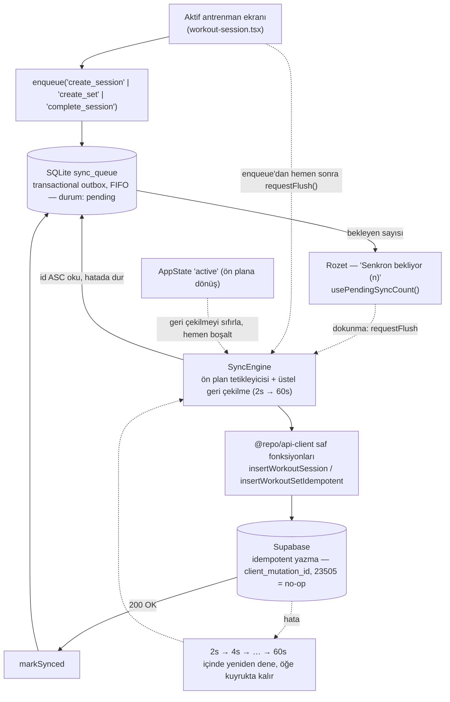

<p align="center">
  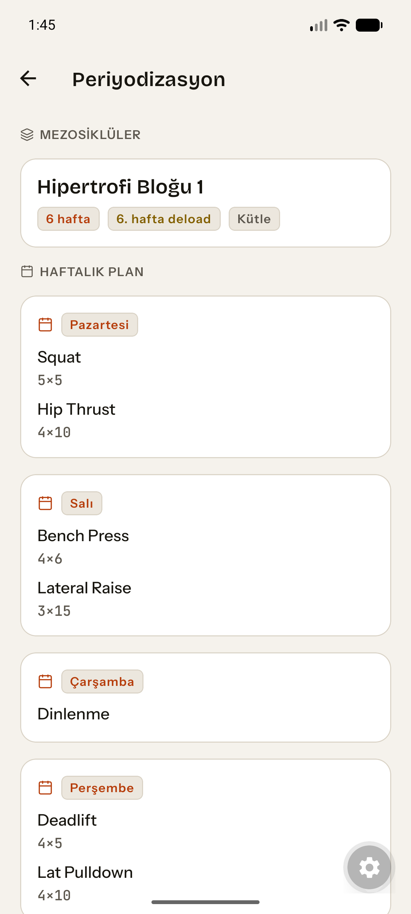
  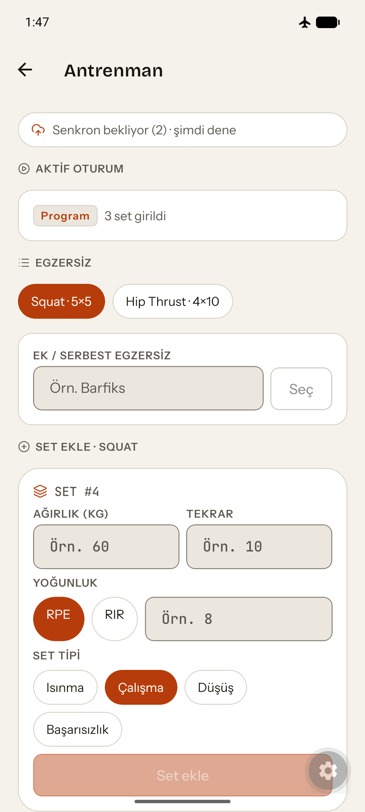
  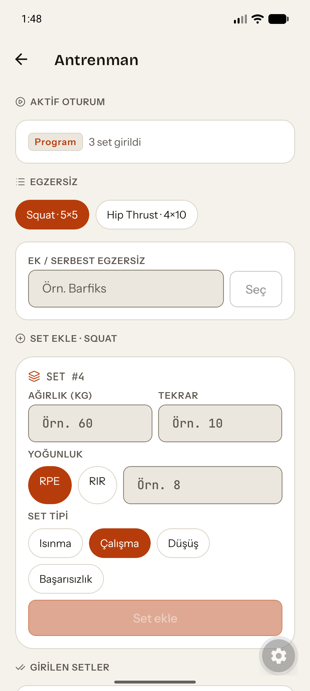
</p>

**Arayüzde domain hesabı.** RPE→%1RM dönüşümü `packages/domain` içinde (`rpeToPercent`) hesaplanır; ekran yalnızca sonucu çizer — egzersiz başına gösterilen hedef yüzdeler, işaretlenen deload haftası.

**Transactional outbox, kanıtlanmış.** Uçak modunda kaydedilen setler bir _Senkron bekliyor (2)_ rozetinin arkasında kuyruğa girer (sol→orta); yeniden bağlanıldığında motor onları idempotent biçimde boşaltır ve rozet kalkar (sağ). Bkz. [`docs/mobile/sync-protocol.md`](docs/mobile/sync-protocol.md).

Çevrim içi olsun olmasın her yazma kuyruktan geçer — ayrı bir çevrim içi/offline kod yolu yoktur. `SyncEngine` Supabase'i hiçbir zaman kendisi import etmez; kuyruğu FK açısından güvenli sırayla boşaltır (`id ASC`; bir oturumun `create_session`'ı her zaman onun `create_set` girdilerinden önce kuyruğa alınır) ve yalnızca `@repo/api-client`'ın C1 çevrim içi veri katmanı için zaten sunduğu saf fonksiyonları (`insertWorkoutSession`, `insertWorkoutSetIdempotent`) çağırır. İdempotentlik iki farklı nedenle iki farklı yolla sağlanır: `workout_sessions.id`, **istemci tarafında** (`crypto.randomUUID()`) üretilen düz bir birincil anahtardır, bu yüzden düz bir `.upsert(row, { onConflict: 'id', ignoreDuplicates: true })` işe yarar; `workout_logs` ise PostgREST'in `upsert`'ünün bir `WHERE` cümlesiyle hedefleyemediği _kısmi_ bir benzersiz indekse (`(client_id, client_mutation_id) WHERE client_mutation_id IS NOT NULL`) dayanır, bu yüzden onun yerine düz bir `insert` kullanılır ve yeniden denemedeki bir `23505` istemci tarafında sessiz bir no-op olarak ele alınır. Bilinçli olarak hiçbir `NetInfo` bağlantı kontrolü yoktur — strateji yalnızca "dene, başarısız ol, geri çekil"dir (2s → 4s → … → 60s, üst sınırlı); uygulamanın ön plana dönmesiyle ya da "Senkron bekliyor (n)" rozetine elle dokunulmasıyla sıfırlanır.

### Uçak modu kanıtı

Bir Android emülatöründe canlı doğrulandı (Pixel 8 AVD, `client2` hesabı, yerel Supabase yığını): çevrim içiyken kaydedilen bir set hemen boşaltıldı, rozet hiç görünmedi. Uçak modu açık, iki set daha kaydedildi (22 kg × 5 @RPE 9, 24 kg × 4 @RPE 10) — rozet "Senkron bekliyor (2)" gösterdi. Uçak modu kapalı — `AppState` ön plan tetikleyicisi kuyruğu boşalttı ve rozet kalktı. `workout_logs` tam olarak **3/3 satırla** sonlandı (çevrim içi set artı iki offline set), hepsi `session_id` ve `client_mutation_id` taşıyordu — geri çekilmeli yeniden deneme döngüsünden hiçbir kopya sağ çıkmadı. Tam yazım: [`docs/mobile/sync-protocol.md`](docs/mobile/sync-protocol.md) §8.

### Bilinçli olarak kapsam dışı

v1'in dondurulmasındaki aynı disiplin burada da uygulandı — bir gözden kaçırma değil, belgelenmiş bir sınır:

- **Koç tarafında mezosikıl CRUD arayüzü yok.** Yazma yolu (`useSaveMesocycle`) zaten var; henüz onu çağıran bir şey yok.
- **Son yazan kazanır (last-write-wins) çakışma çözümü yok.** Çoklu cihaz kullanımı _için_ tasarlandı — iki yeni tablo da zaten `updated_at` ve bir `set_updated_at()` trigger'ı taşıyor — ama birleştirme mekanizmasının kendisi kapsam dışı: tek cihazlı, yalnızca eklemeli, silmesiz bir senaryoda çözülecek bir çakışma sınıfı yoktur.
- **Silme senkronizasyonu yok, medya senkronizasyonu yok.** Kuyruk yalnızca `create_*` / `complete_*` işlemlerini taşır.

Tam liste ve gerekçe: [`docs/mobile/sync-protocol.md`](docs/mobile/sync-protocol.md) §6. İlgili kararlar: [ADR-0028](docs/adr/0028-mobil-koc-acil-erisim.md) (mobil koç acil erişimi), [ADR-0029](docs/adr/0029-kapsam-dondurma-v1.md) (bu dilimin üzerine inşa edildiği v1 dondurması), [ADR-0030](docs/adr/0030-motion-doktrini.md) (bu dilimle değişmeyen hareket doktrini).

> **Hosted eşliği hakkında bir not.** Hosted demo (bir Supabase projesi) **v1 çekirdek eşliğinde** dondurulmuştur — orada uygulanan son migration `20260820160000`'dır. Sonraki üç migration oraya hiç gönderilmedi: `20260820170000_profile_body_metrics` (profil/vücut ölçüleri sütunları), `20260820180000_account_active_state` ve bu dilimin `20260821120000_bb_signature_slice`'ı. Nedeni bir kestirme değil, mekaniktir: üçü de yerel bir `supabase db reset` için yazılmış ağır bir öz doğrulama bloğu taşır; bu blok RLS davranışını migration'ın kendi içinden sınamak için `set local role authenticated` çalıştırır — ve hosted push'un migration rolü bağlamında bu ifade `permission denied for schema public (42501)` döndürür. Projeyi kapatmanın bir parçası olarak, üzerinde boğuşulmadan bilinçli şekilde verilen karar: migration'ları hiç yazılmadıkları bir rol bağlamında ayakta kalacak şekilde yeniden işlemek yerine hosted demoyu v1 eşliğinde dondurmak ve daha yeni katmanların — profil/vücut ölçüleri, hesap-aktif durumu ve bu imza dilimi — bunun yerine **yerel Supabase + Android emülatörü kanıtına** dayanmasına izin vermek (`pnpm run test:rls` **158/158**, yukarıdaki uçak modu adımları). Bir portfolyo bağlamında hosted proje canlı v1 demosu olarak kalır; en yeni katman ikinci bir hosted dağıtımla değil, yerel ve emülatör kanıtıyla belgelenir.

---

## Ekran görüntüleri

Kareler, yerel Supabase yığınındaki **demo hesaplara** karşı otomatik olarak üretilir (`supabase/seed.sql` — koç `coach@example.com`, danışan `client2@example.com`): [`scripts/capture-screenshots.mjs`](scripts/capture-screenshots.mjs) Playwright ile oturum açar, koç oturumunu gerçek bir TOTP koduyla `aal2`'ye yükseltir ve `docs/screenshots/` içine sabit bir 1440×900 masaüstü karesi yazar (dosya boyutu için 0,75 ölçeğe indirilmiş, 1080×675 PNG). Betik bir test **değildir** ve CI'a bağlı değildir — arayüz değiştiğinde elle çalıştırılır (`node scripts/capture-screenshots.mjs [--only=<frame>]`). Görünen her ad, e-posta ve ölçüm seed verisidir; hiçbir gerçek kişisel veri söz konusu değildir. Arayüz Türkçedir ve her kare güncel Kor & Kemik kimliğini gösterir (açık tema; bkz. [Marka kimliği](#marka-kimliği)).

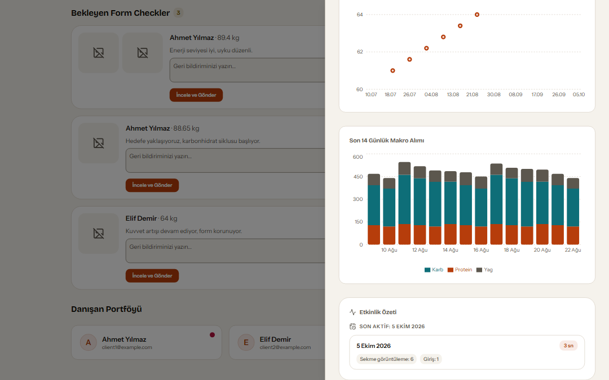

**Koçun görünümü gün hassasiyetinde durur.** Özet bir tarihi ve o gün kaç sekme görüntüleme / oturum açma gerçekleştiğini gösterir; **hiçbir yerde saat ya da dakika damgası yoktur** — bu sınır, bu sayfanın neyi çizmeyi seçtiğinden değil, `coach_activity_summary()` RPC imzasından gelir. Sayfayı açabilmek bile `aal2` bir koç oturumu gerektirir; `aal1` bir koç aynı düzeni boş veriyle dolu görür.

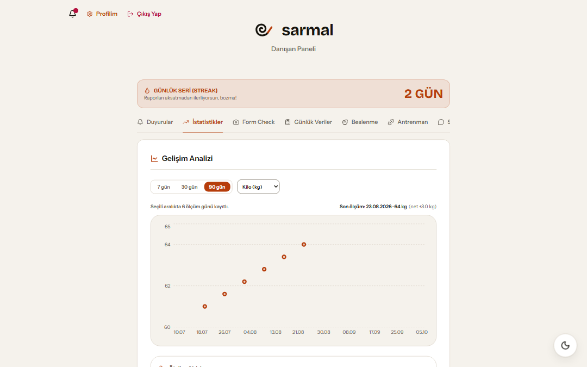

**Tek seri, iki okur.** Danışan kendi kilo serisine bakıyor: seçili pencerede 6 ölçüm günü, net +3,0 kg. Aralık seçici (7/30/90 gün) ve metrik seçici yalnızca **görünümü** değiştirir; tek bir kaynak seri vardır ve koç aynı seriyi salt okunur görür.

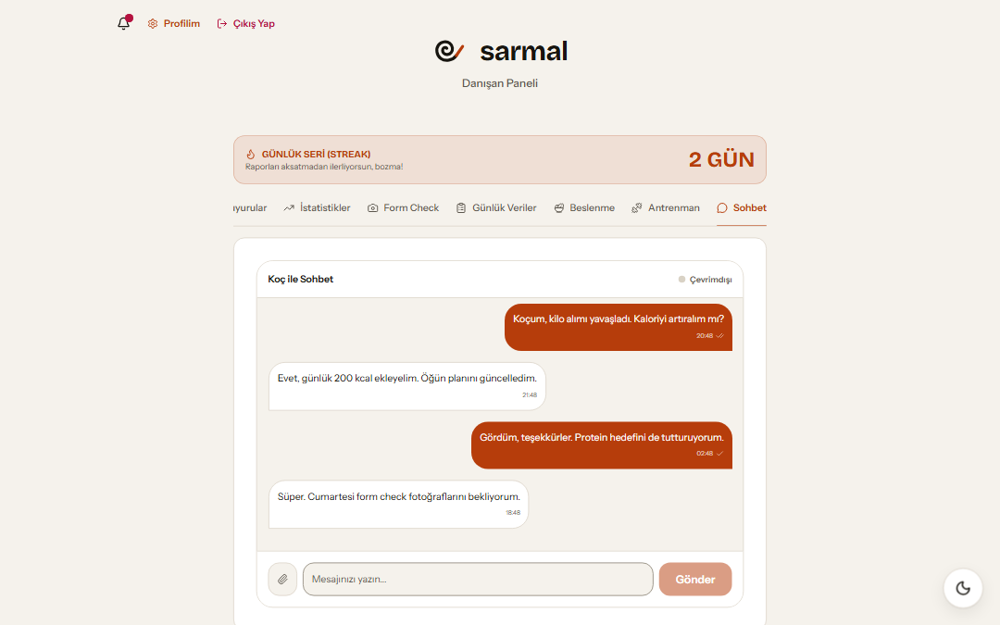

**Düzeltilmiş bir RLS regresyonunun kanıtı.** Koç–danışan sohbeti gerçek zamanlıdır (Supabase Realtime) ve okunma durumu mesaj başına izlenir. Danışanın koçun profil satırını okuyabilmesi bir RLS düzeltmesine bağlıydı; bu ekran, düzeltmenin tuttuğunun test edilmiş kanıtıdır (`tests/e2e/messaging.spec.ts`).

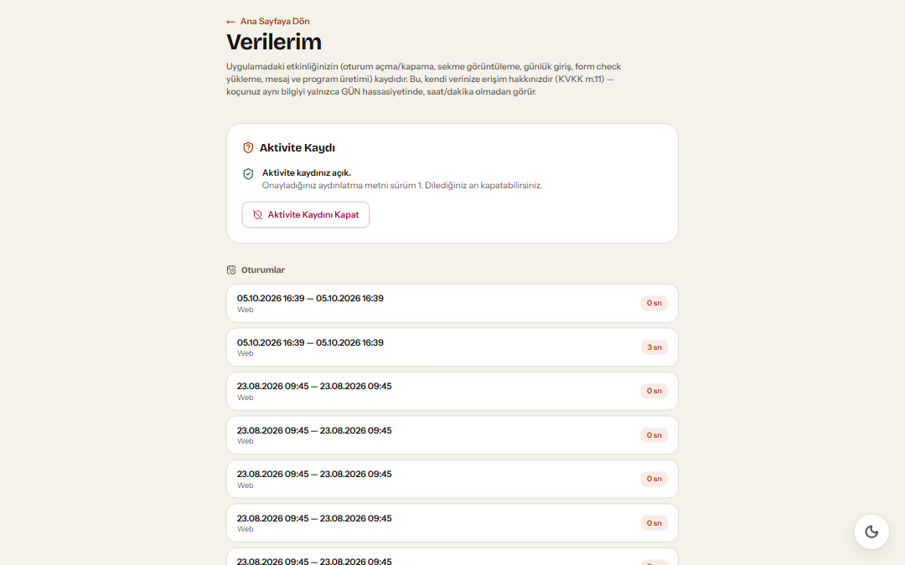

**Aynı kayıtlar, tam çözünürlükte, ait oldukları kişi için.** `/verilerim`, KVKK md. 11 erişim hakkıdır: rıza **açıkken** oturumlar ve olaylar **saat ve dakika damgalarıyla** listelenir — iki kare yukarıdaki gün düzeyindeki koç özetiyle bilinçli olarak asimetriktir. İki ekran birlikte tek bir gizlilik kararının görsel kanıtıdır: danışan her şeyi görür, koç günü görür. "Etkinlik kaydını kapat" yalnızca toplamayı durdurmaz; mevcut satırları o anda siler (bkz. [karar #3](#3-onay-kapısı-yazma-fonksiyonunun-içinde)).

### Mobil

<p align="center">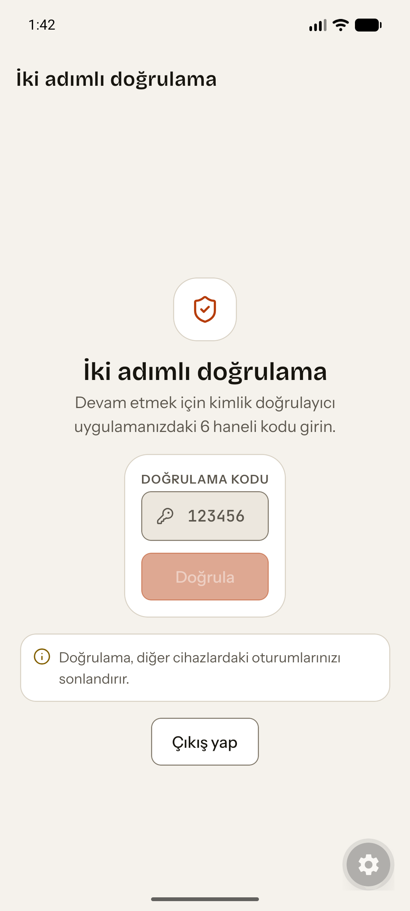</p>

**RLS kapısı mobile de ulaşır.** Telefondaki koç verisi de bir `aal2` step-up'ının arkasındadır — kapı rotada değil RLS'te yaşar, bu yüzden istemci onu atlatamaz. Uyarı ("bu, diğer oturumlarınızı sonlandırır") mobilde B-061'i kapatır. Yukarıdaki dört karenin geldiği Playwright betiğiyle değil, bir Android emülatöründe yakalandı. Tur 2'nin diğer mobil kareleri (periyodizasyon, offline senkronizasyon) yukarıdaki [Tur 2 — İmza Dilimi](#i̇mza-dilimi) bölümündedir.

---

## Özellikler

### Koçun (`coach`) bakış açısından

- Her danışanın profili, ilerleme geçmişi ve form kontrol fotoğrafları için tek bir panel; 7/30/90 günlük pencerelerde kilo ve ölçüm eğilimleri.
- Danışanların ürettiği yapay zekâ antrenman/beslenme planlarını **onaylama ya da reddetme** (`program_approvals`) — hiçbir plan koç onayı olmadan bir danışanın aktif programına yazılmaz.
- Duyurular ve bireysel bildirimler; danışanlarla dosya ekli, gerçek zamanlı bire bir sohbet.
- **Zorunlu TOTP çok faktörlü kimlik doğrulama** — `aal2` olmadan bir koç hesabı hiçbir danışan verisi görmez (bkz. [karar #1](#1-mfa-kapısı-bir-rotada-değil-rls-içinde)).
- **Bir danışan için parola sıfırlama tetikleme**: koç danışan olarak oturum açamaz (impersonation yok); sıfırlama bağlantısı danışanın kendi e-posta adresine gider ve işlem `coach_actions` denetim tablosuna yazılır — denetim yazması başarısız olursa sıfırlama fail-closed olarak iptal edilir.
- Rıza vermiş danışanlar için **gün hassasiyetinde etkinlik özeti** (bkz. [karar #3](#3-onay-kapısı-yazma-fonksiyonunun-içinde)).
- **Yapılmadı:** bir danışan hesabı oluşturma akışı. Bunun için yazılmış `service_role` tabanlı server action'lar, onları hiçbir şey çağırmadığı için kaldırıldı (`docs/DISCOVERY.md` §2.5) ve yerlerine bir arayüz gelmedi; hesaplar bugün Supabase tarafında elle oluşturuluyor. Çoklu koç izolasyonu (bir koç-danışan atama tablosu) da yok — borç kaydında **B-058** olarak izleniyor.

### Danışanın (`client`) bakış açısından

- **Form kontrolü**: haftalık kilo girişi ile ön/arka poz fotoğrafları; geçmiş kayıtlarla **önce/sonra** karşılaştırması (bir kaydırıcı bileşen). Fotoğraflar özel bir Supabase Storage bucket'ında (`form-checks-media`) yaşar ve yalnızca bir saatlik TTL'e sahip **imzalı URL'ler** üzerinden sunulur.
- Recharts grafiklerinde kilo, ölçüm ve makro (protein/karbonhidrat/yağ) eğilimleri, ayrıca ayrı bir ilerleme fotoğrafı arşivi (`progress_photos`).
- **Canlı salon modu**: antrenman sırasında, sürümlü plan yapısıyla yönlendirilen set başına ağırlık/tekrar/RPE girişi (`workout_logs`).
- Hedef, bölünme tipi ve seviyeden **yapay zekâ antrenman planları**, antropometrik veriden **yapay zekâ beslenme planları** (BMR/TDEE + makro dağılımı). Üretilen program onay için koça gider; onaylandığında profile yazılır ve bir bildirim gönderilir.
- Günlük su/sodyum/makro girişi (gün başına bir kayıt, `daily_logs`) ve ardışık form kontrolü günlerine dayalı **seri takibi**.
- Koçla gerçek zamanlı sohbet, okunma durumu ve okunmamış bildirim rozeti; sunucu tarafı magic-byte doğrulamasından geçmiş ekler.
- **Kendi verisi üzerinde kontrol**: isteğe bağlı TOTP MFA, `/verilerim` altında tam çözünürlüklü etkinlik günlüğü, tek tıkla rıza geri çekme ve **hesabın ve tüm verisinin kalıcı olarak silinmesi** (bkz. [karar #2](#2-yarı-silinmiş-bir-hesap-şema-düzeyinde-imkânsız)).
- **PWA**: ana ekrana yüklenebilir, `workout_logs`/`profiles` verisi için offline önbellek (`next-pwa`, `NetworkFirst`); form kontrol fotoğrafları cihazda hiçbir zaman tutulmaz (`NetworkOnly`).
- Koyu tema (`next-themes`, elle değiştirme seçeneğiyle sistem tercihini izler).

### Mobil (`apps/mobile`)

Expo SDK 57 / React Native 0.86 üzerinde bir **iskelet**: `expo-router` ile 5 sekme artı bir oturum açma ekranı; paylaşılan `@repo/types` ve `@repo/logger`'a bağlı. Veri katmanı **bilinçli olarak** henüz bağlanmadı (bkz. [ADR-0023](docs/adr/0023-monorepo-kesim-plani.md)); CI onu tip kontrolü, lint, `expo-doctor` ve `expo export` ile ayrı bir iş olarak çalıştırır. Android emülatöründe gerçek bir smoke çalıştırması yapıldı.

---

## Mimari

Bir pnpm + Turborepo monoreposu. Next.js sunucusu Supabase (Postgres/Auth/Storage/Realtime) ile doğrudan konuşur, ancak Python yapay zekâ servisine **yalnızca proxy görevi gören kendi API rotaları üzerinden** ulaşır. Tarayıcı FastAPI'yi hiçbir zaman doğrudan görmez.

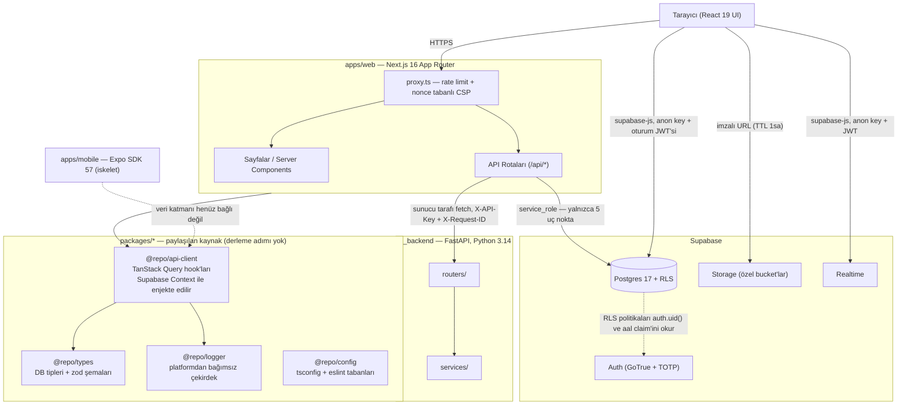

**Danışan yapay zekâ antrenman planı ister → koç onaylar** akışı:

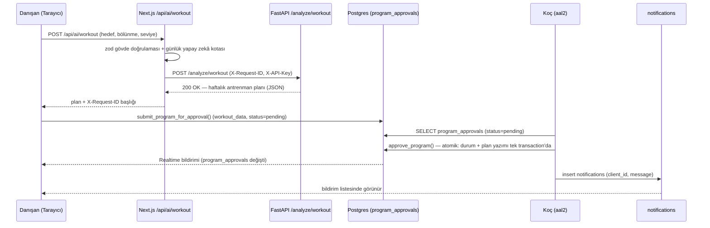

Derinlemesine mimari kararlar, veri modeli ve ADR dizini için [`docs/ARCHITECTURE.md`](docs/ARCHITECTURE.md) ve [`docs/adr/`](docs/adr/) belgelerine bakın — ikisi de Türkçedir.

---

## Teknoloji yığını

| Katman                                | Teknoloji                    | Sürüm              | Amaç                                                                        |
| ------------------------------------- | ---------------------------- | ------------------ | --------------------------------------------------------------------------- |
| Monorepo görev çalıştırıcı            | Turborepo                    | 2.10.11            | Görev grafiği, önbellekleme (2 uygulama + 4 paket)                          |
| Paket yöneticisi (JS)                 | pnpm                         | 10.34.5            | `package.json#packageManager` ile sabitlenmiş                               |
| Çalışma zamanı                        | Node.js                      | 24 LTS             | `engines.node: >=24.19.0`                                                   |
| Frontend framework'ü                  | Next.js (App Router)         | 16.3.1             | SSR/RSC, yönlendirme, API rotaları — **webpack'e sabitlenmiş**              |
| UI kütüphanesi                        | React                        | 19.2.4             | Bileşen modeli                                                              |
| Dil                                   | TypeScript (strict)          | 6.0.3              | Tüm workspace'lerde tek major sürüm (B-051)                                 |
| Stil                                  | Tailwind CSS                 | ^3.4.19            | Utility-first CSS + `src/design/tokens.ts`                                  |
| Veri çekme/önbellek                   | TanStack Query               | ^5.62.11           | Sunucu durumu, önbellek geçersizleştirme                                    |
| Formlar + doğrulama                   | React Hook Form + Zod        | ^7.54.2 / ^3.24.1  | Form durumu ve şema doğrulaması                                             |
| Grafikler                             | Recharts                     | ^3.9.1             | Kilo/ölçüm/makro eğilim grafikleri (Chart.js kaldırıldı)                    |
| İkonlar                               | lucide-react                 | ^1.31.0            | Emoji yerine ikon seti (ADR-0016)                                           |
| Toast'lar                             | Sonner                       | ^1.7.2             | Yalnızca `apps/web`; pakete bir portun arkasından verilir                   |
| Tema                                  | next-themes                  | ^0.4.6             | Koyu/açık tema, nonce zinciriyle uyumlu                                     |
| PWA                                   | next-pwa                     | ^5.6.0             | Service worker, offline önbellek                                            |
| Loglama (frontend)                    | pino                         | ^9.6.0             | Yapılandırılmış JSON loglar + `REDACT_PATHS`                                |
| Mobil                                 | Expo SDK / React Native      | 57 / 0.86.2        | `expo-router` ile iskelet istemci                                           |
| Veritabanı                            | Supabase (Postgres)          | 17.6.x             | Veri, Auth, Storage, Realtime — 21 tablo, 34 migration                      |
| İstemci SDK'sı                        | @supabase/supabase-js + ssr  | ^2.110.0 / ^0.12.4 | Supabase erişimi, cookie tabanlı oturumlar (ADR-0022)                       |
| Yapay zekâ servisi                    | FastAPI                      | ≥0.115             | Antrenman/beslenme/öneri motoru                                             |
| Yapay zekâ servisi dili               | Python                       | 3.14               | `pyproject` tabanı ≥3.12; CI/mypy/ruff 3.14'e sabitlenmiş                   |
| Yapay zekâ servisi doğrulaması        | Pydantic + pydantic-settings | ≥2.9 / ≥2.6        | Şema ve ayar doğrulaması                                                    |
| Yapay zekâ servisi loglaması          | structlog                    | ≥24.4              | Yapılandırılmış JSON loglar                                                 |
| Yapay zekâ servisi istek sınırlaması  | slowapi                      | ≥0.1.9             | İstek sınırlama                                                             |
| Paket yöneticisi (Python)             | uv                           | —                  | Bağımlılık/venv yönetimi                                                    |
| Birim/bileşen testleri                | Vitest + Testing Library     | ^2.1.8             | 868 test / 68 dosya                                                         |
| Backend testleri                      | pytest + pytest-cov          | ≥8.3               | FastAPI testleri (`--cov-fail-under=70`)                                    |
| E2E testleri                          | Playwright                   | ^1.49.1            | 10 spec dosyası, chromium + Mobile Chrome                                   |
| CI                                    | GitHub Actions               | —                  | 6 iş + bir `required-checks` kapısı                                         |
| Konteynerleştirme                     | Docker + docker compose      | —                  | Çok aşamalı derleme, `output: 'standalone'`                                 |

> **Next.js neden webpack'e sabitlendi:** `next-pwa` v5 Turbopack ile çalışmaz ve PWA offline önbelleği projenin kabul kriterlerinden biridir. Karar ve alternatifleri: [ADR-0006](docs/adr/0006-next-pwa-korunmasi.md), [ADR-0012](docs/adr/0012-pwa-webpack-build.md).

---

## Hızlı başlangıç

### Ön koşullar

- **Node.js 24 LTS** (`package.json#engines` → `>=24.19.0`)
- **pnpm ≥ 10** — tam sürüm `package.json#packageManager` içinde sabitlenmiştir (`pnpm@10.34.5`); pnpm 10 bu alanı okur ve kendini o sürüme geçirir. `npm i -g pnpm@10.34.5` ile kurun (Node 25'te paketten çıkarıldığı için corepack kullanılmaz).
- **Python 3.14** ve **[uv](https://docs.astral.sh/uv/)**
- **[Supabase CLI](https://supabase.com/docs/guides/cli)** — yerel Postgres/Auth/Storage/Studio yığını için (Docker gerektirir)
- Docker (yerel Supabase yığını için zaten gereklidir; uygulama konteynerleri isteğe bağlıdır)

> **pnpm tuzağı:** bu depoda bayraklar betiklere `--` ayırıcısı **olmadan** iletilir. Doğru biçim `pnpm run test:e2e --ui`, `pnpm run test --reporter=verbose` şeklindedir.

### Adımlar (macOS/Linux — bash)

```bash
# 1) Clone the repository
git clone <repo-url>
cd my-coaching-appv2

# 2) Install every workspace dependency (one command, from the root)
pnpm install --frozen-lockfile

# 3) Copy the environment file and fill it in
cp apps/web/.env.example apps/web/.env.local
# Open .env.local and enter your Supabase project details.
# In local development NEXT_PUBLIC_SUPABASE_URL must point at the local stack
# (http://127.0.0.1:54321) — if you enter a hosted address, the server guard
# deliberately fails on the first request unless ALLOW_HOSTED_TARGET=1.

# 4) Start the local Supabase stack (Postgres + Auth + Storage + Studio)
npx supabase start

# 5) Apply the migrations
pnpm run db:migrate
# note: db:migrate runs `supabase db push`. A full from-scratch reset + seed
# needs `supabase db reset` — that command DELETES ALL LOCAL DATA.

# 6) Generate the TypeScript types (packages/types/src/database.ts)
pnpm run db:types

# 7) Install the AI backend dependencies
cd ai_backend && uv sync && cd ..
```

Geliştirme sunucularını iki ayrı terminalde başlatın:

```bash
# Terminal 1 — Next.js (http://localhost:3000)
pnpm run dev

# Terminal 2 — FastAPI (http://localhost:8000, hot reload via --reload)
cd ai_backend
uv run uvicorn app.main:app --reload
```

### Adımlar (Windows — PowerShell)

```powershell
git clone <repo-url>
Set-Location my-coaching-appv2

pnpm install --frozen-lockfile

Copy-Item apps/web/.env.example apps/web/.env.local
# Open .env.local and enter your Supabase project details

npx supabase start
pnpm run db:migrate
pnpm run db:types

Set-Location ai_backend
uv sync
Set-Location ..
```

İki ayrı PowerShell penceresinde:

```powershell
# Window 1
pnpm run dev

# Window 2
Set-Location ai_backend
uv run uvicorn app.main:app --reload
```

Uygulama `http://localhost:3000` adresinde, yapay zekâ servisi `http://localhost:8000` adresinde çalışır (Swagger: `/docs`).

> **Koç olarak oturum açmayı düşünüyorsanız:** `aal2` kapısı TOTP kaydını zorunlu kılar ve yerel GoTrue'da TOTP varsayılan olarak **kapalıdır**. `supabase/config.toml` içinde MFA/TOTP etkinleştirilip yığın yeniden başlatılana kadar koç akışı çalışmaz (ayrıntılar: [ADR-0026](docs/adr/0026-totp-mfa-ve-aal2-kapisi.md), "Kalan risk").

### Mobil (isteğe bağlı)

```bash
pnpm --filter mobile run start   # Expo development server
pnpm run mobile:type-check
pnpm run mobile:lint
```

---

## Ortam değişkenleri

### Next.js (`apps/web/.env.local`, şablon: `apps/web/.env.example`)

Doğrulama iki dosyaya bölünmüştür: istemciye de giden değerler [`apps/web/src/env.shared.ts`](apps/web/src/env.shared.ts) içinde, yalnızca sunucuya ait değerler ise [`apps/web/src/env.server.ts`](apps/web/src/env.server.ts) içinde yaşar (bu dosya `import 'server-only'` taşır). İkisi de zod ile fail-fast doğrular.

| Değişken                        | Zorunlu                             | Varsayılan              | Kullanan                   | Açıklama                                                                                                                                                                  |
| ------------------------------- | ----------------------------------- | ----------------------- | -------------------------- | ------------------------------------------------------------------------------------------------------------------------------------------------------------------------- |
| `NEXT_PUBLIC_SUPABASE_URL`      | Evet                                | —                       | İstemci + sunucu           | Supabase proje URL'si. Derleme zamanında tarayıcı paketine gömülür.                                                                                                       |
| `NEXT_PUBLIC_SUPABASE_ANON_KEY` | Evet                                | —                       | İstemci + sunucu           | Supabase anon/publishable anahtarı. RLS ile korunur; istemciye açılması güvenlidir.                                                                                       |
| `SUPABASE_SERVICE_ROLE_KEY`     | **Evet, beş sunucu rotası için**    | —                       | **Yalnızca sunucu**        | RLS'i atlayan service-role anahtarı — aşağıdaki uyarıya bakın. Tanımlı değilse etkilenen rotalar `503` döndürür.                                                          |
| `ALLOW_HOSTED_TARGET`           | Hosted hedefte **evet**             | _(boş)_                 | Sunucu                     | `1` olarak ayarlanmadıkça `*.supabase.co\|com` hedefli her sunucu isteği fail-closed olarak reddedilir (bkz. [karar #4](#4-üç-katmanlı-fail-closed-bir-hosted-hedef-koruması)). |
| `AI_BACKEND_URL`                | Hayır                               | `http://localhost:8000` | Sunucu (`/api/ai/*` proxy) | FastAPI servisinin adresi.                                                                                                                                                |
| `AI_BACKEND_API_KEY`            | Production'da **evet**              | —                       | Sunucu                     | FastAPI'ye `X-API-Key` olarak iletilir. `NODE_ENV=production` iken eksikse uygulama fail-fast olur.                                                                       |
| `NEXT_PUBLIC_APP_URL`           | Hayır                               | `http://localhost:3000` | İstemci + sunucu           | Mutlak URL üretimi (örn. e-posta bağlantıları).                                                                                                                           |
| `NODE_ENV`                      | Hayır                               | `development`           | Sunucu                     | `development` \| `test` \| `production`.                                                                                                                                  |
| `LOG_LEVEL`                     | Hayır                               | `info`                  | Sunucu                     | pino log seviyesi.                                                                                                                                                        |
| `RATE_LIMIT_WINDOW_MS`          | Hayır                               | `60000`                 | Sunucu (`proxy.ts`)        | Genel `/api/*` rate limit penceresi (ms).                                                                                                                                 |
| `RATE_LIMIT_MAX_REQUESTS`       | Hayır                               | `60`                    | Sunucu (`proxy.ts`)        | Pencere başına genel istek tavanı. `/api/*`'dan bağımsız olarak `/api/ai/*` **dakikada 20 istek** olarak sabittir.                                                         |
| `TRUSTED_PROXY_COUNT`           | Hayır                               | `0`                     | Sunucu                     | `X-Forwarded-For` zincirinde kaç atlamaya güvenileceği. **Varsayılan 0, hiçbir başlığa güvenilmediği anlamına gelir.**                                                    |
| `AI_QUOTA_DAILY_LIMIT`          | Hayır                               | `20`                    | Sunucu                     | Kullanıcı başına günlük yapay zekâ proxy isteği (üç uç nokta da tek bir kovayı paylaşır).                                                                                 |

> **UYARI — `SUPABASE_SERVICE_ROLE_KEY`.** Bu anahtar RLS'i **tamamen** atlar; sızması tüm veritabanının ele geçirilmesi demektir. Asla `NEXT_PUBLIC_` önekini almamalı ve asla istemci koduna (bir bileşen, bir hook, bir `'use client'` dosyası) import edilmemelidir.
>
> [ADR-0025](docs/adr/0025-hesap-silme-ve-service-role-sunucu-yolu.md)'ten bu yana anahtar **çalışma zamanında kullanılmaktadır** — her biri tek bir dar iş için beş sunucu rotasında:
>
> | Rota                                    | `service_role` neden gerekli                                                       |
> | --------------------------------------- | ---------------------------------------------------------------------------------- |
> | `POST /api/account/delete`              | Storage API üzerinden fiziksel dosya silme + `delete_account()` çağrısı            |
> | `POST /api/attachments/verify`          | Magic-byte doğrulama damgasının yazılması (bir istemci kendini doğrulamamalıdır)   |
> | `POST /api/activity`                    | `record_activity()` — EXECUTE yalnızca `service_role`'e verilmiştir                |
> | `PUT/DELETE /api/activity/consent`      | `grant_activity_consent()` / `revoke_activity_consent()`                           |
> | `POST /api/coach/reset-client-password` | `auth.admin.generateLink()` ile bir kurtarma bağlantısı üretilmesi                 |
>
> Etrafındaki disiplin: anahtarı tam olarak bir dosya okur, `env.server.ts`, ve bu dosya `import 'server-only'` taşır (yanlışlıkla yapılan bir istemci importu bir **derleme zamanı** hatasıdır); `service_role`'ün EXECUTE hakları sayılı bir fonksiyon kümesiyle sınırlıdır ve denetim tablolarında hiçbir doğrudan tablo ayrıcalığı yoktur; anahtar yapılandırılmamışsa rotalar `503` döndürür — asla **sessizce başarı iddia etmezler**; ve hiçbir log satırı anahtarı, bir token'ı ya da bir hata gövdesini asla taşımaz.

### FastAPI (`ai_backend/.env`, şablon: `ai_backend/app/core/config.py`)

| Değişken       | Varsayılan              | Açıklama                                                                                                                         |
| -------------- | ----------------------- | -------------------------------------------------------------------------------------------------------------------------------- |
| `APP_NAME`     | `Coaching AI Backend`   | OpenAPI başlığı.                                                                                                                 |
| `VERSION`      | `1.0.0`                 | Uygulama sürümü.                                                                                                                 |
| `ENVIRONMENT`  | `development`           | `development` \| `staging` \| `production`. Production'da hata mesajları genel metne düşer.                                      |
| `CORS_ORIGINS` | `http://localhost:3000` | Virgülle ayrılmış origin izin listesi (`*` değil, bir izin listesi).                                                              |
| `API_KEY`      | _(boş)_                 | Ayarlanırsa `/analyze/*` ve `/recommendations` için bir `X-API-Key` başlığı zorunlu olur.                                         |
| `RATE_LIMIT`   | `60/minute`             | Genel istek tavanı. `/analyze/*` ve `/recommendations` ayrıca `20/minute` ile sınırlanır; `/health*` muaftır.                     |
| `LOG_LEVEL`    | `INFO`                  | structlog log seviyesi.                                                                                                          |
| `DATA_DIR`     | `ai_backend/data`       | CSV veri dosyalarının okunduğu dizin.                                                                                            |

---

## Geliştirme komutları

### Kök (`package.json`) — Turborepo üzerinden

Aşağıdaki komutlar `--filter=!mobile` ile çalışır ve web ile paketleri kapsar; mobil, ayrı `mobile:*` betikleri üzerinden çalışır.

| Komut                                                          | Ne yapar                                                                                   |
| -------------------------------------------------------------- | ------------------------------------------------------------------------------------------ |
| `pnpm run dev`                                                 | `apps/web` geliştirme sunucusu (`next dev --webpack`).                                     |
| `pnpm run build`                                               | Tüm workspace'lerde `build` (`output: 'standalone'`).                                      |
| `pnpm run start`                                               | Production derlemesini çalıştırır.                                                         |
| `pnpm run lint`                                                | ESLint flat config; `apps/web` + `packages/*`.                                             |
| `pnpm run type-check`                                          | `tsc --noEmit` — çıktı üretmeden tip kontrolü.                                             |
| `pnpm run type-check:e2e`                                      | E2E dosyaları için, kendi tsconfig'leriyle tip kontrolü.                                   |
| `pnpm run test`                                                | Vitest, tek çalıştırma.                                                                    |
| `pnpm run test:coverage`                                       | Kapsam raporuyla Vitest (`coverage/index.html`).                                           |
| `pnpm run test:e2e`                                            | Playwright E2E testleri (UI modu için `pnpm run test:e2e --ui`).                           |
| `pnpm run test:rls`                                            | 144 RLS senaryosunu psql aracılığıyla yerel Postgres konteynerine karşı çalıştırır.         |
| `pnpm run test:transform`                                      | Veri dönüşümü SQL testleri.                                                                |
| `pnpm run ratchet`                                             | Kimlik cırcırı — eski tasarım dili sayaçlarını doğrular (ADR-0018).                        |
| `pnpm run format`                                              | Tüm dosyaları Prettier ile biçimlendirir.                                                  |
| `pnpm run format:check`                                        | Prettier biçim kontrolü (yazmadan).                                                        |
| `pnpm run db:migrate`                                          | `supabase db push` — bekleyen migration'ları uygular.                                      |
| `pnpm run db:types`                                            | Yerel şemadan `packages/types/src/database.ts` üretir.                                     |
| `pnpm run db:backup-hosted`                                    | Hosted projenin şema + veri + rol yedeğini alır.                                           |
| `pnpm run clean:foods`                                         | `data/daily_food_nutrition_dataset.csv` → `data/clean_foods.csv`.                          |
| `pnpm run db:import-catalog`                                   | `exercises` / `food_database` referans kataloglarını yükler.                               |
| `pnpm run mobile:type-check` / `mobile:lint` / `mobile:export` | `apps/mobile` kapıları.                                                                    |
| `pnpm run ci`                                                  | `lint && type-check && test && build` — CI frontend işinin yerel karşılığı.                |

### Yapay zekâ backend'i (`ai_backend/`)

| Komut                                  | Ne yapar                                               |
| -------------------------------------- | ------------------------------------------------------ |
| `uv sync`                              | Bağımlılıkları kurar (`pyproject.toml`'dan).           |
| `uv run uvicorn app.main:app --reload` | Geliştirme sunucusu (`http://localhost:8000`).         |
| `uv run pytest`                        | Testler + kapsam raporu (`--cov-fail-under=70`).       |
| `uv run ruff check .`                  | Lint.                                                  |
| `uv run ruff format --check .`         | Biçim kontrolü.                                        |
| `uv run mypy app`                      | Statik tip kontrolü (strict).                          |

---

## Test

Test piramidinin dört katmanı vardır; sayılar en son tam çalıştırmadan gelir.

| Katman                      | Kapsam                                                     | Komut                    | Durum                                        |
| --------------------------- | ---------------------------------------------------------- | ------------------------ | -------------------------------------------- |
| **Vitest** (birim/bileşen)  | jsdom, `apps/web` + `packages/*`                           | `pnpm run test:coverage` | **868 test / 68 dosya**, %67,17 satır        |
| **RLS** (SQL)               | `supabase/tests/rls.test.sql`, gerçek bir oturum JWT'siyle | `pnpm run test:rls`      | **144 senaryo**                              |
| **pytest** (backend)        | `ai_backend/tests`                                         | `uv run pytest`          | eşik `--cov-fail-under=70`                   |
| **Playwright** (E2E)        | 10 spec, chromium + Mobile Chrome                          | `pnpm run test:e2e`      | **54 başarılı**, 4 atlandı                   |

Birkaç ayrıntı:

- **Kapsam eşikleri tek yönlü bir cırcırdır** (`vitest.config.ts`): `lines 60`, `functions 60`, `branches 55`, `statements 60`. Ölçülen değer (%67,17) eşiğin üzerindedir ve eşik asla düşürülmez.
- **RLS testleri iddia etmez, ölçer.** Her senaryo gerçek bir `authenticated` JWT'yi üstlenir (`set local request.jwt.claims`) ve sorguları çalıştırır; "`aal1`'deki bir koç kaç satır görür" sorusunun yanıtı bir dosyadaki yorum değil, test çıktısındaki bir sayıdır.
- **E2E gerçek bir yığına karşı çalışır.** `webServer` testlerden önce `pnpm run build && pnpm run start` çalıştırır; CI'da ayrıca `supabase start` + `supabase db reset` ile temiz bir veritabanı hazırlanır. Koç spec'leri TOTP kodlarını bir `aal2` fixture'ı (`otplib`) aracılığıyla üretir.
- **`e2e` işi yalnızca `pull_request` olayında tetiklenir** — push'larda kritik yolu kısa tutmak için.

---

## Veritabanı ve RLS

**21 public tablo, 34 migration.** Danışan verisi taşıyan 16 tablo `aal2` kapısının altına girer; kalan beşi kataloglar (`exercises`, `food_database`) ve denetim/damga tablolarıdır (`account_deletions`, `coach_actions`, `message_attachment_verifications` — hepsi RLS artı FORCE ile ve **sıfır politikayla**; herkese kapalıdır, yalnızca `SECURITY DEFINER` fonksiyonları tarafından yazılır).

**Rol modeli:** `user_role` enum'u `coach` ve `client` değerlerini alır ([ADR-0013](docs/adr/0013-rollerin-coach-client-olarak-yeniden-adlandirilmasi.md)). Bilinçli bir istisna: yapay zekâ backend'inin kablo protokolündeki `student_id` alanı değişmedi, çünkü `ai_backend/app/schemas/recommendations.py` bu adı bekler.

**Row Level Security yetkilendirmenin tek kaynağıdır.** Uygulama kodunun hiçbir yerinde kendi başına bir rol kontrolü yapılıp erişime buna göre karar verilmez — her SELECT/INSERT/UPDATE/DELETE Postgres politikalarıyla süzülür. `public` şemasındaki tüm tablo ve fonksiyon ayrıcalıkları `anon` rolünden REVOKE edilmiştir ve RLS her tabloda hem `enabled` hem `forced` durumundadır (böylece tablo sahibi bile onu atlayamaz).

**Yalnızca ekleme (append-only) migration kuralı:** mevcut bir migration asla düzenlenmez, onun yerine yenisi yazılır. Her migration dosyası neden var olduğunu, hangi ölçüme dayandığını ve nasıl geri alınacağını (bir `-- DOWN` bloğu) kendi içinde taşır.

```bash
pnpm run db:migrate   # applies pending migrations
pnpm run db:types     # regenerates packages/types/src/database.ts
pnpm run test:rls     # 144 scenarios
```

CSV içe aktarma, RLS politika tablosu, storage bucket politikaları ve bilinen tutarsızlıklar için [`supabase/README.md`](supabase/README.md) belgesine bakın.

---

## Docker ile çalıştırma

```bash
docker compose up --build
```

| Servis                         | Port    | Not                                                                                                                                                                                       |
| ------------------------------ | ------- | ----------------------------------------------------------------------------------------------------------------------------------------------------------------------------------------- |
| `web` (Next.js)                | `3000`  | `ai-backend` servisi `healthy` olana kadar başlamaz. `env_file` olarak `apps/web/.env.local` dosyasını okur.                                                                              |
| `ai-backend` (FastAPI)         | `8000`  | `/health` üzerinden sağlık kontrolü yapılır.                                                                                                                                              |
| `supabase-db` (isteğe bağlı)   | `54322` | Yalnızca izole/CI smoke testleri için minimal bir Postgres — **gerçek yerel geliştirme için bunun yerine `npx supabase start` kullanın** (Auth/Storage/Studio ile birlikte tam yığın).    |

`Dockerfile` çok aşamalıdır (`node:24-alpine`) ve monoreponun yalnızca web dilimini kurar (`pnpm install --frozen-lockfile --filter web...`). `AI_BACKEND_API_KEY` her iki serviste de zorunludur; tanımsızsa compose, anahtarsız sessizce ayağa kalkmak yerine açık bir hatayla durur. `NEXT_PUBLIC_*` değişkenleri **derleme zamanında** gömüldüğü için `docker build --build-arg NEXT_PUBLIC_SUPABASE_URL=...` olarak iletilmeleri gerekir.

---

## Dağıtım

Proje **dağıtılmış değildir**; aşağıdaki, hazırlanmış ama uygulanmamış bir dağıtım yoludur. Hedef topoloji: frontend Vercel'de, yapay zekâ backend'i Railway ya da Fly.io'da, veritabanı Supabase'de. Adım adım rehber, ortam değişkeni matrisi ve dağıtım sonrası kontrol listesi için [`docs/DEPLOYMENT.md`](docs/DEPLOYMENT.md) belgesine bakın.

**Dağıtım sözleşmesi:** gerçek bir hosted hedefe çıkarken `ALLOW_HOSTED_TARGET=1` **mutlaka** ayarlanmalıdır; aksi halde uygulama ilk istekte bilinçli olarak başarısız olur (bkz. [karar #4](#4-üç-katmanlı-fail-closed-bir-hosted-hedef-koruması)).

---

## Güvenlik

- **RLS yetkilendirmenin tek kaynağıdır**; koç için `aal2` (MFA) gerekliliği de bir rota kontrolü değil, bir RLS politikasıdır. Bkz. [Veritabanı ve RLS](#veritabanı-ve-rls).
- **HTTP güvenlik başlıkları**: HSTS (`max-age=63072000; includeSubDomains; preload`), `X-Frame-Options: DENY`, `X-Content-Type-Options: nosniff`, `Referrer-Policy`, `Permissions-Policy` ve `X-DNS-Prefetch-Control`, `next.config.mjs` içinde statiktir; **nonce tabanlı CSP** ise `proxy.ts` içinde istek başına üretilir (ADR-0022).
- **Oturumlar `localStorage`'da değil, cookie'lerde yaşar** (`@supabase/ssr`) — XSS yoluyla token hırsızlığı için daha dar bir yüzey (ADR-0022).
- **Üç katmanlı rate limiting**: `/api/*` için bellek içi bir IP+yol sınırı (`/api/health` muaf), `/api/ai/*` için dakikada 20 ve kullanıcı başına bir **günlük yapay zekâ kotası**. Oturum açma rotası ayrıca normalize edilmiş e-posta başına 15 dakikada 10 başarısız denemeye izin verir — IP yerine e-postayı anahtar almak bilinçlidir: `TRUSTED_PROXY_COUNT=0` iken IP tabanlı bir kilit, her kullanıcıyı dışarıda bırakan bir DoS kaldıracına dönüşürdü.
- **`X-Forwarded-For`'a varsayılan olarak güvenilmez** (`TRUSTED_PROXY_COUNT=0`); bir istemci bu başlığı serbestçe ayarlayabildiği için, güvenilen atlama sayısı açıkça belirtilmedikçe ondan hiçbir IP çözülmez.
- **Girdi doğrulaması**: her API rotası girdisi zod şemalarıyla (`@repo/types/schemas`), FastAPI tarafında ise Pydantic modelleriyle doğrulanır.
- **Dosya yüklemeleri**: ekler sunucu tarafında **magic byte**'larla doğrulanır (uzantıya ve `Content-Type`'a güvenilmez), doğrulama damgası TOCTOU'ya dayanıklı bir eTag'e bağlanır ve indirmeler `Content-Disposition: attachment` ile sunulur.
- **Storage gizliliği**: `avatars`, `form-checks-media`, `progress-photos` ve `message-attachments` bucket'ları **özeldir**. Sütunlar tam bir URL yerine bucket içi bir yol saklar, okumalar yalnızca **imzalı URL'ler** (TTL 3600s) üzerinden yapılır ve `anon` rolü hiçbir storage nesnesini okuyamaz.
- **Hata mesajlarında stack trace yok**: yapay zekâ proxy'si upstream hata ayrıntısını yalnızca sunucu loguna yazar ve istemciye genel bir mesaj artı bir `request_id` döndürür.
- **Log redaksiyonu**: `@repo/logger` içindeki `REDACT_PATHS` listesi token/anahtar/e-posta alanlarını maskeler; `service_role` yolları buna **güvenmez** ve hassas bir alanı hiçbir zaman bir loga koymaz.
- **Uçtan uca izlenebilirlik**: her yapay zekâ proxy isteği, hem Next.js hem FastAPI loglarında aynı tanımlayıcı altında görünen bir `X-Request-ID` üretir.
- **CI güvenlik kapısı**: semgrep, gitleaks (haftalık tam geçmiş taraması dahil), `pnpm audit --prod --audit-level=high` ve `pip-audit`.

Bir güvenlik açığı bildirmek için [`SECURITY.md`](SECURITY.md) belgesine bakın — lütfen **herkese açık bir GitHub issue'su açmayın**.

---

## Proje yapısı

```
apps/
  web/                        Next.js 16 App Router application
    src/app/                  layout, page (dashboard), login, profile, users,
                              verilerim, forgot-password, reset-password
    src/app/api/              health · ai/{workout,nutrition,recommendations} ·
                              account/delete · activity{,/consent} ·
                              attachments/verify · auth/sign-in ·
                              coach/reset-client-password
    src/components/           DashboardTabs, CoachUserManagement, NotificationForm
    src/components/tabs/      Announcements, Stats, FormCheck, DailyLog, Nutrition,
                              Workout, Messages
    src/components/security/  CoachMfaGate, SecuritySection (TOTP enrollment)
    src/components/activity/  ActivityConsent, ClientActivityLog, CoachActivitySummary
    src/components/progress/  ProgressPhotos, BeforeAfterSlider
    src/components/workout/   GymMode
    src/design/tokens.ts      light/dark design tokens (ADR-0031)
    src/lib/                  supabase/, api/ (proxy, rate limit, quota), security/,
                              logger.ts (pino branch), notifier.ts
    src/env.{shared,server}.ts  zod env validation + the hosted target guard
    src/proxy.ts              /api/* rate limiting + nonce-based CSP
    tests/unit/               Vitest (68 files)
    tests/e2e/                Playwright (10 specs)
  mobile/                     Expo SDK 57 skeleton (expo-router, 5 tabs)
packages/
  config/                     shared tsconfig + eslint bases
  types/                      database.ts (generated by Supabase) + zod schemas
  api-client/                 TanStack Query hooks, Supabase Context injection,
                              storage/upload helpers, query key factories
  logger/                     platform-agnostic logger core + REDACT_PATHS
ai_backend/app/               main.py (factory), core/, routers/, services/, schemas/
supabase/
  migrations/                 34 migrations — schema, functions/triggers, RLS, storage
  tests/rls.test.sql          144 RLS scenarios
docs/                         (Turkish)
  adr/                        26 architecture decision records
  archive/                    17 phase narratives (closed phases move here)
  screenshots/                README frames (produced by scripts/capture-screenshots.mjs)
  ARCHITECTURE.md, DEPLOYMENT.md, DISCOVERY.md, PROGRESS.md, ops/, security/
scripts/                      identity-ratchet, catalog import, hosted backup, E2E cleanup,
                              README screenshots
data/                         CSV source files (exercises, foods)
```

---

## Katkı ve lisans

Süreç, branch adlandırma, commit kuralları ve PR beklentileri: [`CONTRIBUTING.md`](CONTRIBUTING.md). Sürüm geçmişi: [`CHANGELOG.md`](CHANGELOG.md). Güvenlik politikası: [`SECURITY.md`](SECURITY.md).

**Lisans:** MIT — tam metin ve telif hakkı bildirimi [`LICENSE.txt`](LICENSE.txt) içinde.
