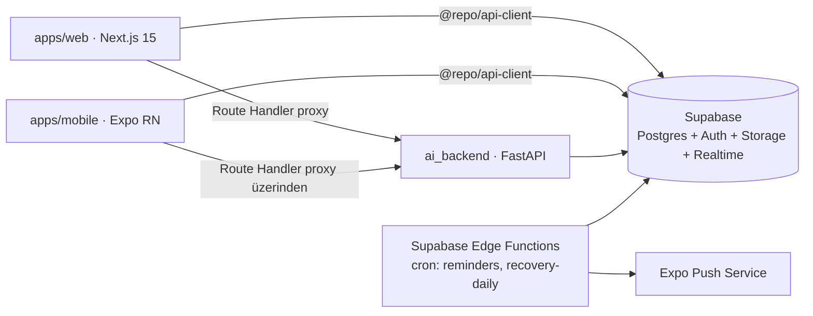

# Online Coaching Platform — Mühendislik Spesifikasyonu ve Uygulama Prompt'u

> **Hedef ajan:** Claude Code
> **Çalışma dili:** Türkçe (kod, commit mesajları ve tanımlayıcılar İngilizce)
> **Repo:** `Online-Coaching-AppV2` (Next.js + Supabase + Python `ai_backend`)
> **Sürüm:** v1.0 — bu doküman tek doğruluk kaynağıdır (single source of truth).
> Çelişki durumunda bu doküman > mevcut kod > senin varsayımın.

---

## 0. Ajan Çalışma Protokolü (ZORUNLU — önce bunu oku)

1. **Keşif önce gelir.** Hiçbir kod yazmadan önce tüm repo'yu tara, mevcut
   şemayı/route'ları/component'leri çıkar ve `docs/DISCOVERY.md` dosyasına
   mevcut durumun envanterini yaz. Bu envanteri bana raporla ve **onayımı
   bekle**.
2. **Faz kapıları (phase gates).** Her fazın sonunda: (a) tanımlı kabul
   kriterlerinin (AC) tamamının karşılandığını doğrula, (b) `pnpm turbo build
lint test` ve `pytest` yeşil olsun, (c) `PROGRESS.md`'yi güncelle,
   (d) **dur ve raporla** — bir sonraki faza benim onayım olmadan geçme.
3. **Git disiplini.** Commit'leri sen hazırla ama `git push` asla çalıştırma.
   Conventional commits (`feat(web): ...`, `feat(mobile): ...`, `feat(db): ...`,
   `feat(ai): ...`, `chore(repo): ...`). Bir commit = bir mantıksal değişiklik.
   Faz başına bir feature branch: `feat/phase-N-<slug>`.
4. **Scope disiplini.** Bu dokümanda yazmayan hiçbir özelliği ekleme, hiçbir
   bağımlılığı "iyi olur" diye kurma. Bir bağımlılık eklemek istiyorsan
   gerekçesiyle sor.
5. **Belirsizlik protokolü.** Teknik bir karar noktası bu dokümanda
   tanımlanmamışsa: 3 seçenek + trade-off tablosu + kendi önerinle bana sor.
   Sessiz varsayım = hata.
6. **ADR zorunluluğu.** Mimari sonucu olan her karar için
   `docs/adr/NNNN-<slug>.md` yaz (context / decision / consequences formatı).
7. **Hata durumunda.** Bir migration, test veya build 2 denemede düzelmiyorsa
   dur, hatayı ve denediklerini raporla; brute-force retry döngüsüne girme.

---

## 1. Sistem Bağlamı ve Hedef Mimari

### 1.1 Ürün özeti

Koç-öğrenci (coach/client) modelli fitness koçluk platformu. Referans özellik
seti: antrenman planı atama ve loglama, beslenme planı + AI destekli yemek
fotoğrafı makro tahmini, ilerleme takibi (kilo/ölçü/foto), form check
(video/foto + koç geri bildirimi), gerçek zamanlı mesajlaşma, sağlık verisi
senkronizasyonu (HealthKit / Health Connect), uyku takibi, 0-100 recovery
skoru, hatırlatma push bildirimleri, aktivite geçmişi.

### 1.2 Hedef topoloji



**Değişmez kurallar (invariants):**

- I-1: Mobil ve web, `ai_backend`'e **asla doğrudan** istek atmaz; tüm AI
  çağrıları Next.js route handler proxy'sinden geçer (API key'ler yalnızca
  sunucu tarafında yaşar).
- I-2: Tüm istemci-veri erişimi RLS'e tabidir; `service_role` key yalnızca
  Edge Function'larda ve `ai_backend`'de bulunur.
- I-3: `packages/types` dışında domain tipi tanımlanmaz; iki app aynı tipleri
  import eder.
- I-4: Sağlık verisi (health_metrics, sleep_sessions, progress_photos,
  form_checks, messages) içeren storage bucket'ları **private**'tır; erişim
  yalnızca signed URL (TTL ≤ 1 saat) ile olur.
- I-5: Her public API fonksiyonunun girdi/çıktısı zod (TS) veya Pydantic (Py)
  ile runtime'da doğrulanır. "Trust the caller" yok.

### 1.3 Teknoloji kararları (sabitlenmiş)

| Alan             | Karar                                             | Not                                                   |
| ---------------- | ------------------------------------------------- | ----------------------------------------------------- |
| Monorepo         | pnpm workspaces + Turborepo                       | affected-only pipeline                                |
| Web              | Next.js (App Router) + TypeScript strict          | mevcut app taşınır                                    |
| Mobil            | Expo SDK (managed) + Expo Router + TypeScript     | EAS build hedefli                                     |
| Veri erişimi     | TanStack Query (her iki app) + `@repo/api-client` | cache key sözleşmesi §3.4                             |
| Form             | react-hook-form + zod                             | ortak şemalar `packages/types/schemas`                |
| Grafik           | web: recharts · mobil: victory-native             | aynı veri şekli                                       |
| AI backend       | FastAPI + Pydantic v2 + uv                        | ruff + mypy strict                                    |
| Vision sağlayıcı | Anthropic Messages API (görsel girişli)           | `VISION_PROVIDER` env ile soyutlanır, adapter pattern |
| Push             | Expo Push + `device_push_tokens`                  | web push kapsam dışı (v2)                             |
| Zamanlama        | Supabase Edge Functions + pg_cron                 | §9                                                    |

---

## 2. Faz 0 — Monorepo Dönüşümü

### İş kalemleri

- `apps/web`, `apps/mobile`, `packages/types`, `packages/api-client`,
  `packages/config` (paylaşılan tsconfig/eslint) yapısını kur.
- Mevcut Next.js app'i **davranış değişikliği olmadan** `apps/web`'e taşı;
  taşıma öncesi ve sonrası route envanterini diff'le kanıtla.
- `apps/mobile`: Expo iskeleti + auth akışı placeholder + tab navigasyonu
  (Dashboard / Plan / Nutrition / Progress / Chat).
- TypeScript migrasyonu: `apps/web`'i strict TS'e taşı (bu, Faz 0'ın parçası;
  sonraki fazlar JS'e kod eklemesin).

### Kabul kriterleri (AC)

- AC-0.1: `pnpm turbo build` kök dizinden tüm paketleri derler, sıfır TS hatası.
- AC-0.2: `apps/web` eski davranışıyla ayağa kalkar (manuel smoke: login →
  dashboard → mevcut sekmeler).
- AC-0.3: `apps/mobile` Expo Go'da açılır, tab'lar arası gezinme çalışır.
- AC-0.4: `packages/types` Supabase'den üretilmiş DB tiplerini export eder
  (`supabase gen types typescript`).
- AC-0.5: Hiçbir paket bir diğerinin `src/` içine relative path ile uzanmaz;
  yalnızca workspace import.

---

## 3. Faz 1 — Veri Modeli, RLS ve API Sözleşmesi

### 3.1 Şema (migration'lar `supabase/migrations/` altında, her tablo ayrı dosya)

Tablolar (tam kolon listesini sen tasarla, aşağıdaki zorunlu alanlar ve
kısıtlarla):

| Tablo                                      | Zorunlu unsurlar                                                                                                                                                                |
| ------------------------------------------ | ------------------------------------------------------------------------------------------------------------------------------------------------------------------------------- |
| `profiles`                                 | `role user_role NOT NULL` (`coach`,`client`); `coach_id uuid REFERENCES profiles`; CHECK: client ise coach_id atanabilir, coach ise NULL                                        |
| `workout_plans` / `workout_plan_exercises` | plan versiyonlama: `version int`, `is_active bool`; egzersiz: `video_url`, `target_sets/reps/weight`, `position int`                                                            |
| `workout_logs` / `workout_log_sets`        | set: `actual_reps`, `actual_weight_kg numeric(5,2)`, `rpe numeric(3,1) CHECK (rpe BETWEEN 1 AND 10)`                                                                            |
| `nutrition_plans` / `nutrition_plan_meals` | hedefler: `kcal int`, `protein_g/carb_g/fat_g int`, CHECK ≥ 0                                                                                                                   |
| `nutrition_logs`                           | `photo_path`, `ai_estimate jsonb`, `user_override jsonb`, `status` (`ai_suggested`,`confirmed`)                                                                                 |
| `progress_entries`                         | `weight_kg numeric(5,2)`, `measurements jsonb`, UNIQUE(user_id, entry_date)                                                                                                     |
| `progress_photos`                          | `angle` enum (`front`,`side`,`back`), private bucket path                                                                                                                       |
| `form_checks`                              | `status` enum (`pending`,`reviewed`), `coach_feedback text`, `reviewed_at`                                                                                                      |
| `conversations` / `messages`               | UNIQUE(coach_id, client_id); `read_at timestamptz`; sistem mesajı için `kind` enum (`user`,`system`)                                                                            |
| `coach_notes`                              | koç → öğrenci serbest not                                                                                                                                                       |
| `health_metrics`                           | `metric_date date`, `steps int`, `active_kcal int`, `avg_hr int`, `distance_m int`, `source` enum (`healthkit`,`health_connect`,`manual`), UNIQUE(user_id, metric_date, source) |
| `sleep_sessions`                           | `start_at/end_at timestamptz`, `stages jsonb` (`{deep,rem,light,awake}` dakika), `source`                                                                                       |
| `recovery_scores`                          | `score int CHECK (score BETWEEN 0 AND 100)`, `components jsonb`, `advice_key text`, UNIQUE(user_id, score_date)                                                                 |
| `reminders`                                | `kind` (`workout`,`meal`), `time_local time`, `days_of_week int[]`, `timezone text`                                                                                             |
| `device_push_tokens`                       | UNIQUE(user_id, token), `platform` enum (`ios`,`android`)                                                                                                                       |

**İndeksler:** her FK'ye indeks; zaman serisi tablolarında
`(user_id, <date> DESC)` composite indeks; `messages(conversation_id,
created_at DESC)`.

### 3.2 RLS matrisi (her tablo için politika yaz, test et)

| Aktör        | Kendi verisi | Öğrencisinin verisi                                                                         | Başkasının verisi |
| ------------ | ------------ | ------------------------------------------------------------------------------------------- | ----------------- |
| client       | R/W          | —                                                                                           | DENY              |
| coach        | R/W          | **R** (tümü) + **W** (yalnız: plan tabloları, coach_feedback, coach_notes, system messages) | DENY              |
| service_role | bypass       | bypass                                                                                      | bypass            |

- Koç-öğrenci ilişkisi tek kaynaktan doğrulanır: `profiles.coach_id`.
  Politikalarda `EXISTS (SELECT 1 FROM profiles p WHERE p.id = <row>.user_id
AND p.coach_id = auth.uid())` pattern'ini kullan; JWT claim'e güvenme.
- **RLS testleri zorunlu:** pgTAP veya SQL tabanlı test script'i ile en az şu
  senaryolar: client kendi logunu okur (PASS), client başka client'ın logunu
  okur (FAIL), koç öğrencisinin logunu okur (PASS), koç başka koçun
  öğrencisinin logunu okur (FAIL), koç öğrencinin workout_log'una yazar (FAIL).

### 3.3 Storage

Bucket'lar: `meal-photos`, `progress-photos`, `form-checks` — hepsi private.
Path sözleşmesi: `<user_id>/<uuid>.<ext>`. Storage RLS: yükleme yalnızca kendi
prefix'ine; okuma kendi prefix'i + koçun öğrenci prefix'i. Maks. dosya boyutu:
foto 10 MB, video 100 MB; MIME whitelist.

### 3.4 API sözleşmesi (contract-first)

`packages/api-client` tüm fonksiyonları şu imza disipliniyle sunar:

```ts
type Result<T> = { ok: true; data: T } | { ok: false; error: AppError }
// AppError: { code: ErrorCode; message: string; retryable: boolean }
```

- Hiçbir fonksiyon exception fırlatarak akış kontrolü yapmaz; `Result` döner.
- TanStack Query key sözleşmesi: `[domain, entity, params]` — ör.
  `['nutrition','logs',{date}]`. Key üreticileri `packages/api-client/keys.ts`
  içinde merkezidir; string literal key yasak.
- Ortak zod şemaları `packages/types/schemas/` altında; FastAPI tarafındaki
  Pydantic modelleriyle alan adları birebir aynı (snake_case, wire format).

### Kabul kriterleri

- AC-1.1: `supabase db reset` temiz kurulumdan tüm migration'ları hatasız uygular.
- AC-1.2: RLS test script'i §3.2'deki 5 senaryonun tamamını doğrular.
- AC-1.3: Seed: 1 koç + 2 öğrenci + 1 haftalık dolu plan + 3 günlük log verisi.
- AC-1.4: `packages/types` şemadan üretilmiş güncel tipleri içerir; CI'da
  "types güncel mi" drift check'i vardır.

---

## 4. Faz 2 — Koç-Öğrenci Çekirdek Akışı

### 4.1 Antrenman

- Koç: haftalık plan CRUD; plan yayınlama = yeni `version`, eski versiyon
  `is_active=false` (geçmiş loglar eski versiyona bağlı kalır — FK
  versiyonlu satıra).
- Öğrenci: günün antrenmanı, video embed, set bazlı log girişi (optimistic
  update + offline durumda kuyruklama mobilde v2, şimdilik hata mesajı).
- Tamamlama: tüm setler girilince `workout_logs.completed_at` set edilir.

### 4.2 Beslenme

- Koç: günlük makro hedefi + öğün şablonu CRUD.
- Öğrenci: makro dashboard (hedef vs gerçekleşen; halka grafik), manuel öğün
  ekleme.

### 4.3 Form check

- Öğrenci: kamera (mobil) / dosya (web) → private bucket → kayıt `pending`.
- Koç: bekleyenler kuyruğu, medya izleme (signed URL), geri bildirim →
  `reviewed` + sistem mesajı + push (Faz 7'de aktifleşir, şimdi event yayınla).

### 4.4 Mesajlaşma

- Supabase Realtime channel per conversation; metin + opsiyonel foto.
- Okundu: karşı taraf mesajı görüntüleyince `read_at`; unread count
  conversation listesinde.
- Sistem mesajları (`kind='system'`): plan yayınlandı, form check yanıtlandı.

### Kabul kriterleri

- AC-2.1: Uçtan uca akış her iki platformda: koç plan yayınlar → öğrenci
  görür → log girer → koç logu görür. (Playwright web'de otomatik; mobilde
  manuel checklist `docs/mobile-smoke.md`.)
- AC-2.2: İki tarayıcı sekmesi arasında mesaj < 2 sn'de realtime düşer.
- AC-2.3: Form check medyası public URL ile ERİŞİLEMEZ (curl testiyle kanıtla).
- AC-2.4: Aynı ekranın web ve mobil sürümü aynı api-client fonksiyonunu
  çağırır; platform-özel veri erişim kodu yoktur (grep ile doğrula:
  `supabase.from(` çağrısı yalnızca `packages/api-client` içinde geçer).

---

## 5. Faz 3 — Yemek Fotoğrafı Makro Tahmini

### 5.1 ai_backend yapısı

```
ai_backend/
  app/routers/meal_analysis.py      # POST /v1/analyze/meal-photo
  app/services/vision/base.py       # VisionProvider protokolü (adapter)
  app/services/vision/anthropic.py  # varsayılan sağlayıcı
  app/schemas/meal.py               # Pydantic v2 request/response
  app/core/{config,logging,limits}.py
```

### 5.2 Sözleşme

`POST /v1/analyze/meal-photo` — multipart: `image` (jpeg/png/webp ≤ 10 MB),
opsiyonel `context: str`.

Yanıt (200):

```json
{
  "items": [
    {
      "name": "grilled chicken",
      "portion_estimate": "150g",
      "kcal": 240,
      "protein_g": 45,
      "carb_g": 0,
      "fat_g": 6
    }
  ],
  "totals": { "kcal": 610, "protein_g": 52, "carb_g": 45, "fat_g": 22 },
  "confidence": "medium",
  "disclaimer_key": "ai_estimate_approx"
}
```

Hatalar: 400 (geçersiz görsel), 413 (boyut), 422 (yemek tespit edilemedi —
`code: NO_FOOD_DETECTED`), 429 (limit), 502 (sağlayıcı hatası, `retryable:
true`). Model çıktısı katı JSON şemaya parse edilir; parse hatasında 1 retry
(düzeltme talimatıyla), sonra 502.

### 5.3 Kısıtlar

- Proxy: `apps/web/app/api/ai/meal-photo/route.ts` — auth zorunlu, kullanıcı
  kimliği server'da JWT'den alınır (client'tan user_id kabul etme).
- Rate limit: kullanıcı başına 10 analiz/gün — sayaç Postgres'te
  (`ai_usage_counters`), atomik `INSERT ... ON CONFLICT ... UPDATE`.
- Sonuç `nutrition_logs`'a `status='ai_suggested'` olarak yazılır; kullanıcı
  onay/düzenleme ekranından `confirmed`'a çevirmeden makro dashboard'una
  **dahil edilmez**.
- Maliyet gözlemi: her çağrının token kullanımını structured log'a yaz.

### Kabul kriterleri

- AC-3.1: pytest: mock provider ile happy path + 5 hata senaryosu.
- AC-3.2: Gerçek görselle manuel smoke (1 adet) — sonucu PROGRESS.md'ye ekle.
- AC-3.3: 11. istek 429 döner; ertesi gün (sayaç reset) tekrar çalışır
  (testte saat mock'la).
- AC-3.4: API key hiçbir client bundle'ında geçmez (`grep` ile build çıktısı
  doğrulanır).

---

## 6. Faz 4 — İlerleme Takibi

- Kilo/ölçü girişi (günde bir kayıt, upsert), trend grafikleri (7/30/90 gün
  aralık seçici; boş günler grafikte gap olarak kalır, interpolasyon yapılmaz).
- Foto: açı etiketli yükleme, önce/sonra karşılaştırma (slider) — signed URL.
- Koç görünümü salt-okunur.

**AC-4.1:** Aynı güne ikinci kilo girişi eskisini günceller, duplicate satır
oluşmaz. **AC-4.2:** Grafik verisi tek endpoint'ten (`progress.getTrends`)
gelir ve her iki platformda aynı seriyi çizer.

---

## 7. Faz 5 — Sağlık Verisi Senkronizasyonu

- Mobil: iOS HealthKit + Android Health Connect (uygun Expo modülü/config
  plugin — seçtiğin kütüphane için ADR yaz). Okunan veriler: adım, aktif
  kalori, nabız, mesafe, antrenmanlar, uyku (evreli).
- Senkron stratejisi: app foreground'a gelince "son senkron zamanından beri"
  delta çekilir; idempotent upsert (UNIQUE kısıtları §3.1). Arka plan senkronu
  v2 — şimdilik kapsam dışı, ADR'de not düş.
- Health'ten gelen antrenman ↔ program antrenmanı elle eşleştirme
  (`workout_logs.health_workout_id`).
- İzin reddedildiğinde: manuel giriş formu + izin ekranına yönlendiren buton.
- Web: salt-okunur gösterim + manuel giriş.

**AC-5.1:** Aynı günün verisi iki kez senkron edilince satır çoğalmaz.
**AC-5.2:** İzin verilmemiş metrikler UI'da "veri yok, bağla" durumuyla
gösterilir, sıfır olarak GÖSTERİLMEZ (0 ≠ bilinmiyor).

---

## 8. Faz 6 — Recovery Skoru

- Hesaplama `ai_backend/app/services/recovery.py` içinde **saf fonksiyon**:
  `compute_recovery(inputs: RecoveryInputs, weights: RecoveryWeights) -> RecoveryResult`.
- Bileşenler ve varsayılan ağırlıklar (config'den değiştirilebilir):
  uyku süresi 0.30, uyku kalitesi (derin+REM oranı) 0.20, dinlenme nabzı
  (kişisel 30 günlük baseline'a göre sapma) 0.20, HRV (baseline sapması) 0.15,
  önceki gün antrenman yükü (set×tekrar×ağırlık hacminden normalize) 0.15.
- Eksik bileşen: ağırlıklar mevcut bileşenlere yeniden normalize edilir;
  yanıtta `missing_inputs: [...]` listelenir. En az 1 bileşen yoksa skor
  üretilmez (`status: insufficient_data`).
- Öneri metni kural tabanlıdır (skor aralığı → `advice_key`); serbest LLM
  metni YOK (deterministik ve test edilebilir kalsın).
- Günlük hesap: pg_cron tetikli Edge Function, kullanıcı başına dünün verisiyle.

**AC-6.1:** Birim testler: tam veri, kısmi veri, sınır değerler (skor 0 ve 100
kırpılır), baseline yokken davranış. **AC-6.2:** Formül ve ağırlıklar
`docs/recovery-score.md`'de tablo halinde dokümante.

---

## 9. Faz 7 — Hatırlatmalar ve Push

- `device_push_tokens` kayıt/temizleme (logout'ta sil, geçersiz token'ı Expo
  yanıtından işaretle).
- Edge Function `send-reminders`: pg_cron her 15 dakikada tetikler; kullanıcı
  timezone'una göre o dilime denk gelen reminder'ları toplar, Expo Push'a
  batch gönderir. Idempotency: `reminder_dispatch_log(reminder_id,
dispatch_date)` UNIQUE — aynı hatırlatma aynı gün iki kez gitmez.
- Olay bazlı push: yeni plan / form check yanıtı / yeni mesaj → DB trigger →
  `notification_outbox` tablosu → Edge Function outbox'ı boşaltır (doğrudan
  trigger'dan HTTP çağrısı yapma — outbox pattern).

**AC-7.1:** Cron fonksiyonunun idempotency'si testle kanıtlı (aynı dakika iki
tetik = tek push kaydı). **AC-7.2:** Timezone testi: Europe/Istanbul
kullanıcısının 07:00 hatırlatması UTC'de doğru dilimde seçilir (DST dahil en
az 2 test vakası).

---

## 10. Faz 8 — Widget Altyapısı (yalnız API)

- `GET /v1/widget-summary` (proxy üzerinden): `{weight_current, weight_prev,
steps_today, sleep_last_night_min, recovery_score, workouts_this_week}` —
  tek istek, ≤ 150 ms hedef (tek SQL ile toplanır, N+1 yok).
- Native WidgetKit/App Widget implementasyonu **bu prompt'un kapsamı dışında**;
  ayrı oturum. Burada yalnızca endpoint + sözleşme + test.

---

## 11. Faz 9 — Aktivite Geçmişi

- `activity.getHistory({range})`: haftalık özet (antrenman sayısı, toplam süre,
  kalori, ort. nabız) + geçmiş antrenman listesi (cursor pagination, sayfa 20).

**AC-9.1:** Pagination cursor'u stabil (yeni kayıt eklenince sayfa kayması
duplicate göstermez).

---

## 12. Faz 10 — Kalite Altyapısı

- **Test piramidi:** api-client unit (Vitest) · web component (Vitest+RTL) ·
  web E2E (Playwright: login→plan→log→chat, form check, meal photo mock'lu) ·
  mobil (Jest+RNTL kritik ekranlar) · ai_backend (pytest, coverage ≥ %80
  services/) · RLS (SQL testleri, CI'da).
- **CI (GitHub Actions):** PR'da turbo affected lint+type+test+build; ai_backend
  için ruff+mypy+pytest; migration drift check; `pnpm audit` (high+ fail).
- **Gözlemlenebilirlik:** ai_backend structlog JSON (request_id, user_id hash,
  latency, token usage); Next.js route handler'larda aynı request_id'yi
  forward et.
- **Dokümantasyon:** README (mermaid mimari, kurulum, env tablosu — isim,
  zorunlu mu, hangi paket, örnek değer), `docs/adr/`, `docs/recovery-score.md`,
  FastAPI otomatik OpenAPI.

---

## 13. Tanımlar

- **Bitti (Definition of Done), her faz için:** AC'ler yeşil + testler yeşil +
  lint/type temiz + PROGRESS.md güncel + ADR'ler yazılmış + benden onay alınmış.
- **Kapsam dışı (v2 backlog'a yaz, yapma):** web push, mobil offline kuyruk,
  native widget implementasyonu, grup mesajlaşma, koç için birden çok öğrenci
  toplu görünümü analytics'i, ödeme/abonelik.
