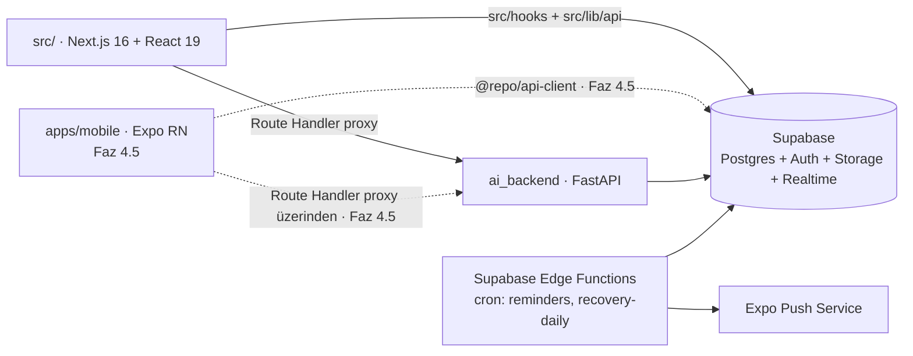

# Online Coaching Platform — Mühendislik Spesifikasyonu ve Uygulama Prompt'u

> **Hedef ajan:** Claude Code
> **Çalışma dili:** Türkçe (kod, commit mesajları ve tanımlayıcılar İngilizce)
> **Repo:** `Online-Coaching-AppV2` (Next.js + Supabase + Python `ai_backend`)
> **Sürüm:** v1.1 — bu doküman tek doğruluk kaynağıdır (single source of truth).
> Çelişki durumunda bu doküman > mevcut kod > senin varsayımın.

## Revizyon geçmişi (v1.0 → v1.1)

- **R1** — Sürüm `v1.0` → `v1.1`; bu revizyon geçmişi eklendi — hiçbir
  değişiklik sessiz olmasın, her madde gerekçesiyle izlenebilsin.
- **R2** — Faz 0 ikiye bölündü: tamamlanmış işler **"Faz 0 — Temel
  (TAMAMLANDI)"** oldu (§2); monorepo (pnpm + Turborepo, `packages/*`) ve Expo
  mobil iskeleti yeni **"Faz 4.5 — Monorepo ve Mobil Temel"**e taşındı (§7),
  AC-0.1..AC-0.5 oraya AC-4.5.\* olarak uyarlandı — en yıkıcı adım (tüm
  path'ler, CI, Docker, deployment) hiçbir kullanıcı değeri üretmiyordu ve
  monorepo'nun tek gerekçesi olan mobil, Faz 5'e (sağlık verisi) kadar zorunlu
  değil. Bölüm numaraları bir kaydı (eski §7–§13 → yeni §8–§14); faz
  numaraları (Faz 5..Faz 10) değişmedi, yalnızca aralarına Faz 4.5 girdi.
  Çapraz referanslar güncellendi: §1.3 "Zamanlama → §9" artık §10.
- **R2b** — AC-2.1'in "her iki platformda" ve AC-2.4'ün "yalnızca
  `packages/api-client`" şartları mevcut yapıya uyarlandı (web Playwright
  zorunlu; mobil doğrulaması ve `packages/api-client` kuralı Faz 4.5'e
  ertelendi) — mobil uygulama ve monorepo Faz 2 sırasında henüz yok.
  §5.3'teki proxy yolu `apps/web/app/...` → `src/app/...` düzeltildi (aynı
  nedenle).
- **R3** — Tek koçlu modele geçildi: §3.1'den `profiles.coach_id` ve bağlı
  CHECK kaldırıldı, §3.2 RLS matrisi iki aktöre indi, "koç başka koçun
  öğrencisini göremez" katmanı kaldırıldı, `EXISTS (... coach_id =
auth.uid())` pattern'i mevcut ve doğrulanmış `public.is_admin()`
  `SECURITY DEFINER` yardımcısıyla değiştirildi (özyineleme uyarısı gerekçesiyle
  korundu), RLS test senaryoları güncellendi — kullanıcı kararı
  (`docs/PROGRESS.md` §4).
- **R4** — §3.1'e rol yeniden adlandırma maddesi eklendi: enum
  `admin`/`student` → `coach`/`client` dönüşümü **Faz 1'in şema yeniden
  yazımının parçasıdır**, ayrı iş kalemi değildir — yarım kalmış bir
  yeniden adlandırma iki dilli bir kod tabanı bırakır.
- **R5** — §3.4'teki `Result<T>` sözleşmesi kaldırıldı, yerine mevcut ve
  çalışan tipli `ApiError` fırlatma modeli yazıldı; key sözleşmesi
  `src/lib/query/keys.ts`'teki gerçek şekle uyarlandı — `Result<T>` TanStack
  Query'nin `queryFn`'in fırlatmasına dayanan hata makinesiyle uyumsuz.
- **R6** — §3.5 "Veri migrasyonu" eklendi (JSON string planlar → normalize
  tablolar, `messages` → `conversations`, `form_checks` + `status`, eski
  kolonların kaderi, geri alınabilirlik) + AC-1.5 — plan yeşil alan gibi
  yazılmıştı, repoda çalışan bir şema ve veri var.
- **R7** — §3.3'e storage mahremiyeti Faz 1 çıkış kriteri olarak eklendi
  (public bucket kalmayacak, kolonlar tam URL değil yol saklayacak, mevcut
  satırlar dönüştürülecek) + AC-1.6 — `avatars` ve `form-checks-media` şu an
  public ve `form_checks.front_pose_url` tam public URL saklıyor; I-4 fiilen
  ihlal ediliyor.
- **R8** — §1.3 teknoloji tablosu güncellendi: Next.js 15 → **16 + React 19**,
  monorepo satırına "Faz 4.5" notu, build motoru satırı (`next build
--webpack`, `next-pwa` kısıtı), grafik satırına `chart.js` ikinci kütüphane
  notu — tablo repodan geri kalmıştı. Grafik tekleştirme Faz 4'e iş kalemi +
  AC-4.3 olarak eklendi.
- **R9** — §1.2 topoloji diyagramı mevcut duruma çekildi (`src/` · Next.js 16,
  `apps/mobile` "Faz 4.5" etiketli, `@repo/api-client` → `src/hooks` +
  `src/lib/api`); I-1..I-5 korundu, yalnız I-3 `packages/types` → `src/types`
  olarak uyarlandı (Faz 4.5'te taşınır).
- **R10** — §0.6 güncellendi: mevcut 6 ADR `docs/ARCHITECTURE.md` §7 içine
  gömülü (ADR-lite); Faz 1'in başında `docs/adr/NNNN-<slug>.md` dosyalarına
  ayrıştırılacak (AC-1.7), sonrasında her yeni karar ayrı dosya — plan var
  olmayan bir dizini varsayıyordu.
- **R11** — §0.2 faz kapısı komutları gerçek komutlarla değiştirildi
  (`npm run lint/type-check/test/build`, `format:check`, `test:e2e`,
  `ai_backend` için `uv run ruff/mypy/pytest`) — `pnpm turbo build lint test`
  bu repoda çalışmıyor; turbo komutlarına Faz 4.5'te dönülecek.
- **R12** — §0.3 git disiplini gerçeğe uyarlandı: **ajan commit atmaz**,
  yalnızca conventional-commit mesajı önerir; commit'i kullanıcı atar.
  `git push` yasağı korundu.

---

## 0. Ajan Çalışma Protokolü (ZORUNLU — önce bunu oku)

1. **Keşif önce gelir.** Hiçbir kod yazmadan önce tüm repo'yu tara, mevcut
   şemayı/route'ları/component'leri çıkar ve `docs/DISCOVERY.md` dosyasına
   mevcut durumun envanterini yaz. Bu envanteri bana raporla ve **onayımı
   bekle**.
2. **Faz kapıları (phase gates).** Her fazın sonunda: (a) tanımlı kabul
   kriterlerinin (AC) tamamının karşılandığını doğrula, (b) aşağıdaki kapı
   komutlarının tamamı yeşil olsun, (c) `docs/PROGRESS.md`'yi güncelle,
   (d) **dur ve raporla** — bir sonraki faza benim onayım olmadan geçme.

   ```
   npm run lint && npm run type-check && npm run test && npm run build
   npm run format:check
   npm run test:e2e            (yerel Supabase yığını + seed gerekir)
   cd ai_backend && uv run ruff check . && uv run mypy app && uv run pytest
   ```

   Monorepo Faz 4.5'te devreye girdiğinde (§7) bu kapı, `pnpm turbo` affected
   pipeline'ının eşdeğer komutlarıyla değiştirilir.

3. **Git disiplini.** **Commit ATMA.** Değişiklikleri hazırla ve önerilen
   conventional-commit mesajını raporla; commit'i kullanıcı atar. `git push`
   asla çalıştırma. Mesaj biçimi conventional commits (`feat(web): ...`,
   `feat(mobile): ...`, `feat(db): ...`, `feat(ai): ...`, `chore(repo): ...`).
   Bir commit = bir mantıksal değişiklik. Faz başına bir feature branch:
   `feat/phase-N-<slug>`.
4. **Scope disiplini.** Bu dokümanda yazmayan hiçbir özelliği ekleme, hiçbir
   bağımlılığı "iyi olur" diye kurma. Bir bağımlılık eklemek istiyorsan
   gerekçesiyle sor.
5. **Belirsizlik protokolü.** Teknik bir karar noktası bu dokümanda
   tanımlanmamışsa: 3 seçenek + trade-off tablosu + kendi önerinle bana sor.
   Sessiz varsayım = hata.
6. **ADR zorunluluğu.** Mimari sonucu olan her karar için ADR yaz (context /
   decision / consequences formatı). Mevcut 6 karar `docs/ARCHITECTURE.md` §7
   içine gömülüdür (ADR-lite, ADR-1..ADR-6); `docs/adr/` dizini henüz yok.
   **Faz 1'in ilk işi** bu 6 kaydı `docs/adr/NNNN-<slug>.md` dosyalarına
   ayrıştırmak ve `ARCHITECTURE.md` §7'yi yalnızca bu dosyalara link veren bir
   indekse indirmektir. Ayrıştırmadan sonra her yeni karar doğrudan
   `docs/adr/NNNN-<slug>.md` olarak yazılır; gömülü ADR yazımı biter.
7. **Hata durumunda.** Bir migration, test veya build 2 denemede düzelmiyorsa
   dur, hatayı ve denediklerini raporla; brute-force retry döngüsüne girme.

---

## 1. Sistem Bağlamı ve Hedef Mimari

### 1.1 Ürün özeti

Koç-öğrenci (coach/client) modelli fitness koçluk platformu. Referans özellik
seti: antrenman planı atama ve loglama, beslenme planı + AI destekli yemek
fotoğrafı makro tahmini, ilerleme takibi (kilo/ölçü/foto), form check
(video/foto + koç geri bildirimi), gerçek zamanlı mesajlaşma, sağlık verisi
senkronizasyonu (HealthKit / Health Connect), uyku takibi, 0-100 recovery
skoru, hatırlatma push bildirimleri, aktivite geçmişi.

### 1.2 Hedef topoloji



Kesik çizgili düğüm/kenarlar henüz yok: mobil uygulama ve `packages/*`
Faz 4.5'te (§7) devreye girer. O noktaya kadar web tek repo (`src/`) ve npm
ile yürür; `apps/web` yolu Faz 4.5'ten sonra geçerlidir.

**Değişmez kurallar (invariants):**

- I-1: Mobil ve web, `ai_backend`'e **asla doğrudan** istek atmaz; tüm AI
  çağrıları Next.js route handler proxy'sinden geçer (API key'ler yalnızca
  sunucu tarafında yaşar).
- I-2: Tüm istemci-veri erişimi RLS'e tabidir; `service_role` key yalnızca
  Edge Function'larda ve `ai_backend`'de bulunur.
- I-3: Domain tipi yalnızca tek bir yerde tanımlanır; bileşenler kendi ad-hoc
  tiplerini türetmez. Bugünkü yeri `src/types` (`database.ts` şemadan
  üretilir, `domain.ts` elle yazılır); Faz 4.5'te `packages/types`'a taşınır ve
  iki app aynı tipleri import eder.
- I-4: Sağlık verisi (health_metrics, sleep_sessions, progress_photos,
  form_checks, messages) içeren storage bucket'ları **private**'tır; erişim
  yalnızca signed URL (TTL ≤ 1 saat) ile olur.
- I-5: Her public API fonksiyonunun girdi/çıktısı zod (TS) veya Pydantic (Py)
  ile runtime'da doğrulanır. "Trust the caller" yok.

### 1.3 Teknoloji kararları (sabitlenmiş)

| Alan             | Karar                                                  | Not                                                                                                                                     |
| ---------------- | ------------------------------------------------------ | --------------------------------------------------------------------------------------------------------------------------------------- |
| Monorepo         | pnpm workspaces + Turborepo                            | **Faz 4.5'te devreye girer (§7)**; o zamana kadar tek repo + npm                                                                        |
| Web              | Next.js 16 (App Router) + React 19 + TypeScript strict | mevcut durum (`next@16.2.10`, `react@19.2.4`)                                                                                           |
| Build motoru     | webpack — `next build --webpack`                       | `next-pwa` bir webpack eklentisi; Turbopack'e geçiş PWA'yı bırakmayı gerektirir. `@ducanh2912/next-pwa` de webpack tabanlı, çözüm değil |
| Mobil            | Expo SDK (managed) + Expo Router + TypeScript          | Faz 4.5; EAS build hedefli                                                                                                              |
| Veri erişimi     | TanStack Query + merkezi veri katmanı                  | bugün `src/hooks` + `src/lib/api`; Faz 4.5'te `@repo/api-client`. Sözleşme ve cache key: §3.4                                           |
| Form             | react-hook-form + zod                                  | ortak şemalar bugün `src/lib/validation/schemas.ts`; Faz 4.5'te `packages/types/schemas`                                                |
| Grafik           | web: recharts · mobil: victory-native                  | web'de ayrıca `chart.js` + `react-chartjs-2` kullanılıyor (StatsTab) — **Faz 4'te tek kütüphaneye indirilecek**                         |
| AI backend       | FastAPI + Pydantic v2 + uv                             | ruff + mypy strict                                                                                                                      |
| Vision sağlayıcı | Anthropic Messages API (görsel girişli)                | `VISION_PROVIDER` env ile soyutlanır, adapter pattern                                                                                   |
| Push             | Expo Push + `device_push_tokens`                       | web push kapsam dışı (v2)                                                                                                               |
| Zamanlama        | Supabase Edge Functions + pg_cron                      | §10                                                                                                                                     |

---

## 2. Faz 0 — Temel (TAMAMLANDI)

Bu faz repoda fiilen bitti; yeniden yapılacak iş yok. Kanıt ve detay:
`docs/PROGRESS.md` §1–§3, `UPGRADE_NOTES.md` §2.

### Tamamlananlar

- **TypeScript strict migrasyonu:** `strict`, `noUncheckedIndexedAccess`,
  `noImplicitOverride`, `noUnusedLocals/Parameters`, `allowJs: false`.
  `src/` altında `.js` kaynak kalmadı; sonraki fazlar JS'e kod eklemez.
- **Test altyapısı:** Vitest + RTL (180 test), Playwright E2E (28/28 —
  chromium + Mobile Chrome), `ai_backend` pytest (63 test, kapsam %92).
- **CI/CD:** `.github/workflows/ci.yml` — `frontend`, `backend`, `e2e`,
  `docker`, `required-checks` job'ları; ESLint flat config + Prettier.
- **Docker:** kök `Dockerfile` (Next.js standalone), `ai_backend/Dockerfile`
  (non-root, `$PORT`), `docker-compose.yml`.
- **Güvenlik başlıkları ve sertleştirme:** iki katmanlı rate limiting
  (Next.js middleware + FastAPI `slowapi`), CORS allowlist, CSP/HSTS/
  X-Frame-Options, `X-Request-ID` korelasyonlu yapılandırılmış loglama.
- **AI proxy:** `src/app/api/ai/*` route handler'ları — tarayıcı `ai_backend`'e
  asla doğrudan istek atmaz (I-1 sağlanıyor).
- **Şema + RLS'in ilk sürümü:** 9 tablo, 37 politika, 8 storage politikası,
  `is_admin()` / `profile_role()` `SECURITY DEFINER` yardımcıları. Faz 1 bu
  şemayı yeniden yazacak — mevcut politikaları cilalamaya vakit harcama.

### Bu fazdan çıkarılanlar

Monorepo dönüşümü (pnpm + Turborepo, `packages/*`) ve Expo mobil iskeleti
**Faz 4.5'e taşındı (§7)**. Gerekçe: en yıkıcı adım (tüm path'ler, CI, Docker,
deployment kırılır) hiçbir kullanıcı değeri üretmiyor ve monorepo'nun tek
gerekçesi olan kod paylaşımının tek tüketicisi mobil uygulama — mobil ise
Faz 5'ten (sağlık verisi) önce zorunlu değil. Faz 1–4 mevcut tek repo
yapısında yürütülür.

---

## 3. Faz 1 — Veri Modeli, RLS ve API Sözleşmesi

### 3.1 Şema (migration'lar `supabase/migrations/` altında, her tablo ayrı dosya)

Tablolar (tam kolon listesini sen tasarla, aşağıdaki zorunlu alanlar ve
kısıtlarla):

| Tablo                                      | Zorunlu unsurlar                                                                                                                                                                |
| ------------------------------------------ | ------------------------------------------------------------------------------------------------------------------------------------------------------------------------------- |
| `profiles`                                 | `role user_role NOT NULL` (`coach`,`client`). **Tek koçlu model: `coach_id` YOK** — koç-danışan eşleştirmesi tutulmaz (bkz. §3.2)                                               |
| `workout_plans` / `workout_plan_exercises` | plan versiyonlama: `version int`, `is_active bool`; egzersiz: `video_url`, `target_sets/reps/weight`, `position int`                                                            |
| `workout_logs` / `workout_log_sets`        | set: `actual_reps`, `actual_weight_kg numeric(5,2)`, `rpe numeric(3,1) CHECK (rpe BETWEEN 1 AND 10)`                                                                            |
| `nutrition_plans` / `nutrition_plan_meals` | hedefler: `kcal int`, `protein_g/carb_g/fat_g int`, CHECK ≥ 0                                                                                                                   |
| `nutrition_logs`                           | `photo_path`, `ai_estimate jsonb`, `user_override jsonb`, `status` (`ai_suggested`,`confirmed`)                                                                                 |
| `progress_entries`                         | `weight_kg numeric(5,2)`, `measurements jsonb`, UNIQUE(user_id, entry_date)                                                                                                     |
| `progress_photos`                          | `angle` enum (`front`,`side`,`back`), private bucket path                                                                                                                       |
| `form_checks`                              | `status` enum (`pending`,`reviewed`), `coach_feedback text`, `reviewed_at`                                                                                                      |
| `conversations` / `messages`               | UNIQUE(coach_id, client_id); `read_at timestamptz`; sistem mesajı için `kind` enum (`user`,`system`)                                                                            |
| `coach_notes`                              | koç → öğrenci serbest not                                                                                                                                                       |
| `health_metrics`                           | `metric_date date`, `steps int`, `active_kcal int`, `avg_hr int`, `distance_m int`, `source` enum (`healthkit`,`health_connect`,`manual`), UNIQUE(user_id, metric_date, source) |
| `sleep_sessions`                           | `start_at/end_at timestamptz`, `stages jsonb` (`{deep,rem,light,awake}` dakika), `source`                                                                                       |
| `recovery_scores`                          | `score int CHECK (score BETWEEN 0 AND 100)`, `components jsonb`, `advice_key text`, UNIQUE(user_id, score_date)                                                                 |
| `reminders`                                | `kind` (`workout`,`meal`), `time_local time`, `days_of_week int[]`, `timezone text`                                                                                             |
| `device_push_tokens`                       | UNIQUE(user_id, token), `platform` enum (`ios`,`android`)                                                                                                                       |

**İndeksler:** her FK'ye indeks; zaman serisi tablolarında
`(user_id, <date> DESC)` composite indeks; `messages(conversation_id,
created_at DESC)`.

**Rol adlandırması (Faz 1'in parçası, ayrı iş değil).** Enum değerleri şu an
`admin`/`student` (ürün dilinde koç/danışan). `admin` → `coach`,
`student` → `client` yeniden adlandırması **bu fazın şema yeniden yazımının
içindedir**; sonraya bırakılmaz, ayrı bir iş kalemi olarak planlanmaz. Aynı
migration zinciri şunları birlikte yapar: (a) `user_role` enum'unu dönüştürür,
(b) mevcut satırları taşır, (c) `is_admin()` ve `profile_role()` gövdelerini
günceller (fonksiyon adı ve imzası korunur — çağrı yerleri kırılmasın),
(d) tüm istemci kodunu günceller (`src/types/domain.ts` `isAdmin()`,
`src/hooks/**`, bileşenler, E2E seed'leri). Yarım bırakılmış bir yeniden
adlandırma (şemada `coach`, kodda `admin`) kabul edilmez.

**Tek koçlu model notu.** Sistemde bir koç vardır ve tüm danışanları görür;
`coach_id` kolonu, ona bağlı CHECK ve koç-eşleştirme mantığı bilinçli olarak
YOKTUR (kullanıcı kararı, `docs/PROGRESS.md` §4). İleride çok koçluya
geçilmek istenirse `profiles.coach_id` **ek bir migration** ile getirilir ve
RLS politikalarına ikinci bir sahiplik katmanı eklenir; bu iş Faz 1 kapsamı
dışındadır ve o gün geldiğinde ADR ile açılır.

### 3.2 RLS matrisi (her tablo için politika yaz, test et)

Tek koçlu model: iki aktör vardır. Koç **tüm** danışanları görür; "koç başka
koçun danışanını göremez" katmanı yoktur.

| Aktör        | Kendi verisi | Danışan verisi                                                                                         | Not                                              |
| ------------ | ------------ | ------------------------------------------------------------------------------------------------------ | ------------------------------------------------ |
| client       | R/W          | —                                                                                                      | Kendi satırı dışındaki her şey DENY              |
| coach        | R/W          | **R** (tüm danışanlar) + **W** (yalnız: plan tabloları, coach_feedback, coach_notes, sistem mesajları) | Danışanın kendi log'una yazamaz                  |
| anon         | —            | —                                                                                                      | Tüm tablolarda REVOKE; hiçbir satır okuyamaz     |
| service_role | bypass       | bypass                                                                                                 | Yalnızca Edge Function'lar ve `ai_backend` (I-2) |

- Koç yetkisi bir ilişki kolonundan değil **rolden** doğrulanır. Politikalarda
  mevcut ve doğrulanmış `public.is_admin()` yardımcısı kullanılır
  (`SECURITY DEFINER`, `stable`, `set search_path = public, pg_temp`):
  `using (student_id = auth.uid() or public.is_admin())`. JWT claim'e güvenme.
  Faz 1'deki yeniden adlandırmadan sonra fonksiyonun gövdesi `role = 'coach'`
  olur; adı ve imzası korunur.
- **Politika özyinelemesi uyarısı (KORUNACAK).** Yardımcının `SECURITY
DEFINER` olması şart, kolaylık değil. Bir politika kendi tablosuna düz bir
  alt sorguyla geri sorarsa (`EXISTS (SELECT 1 FROM profiles p WHERE ...)`
  bir `profiles` politikasının içinde), alt sorgu da RLS'e tabi olur ve aynı
  politikayı yeniden tetikler; Postgres bunu
  `infinite recursion detected in policy for relation "profiles"` hatasıyla
  keser. `SECURITY DEFINER` fonksiyon RLS'i atlayarak zinciri kırar. Aynı
  nedenle rol yükseltmesini engelleyen `profiles` UPDATE `WITH CHECK`'i
  `public.profile_role()` kullanır. Bu iki fonksiyon dışında politika içinden
  `profiles`'a sorgu yazma.
- **RLS testleri zorunlu:** pgTAP veya SQL tabanlı test script'i ile en az şu
  senaryolar:
  1. Danışan kendi logunu okur (PASS).
  2. Danışan başka danışanın logunu / form check'ini okur (FAIL — 0 satır).
  3. Koç tüm danışanların verisini okur (PASS).
  4. Koç danışanın `workout_logs` satırına yazar (FAIL).
  5. Danışan kendi rolünü koç rolüne yükseltmeye çalışır (FAIL —
     `new row violates row-level security policy`).
  6. `anon` hiçbir tabloyu okuyamaz (FAIL — `permission denied for table ...`).

  Senaryo 5 ve 6 mevcut şema üzerinde elle SQL ile fiilen doğrulandı
  (`docs/PROGRESS.md` §1.1); Faz 1'de tüm liste tekrarlanabilir script'e
  dönüştürülür ve CI'a bağlanır.

### 3.3 Storage

Bucket'lar: `meal-photos`, `progress-photos`, `form-checks` — hepsi private.
Path sözleşmesi: `<user_id>/<uuid>.<ext>`. Storage RLS: yükleme yalnızca kendi
prefix'ine; okuma kendi prefix'i + koç için tüm prefix'ler (tek koçlu model).
Maks. dosya boyutu: foto 10 MB, video 100 MB; MIME whitelist.

**Mevcut durum ve Faz 1 çıkış kriteri (I-4'ün fiili karşılığı).** Repoda şu an
`avatars` ve `form-checks-media` bucket'ları **public** (`public = true`,
`getPublicUrl` ile servis ediliyor) ve `form_checks.front_pose_url` /
`back_pose_url` **tam public URL** saklıyor — danışan vücut fotoğrafları
URL'yi bilen herkese açık. I-4 bugün ihlal ediliyor. Faz 1, aşağıdakiler
karşılanmadan "bitti" sayılamaz:

1. **Hiçbir bucket public kalmayacak.** Tüm okuma signed URL ile (TTL ≤ 1
   saat); `getPublicUrl` çağrısı kod tabanında kalmayacak.
2. **URL kolonları tam URL değil, bucket içi YOL saklayacak** —
   `form_checks.front_pose_url` / `back_pose_url` ve `profiles.avatar_url`
   dahil. Signed URL istemcide okuma anında üretilir
   (`src/hooks/useFormChecks.ts`, `src/hooks/useProfile.ts`,
   `src/components/AdminUserManagement.tsx` güncellenir).
3. **Mevcut satırlar için veri dönüşümü yazılacak** (tam URL → yol); bkz.
   §3.5. Barındırılan projede de aynı dönüşüm planlanır.

Bu üç madde `docs/PROGRESS.md` §6a'da devir borcu olarak kayıtlıdır; iki liste
birbirinden ayrışmamalıdır.

### 3.4 API sözleşmesi (contract-first)

Veri katmanı (bugün `src/lib/api` + `src/hooks`; Faz 4.5'te
`packages/api-client`) tek tip hata disipliniyle çalışır: **başarısız çağrılar
tipli `ApiError` fırlatır.** `Result<T>` sarmalayıcı KULLANILMAZ.

```ts
class ApiError extends Error {
  readonly status: number // HTTP durumu (ağ hatası 0, timeout 408, iptal 499)
  readonly code: string // 'TIMEOUT' | 'NETWORK_ERROR' | 'HTTP_ERROR' | sunucu kodu
  readonly message: string // kullanıcıya gösterilebilir TÜRKÇE metin
  readonly details?: unknown
  readonly requestId?: string // X-Request-ID korelasyonu
  static isApiError(e: unknown): e is ApiError
}
```

- **Gerekçe (v1.0'daki `Result<T>` neden kaldırıldı):** TanStack Query'nin tüm
  hata makinesi — `isError`, `retry`, error boundary — `queryFn`'in
  **fırlatmasına** dayanır. `Result<T>` dönen bir istemci her `queryFn`'de
  `if (!r.ok) throw` unwrap'i gerektirir; sözleşme sınırın hemen ardında yine
  exception'a çevrilir. Kazanç yok, tek tip hata akışı kaybı var
  (`docs/PROGRESS.md` §4 karar kaydı).
- Beklenen hata durumları tipli `ApiError` ile ifade edilir; çağıran
  `ApiError.isApiError(e)` ile daraltır ve `status` / `code` üzerinden
  dallanır. Yakalanmayan hata = programlama hatası, error boundary'ye düşer.
- **İş kalemi (Faz 1):** Planın asıl istediği iki bilgi `ApiError`'a alan
  olarak eklenecek — `code: ErrorCode` (string literal union, serbest `string`
  değil) ve `retryable: boolean`. `retryable` eklendiğinde
  `src/lib/query/queryClient.ts`'teki retry politikası bugünkü
  "4xx ise deneme" sezgisi yerine bu bayrağı okur.
- TanStack Query key sözleşmesi: anahtar `[domain, entity, params]`
  şeklindedir ve **yalnızca** merkezi fabrikalardan üretilir; string literal
  key yasak. Fabrikalar bugün `src/lib/query/keys.ts` içinde
  (Faz 4.5'te `packages/api-client/keys.ts`'e taşınır). Gerçek şekil:
  `queryKeys.profile(id) → ['profile', id ?? null]`,
  `queryKeys.dailyLogs(studentId) → ['daily-logs', studentId ?? null]`,
  `queryKeys.notifications(userId, opts) → ['notifications', userId ?? null, opts ?? null]`;
  `queryKeys.messages(a, b)` yön bağımsızdır (taraflar sıralanır — `(a,b)` ve
  `(b,a)` aynı anahtarı üretir). Prefix invalidate için `queryKeyRoots`
  kullanılır.
- Ortak zod şemaları bugün `src/lib/validation/schemas.ts` içinde; Faz 4.5'te
  `packages/types/schemas/` altına taşınır. FastAPI tarafındaki Pydantic
  modelleriyle alan adları birebir aynı (snake_case, wire format).

### 3.5 Veri migrasyonu (bu bir yeşil alan projesi DEĞİL)

Faz 1 şemayı yeniden yazar, ama repoda çalışan bir şema ve içinde veri var.
Her yapısal migration'ın yanında bir **veri migrasyonu** yazılır:

| Kaynak (mevcut)                                                           | Hedef (Faz 1)                                | Not                                                                                                                                                                                                                            |
| ------------------------------------------------------------------------- | -------------------------------------------- | ------------------------------------------------------------------------------------------------------------------------------------------------------------------------------------------------------------------------------ |
| `profiles.workout_plan` — JSON **string**, `Record<gün, string>`          | `workout_plans` + `workout_plan_exercises`   | Gün içeriği serbest metin; satırlara ayrıştırılır, ilk sürüm `version = 1, is_active = true`. Ayrıştırılamayan metin kaybolmaz, ham hâliyle bir `notes` alanında saklanır.                                                     |
| `profiles.nutrition_plan` — JSON **string**, `Record<gün, {items,total}>` | `nutrition_plans` + `nutrition_plan_meals`   | `items` "Ad:gram" listesi, `total` gün kalorisi. Parse edilemeyen gün düşürülmez, ham metin korunur.                                                                                                                           |
| `messages` (`sender_id` / `receiver_id`, `is_read bool`)                  | `conversations` + `messages.conversation_id` | **`conversations` tablosu şu an YOK.** Her (koç, danışan) çifti için tek konuşma üretilir. `is_read` → `read_at`: bilgi uydurma; okunma zamanı bilinmediği için karar ADR'de verilir (NULL bırak vs. `created_at` ile doldur). |
| `form_checks`                                                             | yeni `form_checks` (+ `status` enum)         | **`status` kolonu şu an YOK.** Dönüşüm: `coach_feedback` doluysa `reviewed`, boşsa `pending`. URL kolonları tam URL → bucket içi yol (§3.3).                                                                                   |
| `daily_logs`, `workout_logs`, `program_approvals`, `notifications`        | karşılıkları                                 | Kolon eşlemesi birebir değilse eşleme tablosu migration dosyasının başına yorum olarak yazılır.                                                                                                                                |

Kurallar:

- **Eski kolonların kaderi açıkça kararlaştırılır — sessiz bırakılmaz.**
  Varsayılan karar: `profiles.workout_plan` ve `profiles.nutrition_plan` veri
  taşındıktan sonra **aynı migration'da DROP EDİLMEZ**; bir faz boyunca
  salt-okunur olarak yan yana yaşar
  (`comment on column ... is 'DEPRECATED: <hedef tablo>'`). Yazma yolu ilk
  migration'da kesilir — çift kaynak yaşamaz. DROP, Faz 2 kapısında ayrı bir
  migration ile yapılır.
- **Her migration geri alınabilir olacak:** ters dönüşüm eş adlı bir `down`
  script'inde yazılır ve en az bir kez fiilen çalıştırılıp doğrulanır.
- **Her migration temiz kurulumdan da çalışacak:** `supabase db reset` boş
  veritabanında hatasız tamamlanmalı; veri migrasyonu satır bulamadığında
  no-op olur, hata vermez.
- Veri dönüşümü SQL içinde yapılır (uygulama script'i değil) ki `db reset`
  zincirinin parçası olsun ve CI'da tekrarlanabilsin.
- **Barındırılan proje uyarısı:** migration'lar bugüne kadar yalnızca YEREL
  yığına uygulandı; `.env.local` barındırılan bir Supabase projesini
  gösteriyor (`docs/PROGRESS.md` §6a). Orada gerçek danışan verisi varsa
  dönüşüm önce dry-run edilir, satır sayıları öncesi/sonrası raporlanır.

### Kabul kriterleri

- AC-1.1: `supabase db reset` temiz kurulumdan tüm migration'ları hatasız uygular.
- AC-1.2: RLS test script'i §3.2'deki 6 senaryonun tamamını doğrular.
- AC-1.3: Seed: 1 koç + 2 öğrenci + 1 haftalık dolu plan + 3 günlük log verisi.
- AC-1.4: `src/types` şemadan üretilmiş güncel tipleri içerir (`npm run
db:types` çıktısıyla diff sıfır); CI'da "types güncel mi" drift check'i
  vardır. (Faz 4.5'te bu kriter `packages/types`'a taşınır.)
- AC-1.5: §3.5'teki her kaynak için veri migrasyonu yazılmış; mevcut veriyle
  çalıştırıldığında satır kaybı yok (öncesi/sonrası sayım raporu
  `docs/PROGRESS.md`'ye eklenir) ve aynı migration boş veritabanında da geçer.
- AC-1.6: §3.3 çıkış kriteri karşılandı — `storage.buckets` içinde
  `public = true` olan bucket yok, URL kolonları yol saklıyor, form check
  medyası public URL ile erişilemiyor (curl testiyle kanıtla).
- AC-1.7: 6 ADR-lite kaydı `docs/adr/NNNN-<slug>.md` dosyalarına ayrıştırıldı
  (§0.6).

---

## 4. Faz 2 — Koç-Öğrenci Çekirdek Akışı

### 4.1 Antrenman

- Koç: haftalık plan CRUD; plan yayınlama = yeni `version`, eski versiyon
  `is_active=false` (geçmiş loglar eski versiyona bağlı kalır — FK
  versiyonlu satıra).
- Öğrenci: günün antrenmanı, video embed, set bazlı log girişi (optimistic
  update + offline durumda kuyruklama mobilde v2, şimdilik hata mesajı).
- Tamamlama: tüm setler girilince `workout_logs.completed_at` set edilir.

### 4.2 Beslenme

- Koç: günlük makro hedefi + öğün şablonu CRUD.
- Öğrenci: makro dashboard (hedef vs gerçekleşen; halka grafik), manuel öğün
  ekleme.

### 4.3 Form check

- Öğrenci: kamera (mobil) / dosya (web) → private bucket → kayıt `pending`.
- Koç: bekleyenler kuyruğu, medya izleme (signed URL), geri bildirim →
  `reviewed` + sistem mesajı + push (Faz 7'de aktifleşir, şimdi event yayınla).

### 4.4 Mesajlaşma

- Supabase Realtime channel per conversation; metin + opsiyonel foto.
- Okundu: karşı taraf mesajı görüntüleyince `read_at`; unread count
  conversation listesinde.
- Sistem mesajları (`kind='system'`): plan yayınlandı, form check yanıtlandı.

### Kabul kriterleri

- AC-2.1: Uçtan uca akış **web'de** otomatik doğrulanır (Playwright): koç plan
  yayınlar → danışan görür → log girer → koç logu görür. **Mobil doğrulaması
  bu fazda YOK** — mobil uygulama Faz 4.5'te geliyor; `docs/mobile-smoke.md`
  checklist'i aynı akış için Faz 4.5'te doldurulur (AC-4.5.6).
- AC-2.2: İki tarayıcı sekmesi arasında mesaj < 2 sn'de realtime düşer.
- AC-2.3: Form check medyası public URL ile ERİŞİLEMEZ (curl testiyle kanıtla).
- AC-2.4: Bileşenlerde doğrudan veri erişimi yoktur; grep ile doğrula:
  `supabase.from(` çağrısı yalnızca `src/hooks/**` ve `src/lib/supabase/**`
  içinde geçer. Tek istisna, service-role istemcisiyle çalışan sunucu
  action'ları (`src/app/actions.ts`) — grep beyaz listesine bu dosya adıyla
  alınır, başka istisna eklenmez. Faz 4.5'ten sonra kural
  "`supabase.from(` yalnızca `packages/api-client` içinde" olarak sıkılaşır ve
  aynı ekranın web/mobil sürümü aynı api-client fonksiyonunu çağırır
  (AC-4.5.5).

---

## 5. Faz 3 — Yemek Fotoğrafı Makro Tahmini

### 5.1 ai_backend yapısı

```
ai_backend/
  app/routers/meal_analysis.py      # POST /v1/analyze/meal-photo
  app/services/vision/base.py       # VisionProvider protokolü (adapter)
  app/services/vision/anthropic.py  # varsayılan sağlayıcı
  app/schemas/meal.py               # Pydantic v2 request/response
  app/core/{config,logging,limits}.py
```

### 5.2 Sözleşme

`POST /v1/analyze/meal-photo` — multipart: `image` (jpeg/png/webp ≤ 10 MB),
opsiyonel `context: str`.

Yanıt (200):

```json
{
  "items": [
    {
      "name": "grilled chicken",
      "portion_estimate": "150g",
      "kcal": 240,
      "protein_g": 45,
      "carb_g": 0,
      "fat_g": 6
    }
  ],
  "totals": { "kcal": 610, "protein_g": 52, "carb_g": 45, "fat_g": 22 },
  "confidence": "medium",
  "disclaimer_key": "ai_estimate_approx"
}
```

Hatalar: 400 (geçersiz görsel), 413 (boyut), 422 (yemek tespit edilemedi —
`code: NO_FOOD_DETECTED`), 429 (limit), 502 (sağlayıcı hatası, `retryable:
true`). Model çıktısı katı JSON şemaya parse edilir; parse hatasında 1 retry
(düzeltme talimatıyla), sonra 502.

### 5.3 Kısıtlar

- Proxy: `src/app/api/ai/meal-photo/route.ts` (Faz 4.5'ten sonra
  `apps/web/app/api/ai/meal-photo/route.ts`) — auth zorunlu, kullanıcı
  kimliği server'da JWT'den alınır (client'tan user_id kabul etme).
- Rate limit: kullanıcı başına 10 analiz/gün — sayaç Postgres'te
  (`ai_usage_counters`), atomik `INSERT ... ON CONFLICT ... UPDATE`.
- Sonuç `nutrition_logs`'a `status='ai_suggested'` olarak yazılır; kullanıcı
  onay/düzenleme ekranından `confirmed`'a çevirmeden makro dashboard'una
  **dahil edilmez**.
- Maliyet gözlemi: her çağrının token kullanımını structured log'a yaz.

### Kabul kriterleri

- AC-3.1: pytest: mock provider ile happy path + 5 hata senaryosu.
- AC-3.2: Gerçek görselle manuel smoke (1 adet) — sonucu PROGRESS.md'ye ekle.
- AC-3.3: 11. istek 429 döner; ertesi gün (sayaç reset) tekrar çalışır
  (testte saat mock'la).
- AC-3.4: API key hiçbir client bundle'ında geçmez (`grep` ile build çıktısı
  doğrulanır).

---

## 6. Faz 4 — İlerleme Takibi

- Kilo/ölçü girişi (günde bir kayıt, upsert), trend grafikleri (7/30/90 gün
  aralık seçici; boş günler grafikte gap olarak kalır, interpolasyon yapılmaz).
- Foto: açı etiketli yükleme, önce/sonra karşılaştırma (slider) — signed URL.
- Koç görünümü salt-okunur.

- Grafik kütüphanesi tekleştirme: web'de bugün hem `recharts`
  (`AdminUserManagement`) hem `chart.js` + `react-chartjs-2` (`StatsTab`)
  kullanılıyor. Bu fazda tek kütüphaneye (recharts) indirilir; diğerinin
  bağımlılıkları `package.json`'dan düşer (§1.3).

**AC-4.1:** Aynı güne ikinci kilo girişi eskisini günceller, duplicate satır
oluşmaz. **AC-4.2:** Grafik verisi tek endpoint'ten (`progress.getTrends`)
gelir ve tüm ekranlar aynı seriyi çizer. **AC-4.3:** Kod tabanında tek grafik
kütüphanesi kalır (`grep -r "chart.js\|react-chartjs-2" src/` boş döner).

---

## 7. Faz 4.5 — Monorepo ve Mobil Temel

Bu faz v1.0'da Faz 0 idi; buraya taşındı. Gerekçe: monorepo'nun tek amacı kod
paylaşımı, kod paylaşımının tek tüketicisi mobil uygulama ve mobil ilk kez
Faz 5'te (sağlık verisi) zorunlu hâle geliyor. Faz 1–4 tek repo + npm ile
yürütülür; dönüşüm ancak elde çalışan ve test edilmiş bir ürün varken yapılır.

### İş kalemleri

- pnpm workspaces + Turborepo; `apps/web`, `apps/mobile`, `packages/types`,
  `packages/api-client`, `packages/config` (paylaşılan tsconfig/eslint).
- Mevcut Next.js app'i **davranış değişikliği olmadan** `apps/web`'e taşı;
  taşıma öncesi ve sonrası route envanterini diff'le kanıtla.
- Geçici konumları kalıcı hâle getir: `src/types` → `packages/types`,
  `src/lib/api` + `src/lib/query/keys.ts` + `src/hooks` →
  `packages/api-client`, `src/lib/validation/schemas.ts` →
  `packages/types/schemas` (I-3 ve §3.4'te işaretlenen taşımalar).
- `apps/mobile`: Expo iskeleti + auth akışı placeholder + tab navigasyonu
  (Dashboard / Plan / Nutrition / Progress / Chat).
- CI, Docker ve deployment yollarını yeni yapıya göre güncelle; §0.2 kapı
  komutlarını turbo eşdeğerleriyle değiştir. `next-pwa` webpack kısıtı
  (`next build --webpack`) taşımadan sonra da geçerlidir (§1.3).

### Kabul kriterleri (AC)

- AC-4.5.1: `pnpm turbo build` kök dizinden tüm paketleri derler, sıfır TS hatası.
- AC-4.5.2: `apps/web` eski davranışıyla ayağa kalkar (manuel smoke: login →
  dashboard → mevcut sekmeler) ve mevcut Playwright paketi taşıma sonrası da
  tamamen yeşil.
- AC-4.5.3: `apps/mobile` Expo Go'da açılır, tab'lar arası gezinme çalışır.
- AC-4.5.4: `packages/types` Supabase'den üretilmiş DB tiplerini export eder
  (`supabase gen types typescript`); AC-1.4'teki drift check'i buraya taşınır.
- AC-4.5.5: Hiçbir paket bir diğerinin `src/` içine relative path ile uzanmaz;
  yalnızca workspace import. `supabase.from(` çağrısı yalnızca
  `packages/api-client` içinde geçer (AC-2.4'ün sıkılaştırılmış hâli).
- AC-4.5.6: Faz 2'nin uçtan uca akışı mobilde manuel checklist ile doğrulanır
  (`docs/mobile-smoke.md`) — AC-2.1'in ertelenen mobil yarısı burada kapanır.

---

## 8. Faz 5 — Sağlık Verisi Senkronizasyonu

- Mobil: iOS HealthKit + Android Health Connect (uygun Expo modülü/config
  plugin — seçtiğin kütüphane için ADR yaz). Okunan veriler: adım, aktif
  kalori, nabız, mesafe, antrenmanlar, uyku (evreli).
- Senkron stratejisi: app foreground'a gelince "son senkron zamanından beri"
  delta çekilir; idempotent upsert (UNIQUE kısıtları §3.1). Arka plan senkronu
  v2 — şimdilik kapsam dışı, ADR'de not düş.
- Health'ten gelen antrenman ↔ program antrenmanı elle eşleştirme
  (`workout_logs.health_workout_id`).
- İzin reddedildiğinde: manuel giriş formu + izin ekranına yönlendiren buton.
- Web: salt-okunur gösterim + manuel giriş.

**AC-5.1:** Aynı günün verisi iki kez senkron edilince satır çoğalmaz.
**AC-5.2:** İzin verilmemiş metrikler UI'da "veri yok, bağla" durumuyla
gösterilir, sıfır olarak GÖSTERİLMEZ (0 ≠ bilinmiyor).

---

## 9. Faz 6 — Recovery Skoru

- Hesaplama `ai_backend/app/services/recovery.py` içinde **saf fonksiyon**:
  `compute_recovery(inputs: RecoveryInputs, weights: RecoveryWeights) -> RecoveryResult`.
- Bileşenler ve varsayılan ağırlıklar (config'den değiştirilebilir):
  uyku süresi 0.30, uyku kalitesi (derin+REM oranı) 0.20, dinlenme nabzı
  (kişisel 30 günlük baseline'a göre sapma) 0.20, HRV (baseline sapması) 0.15,
  önceki gün antrenman yükü (set×tekrar×ağırlık hacminden normalize) 0.15.
- Eksik bileşen: ağırlıklar mevcut bileşenlere yeniden normalize edilir;
  yanıtta `missing_inputs: [...]` listelenir. En az 1 bileşen yoksa skor
  üretilmez (`status: insufficient_data`).
- Öneri metni kural tabanlıdır (skor aralığı → `advice_key`); serbest LLM
  metni YOK (deterministik ve test edilebilir kalsın).
- Günlük hesap: pg_cron tetikli Edge Function, kullanıcı başına dünün verisiyle.

**AC-6.1:** Birim testler: tam veri, kısmi veri, sınır değerler (skor 0 ve 100
kırpılır), baseline yokken davranış. **AC-6.2:** Formül ve ağırlıklar
`docs/recovery-score.md`'de tablo halinde dokümante.

---

## 10. Faz 7 — Hatırlatmalar ve Push

- `device_push_tokens` kayıt/temizleme (logout'ta sil, geçersiz token'ı Expo
  yanıtından işaretle).
- Edge Function `send-reminders`: pg_cron her 15 dakikada tetikler; kullanıcı
  timezone'una göre o dilime denk gelen reminder'ları toplar, Expo Push'a
  batch gönderir. Idempotency: `reminder_dispatch_log(reminder_id,
dispatch_date)` UNIQUE — aynı hatırlatma aynı gün iki kez gitmez.
- Olay bazlı push: yeni plan / form check yanıtı / yeni mesaj → DB trigger →
  `notification_outbox` tablosu → Edge Function outbox'ı boşaltır (doğrudan
  trigger'dan HTTP çağrısı yapma — outbox pattern).

**AC-7.1:** Cron fonksiyonunun idempotency'si testle kanıtlı (aynı dakika iki
tetik = tek push kaydı). **AC-7.2:** Timezone testi: Europe/Istanbul
kullanıcısının 07:00 hatırlatması UTC'de doğru dilimde seçilir (DST dahil en
az 2 test vakası).

---

## 11. Faz 8 — Widget Altyapısı (yalnız API)

- `GET /v1/widget-summary` (proxy üzerinden): `{weight_current, weight_prev,
steps_today, sleep_last_night_min, recovery_score, workouts_this_week}` —
  tek istek, ≤ 150 ms hedef (tek SQL ile toplanır, N+1 yok).
- Native WidgetKit/App Widget implementasyonu **bu prompt'un kapsamı dışında**;
  ayrı oturum. Burada yalnızca endpoint + sözleşme + test.

---

## 12. Faz 9 — Aktivite Geçmişi

- `activity.getHistory({range})`: haftalık özet (antrenman sayısı, toplam süre,
  kalori, ort. nabız) + geçmiş antrenman listesi (cursor pagination, sayfa 20).

**AC-9.1:** Pagination cursor'u stabil (yeni kayıt eklenince sayfa kayması
duplicate göstermez).

---

## 13. Faz 10 — Kalite Altyapısı

- **Test piramidi:** api-client unit (Vitest) · web component (Vitest+RTL) ·
  web E2E (Playwright: login→plan→log→chat, form check, meal photo mock'lu) ·
  mobil (Jest+RNTL kritik ekranlar) · ai_backend (pytest, coverage ≥ %80
  services/) · RLS (SQL testleri, CI'da).
- **CI (GitHub Actions):** PR'da turbo affected lint+type+test+build; ai_backend
  için ruff+mypy+pytest; migration drift check; `pnpm audit` (high+ fail).
- **Gözlemlenebilirlik:** ai_backend structlog JSON (request_id, user_id hash,
  latency, token usage); Next.js route handler'larda aynı request_id'yi
  forward et.
- **Dokümantasyon:** README (mermaid mimari, kurulum, env tablosu — isim,
  zorunlu mu, hangi paket, örnek değer), `docs/adr/`, `docs/recovery-score.md`,
  FastAPI otomatik OpenAPI.

---

## 14. Tanımlar

- **Bitti (Definition of Done), her faz için:** AC'ler yeşil + testler yeşil +
  lint/type temiz + PROGRESS.md güncel + ADR'ler yazılmış + benden onay alınmış.
- **Kapsam dışı (v2 backlog'a yaz, yapma):** web push, mobil offline kuyruk,
  native widget implementasyonu, grup mesajlaşma, koç için birden çok öğrenci
  toplu görünümü analytics'i, ödeme/abonelik.
