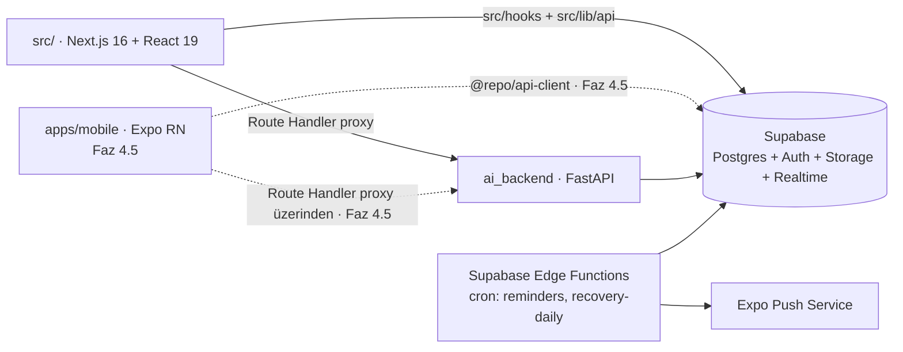

# Online Coaching Platform — Mühendislik Spesifikasyonu ve Uygulama Prompt'u

> **Hedef ajan:** Claude Code
> **Çalışma dili:** Türkçe (kod, commit mesajları ve tanımlayıcılar İngilizce)
> **Repo:** `Online-Coaching-AppV2` (Next.js + Supabase + Python `ai_backend`)
> **Sürüm:** v1.1 — bu doküman tek doğruluk kaynağıdır (single source of truth).
> Çelişki durumunda bu doküman > mevcut kod > senin varsayımın.

## Revizyon geçmişi (v1.0 → v1.1)

- **R1** — Sürüm `v1.0` → `v1.1`; bu revizyon geçmişi eklendi — hiçbir
  değişiklik sessiz olmasın, her madde gerekçesiyle izlenebilsin.
- **R2** — Faz 0 ikiye bölündü: tamamlanmış işler **"Faz 0 — Temel
  (TAMAMLANDI)"** oldu (§2); monorepo (pnpm + Turborepo, `packages/*`) ve Expo
  mobil iskeleti yeni **"Faz 4.5 — Monorepo ve Mobil Temel"**e taşındı (§7),
  AC-0.1..AC-0.5 oraya AC-4.5.\* olarak uyarlandı — en yıkıcı adım (tüm
  path'ler, CI, Docker, deployment) hiçbir kullanıcı değeri üretmiyordu ve
  monorepo'nun tek gerekçesi olan mobil, Faz 5'e (sağlık verisi) kadar zorunlu
  değil. Bölüm numaraları bir kaydı (eski §7–§13 → yeni §8–§14); faz
  numaraları (Faz 5..Faz 10) değişmedi, yalnızca aralarına Faz 4.5 girdi.
  Çapraz referanslar güncellendi: §1.3 "Zamanlama → §9" artık §10.
- **R2b** — AC-2.1'in "her iki platformda" ve AC-2.4'ün "yalnızca
  `packages/api-client`" şartları mevcut yapıya uyarlandı (web Playwright
  zorunlu; mobil doğrulaması ve `packages/api-client` kuralı Faz 4.5'e
  ertelendi) — mobil uygulama ve monorepo Faz 2 sırasında henüz yok.
  §5.3'teki proxy yolu `apps/web/app/...` → `src/app/...` düzeltildi (aynı
  nedenle).
- **R3** — Tek koçlu modele geçildi: §3.1'den `profiles.coach_id` ve bağlı
  CHECK kaldırıldı, §3.2 RLS matrisi iki aktöre indi, "koç başka koçun
  öğrencisini göremez" katmanı kaldırıldı, `EXISTS (... coach_id =
auth.uid())` pattern'i mevcut ve doğrulanmış `public.is_admin()`
  `SECURITY DEFINER` yardımcısıyla değiştirildi (özyineleme uyarısı gerekçesiyle
  korundu), RLS test senaryoları güncellendi — kullanıcı kararı
  (`docs/PROGRESS.md` §4).
- **R4** — §3.1'e rol yeniden adlandırma maddesi eklendi: enum
  `admin`/`student` → `coach`/`client` dönüşümü **Faz 1'in şema yeniden
  yazımının parçasıdır**, ayrı iş kalemi değildir — yarım kalmış bir
  yeniden adlandırma iki dilli bir kod tabanı bırakır. **UYGULANDI
  (2026-08-17, Faz 1a):** `supabase/migrations/20260817090000_rename_roles.sql`
  ile enum, `is_admin()`→`is_coach()` ve 5 tablodaki `student_id`→`client_id`
  kolonları taşındı; bkz. §3.1 ve `docs/PROGRESS.md` §3 "Faz 1a — çıkış
  kriterleri".
- **R5** — §3.4'teki `Result<T>` sözleşmesi kaldırıldı, yerine mevcut ve
  çalışan tipli `ApiError` fırlatma modeli yazıldı; key sözleşmesi
  `src/lib/query/keys.ts`'teki gerçek şekle uyarlandı — `Result<T>` TanStack
  Query'nin `queryFn`'in fırlatmasına dayanan hata makinesiyle uyumsuz.
- **R6** — §3.5 "Veri migrasyonu" eklendi (JSON string planlar → normalize
  tablolar, `messages` → `conversations`, `form_checks` + `status`, eski
  kolonların kaderi, geri alınabilirlik) + AC-1.5 — plan yeşil alan gibi
  yazılmıştı, repoda çalışan bir şema ve veri var.
- **R7** — §3.3'e storage mahremiyeti Faz 1 çıkış kriteri olarak eklendi
  (public bucket kalmayacak, kolonlar tam URL değil yol saklayacak, mevcut
  satırlar dönüştürülecek) + AC-1.6 — `avatars` ve `form-checks-media` şu an
  public ve `form_checks.front_pose_url` tam public URL saklıyor; I-4 fiilen
  ihlal ediliyor. **UYGULANDI (2026-08-17, Faz 1a):**
  `supabase/migrations/20260817100000_private_storage.sql` ile iki bucket da
  `public = false` yapıldı, kolonlar `*_url` → `*_path` olarak yeniden
  adlandırılıp mevcut satırlar yola dönüştürüldü, okuma `src/lib/storage.ts`
  üzerinden imzalı adresle (TTL 3600 sn) yapılıyor; bkz. §3.3 ve
  `docs/PROGRESS.md` §3 "Faz 1a — storage mahremiyeti".
- **R8** — §1.3 teknoloji tablosu güncellendi: Next.js 15 → **16 + React 19**,
  monorepo satırına "Faz 4.5" notu, build motoru satırı (`next build
--webpack`, `next-pwa` kısıtı), grafik satırına `chart.js` ikinci kütüphane
  notu — tablo repodan geri kalmıştı. Grafik tekleştirme Faz 4'e iş kalemi +
  AC-4.3 olarak eklendi.
- **R9** — §1.2 topoloji diyagramı mevcut duruma çekildi (`src/` · Next.js 16,
  `apps/mobile` "Faz 4.5" etiketli, `@repo/api-client` → `src/hooks` +
  `src/lib/api`); I-1..I-5 korundu, yalnız I-3 `packages/types` → `src/types`
  olarak uyarlandı (Faz 4.5'te taşınır).
- **R10** — §0.6 güncellendi: mevcut 6 ADR `docs/ARCHITECTURE.md` §7 içine
  gömülü (ADR-lite); Faz 1'in başında `docs/adr/NNNN-<slug>.md` dosyalarına
  ayrıştırılacak (AC-1.7), sonrasında her yeni karar ayrı dosya — plan var
  olmayan bir dizini varsayıyordu.
- **R11** — §0.2 faz kapısı komutları gerçek komutlarla değiştirildi
  (`npm run lint/type-check/test/build`, `format:check`, `test:e2e`,
  `ai_backend` için `uv run ruff/mypy/pytest`) — `pnpm turbo build lint test`
  bu repoda çalışmıyor; turbo komutlarına Faz 4.5'te dönülecek.
- **R12** — §0.3 git disiplini gerçeğe uyarlandı: **ajan commit atmaz**,
  yalnızca conventional-commit mesajı önerir; commit'i kullanıcı atar.
  `git push` yasağı korundu.
- **R13** — **Faz 1.5 — Güvenlik Denetimi ve Sertleştirme** eklendi (§3a).
  Kaynak: `securityhardening_prompt.md` (o doküman değiştirilmedi, kaynak olarak
  korunuyor). Konum gerekçesi: Faz 1 RLS'i ve şemayı yeniden yazıyor — denetim
  daha erken yapılsaydı sonucu boşa giderdi; Faz 2 ise bu temelin üstüne yeni
  saldırı yüzeyi (plan yayınlama, form check kuyruğu, realtime mesajlaşma)
  ekliyor, dolayısıyla temel önce sağlamlaştırılmalı. Prompt'un maddeleri
  mevcut durumla uzlaştırıldı (§3a.3): 20 madde **zaten kapalı** (kanıtla),
  9 madde **geçersiz/uyarlanmış** (tek koçlu model, npm/pnpm, henüz var olmayan
  uçlar), 17 madde **açık** ve bu fazın işi. **Faz numaraları KAYMADI:** bölüm
  `§3a` olarak eklendi (`docs/PROGRESS.md` §6a/§6b konvansiyonu), böylece
  §4–§14 ve tüm çapraz referanslar (§7 Faz 4.5, §10 zamanlama, AC-\* adları)
  olduğu gibi geçerli kaldı; faz adı Faz 4.5 mantığıyla **Faz 1.5**'tir.
- **R14** — **Faz 1.6 — Görsel Kimlik Oturumu** eklendi (§3b). Kaynak: ADR-0015
  (görsel kimlik sistemi), ADR-0016 (emoji → Lucide), ADR-0017 (imza öğe: halka),
  ADR-0018 (iki katmanlı geçiş + CI ratchet). Plan bugüne kadar görsel dili hiç
  karara bağlamamıştı; kimlik varsayılanların toplamı olarak oluşmuştu (`#8b5cf6`
  = Tailwind `violet-500`, beyaz üstünde ~4.2:1 ile AA'yı geçmiyor; 49
  `font-black`; `next/font` hiç kullanılmıyor). Faz numaraları **KAYMADI:** bölüm
  `§3b` olarak eklendi (§3a ve `docs/PROGRESS.md` §6a/§6b konvansiyonu), §4–§14 ve
  tüm çapraz referanslar (AC-\* adları dahil) olduğu gibi geçerli. **Faz 1.5 ile
  paralel yürütülebilir** — dosya bakımından çakışmıyorlar (Faz 1.5 `supabase/**`,
  `src/lib/**`, CI güvenlik adımları; Faz 1.6 `src/design/**`, `tailwind.config.ts`,
  `src/app/globals.css`, `src/app/layout.tsx`), ama ikisi de Faz 2'den önce
  bitmelidir. Ayrıca §4.2'deki "halka grafik" ifadesi ADR-0017'nin tek anlam
  kuralı gereği **yatay bar** olarak düzeltildi (halka yalnızca döngü durumu
  kodlar; makro bir döngü değil, bütçedir).

---

## 0. Ajan Çalışma Protokolü (ZORUNLU — önce bunu oku)

1. **Keşif önce gelir.** Hiçbir kod yazmadan önce tüm repo'yu tara, mevcut
   şemayı/route'ları/component'leri çıkar ve `docs/DISCOVERY.md` dosyasına
   mevcut durumun envanterini yaz. Bu envanteri bana raporla ve **onayımı
   bekle**.
2. **Faz kapıları (phase gates).** Her fazın sonunda: (a) tanımlı kabul
   kriterlerinin (AC) tamamının karşılandığını doğrula, (b) aşağıdaki kapı
   komutlarının tamamı yeşil olsun, (c) `docs/PROGRESS.md`'yi güncelle —
   faz/tur kapanınca **anlatı doğrudan `docs/archive/progress-<slug>.md`'ye
   yazılır**; `docs/PROGRESS.md`'ye yalnızca durum özeti, borç tablosu
   güncellemesi ve tek satırlık faz kaydı işlenir —,
   (d) **dur ve raporla** — bir sonraki faza benim onayım olmadan geçme.

   ```
   npm run lint && npm run type-check && npm run test && npm run build
   npm run format:check
   npm run test:e2e            (yerel Supabase yığını + seed gerekir)
   cd ai_backend && uv run ruff check . && uv run mypy app && uv run pytest
   ```

   Monorepo Faz 4.5'te devreye girdiğinde (§7) bu kapı, `pnpm turbo` affected
   pipeline'ının eşdeğer komutlarıyla değiştirilir.

3. **Git disiplini.** **Commit ATMA.** Değişiklikleri hazırla ve önerilen
   conventional-commit mesajını raporla; commit'i kullanıcı atar. `git push`
   asla çalıştırma. Mesaj biçimi conventional commits (`feat(web): ...`,
   `feat(mobile): ...`, `feat(db): ...`, `feat(ai): ...`, `chore(repo): ...`).
   Bir commit = bir mantıksal değişiklik. Faz başına bir feature branch:
   `feat/phase-N-<slug>`.
4. **Scope disiplini.** Bu dokümanda yazmayan hiçbir özelliği ekleme, hiçbir
   bağımlılığı "iyi olur" diye kurma. Bir bağımlılık eklemek istiyorsan
   gerekçesiyle sor.
5. **Belirsizlik protokolü.** Teknik bir karar noktası bu dokümanda
   tanımlanmamışsa: 3 seçenek + trade-off tablosu + kendi önerinle bana sor.
   Sessiz varsayım = hata.
6. **ADR zorunluluğu.** Mimari sonucu olan her karar için ADR yaz (context /
   decision / consequences formatı). **TAMAMLANDI (2026-08-17, Faz 1a):**
   `docs/ARCHITECTURE.md` §7'de gömülü olan 6 "ADR-lite" kaydı `docs/adr/
NNNN-<slug>.md` dosyalarına ayrıştırıldı (AC-1.7) ve `ARCHITECTURE.md` §7
   yalnızca bu dosyalara link veren bir indekse indirildi; `docs/adr/` dizini
   artık mevcut (bkz. `docs/adr/README.md`, 13 ADR — rol yeniden adlandırma
   kararı `0013` olarak eklendi ve `0003`'ün yerini aldı). Ayrıştırmadan
   sonraki her yeni karar doğrudan `docs/adr/NNNN-<slug>.md` olarak yazılır;
   gömülü ADR yazımı bitti.
7. **Hata durumunda.** Bir migration, test veya build 2 denemede düzelmiyorsa
   dur, hatayı ve denediklerini raporla; brute-force retry döngüsüne girme.

---

## 1. Sistem Bağlamı ve Hedef Mimari

### 1.1 Ürün özeti

Koç-öğrenci (coach/client) modelli fitness koçluk platformu. Referans özellik
seti: antrenman planı atama ve loglama, beslenme planı + AI destekli yemek
fotoğrafı makro tahmini **(ertelendi, ADR-0021 — bkz. §5)**, ilerleme takibi
(kilo/ölçü/foto), form check (video/foto + koç geri bildirimi), gerçek
zamanlı mesajlaşma, sağlık verisi senkronizasyonu (HealthKit / Health
Connect), uyku takibi, 0-100 recovery skoru, hatırlatma push bildirimleri,
aktivite geçmişi.

### 1.2 Hedef topoloji



Kesik çizgili düğüm/kenarlar henüz yok: mobil uygulama ve `packages/*`
Faz 4.5'te (§7) devreye girer. O noktaya kadar web tek repo (`src/`) ve npm
ile yürür; `apps/web` yolu Faz 4.5'ten sonra geçerlidir.

**Değişmez kurallar (invariants):**

- I-1: Mobil ve web, `ai_backend`'e **asla doğrudan** istek atmaz; tüm AI
  çağrıları Next.js route handler proxy'sinden geçer (API key'ler yalnızca
  sunucu tarafında yaşar).
- I-2: Tüm istemci-veri erişimi RLS'e tabidir; `service_role` key yalnızca
  Edge Function'larda ve `ai_backend`'de bulunur.
- I-3: Domain tipi yalnızca tek bir yerde tanımlanır; bileşenler kendi ad-hoc
  tiplerini türetmez. Bugünkü yeri `src/types` (`database.ts` şemadan
  üretilir, `domain.ts` elle yazılır); Faz 4.5'te `packages/types`'a taşınır ve
  iki app aynı tipleri import eder.
- I-4: Sağlık verisi (health_metrics, sleep_sessions, progress_photos,
  form_checks, messages) içeren storage bucket'ları **private**'tır; erişim
  yalnızca signed URL (TTL ≤ 1 saat) ile olur.
- I-5: Her public API fonksiyonunun girdi/çıktısı zod (TS) veya Pydantic (Py)
  ile runtime'da doğrulanır. "Trust the caller" yok.

### 1.3 Teknoloji kararları (sabitlenmiş)

| Alan             | Karar                                                  | Not                                                                                                                                       |
| ---------------- | ------------------------------------------------------ | ----------------------------------------------------------------------------------------------------------------------------------------- |
| Monorepo         | pnpm workspaces + Turborepo                            | **Faz 4.5'te devreye girer (§7)**; o zamana kadar tek repo + npm                                                                          |
| Web              | Next.js 16 (App Router) + React 19 + TypeScript strict | mevcut durum (`next@16.2.10`, `react@19.2.4`)                                                                                             |
| Build motoru     | webpack — `next build --webpack`                       | `next-pwa` bir webpack eklentisi; Turbopack'e geçiş PWA'yı bırakmayı gerektirir. `@ducanh2912/next-pwa` de webpack tabanlı, çözüm değil   |
| Mobil            | Expo SDK (managed) + Expo Router + TypeScript          | Faz 4.5; EAS build hedefli                                                                                                                |
| Veri erişimi     | TanStack Query + merkezi veri katmanı                  | bugün `src/hooks` + `src/lib/api`; Faz 4.5'te `@repo/api-client`. Sözleşme ve cache key: §3.4                                             |
| Form             | react-hook-form + zod                                  | ortak şemalar bugün `src/lib/validation/schemas.ts`; Faz 4.5'te `packages/types/schemas`                                                  |
| Grafik           | web: recharts · mobil: victory-native                  | web'de ayrıca `chart.js` + `react-chartjs-2` kullanılıyor (StatsTab) — **Faz 4'te tek kütüphaneye indirilecek**                           |
| AI backend       | FastAPI + Pydantic v2 + uv                             | ruff + mypy strict                                                                                                                        |
| Vision sağlayıcı | Anthropic Messages API (görsel girişli)                | **Ertelendi (ADR-0021, Faz 3) — uygulanmadı.** `VISION_PROVIDER` env ile soyutlanır, adapter pattern kararı geri dönüş için geçerli kalır |
| Push             | Expo Push + `device_push_tokens`                       | web push kapsam dışı (v2)                                                                                                                 |
| Zamanlama        | Supabase Edge Functions + pg_cron                      | §10                                                                                                                                       |

---

## 2. Faz 0 — Temel (TAMAMLANDI)

Bu faz repoda fiilen bitti; yeniden yapılacak iş yok. Kanıt ve detay:
`docs/PROGRESS.md` §1–§3, `UPGRADE_NOTES.md` §2.

### Tamamlananlar

- **TypeScript strict migrasyonu:** `strict`, `noUncheckedIndexedAccess`,
  `noImplicitOverride`, `noUnusedLocals/Parameters`, `allowJs: false`.
  `src/` altında `.js` kaynak kalmadı; sonraki fazlar JS'e kod eklemez.
- **Test altyapısı:** Vitest + RTL (180 test), Playwright E2E (28/28 —
  chromium + Mobile Chrome), `ai_backend` pytest (63 test, kapsam %92).
- **CI/CD:** `.github/workflows/ci.yml` — `frontend`, `backend`, `e2e`,
  `docker`, `required-checks` job'ları; ESLint flat config + Prettier.
- **Docker:** kök `Dockerfile` (Next.js standalone), `ai_backend/Dockerfile`
  (non-root, `$PORT`), `docker-compose.yml`.
- **Güvenlik başlıkları ve sertleştirme:** iki katmanlı rate limiting
  (Next.js middleware + FastAPI `slowapi`), CORS allowlist, CSP/HSTS/
  X-Frame-Options, `X-Request-ID` korelasyonlu yapılandırılmış loglama.
- **AI proxy:** `src/app/api/ai/*` route handler'ları — tarayıcı `ai_backend`'e
  asla doğrudan istek atmaz (I-1 sağlanıyor).
- **Şema + RLS'in ilk sürümü:** 9 tablo, 37 politika, 8 storage politikası,
  `is_admin()` / `profile_role()` `SECURITY DEFINER` yardımcıları. Faz 1 bu
  şemayı yeniden yazacak — mevcut politikaları cilalamaya vakit harcama.

### Bu fazdan çıkarılanlar

Monorepo dönüşümü (pnpm + Turborepo, `packages/*`) ve Expo mobil iskeleti
**Faz 4.5'e taşındı (§7)**. Gerekçe: en yıkıcı adım (tüm path'ler, CI, Docker,
deployment kırılır) hiçbir kullanıcı değeri üretmiyor ve monorepo'nun tek
gerekçesi olan kod paylaşımının tek tüketicisi mobil uygulama — mobil ise
Faz 5'ten (sağlık verisi) önce zorunlu değil. Faz 1–4 mevcut tek repo
yapısında yürütülür.

---

## 3. Faz 1 — Veri Modeli, RLS ve API Sözleşmesi

### 3.1 Şema (migration'lar `supabase/migrations/` altında, her tablo ayrı dosya)

Tablolar (tam kolon listesini sen tasarla, aşağıdaki zorunlu alanlar ve
kısıtlarla):

| Tablo                                      | Zorunlu unsurlar                                                                                                                                                                                                    |
| ------------------------------------------ | ------------------------------------------------------------------------------------------------------------------------------------------------------------------------------------------------------------------- |
| `profiles`                                 | `role user_role NOT NULL` (`coach`,`client`). **Tek koçlu model: `coach_id` YOK** — koç-danışan eşleştirmesi tutulmaz (bkz. §3.2)                                                                                   |
| `workout_plans` / `workout_plan_exercises` | plan versiyonlama: `version int`, `is_active bool`; egzersiz: `video_url`, `target_sets/reps/weight`, `position int`                                                                                                |
| `workout_logs` / `workout_log_sets`        | set: `actual_reps`, `actual_weight_kg numeric(5,2)`, `rpe numeric(3,1) CHECK (rpe BETWEEN 1 AND 10)`                                                                                                                |
| `nutrition_plans` / `nutrition_plan_meals` | hedefler: `kcal int`, `protein_g/carb_g/fat_g int`, CHECK ≥ 0                                                                                                                                                       |
| `nutrition_logs`                           | `photo_path`, `ai_estimate jsonb`, `user_override jsonb`, `status` (`ai_suggested`,`confirmed`) — **Ertelendi (ADR-0021, Faz 3): bu dört alan hiç eklenmedi**, bkz. `20260817190100_nutrition_targets_and_logs.sql` |
| `progress_entries`                         | `weight_kg numeric(5,2)`, `measurements jsonb`, UNIQUE(user_id, entry_date)                                                                                                                                         |
| `progress_photos`                          | `angle` enum (`front`,`side`,`back`), private bucket path                                                                                                                                                           |
| `form_checks`                              | `status` enum (`pending`,`reviewed`), `coach_feedback text`, `reviewed_at`                                                                                                                                          |
| `conversations` / `messages`               | UNIQUE(coach_id, client_id); `read_at timestamptz`; sistem mesajı için `kind` enum (`user`,`system`)                                                                                                                |
| `coach_notes`                              | koç → öğrenci serbest not                                                                                                                                                                                           |
| `health_metrics`                           | `metric_date date`, `steps int`, `active_kcal int`, `avg_hr int`, `distance_m int`, `source` enum (`healthkit`,`health_connect`,`manual`), UNIQUE(user_id, metric_date, source)                                     |
| `sleep_sessions`                           | `start_at/end_at timestamptz`, `stages jsonb` (`{deep,rem,light,awake}` dakika), `source`                                                                                                                           |
| `recovery_scores`                          | `score int CHECK (score BETWEEN 0 AND 100)`, `components jsonb`, `advice_key text`, UNIQUE(user_id, score_date)                                                                                                     |
| `reminders`                                | `kind` (`workout`,`meal`), `time_local time`, `days_of_week int[]`, `timezone text`                                                                                                                                 |
| `device_push_tokens`                       | UNIQUE(user_id, token), `platform` enum (`ios`,`android`)                                                                                                                                                           |

**İndeksler:** her FK'ye indeks; zaman serisi tablolarında
`(user_id, <date> DESC)` composite indeks; `messages(conversation_id,
created_at DESC)`.

**Rol adlandırması (Faz 1'in parçası, ayrı iş değil) — UYGULANDI (2026-08-17,
Faz 1a).** Enum değerleri **artık `coach`/`client`** (öncesinde `admin`/
`student` idi; ürün dilinde koç/danışan). `admin` → `coach`, `student` →
`client` yeniden adlandırması `supabase/migrations/20260817090000_rename_roles.sql`
ile gerçekleşti. Migration şunları birlikte yaptı: (a) `user_role` enum'unu
`ALTER TYPE ... RENAME VALUE` ile dönüştürdü (veri kaybı yok, OID korunur),
(b) mevcut satırlar otomatik yeni etikete geçti, (c) `is_admin()` fonksiyonu
**`is_coach()` olarak yeniden adlandırıldı** — bu noktada plan aşağıda
düzeltildiği gibi ilk yazılırken "fonksiyon adı korunur, yalnızca gövde
değişir" öngörmüştü; gerçekleşen bundan farklı oldu (bkz. §3.2'deki
"GÜNCELLEME" notu ve `docs/adr/0013-rollerin-coach-client-olarak-yeniden-adlandirilmasi.md`),
(d) `increment_streak()` gövdesi ayrıca elle güncellendi (ad ile çağırıyordu,
OID ile değil), (e) tüm istemci kodu güncellendi (`src/types/domain.ts`
`isAdmin()` → `isCoach()`, `src/hooks/**`, bileşenler, E2E seed'leri — 38
dosya). Yarım bırakılmış bir yeniden adlandırma (şemada `coach`, kodda
`admin`) yaşanmadı — doğrulama: `docs/PROGRESS.md` §3 "Faz 1a — çıkış
kriterleri".

**Tek koçlu model notu.** Sistemde bir koç vardır ve tüm danışanları görür;
`coach_id` kolonu, ona bağlı CHECK ve koç-eşleştirme mantığı bilinçli olarak
YOKTUR (kullanıcı kararı, `docs/PROGRESS.md` §4). İleride çok koçluya
geçilmek istenirse `profiles.coach_id` **ek bir migration** ile getirilir ve
RLS politikalarına ikinci bir sahiplik katmanı eklenir; bu iş Faz 1 kapsamı
dışındadır ve o gün geldiğinde ADR ile açılır.

### 3.2 RLS matrisi (her tablo için politika yaz, test et)

Tek koçlu model: iki aktör vardır. Koç **tüm** danışanları görür; "koç başka
koçun danışanını göremez" katmanı yoktur.

| Aktör        | Kendi verisi | Danışan verisi                                                                                         | Not                                              |
| ------------ | ------------ | ------------------------------------------------------------------------------------------------------ | ------------------------------------------------ |
| client       | R/W          | —                                                                                                      | Kendi satırı dışındaki her şey DENY              |
| coach        | R/W          | **R** (tüm danışanlar) + **W** (yalnız: plan tabloları, coach_feedback, coach_notes, sistem mesajları) | Danışanın kendi log'una yazamaz                  |
| anon         | —            | —                                                                                                      | Tüm tablolarda REVOKE; hiçbir satır okuyamaz     |
| service_role | bypass       | bypass                                                                                                 | Yalnızca Edge Function'lar ve `ai_backend` (I-2) |

- Koç yetkisi bir ilişki kolonundan değil **rolden** doğrulanır. Politikalarda
  mevcut ve doğrulanmış `public.is_coach()` (eskiden `public.is_admin()`)
  yardımcısı kullanılır (`SECURITY DEFINER`, `stable`,
  `set search_path = public, pg_temp`):
  `using (client_id = auth.uid() or public.is_coach())`. JWT claim'e güvenme.
  **GÜNCELLEME (2026-08-17, Faz 1a):** Bu satır aslında `admin`/`student`
  taşınmadan önce "fonksiyonun adı ve imzası korunur, yalnızca gövdesi
  `role = 'coach'` olur" diyordu; gerçekleşen uygulama bundan farklı oldu —
  `supabase/migrations/20260817090000_rename_roles.sql` fonksiyonu da
  `is_admin()` → `is_coach()` olarak **yeniden adlandırdı** (imza korundu,
  ad değişti). Gerekçe: OID korunduğu için yeniden adlandırma politikaları
  bozmuyor, ve `is_admin()` adını süresiz taşımanın okunurluk maliyeti veri
  riski ortadan kalkınca kabul edilemez görüldü (bkz. `docs/adr/
0013-rollerin-coach-client-olarak-yeniden-adlandirilmasi.md`).
- **Politika özyinelemesi uyarısı (KORUNACAK).** Yardımcının `SECURITY
DEFINER` olması şart, kolaylık değil. Bir politika kendi tablosuna düz bir
  alt sorguyla geri sorarsa (`EXISTS (SELECT 1 FROM profiles p WHERE ...)`
  bir `profiles` politikasının içinde), alt sorgu da RLS'e tabi olur ve aynı
  politikayı yeniden tetikler; Postgres bunu
  `infinite recursion detected in policy for relation "profiles"` hatasıyla
  keser. `SECURITY DEFINER` fonksiyon RLS'i atlayarak zinciri kırar. Aynı
  nedenle rol yükseltmesini engelleyen `profiles` UPDATE `WITH CHECK`'i
  `public.profile_role()` kullanır. Bu iki fonksiyon dışında politika içinden
  `profiles`'a sorgu yazma.
- **RLS testleri zorunlu:** pgTAP veya SQL tabanlı test script'i ile en az şu
  senaryolar:
  1. Danışan kendi logunu okur (PASS).
  2. Danışan başka danışanın logunu / form check'ini okur (FAIL — 0 satır).
  3. Koç tüm danışanların verisini okur (PASS).
  4. Koç danışanın `workout_logs` satırına yazar (FAIL).
  5. Danışan kendi rolünü koç rolüne yükseltmeye çalışır (FAIL —
     `new row violates row-level security policy`).
  6. `anon` hiçbir tabloyu okuyamaz (FAIL — `permission denied for table ...`).

  Senaryo 5 ve 6 mevcut şema üzerinde elle SQL ile fiilen doğrulandı
  (`docs/PROGRESS.md` §1.1); Faz 1'de tüm liste tekrarlanabilir script'e
  dönüştürülür ve CI'a bağlanır.

### 3.3 Storage

Bucket'lar: `meal-photos` (**Ertelendi, ADR-0021, Faz 3 — hiç yaratılmadı**),
`progress-photos`, `form-checks` — hepsi private.
Path sözleşmesi: `<user_id>/<uuid>.<ext>`. Storage RLS: yükleme yalnızca kendi
prefix'ine; okuma kendi prefix'i + koç için tüm prefix'ler (tek koçlu model).
Maks. dosya boyutu: foto 10 MB, video 100 MB; MIME whitelist.

**Mevcut durum ve Faz 1 çıkış kriteri (I-4'ün fiili karşılığı) — TAMAMLANDI
(2026-08-17, Faz 1a).** Repoda önceden `avatars` ve `form-checks-media`
bucket'ları **public** (`public = true`, `getPublicUrl` ile servis ediliyordu)
ve `form_checks.front_pose_url` / `back_pose_url` **tam public URL**
saklıyordu — danışan vücut fotoğrafları URL'yi bilen herkese açıktı. I-4 bu
haliyle ihlal ediliyordu.
`supabase/migrations/20260817100000_private_storage.sql` aşağıdaki üç maddeyi
birlikte uyguladı:

1. ~~**Hiçbir bucket public kalmayacak.** Tüm okuma signed URL ile (TTL ≤ 1
   saat); `getPublicUrl` çağrısı kod tabanında kalmayacak.~~ **TAMAMLANDI:**
   iki bucket da `public = false`; okuma `src/lib/storage.ts` →
   `createSignedUrl`/`createSignedUrls` ile, `SIGNED_URL_TTL_SECONDS = 3600`.
2. ~~**URL kolonları tam URL değil, bucket içi YOL saklayacak** —
   `form_checks.front_pose_url` / `back_pose_url` ve `profiles.avatar_url`
   dahil. Signed URL istemcide okuma anında üretilir
   (`src/hooks/useFormChecks.ts`, `src/hooks/useProfile.ts`,
   `src/components/AdminUserManagement.tsx` güncellenir).~~ **TAMAMLANDI:**
   kolonlar `front_pose_path` / `back_pose_path` / `avatar_path` olarak
   yeniden adlandırıldı; ilgili hook'lar ve `CoachUserManagement.tsx`
   (eskiden `AdminUserManagement.tsx`) imzalı adres kullanacak şekilde
   güncellendi.
3. ~~**Mevcut satırlar için veri dönüşümü yazılacak** (tam URL → yol); bkz.
   §3.5.~~ **TAMAMLANDI:** aynı migration içinde regex ile dönüştürüldü
   (storage dışı mutlak URL'ler — ör. `placehold.co` — bilinçli olarak
   dönüştürülmedi, UI bunlar için placeholder'a düşer). Barındırılan projede
   aynı dönüşüm henüz planlanmadı — bkz. `docs/PROGRESS.md` §6a "ÖNEMLİ NOT".

Bu üç madde `docs/PROGRESS.md` §6a'da devir borcu olarak kayıtlıydı, artık
tamamlandı olarak işaretli; iki liste birbirinden ayrışmamalıdır.

### 3.4 API sözleşmesi (contract-first)

Veri katmanı (bugün `src/lib/api` + `src/hooks`; Faz 4.5'te
`packages/api-client`) tek tip hata disipliniyle çalışır: **başarısız çağrılar
tipli `ApiError` fırlatır.** `Result<T>` sarmalayıcı KULLANILMAZ.

```ts
class ApiError extends Error {
  readonly status: number // HTTP durumu (ağ hatası 0, timeout 408, iptal 499)
  readonly code: string // 'TIMEOUT' | 'NETWORK_ERROR' | 'HTTP_ERROR' | sunucu kodu
  readonly message: string // kullanıcıya gösterilebilir TÜRKÇE metin
  readonly details?: unknown
  readonly requestId?: string // X-Request-ID korelasyonu
  static isApiError(e: unknown): e is ApiError
}
```

- **Gerekçe (v1.0'daki `Result<T>` neden kaldırıldı):** TanStack Query'nin tüm
  hata makinesi — `isError`, `retry`, error boundary — `queryFn`'in
  **fırlatmasına** dayanır. `Result<T>` dönen bir istemci her `queryFn`'de
  `if (!r.ok) throw` unwrap'i gerektirir; sözleşme sınırın hemen ardında yine
  exception'a çevrilir. Kazanç yok, tek tip hata akışı kaybı var
  (`docs/PROGRESS.md` §4 karar kaydı).
- Beklenen hata durumları tipli `ApiError` ile ifade edilir; çağıran
  `ApiError.isApiError(e)` ile daraltır ve `status` / `code` üzerinden
  dallanır. Yakalanmayan hata = programlama hatası, error boundary'ye düşer.
- **İş kalemi (Faz 1):** Planın asıl istediği iki bilgi `ApiError`'a alan
  olarak eklenecek — `code: ErrorCode` (string literal union, serbest `string`
  değil) ve `retryable: boolean`. `retryable` eklendiğinde
  `src/lib/query/queryClient.ts`'teki retry politikası bugünkü
  "4xx ise deneme" sezgisi yerine bu bayrağı okur.
- TanStack Query key sözleşmesi: anahtar `[domain, entity, params]`
  şeklindedir ve **yalnızca** merkezi fabrikalardan üretilir; string literal
  key yasak. Fabrikalar bugün `src/lib/query/keys.ts` içinde
  (Faz 4.5'te `packages/api-client/keys.ts`'e taşınır). Gerçek şekil:
  `queryKeys.profile(id) → ['profile', id ?? null]`,
  `queryKeys.dailyLogs(studentId) → ['daily-logs', studentId ?? null]`,
  `queryKeys.notifications(userId, opts) → ['notifications', userId ?? null, opts ?? null]`;
  `queryKeys.messages(a, b)` yön bağımsızdır (taraflar sıralanır — `(a,b)` ve
  `(b,a)` aynı anahtarı üretir). Prefix invalidate için `queryKeyRoots`
  kullanılır.
- Ortak zod şemaları bugün `src/lib/validation/schemas.ts` içinde; Faz 4.5'te
  `packages/types/schemas/` altına taşınır. FastAPI tarafındaki Pydantic
  modelleriyle alan adları birebir aynı (snake_case, wire format). **Tek
  bilinçli istisna (2026-08-17, Faz 1a):** `RecommendationInput`/
  `recommendationSchema` içindeki `student_id` alanı `client_id`'ye
  **çevrilmedi**, çünkü `ai_backend/app/schemas/recommendations.py` hâlâ
  `student_id` bekliyor ve bu uç (`useRecommendations`) hiçbir bileşen
  tarafından çağrılmıyor; hizalama gerçek bir tüketici eklendiğinde ayrı bir
  işte yapılacak (bkz. `docs/PROGRESS.md` §3 "Faz 1a — AI tel protokolü").

### 3.5 Veri migrasyonu (bu bir yeşil alan projesi DEĞİL)

Faz 1 şemayı yeniden yazar, ama repoda çalışan bir şema ve içinde veri var.
Her yapısal migration'ın yanında bir **veri migrasyonu** yazılır:

| Kaynak (mevcut)                                                           | Hedef (Faz 1)                                | Not                                                                                                                                                                                                                            |
| ------------------------------------------------------------------------- | -------------------------------------------- | ------------------------------------------------------------------------------------------------------------------------------------------------------------------------------------------------------------------------------ |
| `profiles.workout_plan` — JSON **string**, `Record<gün, string>`          | `workout_plans` + `workout_plan_exercises`   | Gün içeriği serbest metin; satırlara ayrıştırılır, ilk sürüm `version = 1, is_active = true`. Ayrıştırılamayan metin kaybolmaz, ham hâliyle bir `notes` alanında saklanır.                                                     |
| `profiles.nutrition_plan` — JSON **string**, `Record<gün, {items,total}>` | `nutrition_plans` + `nutrition_plan_meals`   | `items` "Ad:gram" listesi, `total` gün kalorisi. Parse edilemeyen gün düşürülmez, ham metin korunur.                                                                                                                           |
| `messages` (`sender_id` / `receiver_id`, `is_read bool`)                  | `conversations` + `messages.conversation_id` | **`conversations` tablosu şu an YOK.** Her (koç, danışan) çifti için tek konuşma üretilir. `is_read` → `read_at`: bilgi uydurma; okunma zamanı bilinmediği için karar ADR'de verilir (NULL bırak vs. `created_at` ile doldur). |
| `form_checks`                                                             | yeni `form_checks` (+ `status` enum)         | **`status` kolonu şu an YOK.** Dönüşüm: `coach_feedback` doluysa `reviewed`, boşsa `pending`. URL kolonları tam URL → bucket içi yol (§3.3).                                                                                   |
| `daily_logs`, `workout_logs`, `program_approvals`, `notifications`        | karşılıkları                                 | Kolon eşlemesi birebir değilse eşleme tablosu migration dosyasının başına yorum olarak yazılır.                                                                                                                                |

Kurallar:

- **Eski kolonların kaderi açıkça kararlaştırılır — sessiz bırakılmaz.**
  Varsayılan karar: `profiles.workout_plan` ve `profiles.nutrition_plan` veri
  taşındıktan sonra **aynı migration'da DROP EDİLMEZ**; bir faz boyunca
  salt-okunur olarak yan yana yaşar
  (`comment on column ... is 'DEPRECATED: <hedef tablo>'`). Yazma yolu ilk
  migration'da kesilir — çift kaynak yaşamaz. DROP, Faz 2 kapısında ayrı bir
  migration ile yapılır.
- **Her migration geri alınabilir olacak:** ters dönüşüm eş adlı bir `down`
  script'inde yazılır ve en az bir kez fiilen çalıştırılıp doğrulanır.
- **Her migration temiz kurulumdan da çalışacak:** `supabase db reset` boş
  veritabanında hatasız tamamlanmalı; veri migrasyonu satır bulamadığında
  no-op olur, hata vermez.
- Veri dönüşümü SQL içinde yapılır (uygulama script'i değil) ki `db reset`
  zincirinin parçası olsun ve CI'da tekrarlanabilsin.
- **Barındırılan proje uyarısı:** migration'lar bugüne kadar yalnızca YEREL
  yığına uygulandı; `.env.local` barındırılan bir Supabase projesini
  gösteriyor (`docs/PROGRESS.md` §6a). Orada gerçek danışan verisi varsa
  dönüşüm önce dry-run edilir, satır sayıları öncesi/sonrası raporlanır.

### Kabul kriterleri

- AC-1.1: `supabase db reset` temiz kurulumdan tüm migration'ları hatasız uygular.
- AC-1.2: RLS test script'i §3.2'deki 6 senaryonun tamamını doğrular.
- AC-1.3: Seed: 1 koç + 2 öğrenci + 1 haftalık dolu plan + 3 günlük log verisi.
- AC-1.4: `src/types` şemadan üretilmiş güncel tipleri içerir (`npm run
db:types` çıktısıyla diff sıfır); CI'da "types güncel mi" drift check'i
  vardır. (Faz 4.5'te bu kriter `packages/types`'a taşınır.)
- AC-1.5: §3.5'teki her kaynak için veri migrasyonu yazılmış; mevcut veriyle
  çalıştırıldığında satır kaybı yok (öncesi/sonrası sayım raporu
  `docs/PROGRESS.md`'ye eklenir) ve aynı migration boş veritabanında da geçer.
- AC-1.6: §3.3 çıkış kriteri karşılandı — `storage.buckets` içinde
  `public = true` olan bucket yok, URL kolonları yol saklıyor, form check
  medyası public URL ile erişilemiyor (curl testiyle kanıtla).
- AC-1.7: 6 ADR-lite kaydı `docs/adr/NNNN-<slug>.md` dosyalarına ayrıştırıldı
  (§0.6).

---

## 3a. Faz 1.5 — Güvenlik Denetimi ve Sertleştirme

Kaynak doküman: `securityhardening_prompt.md` (ASVS L2 / OWASP Top 10 / API Top 10
temelli). O doküman **değiştirilmez**; bu bölüm onun mevcut kod tabanıyla
uzlaştırılmış hâlidir. Çelişkide bu bölüm geçerlidir.

**Konum ve numaralandırma.** Faz, Faz 1 (§3) bittikten sonra, Faz 2 (§4) başlamadan
yürütülür. Gerekçe: (a) RLS ve şema Faz 1'de yeniden yazılıyor, denetim daha önce
yapılsaydı sonucu boşa giderdi; (b) Faz 2 bu temelin üstüne yeni saldırı yüzeyi
ekliyor (plan yayınlama, form check kuyruğu, realtime mesajlaşma) — temel önce
sağlamlaştırılır. Bölüm `§3a` olarak eklendi ki §4–§14 numaraları ve çapraz
referanslar kaymasın (`docs/PROGRESS.md` §6a/§6b ile aynı konvansiyon); fazın adı
Faz 4.5 mantığıyla **Faz 1.5**'tir.

### 3a.1 Amaç ve kapsam sınırı

- Amaç **savunma**dır: kendi kod tabanımızdaki zafiyetleri bulmak ve kapatmak.
  Saldırı/exploit geliştirme değildir.
- Hedef **yalnızca bu repo**dur. Dış sistemlere tarama/istek yapılmaz.
- Gerçek kullanıcı verisiyle test yapılmaz; tüm doğrulama yerel yığın + seed ile.
- **Canlı/barındırılan ortama dokunulmaz.** Barındırılan projeyle ilgili bulgular
  yalnızca raporlanır (bkz. §3a.4 K7), migration/`db push` bu fazda çalıştırılmaz.

### 3a.2 Protokol

1. **Önce rapor, sonra düzeltme.** Hiçbir düzeltme yapılmadan önce tüm bulgular
   `docs/security/AUDIT.md`'ye yazılır: **severity** (Critical/High/Medium/Low),
   **kanıt** (`dosya:satır`), **etki**, **düzeltme önerisi**, **durum**
   (open/fixed/accepted). Rapor kullanıcıya sunulur ve **onay beklenir**.
2. **Her düzeltme bir regresyon testiyle gelir.** Önce zafiyeti tetikleyen
   (başarısız olan) test yazılır, düzeltme o testi yeşile çevirir. Test katmanı
   bulgunun katmanına göre seçilir: RLS → `supabase/tests/rls.test.sql`,
   proxy/istemci → `tests/unit/**`, uçtan uca → `tests/e2e/**`.
3. **Kırma değil kapatma.** Meşru bir davranış kırılıyorsa dur ve raporla; sessizce
   özellik kaldırma yok (özellikle §3.2'deki bilinçli sapmalar — ADR-0014).
4. **Sızıntı yapma.** Raporda gerçek secret/token/PII gösterilmez, maskelenir
   (`sk-...abcd` biçimi). Bulunan bir secret için **rotasyon** önerilir; dosyadan
   silmek yeterli sayılmaz.
5. **Commit disiplini** §0.3'e tabidir: ajan commit atmaz, `fix(security): ...`
   biçiminde mesaj önerir. Bir açık = bir commit.
6. Faz sonunda **dur ve raporla**: kalan riskler, kabul edilen riskler (gerekçeli),
   önerilen sonraki adımlar.

### 3a.3 Uzlaştırma tablosu

Prompt'un maddeleri mevcut duruma göre üç kovaya ayrıldı. **Kova 1 yeniden
denetlenmez** — yalnızca `AUDIT.md`'ye "önceden kapatıldı, kanıt: X" satırı olarak
işlenir.

#### Kova 1 — ZATEN KAPALI (kanıtla)

| #   | Prompt maddesi                                                     | Durum ve kanıt                                                                                                                                                                                                                                                                                                                                                          |
| --- | ------------------------------------------------------------------ | ----------------------------------------------------------------------------------------------------------------------------------------------------------------------------------------------------------------------------------------------------------------------------------------------------------------------------------------------------------------------- |
| 1   | Güvenlik header'ları (§6)                                          | CSP, HSTS, `nosniff`, `X-Frame-Options: DENY`, `frame-ancestors 'none'`, `Referrer-Policy`, `Permissions-Policy` — `next.config.mjs:37-82`. Kalıntı: `script-src 'unsafe-inline'` (bkz. Kova 3 #13)                                                                                                                                                                     |
| 2   | CORS `*` + credentials yasağı (§6)                                 | `ai_backend/app/main.py:44-50` — `allow_origins=settings.cors_origins` (allowlist), `allow_headers` dar                                                                                                                                                                                                                                                                 |
| 3   | Proxy zorunluluğu, istemci `ai_backend`'e doğrudan gitmez (§5)     | `src/app/api/ai/{workout,nutrition,recommendations}/route.ts`; ADR-0004; I-1                                                                                                                                                                                                                                                                                            |
| 4   | AI uçlarında auth, kimlik sunucuda JWT'den (§2, §5)                | `src/lib/api/proxy.ts:53-85` — Bearer token `getUser()` ile doğrulanır, `user_id` istemciden kabul edilmez; ADR-0011; `tests/unit/proxy-auth.test.ts` (12 test; kimliksiz istekte `fetch` hiç çağrılmıyor)                                                                                                                                                              |
| 5   | Private bucket + kısa TTL signed URL (§4)                          | `supabase/migrations/20260817100000_private_storage.sql`, `src/lib/storage.ts` (`SIGNED_URL_TTL_SECONDS = 3600`); HTTP kanıt tablosu `docs/PROGRESS.md` §3 "Faz 1a — storage mahremiyeti" (public yol 400, imzalı 200)                                                                                                                                                  |
| 6   | RLS her tabloda aktif (§3)                                         | 13 tablo: `20260816090200_rls_policies.sql:16-24`, `20260817110000:337-338`, `20260817130000:361-362`. (**Yalnızca `ENABLE`** — `FORCE` için bkz. Kova 3 #1)                                                                                                                                                                                                            |
| 7   | RLS test matrisi, regresyon testi olarak (§3, §9.3)                | `supabase/tests/rls.test.sql` — 35 senaryo, `npm run test:rls`, CI `e2e` job'unda; `supabase/README.md` §4a/§4b                                                                                                                                                                                                                                                         |
| 8   | Yetki yükseltme / dikey yetki (§3)                                 | `profiles` UPDATE `WITH CHECK role = public.profile_role(auth.uid())` — danışan kendi rolünü `coach` yapamaz; `supabase/README.md` "Yetki yükseltme koruması"; elle doğrulama `docs/PROGRESS.md` §1.1                                                                                                                                                                   |
| 9   | Anonim istek hassas tablo → DENY (§3)                              | `anon` rolünden tüm `public` yetkileri REVOKE: `20260816090200`, `20260817110000:122-123`, `20260817130000:152-153`; `supabase/README.md` §7 madde 6                                                                                                                                                                                                                    |
| 10  | `service_role` sızıntısı, `NEXT_PUBLIC_` ile hassas değer (§3, §7) | `src/lib/supabase/` yalnızca `client.ts` + `server.ts` (ikisi de anon key); `admin.ts` silindi. `SUPABASE_SERVICE_ROLE_KEY` yalnızca `src/env.ts:17`'de opsiyonel şema alanı — uygulama kodunda hiçbir tüketicisi yok; tek kullanım repo dışı çalışan `scripts/import-catalog.mjs` (bundle'a girmez)                                                                    |
| 11  | Env runtime doğrulaması, `.env.example`, `.env` gitignore (§7)     | `src/env.ts` (zod, client/server şemaları ayrı, fail-fast), `.env.example` mevcut, `.gitignore:44` `.env*`                                                                                                                                                                                                                                                              |
| 12  | Hata yanıtlarında iç detay/stack sızıntısı (§8)                    | `src/lib/api/proxy.ts:143-156` — upstream gövdesi yalnızca loglanır, istemciye generic mesaj + `request_id`                                                                                                                                                                                                                                                             |
| 13  | Loglarda token/şifre (§8)                                          | `src/lib/logger.ts:20-28,99` — pino `redact` (`*.password`, `*.token`, `*.access_token`, `*.apiKey`, `*.authorization`, `req.headers.authorization`, `x-api-key`), `remove: true`. (PII/sağlık verisi için bkz. Kova 3 #7)                                                                                                                                              |
| 14  | Rate limiting (§6)                                                 | İki katman: `src/proxy.ts` (`/api/*`, AI için 20/dk) ve `ai_backend/app/core/rate_limit.py` + router'larda `@limiter.limit("20/minute")`                                                                                                                                                                                                                                |
| 15  | Server action'larda çağıran doğrulaması (§2)                       | Sorun kaynağındaki 4 server action **silindi** (ölü kod) — `docs/DISCOVERY.md` §2.5; `src/app/actions.ts` artık yok                                                                                                                                                                                                                                                     |
| 16  | Secret dosyalarının repoya girmesi (§7)                            | `supabase/.temp/` ve `.branches/` gitignore'da (`.gitignore:75-77`) — `npx supabase start` üretimi `start-secrets` commit'e girmiyor                                                                                                                                                                                                                                    |
| 17  | `SECURITY DEFINER` fonksiyonlarda `search_path` (§4)               | Migration'lardaki **14 `security definer` bildiriminin tamamı** hemen ardından `set search_path = public, pg_temp` içeriyor (`20260816090100`, `20260816100000`, `20260817090000`, `20260817110000`, `20260817130000`, `20260817140000`)                                                                                                                                |
| 18  | XSS: `dangerouslySetInnerHTML` / `eval` / `new Function` (§4)      | `src/**` üzerinde grep **boş** — kullanıcı içeriği (mesaj, notlar) React'in varsayılan escape'i ile render ediliyor                                                                                                                                                                                                                                                     |
| 19  | Kütlesel atama (§6)                                                | İstemci yazmalarının tamamı açık alan listesi kullanıyor (`src/hooks/**` — `useDailyLogs:56`, `useFormChecks:92`, `useMessages:111`, `useNotifications:53,87`, `useWorkoutLogs:49,98`, `useProgramApprovals:53,110,118`); `profiles` üzerinde istemciden güncellenen tek alan `avatar_path` (`useProfile.ts:98-102`). İstek gövdesi hiçbir yerde DB'ye spread edilmiyor |
| 20  | Şema doğrulama (§4, I-5)                                           | Public giriş kabul eden tek yüzey `/api/ai/*`; hepsi `handleAiProxy` içinde zod ile doğrulanıyor (`src/lib/api/proxy.ts:95-107`), FastAPI tarafı Pydantic v2                                                                                                                                                                                                            |

#### Kova 2 — GEÇERSİZ / UYARLANMALI

| #   | Prompt varsayımı                                                                                    | Uyarlama                                                                                                                                                                                                                                                                                                                                          |
| --- | --------------------------------------------------------------------------------------------------- | ------------------------------------------------------------------------------------------------------------------------------------------------------------------------------------------------------------------------------------------------------------------------------------------------------------------------------------------------- |
| 1   | "Koç sınırı: `profiles.coach_id = auth.uid()`; koç tüm öğrencileri görüyorsa **kritik bulgu**" (§3) | **Geçersiz.** Tek koçlu model benimsendi (ADR-0007, §3.1–§3.2); `coach_id` kolonu bilinçli olarak YOK. "Koç tüm danışanları görür" bir **karardır**, bulgu değildir. Denetimde bu madde "çok koçluya geçilirse ikinci sahiplik katmanı gerekir" notuna indirgenir                                                                                 |
| 2   | Test matrisinde "coach başka koçun öğrencisi → DENY" (§3)                                           | **Düşer** — ikinci koç kavramı yok. Matrisin geri kalan 5 senaryosu `rls.test.sql` ile zaten karşılanıyor                                                                                                                                                                                                                                         |
| 3   | "Koç profili görünürlüğü" bulgu olarak raporlanmalı                                                 | **Bilinçli takas** (ADR-0010, `supabase/README.md` "Koç görünürlüğü"): koçun `profiles` satırı tüm authenticated kullanıcılara açık, aksi hâlde mesajlaşma çalışmıyor. Bulgu olarak raporlanmaz; `AUDIT.md`'de "kabul edilen risk, ADR-0010" satırı olarak kayda geçer. `profiles`'a koça ait hassas kolon eklenirse kolon-sınırlı view'a geçilir |
| 4   | "Dikey yetki: `conversations`, `coach_notes`, sistem mesajı" (§3)                                   | **Kısmen yok.** `conversations` tablosu eklenmiyor (tek koçlu model; `messages` `conversation_key` yaklaşımıyla yürüyor — `20260817140000`), `coach_notes` Faz 1b'de ertelendi, `kind='system'` sistem mesajı Faz 2'de geliyor. Bu üç yüzeyin dikey yetki denetimi **Faz 2'nin çıkışına** bağlanır                                                |
| 5   | "Plan atama gibi koça özel yazma işlemlerini client yapabiliyorsa kapat" (§3)                       | **Uyarlanır.** Danışanın kendi planına yazabilmesi bilinçli sapmadır (ADR-0014, `supabase/README.md`); IDOR bulgusu değildir. Kalan gerçek eksik denetim izidir (bkz. Kova 3 #16)                                                                                                                                                                 |
| 6   | `pnpm audit` (§1, §9.4)                                                                             | Proje **npm** kullanıyor → `npm audit`. Turbo/pnpm'e geçiş Faz 4.5'te                                                                                                                                                                                                                                                                             |
| 7   | "meal-photo endpoint", prompt injection, SSRF (§5)                                                  | **Ertelendi, ADR-0021.** Uç hiç yaratılmadı (Faz 3 ertelendi) → bu maddeye bağlı denetim borcu **düşer**, kapatılacak bir şey yok çünkü açılan bir şey de yok. Faz 3 dönerse bu maddeler yeni uygulamanın çıkış kriteriyle birlikte geri gelir (ADR-0021)                                                                                         |
| 8   | "Logout push token'ı geçersiz kılıyor mu?" (§2)                                                     | `device_push_tokens` **Faz 7**'de geliyor (§10). Bu fazda yalnızca oturum sonlandırma denetlenir (`useSession.ts:93-99` — `signOut` + `queryClient.clear()` + workbox cache temizliği)                                                                                                                                                            |
| 9   | `docs/security/rls-tests` ayrı dizini (§9.3)                                                        | **Uyarlanır:** RLS testleri zaten `supabase/tests/rls.test.sql` (35 senaryo) ve `npm run test:rls` ile CI'da. İkinci bir dizin açılmaz; `AUDIT.md` bu dosyaya link verir                                                                                                                                                                          |

#### Kova 3 — AÇIK (bu fazın işi)

| #   | Bulgu adayı                                           | Kanıt / doğrulama                                                                                                                                                                                                                                                                                                   | İlk severity tahmini                     |
| --- | ----------------------------------------------------- | ------------------------------------------------------------------------------------------------------------------------------------------------------------------------------------------------------------------------------------------------------------------------------------------------------------------- | ---------------------------------------- |
| 1   | `FORCE ROW LEVEL SECURITY` hiçbir tabloda yok         | `supabase/**` genelinde `force row level security` grep'i **0 sonuç**; 13 tabloda yalnızca `enable`                                                                                                                                                                                                                 | Medium                                   |
| 2   | Token istemcide `localStorage`'da                     | `src/lib/supabase/client.ts:20-22` — `persistSession: true`, özel `storage` verilmemiş (Supabase varsayılanı `localStorage`). XSS'te token çalınabilir; httpOnly cookie'ye geçişin maliyet/fayda analizi yapılmadı                                                                                                  | High (XSS ile birlikte)                  |
| 3   | Auth uçlarında brute-force koruması yok               | `/login` doğrudan GoTrue'ya gidiyor (`src/hooks/useSession.ts:72`); `src/proxy.ts:11` matcher yalnızca `/api/:path*`; `supabase/config.toml`'da `[auth.rate_limit]` bloğu yok                                                                                                                                       | High                                     |
| 4   | Dosya yüklemede magic-byte doğrulaması yok            | MIME whitelist ve 5 MB sınırı bucket seviyesinde var (`20260816090300_storage.sql:24-43`) ama istemcinin bildirdiği `Content-Type`'a dayanıyor; uzantı kullanıcı dosya adından türetiliyor (`useProfile.ts:90`, `useFormChecks.ts:66-68`) — uzantı içinde `/` kalabileceği için yol enjeksiyonu ayrıca doğrulanmalı | High                                     |
| 5   | Yüklenen dosya tarayıcıda inline servis ediliyor      | `src/lib/storage.ts` imzalı adresi `download` / `Content-Disposition` parametresi olmadan üretiyor; depolanan `Content-Type` istemciden geliyor                                                                                                                                                                     | Medium                                   |
| 6   | Güvenlik olay günlüğü yok                             | `src/proxy.ts` 429'u loglamıyor (dosyada logger çağrısı yok); başarısız giriş denemesi hiç loglanmıyor; RLS reddi (`42501`) uygulama katmanında güvenlik olayı olarak kaydedilmiyor                                                                                                                                 | Medium                                   |
| 7   | Loglarda PII / sağlık verisi maskelenmiyor            | `src/lib/logger.ts:20-28` redact listesi yalnızca kimlik bilgisi alanları; `email`, `full_name`, `weight`, `measurements` gibi sağlık/kişisel alanlar listede yok                                                                                                                                                   | Medium                                   |
| 8   | `npm audit`: 18 zafiyet (3 orta, 13 yüksek, 2 kritik) | `docs/PROGRESS.md` §5 risk tablosu — büyük ölçüde `next-pwa` v5 ağacından; `npm audit fix --force` Next 16'yı düşürebilir. Karar gerekiyor: kabul / izole / `@ducanh2912/next-pwa`                                                                                                                                  | High (karar bekliyor)                    |
| 9   | Araç zinciri yok                                      | `package.json` devDependencies'te `semgrep`/`gitleaks`/`eslint-plugin-security`/`eslint-plugin-no-unsanitized` yok; `.github/workflows/*.yml` içinde `audit`/`semgrep`/`gitleaks` grep'i **0 sonuç**; `ai_backend` için `pip-audit` de yok                                                                          | High                                     |
| 10  | Git geçmişinde secret taraması hiç yapılmadı          | Repoda gitleaks yapılandırması/çıktısı yok; `docs/PROGRESS.md`'de böyle bir kayıt yok                                                                                                                                                                                                                               | High                                     |
| 11  | Barındırılan Supabase projesi sertleşmemiş            | `docs/HOSTED-DATA-INVENTORY.md` §5.3: `avatars` ve `form-checks-media` hosted'da **hâlâ public**; §7 madde 5: şema sürüklenmiş, migration'lar uygulanmamış                                                                                                                                                          | High (rapor + plan; bu fazda uygulanmaz) |
| 12  | `docs/security/` yok                                  | `AUDIT.md`, `THREAT-MODEL.md` ve kök `SECURITY.md` dosyaları mevcut değil (dizin listesi doğrulandı)                                                                                                                                                                                                                | Low (çıktı borcu)                        |
| 13  | CSP `script-src 'unsafe-inline'`                      | `next.config.mjs:33-35` — nonce tabanlı CSP'ye geçiş ertelendi (`docs/PROGRESS.md` §8). XSS'in etkisini büyütür                                                                                                                                                                                                     | Medium                                   |
| 14  | Rate limiter bellek içi, IP bazlı, XFF'e güveniyor    | `src/lib/rate-limit.ts` + `src/proxy.ts:17-28` — `x-forwarded-for` doğrudan okunuyor (güvenilir proxy doğrulaması yok), kullanıcı bazlı limit yok, çok örnekli dağıtımda etkisiz (ADR-0005 bilinen kısıt)                                                                                                           | Medium                                   |
| 15  | `ai_backend` kimlik doğrulaması fail-open             | `ai_backend/app/core/security.py:22-24` — `settings.api_key is None` ise `api_key_guard` no-op; `AI_BACKEND_API_KEY` hem `src/env.ts:19` hem backend tarafında **opsiyonel**. Ağ sınırı varsayımı belgelenmemiş                                                                                                     | High                                     |
| 16  | Plan tablolarında denetim izi yok                     | ADR-0014'ün kabul edilen bedeli: satırı kimin yazdığı tutulmuyor (yalnızca `updated_at`); koç, danışanın planı değiştirdiğini göremiyor                                                                                                                                                                             | Low/Medium                               |
| 17  | PWA runtime cache'i cihazda 7 gün veri tutuyor        | `next.config.mjs:127-135` — `workout_logs` yanıtları (`profiles` bilinçli olarak çıkarıldı); logout'ta `caches` temizliği var (`src/hooks/useSession.ts:21-27`). Paylaşılan cihaz senaryosunda kalan risk değerlendirilecek                                                                                         | Low                                      |

### 3a.4 İş kalemleri (öncelik sırasıyla)

Prompt'un "Öncelik Sırası" bölümü mevcut duruma uyarlandı: erişim kontrolünün büyük
kısmı Faz 1'de kapandığı için ağırlık araç zinciri, dosya yükleme ve oturum
katmanına kaydı.

- **K1 — Erişim kontrolü / IDOR kalanları (Kova 3 #1, #16).** Hassas tablolarda
  `FORCE ROW LEVEL SECURITY`; `rls.test.sql`'e tablo sahibi/`postgres` bağlamını
  kapsayan senaryo. Plan tablolarında denetim izi (`updated_by`) kararı — ADR ile.
- **K2 — Secret taraması ve araç zinciri (Kova 3 #9, #10, #8).** `gitleaks`
  (çalışan ağaç + **git geçmişi**), `semgrep` (owasp + typescript + python + react),
  `eslint-plugin-security` + `eslint-plugin-no-unsanitized`, `npm audit`,
  `ai_backend` için `pip-audit`. Hepsi CI'a bağlanır, high+ **fail** eder.
  `npm audit`'in 18 bulgusu için karar: düzelt / izole et / gerekçeli kabul et.
- **K3 — Dosya yükleme sertleştirmesi (Kova 3 #4, #5).** Magic-byte doğrulaması,
  uzantının sunucuda **whitelist'ten** seçilmesi (kullanıcı dosya adından değil),
  yol üretiminin `/`/`..` içeremeyeceğinin testle kanıtlanması, imzalı adreste
  `Content-Disposition: attachment` / doğru `Content-Type`.
- **K4 — Auth ve oturum (Kova 3 #2, #3, #15).** Token saklama kararı (localStorage
  vs. httpOnly cookie — 3 seçenek + trade-off, §0.5 gereği), auth uçları için
  brute-force koruması (GoTrue `[auth.rate_limit]` ve/veya login akışının kendi
  sınırlayıcısı; IP + hesap bazlı), `AI_BACKEND_API_KEY`'in zorunlu hâle getirilmesi
  (fail-closed).
- **K5 — Gözlemlenebilirlik ve gizlilik (Kova 3 #6, #7).** Güvenlik olay günlüğü
  (rate limit aşımı, auth başarısızlığı, yetki reddi); redact listesine PII ve
  sağlık verisi alanlarının eklenmesi.
- **K6 — Kalan sertleştirme (Kova 3 #13, #14, #17).** Nonce tabanlı CSP değerlendirmesi,
  rate limiter'ın kullanıcı bazlı anahtar + güvenilir proxy doğrulaması, PWA cache
  mahremiyet gözden geçirmesi. Uygulanmayanlar gerekçeli "accepted risk" olarak
  yazılır.
- **K7 — Barındırılan proje raporu (Kova 3 #11).** Yalnızca **rapor ve plan**:
  hosted bucket'ların public olması, şema sürüklenmesi ve migration uygulama
  sırası. Bu fazda hiçbir değişiklik uygulanmaz.
- **K8 — Doküman çıktıları (Kova 3 #12).** `docs/security/AUDIT.md`,
  `docs/security/THREAT-MODEL.md` (STRIDE; aktörler: anonim, danışan, koç,
  saldırgan-danışan; güven sınırları: istemci↔Supabase, istemci↔proxy↔ai_backend),
  kök `SECURITY.md` (sorumlu açıklama politikası taslağı).

### Kabul kriterleri

- **AC-1.5.1:** `docs/security/AUDIT.md` mevcut; her bulgu severity + kanıt
  (`dosya:satır`) + etki + düzeltme önerisi + durum (open/fixed/accepted) içeriyor.
  §3a.3 Kova 1'in 20 maddesi "önceden kapatıldı, kanıt: X" satırı olarak kayıtlı.
- **AC-1.5.2:** Hassas tabloların tamamında `FORCE ROW LEVEL SECURITY` açık;
  `select relname from pg_class where relrowsecurity and not relforcerowsecurity`
  sorgusu `public` şemasında boş döner ve bu `rls.test.sql`'de bir senaryodur.
- **AC-1.5.3:** `gitleaks` **git geçmişi** taraması çalıştırıldı; sonuç temiz ya da
  her bulgu maskelenmiş hâlde raporlandı ve **rotasyon önerisiyle** kapatıldı.
- **AC-1.5.4:** CI'da `semgrep`, `gitleaks`, `npm audit` ve `pip-audit` adımları var;
  **high ve üzeri bulgu job'u kırıyor** (kanıt: kasten eklenmiş bir bulguyla kırmızı
  koşu). Gerekçeli istisnalar allowlist dosyasında ve `AUDIT.md`'de.
- **AC-1.5.5:** Dosya yükleme: magic-byte doğrulaması var, uzantı sunucu tarafı
  whitelist'ten seçiliyor, `<uid>-<uuid>.<ext>` dışında bir yol üretilemiyor —
  `../`, `/` ve sahte MIME içeren en az 3 negatif test yeşil.
- **AC-1.5.6:** Kimliksiz veya sahte `X-API-Key` ile `ai_backend` uçlarına erişim
  **her yapılandırmada** reddediliyor (API key artık opsiyonel değil); pytest ile
  kanıtlı.
- **AC-1.5.7:** Auth brute-force koruması ölçülebilir: aynı hesaba/IP'ye yapılan
  N başarısız denemeden sonra istek reddediliyor; bir E2E veya entegrasyon testiyle
  kanıtlı.
- **AC-1.5.8:** Güvenlik olay günlüğü: rate limit aşımı, auth başarısızlığı ve yetki
  reddi yapılandırılmış log kaydı üretiyor (`request_id` korelasyonlu); loglarda
  e-posta / ad / sağlık verisi maskeli — `logger` redact testiyle kanıtlı.
- **AC-1.5.9:** Her **Critical/High** bulgu için düzeltme + zafiyeti tetikleyen
  regresyon testi; testin düzeltme geri alındığında **kırıldığı** gösterilmiş.
- **AC-1.5.10:** `docs/security/THREAT-MODEL.md` (STRIDE) ve kök `SECURITY.md`
  mevcut ve §3a.4 K8'deki aktör/sınır listesini kapsıyor.
- **AC-1.5.11:** Faz kapısı komutları (§0.2) yeşil; `npm run test:rls` ve
  `npm run test:transform` dahil hiçbir mevcut test düşmedi (meşru davranış
  kırılmadı).
- **AC-1.5.12:** Barındırılan proje için yazılı bir sertleştirme planı var
  (`AUDIT.md` içinde ayrı bölüm) ve bu fazda **hiçbir** hosted değişiklik
  uygulanmadı.

### Kapsam dışı

- Penetrasyon testi, exploit geliştirme, red team çalışması.
- Üçüncü şahıs sistemlere tarama/istek (Supabase altyapısı, Anthropic API dahil).
- Gerçek kullanıcı verisiyle test.
- Canlı/barındırılan ortamda değişiklik uygulama (yalnızca rapor — K7).
- Faz 3 (meal-photo: prompt injection, SSRF, günlük analiz limiti — **Ertelendi,
  ADR-0021; uç hiç yaratılmadı, bu maddeye bağlı denetim borcu düşer**) ve Faz 7
  (push token iptali) yüzeylerinin **uygulama** denetimi — bu fazda yalnızca
  tasarım kısıtı olarak yazılır.
- Nonce tabanlı CSP'nin **uygulanması** zorunlu değildir; değerlendirilir ve
  gerekçeli karar `AUDIT.md`'ye yazılır (`docs/PROGRESS.md` §8'de ertelenmiş kayıt).

---

## 3b. Faz 1.6 — Görsel Kimlik Oturumu (TAMAMLANDI — AC-1.6.7 hariç)

Kaynak kararlar: **ADR-0015** (görsel kimlik sistemi: palet, tema, token mimarisi,
tipografi), **ADR-0016** (fonksiyonel emoji → `lucide-react`), **ADR-0017** (imza öğe:
halka, tek anlam kuralı), **ADR-0018** (iki katmanlı geçiş + CI ratchet). Çelişkide
ADR'ler geçerlidir; bu bölüm onların plandaki iş kalemi karşılığıdır.

**Konum ve numaralandırma.** Bölüm `§3b` olarak eklendi ki §4–§14 numaraları ve çapraz
referanslar kaymasın (§3a ve `docs/PROGRESS.md` §6a/§6b ile aynı konvansiyon); fazın adı
Faz 4.5 / Faz 1.5 mantığıyla **Faz 1.6**'dır.

**Faz sırası.** Faz 1.5 (güvenlik) ve Faz 1.6 (kimlik) **dosya bakımından çakışmaz** —
Faz 1.5 `supabase/**`, `src/lib/**`, `src/proxy.ts` ve CI güvenlik adımlarında; Faz 1.6
`src/design/**`, `tailwind.config.ts`, `src/app/globals.css`, `src/app/layout.tsx`
üzerinde çalışır. Bu yüzden **paralel yürütülebilirler**. İkisi de **Faz 2'den önce**
bitmelidir: Faz 2 ekranları yeniden yazacak, kimlik o zaman hazır olmazsa aynı ekranlar
iki kez elden geçer.

**Durum — TAMAMLANDI (2026-08-17).** Katman A iki commit'te uygulandı (`599974c` token
sistemi, `167f65e` ratchet). **AC-1.6.1–AC-1.6.6, AC-1.6.8, AC-1.6.9 karşılandı;
AC-1.6.7 tasarım gereği Faz 2'ye devredildi** (bkz. §3b.3, ADR-0017 — `LoopRing`
yazılana kadar karşılanamaz). Doğrulama zinciri yeşil: type-check/lint/format temiz,
birim **363/363** (31 dosya), E2E **42/42** (21 senaryo × 2 profil), build başarılı,
`npm run ratchet` **6/6** sayaç yeşil. ADR-0015'in Kehribar hex'i uygulama sırasında
`#B45D00` → `#A65600` revize edildi (AA kontrastı). Tam detay: `docs/PROGRESS.md` §3
"Faz 1.6 — Görsel Kimlik Oturumu, Katman A".

### 3b.1 Amaç ve timebox

- Amaç, kimliğin **sistemini** kurmaktır: token kaynağı, yazı tipleri, tema zeminleri ve
  odak/seçim renkleri. Ekranların görünümünü değiştirmek değildir.
- **Timebox: tek oturum, tek PR.** Bu bir "tasarım turu" değil, sınırlı bir altyapı
  işidir. PR büyüyorsa kapsam dışına taşınmış demektir.

### 3b.2 Kapsam — Katman A

- `src/design/tokens.ts` (yeni): düz TS objesi, **light ve dark iki değer seti**.
  Semantik isimler: `bg`, `surface`, `surface-raised`, `border`, `text-primary`,
  `text-secondary`, `accent`, `accent-contrast`, `success`, `warning`, `danger`,
  `focus-ring`. Web'e özgü hiçbir değer (px'li `box-shadow` string'i, CSS fonksiyonu,
  Tailwind sınıf adı) bu dosyaya girmez — Faz 4.5'te Expo aynı dosyayı import edecek.
- `tailwind.config.ts`: `tokens.ts`'i import eder ve CSS değişkenlerine bağlar.
  `brand-purple` / `brand-purpleHover` yerini semantik token'lara bırakır.
- `next/font` ile üç yazı tipi, hepsi `latin-ext`: **Archivo** (display, 600–700),
  **Hanken Grotesk** (body, 400/500/600), **IBM Plex Mono** (veri, 500, tabular
  figürler). Ağırlık tavanı **700**; 900 sistemde tanımlanmaz.
- Gömülü **8** ham `#8b5cf6`'nın token'a çekilmesi: `src/app/globals.css` (4),
  `src/components/CoachUserManagement.tsx` (3), `src/components/tabs/StatsTab.tsx` (1).
- `src/app/layout.tsx`: `viewport.themeColor` çifti yeni zeminlere (`#F4F4F1` /
  `#14161B`), gövde zemini ve `selection:` sınıfı token'a bağlanır.
- `src/app/globals.css`: `:focus-visible` outline'ı ve `.dark .glass-panel` rgba değeri
  token'dan beslenir.

### 3b.3 Kapsam dışı (bilinçli)

- **Ekran restilizasyonu.** 49 `font-black`, 17 `rounded-3xl`, 14 `bg-gradient-to-*` bu
  fazda dönüştürülmez — Katman B'ye, yani Faz 2'ye aittir (ADR-0018).
- **Emoji → Lucide dönüşümü.** Faz 2'nin ilk mekanik işidir ve E2E locator
  güncellemeleriyle aynı PR'da yapılır (ADR-0016).
- **`LoopRing` bileşeni.** Önceden yazılmaz; ilk göründüğü ekranla (gym modu dinlenme
  sayacı) birlikte yazılır (ADR-0017).
- Chart.js eksen renginin ve `html2canvas` PNG dışa aktarımının token'a uyumu — Faz 4
  grafik tekleştirme işine bağlanır (bkz. §6, AC-4.3).

### 3b.4 CI ratchet (tek yönlü mandal)

`scripts/` altında basit bir grep script'i aşağıdaki sayaçları ölçer; sayaç **mevcut
değerin üstüne çıkarsa CI kırılır**. Tavan asla yükselmez, her PR düşürebilir ve
düşürdüğünde yeni değer baseline olur.

| Sayaç                                    | Kilitlenen tavan (2026-08-17 ölçümü)                                                                                                                              |
| ---------------------------------------- | ----------------------------------------------------------------------------------------------------------------------------------------------------------------- |
| `font-black`                             | 49                                                                                                                                                                |
| `bg-gradient-to-`                        | 14                                                                                                                                                                |
| `rounded-3xl`                            | 17                                                                                                                                                                |
| ham `#8b5cf6`                            | 8 → Katman A sonrası **0** — doğrulandı (`grep` boş)                                                                                                              |
| eski-marka-moru-ondalik (`139, 92, 246`) | **0** — Katman A'da eklendi; `8b5cf6` grep'inin kaçırdığı iki ondalık kullanım (`StatsTab.tsx`, `DashboardTabs.tsx`) elle bulunup düzeltildikten sonra sıfırlandı |
| JSX emoji kullanımı                      | script'in kendi ölçümüyle sabitlenir (60, 15 dosya — ADR'nin tahminiyle birebir)                                                                                  |

### Kabul kriterleri

- **AC-1.6.1:** `src/design/tokens.ts` mevcut; **light ve dark iki değer seti** içeriyor,
  §3b.2'deki 12 semantik anahtarın tamamı tanımlı ve dosyada web'e özgü hiçbir değer
  (px'li gölge string'i, CSS fonksiyonu, Tailwind sınıf adı) yok — bir birim testiyle
  kanıtlı.
- **AC-1.6.2:** Kod tabanında ham `#8b5cf6` **sıfır**; `grep -ri "8b5cf6" src/` boş döner.
  `tailwind.config.ts`'te `brand-purple` sabiti kalmadı.
- **AC-1.6.3:** `:focus-visible` outline rengi ve metin seçimi (`selection`) rengi
  token'dan geliyor; ikisi de tema değiştiğinde birlikte değişiyor (klavye ile gezinerek
  ve `[data-theme]`/`.dark` sınıfı değiştirilerek doğrulanır). Odak halkası hiçbir temada
  görünmez hâle gelmiyor.
- **AC-1.6.4:** Ratchet script'i CI'da bir adım olarak koşuyor ve §3b.4 tablosundaki
  sayıları kilitliyor; kasten eklenmiş bir `font-black` ile **kırmızı koşu** gösterilmiş.
- **AC-1.6.5:** Otomatik kontrast testi (axe veya eşdeğeri) **açık temada** çalışıyor ve
  WCAG **AA**'yı geçiyor; birincil aksiyon rengi, odak halkası ve ikincil metin token'ı
  ayrı ayrı kapsanıyor. Koyu tema için aynı test `accent` token'ının koyu değerini
  (`#A79BFF`) kullandığını doğruluyor.
- **AC-1.6.6:** Üç yazı tipi `next/font` ile self-host ediliyor, `latin-ext` alt kümesi
  açık (Türkçe `ı İ ş ğ ç ö ü` render ediliyor) ve sistemde **hiçbir yerde 900 ağırlığı
  tanımlı değil**.
- **AC-1.6.7:** _(Faz 2'ye bağlı — `LoopRing` yazıldığında doğrulanır.)_
  `prefers-reduced-motion: reduce` altında halka **bilgi kaybetmiyor**: dolgu
  animasyondan değil state kaynaklı `stroke-dashoffset`'ten geliyor, kutlama dönüşü
  geçişsiz düz renk değişimine iniyor. ADR-0017'nin kritik kısıtı budur; bu kriter Faz
  1.6'da **karşılanmaz**, Faz 2'nin çıkış kriterine devredilir.
- **AC-1.6.8:** `viewport.themeColor` çifti ve koyu zemin (`#14161B`) gövde/`.dark
.glass-panel` değerleriyle senkron; PWA yüzeyinde zemin ile tarayıcı çubuğu arasında
  renk sıçraması yok.
- **AC-1.6.9:** Faz kapısı komutları (§0.2) yeşil; hiçbir mevcut test düşmedi. Bu fazda
  ekran metni veya emoji **değişmediği** için E2E locator'larına dokunulmaması gerekir —
  dokunulduysa kapsam aşılmış demektir.

---

## 4. Faz 2 — Koç-Öğrenci Çekirdek Akışı (TAMAMLANDI)

**Durum — TAMAMLANDI (2026-08-17).** Yedi dilim (2a–2j) sıralı/paralel yürütüldü; sıralama
kritikti, 2a tüm ekranlara dokunduğu için atomik ve yalnız çalıştı. **AC-2.1–AC-2.4
karşılandı**: uçtan uca akış Playwright'ta doğrulandı, mesaj gecikmesi ölçüldü **419 ms**
(bütçe 2 sn), form check medyası curl ile yeniden kanıtlandı (kimliksiz `400`, imzalı
adres `200`), `supabase.from(` grep'i yalnızca `src/hooks/**` içinde geçiyor. **AC-1.6.7
(Faz 1.6'dan devredilen `LoopRing`/`prefers-reduced-motion` kısıtı) `LoopRing` bileşeniyle
(ADR-0017) bu fazda kapandı** — reduced-motion açık/kapalı iki durumda üretilen
`stroke-dashoffset` birebir aynı çıktı verdi. §4.1 madde 2'deki "geçmiş loglar eski
versiyona bağlı kalır" garantisi copy-on-write plan yayınlama ile karşılandı: eski
`save_workout_plan()` her kayıtta plan satırlarını silip yeniden yazdığı için danışanın
geçmiş antrenman loglarının plan bağı kopuyordu, bu turda düzeltildi. Doğrulama zinciri tam
yeşil: birim **502/502** (42 dosya), RLS **104/104**, plan transform 26/26,
type-check/lint/format temiz, build başarılı, `db reset` 21 migration + seed, CI ratchet
6/6 sayaç yeşil, E2E **50/50** (iki ardışık koşu + `CI=1`/workers=1/retries=2
yapılandırmasıyla). Tam detay, dilim bazlı bulgular ve kaydedilen borçlar:
`docs/PROGRESS.md` §3 "Faz 2 — Koç-Danışan Çekirdek Akışı".

### 4.1 Antrenman

- Koç: haftalık plan CRUD; plan yayınlama = yeni `version`, eski versiyon
  `is_active=false` (geçmiş loglar eski versiyona bağlı kalır — FK
  versiyonlu satıra).
- Öğrenci: günün antrenmanı, video embed, set bazlı log girişi (optimistic
  update + offline durumda kuyruklama mobilde v2, şimdilik hata mesajı).
- Tamamlama: tüm setler girilince `workout_logs.completed_at` set edilir.

### 4.2 Beslenme

- Koç: günlük makro hedefi + öğün şablonu CRUD.
- Öğrenci: makro dashboard (hedef vs gerçekleşen; **yatay bar** — halka DEĞİL, bkz.
  ADR-0017 tek anlam kuralı: halka yalnızca döngü durumu kodlar, makro bir döngü
  değil bütçedir), manuel öğün ekleme.

### 4.3 Form check

- Öğrenci: kamera (mobil) / dosya (web) → private bucket → kayıt `pending`.
- Koç: bekleyenler kuyruğu, medya izleme (signed URL), geri bildirim →
  `reviewed` + sistem mesajı + push (Faz 7'de aktifleşir, şimdi event yayınla).

### 4.4 Mesajlaşma

- Supabase Realtime channel per conversation; metin + opsiyonel foto.
- Okundu: karşı taraf mesajı görüntüleyince `read_at`; unread count
  conversation listesinde.
- Sistem mesajları (`kind='system'`): plan yayınlandı, form check yanıtlandı.

### Kabul kriterleri

- AC-2.1: Uçtan uca akış **web'de** otomatik doğrulanır (Playwright): koç plan
  yayınlar → danışan görür → log girer → koç logu görür. **Mobil doğrulaması
  bu fazda YOK** — mobil uygulama Faz 4.5'te geliyor; `docs/mobile-smoke.md`
  checklist'i aynı akış için Faz 4.5'te doldurulur (AC-4.5.6).
- AC-2.2: İki tarayıcı sekmesi arasında mesaj < 2 sn'de realtime düşer.
- AC-2.3: Form check medyası public URL ile ERİŞİLEMEZ (curl testiyle kanıtla).
- AC-2.4: Bileşenlerde doğrudan veri erişimi yoktur; grep ile doğrula:
  `supabase.from(` çağrısı yalnızca `src/hooks/**` ve `src/lib/supabase/**`
  içinde geçer, **istisna yok**. **GÜNCELLEME (Faz 1.7):** eski istisna
  `src/app/actions.ts` (service-role istemcisiyle çalışan sunucu action'ları)
  bu dosyanın 4 ölü server action ile birlikte silinmesiyle geçersizleşti —
  dosya artık yok, dolayısıyla grep beyaz listesine ihtiyaç kalmadı (kaynakta
  doğrulandı: `ls src/app/actions.ts` → yok; bkz. `docs/PROGRESS.md` §3
  "Faz 1.7"). Kural sadeleşti, gerekçesi ortadan kalkan istisna kaldırıldı.
  Faz 4.5'ten sonra kural "`supabase.from(` yalnızca `packages/api-client`
  içinde" olarak sıkılaşır ve aynı ekranın web/mobil sürümü aynı api-client
  fonksiyonunu çağırır (AC-4.5.5).

---

## 5. Faz 3 — Yemek Fotoğrafı Makro Tahmini

> **DURUM (2026-08-17): ERTELENDİ — uygulanmadı.**
> Bu faz `docs/adr/0021-yemek-fotografi-makro-tahmininin-ertelenmesi.md` kararıyla
> ertelendi (Reddedildi değil — ADR-0019 ölçütleriyle karşılaştırıldığında Faz 3, motoru
> düşüren dört ölçütten geçiyor). Aşağıdaki spesifikasyonun **hiçbir kısmı hayata
> geçirilmedi** — ne migration, ne servis, ne uç, ne test yazıldı;
> `nutrition_logs`'un Faz 2b'de bilinçli dar tutulan şeması bu yüzden hâlâ geçerli
> (bkz. §3.1). Faz numaraları **kaymadı**: Faz 4–10 aynı numarayla devam ediyor, bu faz
> "Ertelendi" işaretli bir boşluk olarak duruyor. Belge **tarihsel kayıt/gelecekteki
> uygulama başlangıç noktası** olarak korunuyor; ADR-0021'deki geri dönüş merdivenine
> (V0/V1 kademeleri) bakın. Aşağıdaki içerik bu not dışında **değiştirilmedi**.

### 5.1 ai_backend yapısı

```
ai_backend/
  app/routers/meal_analysis.py      # POST /v1/analyze/meal-photo
  app/services/vision/base.py       # VisionProvider protokolü (adapter)
  app/services/vision/anthropic.py  # varsayılan sağlayıcı
  app/schemas/meal.py               # Pydantic v2 request/response
  app/core/{config,logging,limits}.py
```

### 5.2 Sözleşme

`POST /v1/analyze/meal-photo` — multipart: `image` (jpeg/png/webp ≤ 10 MB),
opsiyonel `context: str`.

Yanıt (200):

```json
{
  "items": [
    {
      "name": "grilled chicken",
      "portion_estimate": "150g",
      "kcal": 240,
      "protein_g": 45,
      "carb_g": 0,
      "fat_g": 6
    }
  ],
  "totals": { "kcal": 610, "protein_g": 52, "carb_g": 45, "fat_g": 22 },
  "confidence": "medium",
  "disclaimer_key": "ai_estimate_approx"
}
```

Hatalar: 400 (geçersiz görsel), 413 (boyut), 422 (yemek tespit edilemedi —
`code: NO_FOOD_DETECTED`), 429 (limit), 502 (sağlayıcı hatası, `retryable:
true`). Model çıktısı katı JSON şemaya parse edilir; parse hatasında 1 retry
(düzeltme talimatıyla), sonra 502.

### 5.3 Kısıtlar

- Proxy: `src/app/api/ai/meal-photo/route.ts` (Faz 4.5'ten sonra
  `apps/web/app/api/ai/meal-photo/route.ts`) — auth zorunlu, kullanıcı
  kimliği server'da JWT'den alınır (client'tan user_id kabul etme).
- Rate limit: kullanıcı başına 10 analiz/gün — sayaç Postgres'te
  (`ai_usage_counters`), atomik `INSERT ... ON CONFLICT ... UPDATE`.
- Sonuç `nutrition_logs`'a `status='ai_suggested'` olarak yazılır; kullanıcı
  onay/düzenleme ekranından `confirmed`'a çevirmeden makro dashboard'una
  **dahil edilmez**.
- Maliyet gözlemi: her çağrının token kullanımını structured log'a yaz.

### Kabul kriterleri

- AC-3.1: pytest: mock provider ile happy path + 5 hata senaryosu.
- AC-3.2: Gerçek görselle manuel smoke (1 adet) — sonucu PROGRESS.md'ye ekle.
- AC-3.3: 11. istek 429 döner; ertesi gün (sayaç reset) tekrar çalışır
  (testte saat mock'la).
- AC-3.4: API key hiçbir client bundle'ında geçmez (`grep` ile build çıktısı
  doğrulanır).

---

## 6. Faz 4 — İlerleme Takibi

- Kilo/ölçü girişi (günde bir kayıt, upsert), trend grafikleri (7/30/90 gün
  aralık seçici; boş günler grafikte gap olarak kalır, interpolasyon yapılmaz).
- Foto: açı etiketli yükleme, önce/sonra karşılaştırma (slider) — signed URL.
- Koç görünümü salt-okunur.

- Grafik kütüphanesi tekleştirme: web'de bugün hem `recharts`
  (`AdminUserManagement`) hem `chart.js` + `react-chartjs-2` (`StatsTab`)
  kullanılıyor. Bu fazda tek kütüphaneye (recharts) indirilir; diğerinin
  bağımlılıkları `package.json`'dan düşer (§1.3).

**AC-4.1:** Aynı güne ikinci kilo girişi eskisini günceller, duplicate satır
oluşmaz. **AC-4.2:** Grafik verisi tek endpoint'ten (`progress.getTrends`)
gelir ve tüm ekranlar aynı seriyi çizer. **AC-4.3:** Kod tabanında tek grafik
kütüphanesi kalır (`grep -r "chart.js\|react-chartjs-2" src/` boş döner).

---

## 7. Faz 4.5 — Monorepo ve Mobil Temel

Bu faz v1.0'da Faz 0 idi; buraya taşındı. Gerekçe: monorepo'nun tek amacı kod
paylaşımı, kod paylaşımının tek tüketicisi mobil uygulama ve mobil ilk kez
Faz 5'te (sağlık verisi) zorunlu hâle geliyor. Faz 1–4 tek repo + npm ile
yürütülür; dönüşüm ancak elde çalışan ve test edilmiş bir ürün varken yapılır.

### İş kalemleri

- pnpm workspaces + Turborepo; `apps/web`, `apps/mobile`, `packages/types`,
  `packages/api-client`, `packages/config` (paylaşılan tsconfig/eslint).
- Mevcut Next.js app'i **davranış değişikliği olmadan** `apps/web`'e taşı;
  taşıma öncesi ve sonrası route envanterini diff'le kanıtla.
- Geçici konumları kalıcı hâle getir: `src/types` → `packages/types`,
  `src/lib/api` + `src/lib/query/keys.ts` + `src/hooks` →
  `packages/api-client`, `src/lib/validation/schemas.ts` →
  `packages/types/schemas` (I-3 ve §3.4'te işaretlenen taşımalar).
- `apps/mobile`: Expo iskeleti + auth akışı placeholder + tab navigasyonu
  (Dashboard / Plan / Nutrition / Progress / Chat).
- CI, Docker ve deployment yollarını yeni yapıya göre güncelle; §0.2 kapı
  komutlarını turbo eşdeğerleriyle değiştir. `next-pwa` webpack kısıtı
  (`next build --webpack`) taşımadan sonra da geçerlidir (§1.3).

### Kabul kriterleri (AC)

- AC-4.5.1: `pnpm turbo build` kök dizinden tüm paketleri derler, sıfır TS hatası.
- AC-4.5.2: `apps/web` eski davranışıyla ayağa kalkar (manuel smoke: login →
  dashboard → mevcut sekmeler) ve mevcut Playwright paketi taşıma sonrası da
  tamamen yeşil.
- AC-4.5.3: `apps/mobile` Expo Go'da açılır, tab'lar arası gezinme çalışır.
- AC-4.5.4: `packages/types` Supabase'den üretilmiş DB tiplerini export eder
  (`supabase gen types typescript`); AC-1.4'teki drift check'i buraya taşınır.
- AC-4.5.5: Hiçbir paket bir diğerinin `src/` içine relative path ile uzanmaz;
  yalnızca workspace import. `supabase.from(` çağrısı yalnızca
  `packages/api-client` içinde geçer (AC-2.4'ün sıkılaştırılmış hâli).
- AC-4.5.6: Faz 2'nin uçtan uca akışı mobilde manuel checklist ile doğrulanır
  (`docs/mobile-smoke.md`) — AC-2.1'in ertelenen mobil yarısı burada kapanır.

---

## 8. Faz 5 — Sağlık Verisi Senkronizasyonu

- Mobil: iOS HealthKit + Android Health Connect (uygun Expo modülü/config
  plugin — seçtiğin kütüphane için ADR yaz). Okunan veriler: adım, aktif
  kalori, nabız, mesafe, antrenmanlar, uyku (evreli).
- Senkron stratejisi: app foreground'a gelince "son senkron zamanından beri"
  delta çekilir; idempotent upsert (UNIQUE kısıtları §3.1). Arka plan senkronu
  v2 — şimdilik kapsam dışı, ADR'de not düş.
- Health'ten gelen antrenman ↔ program antrenmanı elle eşleştirme
  (`workout_logs.health_workout_id`).
- İzin reddedildiğinde: manuel giriş formu + izin ekranına yönlendiren buton.
- Web: salt-okunur gösterim + manuel giriş.

**AC-5.1:** Aynı günün verisi iki kez senkron edilince satır çoğalmaz.
**AC-5.2:** İzin verilmemiş metrikler UI'da "veri yok, bağla" durumuyla
gösterilir, sıfır olarak GÖSTERİLMEZ (0 ≠ bilinmiyor).

---

## 9. Faz 6 — Recovery Skoru

- Hesaplama `ai_backend/app/services/recovery.py` içinde **saf fonksiyon**:
  `compute_recovery(inputs: RecoveryInputs, weights: RecoveryWeights) -> RecoveryResult`.
- Bileşenler ve varsayılan ağırlıklar (config'den değiştirilebilir):
  uyku süresi 0.30, uyku kalitesi (derin+REM oranı) 0.20, dinlenme nabzı
  (kişisel 30 günlük baseline'a göre sapma) 0.20, HRV (baseline sapması) 0.15,
  önceki gün antrenman yükü (set×tekrar×ağırlık hacminden normalize) 0.15.
- Eksik bileşen: ağırlıklar mevcut bileşenlere yeniden normalize edilir;
  yanıtta `missing_inputs: [...]` listelenir. En az 1 bileşen yoksa skor
  üretilmez (`status: insufficient_data`).
- Öneri metni kural tabanlıdır (skor aralığı → `advice_key`); serbest LLM
  metni YOK (deterministik ve test edilebilir kalsın).
- Günlük hesap: pg_cron tetikli Edge Function, kullanıcı başına dünün verisiyle.

**AC-6.1:** Birim testler: tam veri, kısmi veri, sınır değerler (skor 0 ve 100
kırpılır), baseline yokken davranış. **AC-6.2:** Formül ve ağırlıklar
`docs/recovery-score.md`'de tablo halinde dokümante.

---

## 10. Faz 7 — Hatırlatmalar ve Push

- `device_push_tokens` kayıt/temizleme (logout'ta sil, geçersiz token'ı Expo
  yanıtından işaretle).
- Edge Function `send-reminders`: pg_cron her 15 dakikada tetikler; kullanıcı
  timezone'una göre o dilime denk gelen reminder'ları toplar, Expo Push'a
  batch gönderir. Idempotency: `reminder_dispatch_log(reminder_id,
dispatch_date)` UNIQUE — aynı hatırlatma aynı gün iki kez gitmez.
- Olay bazlı push: yeni plan / form check yanıtı / yeni mesaj → DB trigger →
  `notification_outbox` tablosu → Edge Function outbox'ı boşaltır (doğrudan
  trigger'dan HTTP çağrısı yapma — outbox pattern).

**AC-7.1:** Cron fonksiyonunun idempotency'si testle kanıtlı (aynı dakika iki
tetik = tek push kaydı). **AC-7.2:** Timezone testi: Europe/Istanbul
kullanıcısının 07:00 hatırlatması UTC'de doğru dilimde seçilir (DST dahil en
az 2 test vakası).

---

## 11. Faz 8 — Widget Altyapısı (yalnız API)

- `GET /v1/widget-summary` (proxy üzerinden): `{weight_current, weight_prev,
steps_today, sleep_last_night_min, recovery_score, workouts_this_week}` —
  tek istek, ≤ 150 ms hedef (tek SQL ile toplanır, N+1 yok).
- Native WidgetKit/App Widget implementasyonu **bu prompt'un kapsamı dışında**;
  ayrı oturum. Burada yalnızca endpoint + sözleşme + test.

---

## 12. Faz 9 — Aktivite Geçmişi

- `activity.getHistory({range})`: haftalık özet (antrenman sayısı, toplam süre,
  kalori, ort. nabız) + geçmiş antrenman listesi (cursor pagination, sayfa 20).

**AC-9.1:** Pagination cursor'u stabil (yeni kayıt eklenince sayfa kayması
duplicate göstermez).

---

## 13. Faz 10 — Kalite Altyapısı

- **Test piramidi:** api-client unit (Vitest) · web component (Vitest+RTL) ·
  web E2E (Playwright: login→plan→log→chat, form check, ~~meal photo mock'lu~~
  **Ertelendi, ADR-0021 — Faz 3 uygulanana kadar bu kalem yok**) ·
  mobil (Jest+RNTL kritik ekranlar) · ai_backend (pytest, coverage ≥ %80
  services/) · RLS (SQL testleri, CI'da).
- **CI (GitHub Actions):** PR'da turbo affected lint+type+test+build; ai_backend
  için ruff+mypy+pytest; migration drift check; `pnpm audit` (high+ fail).
- **Gözlemlenebilirlik:** ai_backend structlog JSON (request_id, user_id hash,
  latency, token usage); Next.js route handler'larda aynı request_id'yi
  forward et.
- **Dokümantasyon:** README (mermaid mimari, kurulum, env tablosu — isim,
  zorunlu mu, hangi paket, örnek değer), `docs/adr/`, `docs/recovery-score.md`,
  FastAPI otomatik OpenAPI.

---

## 14. Tanımlar

- **Bitti (Definition of Done), her faz için:** AC'ler yeşil + testler yeşil +
  lint/type temiz + PROGRESS.md güncel + ADR'ler yazılmış + benden onay alınmış.
- **Kapsam dışı (v2 backlog'a yaz, yapma):** web push, mobil offline kuyruk,
  native widget implementasyonu, grup mesajlaşma, koç için birden çok öğrenci
  toplu görünümü analytics'i, ödeme/abonelik.
