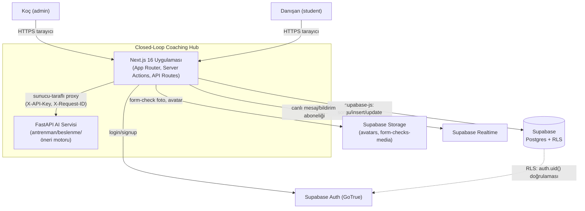
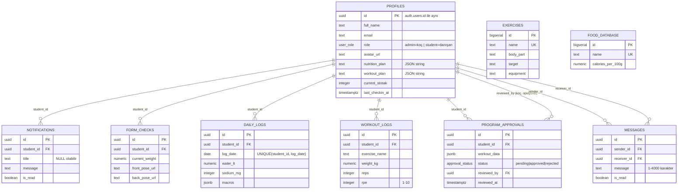

# Mimari

Bu doküman "Closed-Loop Coaching Hub" platformunun sistem bağlamını, veri modelini, kimlik doğrulama/yetkilendirme akışını, istemci veri katmanını, AI proxy tasarımını ve önemli mimari kararları (ADR-lite) belgeler. Genel bakış ve hızlı başlangıç için [`../README.md`](../README.md) dosyasına bakın.

## İçindekiler

1. [Sistem Bağlamı](#1-sistem-bağlamı)
2. [Veri Modeli](#2-veri-modeli)
3. [Kimlik Doğrulama ve Yetkilendirme](#3-kimlik-doğrulama-ve-yetkilendirme)
4. [İstemci Veri Katmanı](#4-i̇stemci-veri-katmanı)
5. [AI Proxy Tasarımı](#5-ai-proxy-tasarımı)
6. [Plan Verilerinin JSON String Olarak Saklanması](#6-plan-verilerinin-json-string-olarak-saklanması)
7. [Karar Kayıtları (ADR-lite)](#7-karar-kayıtları-adr-lite)

---

## 1. Sistem Bağlamı

Sistemin dışına açılan tek yüzey Next.js'tir. FastAPI, Supabase servisleri (Auth/Storage/Realtime dahil) hiçbir zaman doğrudan tarayıcıdan erişilmez; ya `supabase-js` istemci SDK'sı (RLS ile korunan, anon key + kullanıcı JWT'si taşıyan) ya da Next.js sunucu tarafı (server action / API route) üzerinden geçilir.

---

## 2. Veri Modeli

9 tablo, tamamı `profiles`'a `student_id`/`sender_id`/`receiver_id` üzerinden 1-N ilişkilidir (`messages` kendi üzerine iki kez referans verir — gönderen ve alıcı). `exercises` ve `food_database` bağımsız, salt-okunur referans kataloglarıdır.

Enum'lar: `user_role ('admin' | 'student')`, `approval_status ('pending' | 'approved' | 'rejected')`. Şemanın tam DDL'i için `supabase/migrations/20260816090000_initial_schema.sql`; RLS matrisi ve storage politikaları için [`../supabase/README.md`](../supabase/README.md).

---

## 3. Kimlik Doğrulama ve Yetkilendirme

**Akış:** Supabase Auth (GoTrue) → oturum JWT'si (tarayıcıda `supabase-js` tarafından çerezde/localStorage'da tutulur) → her Postgres isteğinde JWT `auth.uid()` olarak Postgres oturumuna enjekte edilir → RLS politikaları `auth.uid()`'i satır sahipliğiyle (`student_id = auth.uid()`) veya `is_admin()` çağrısıyla karşılaştırır.

**Neden `is_admin()` / `profile_role()` `SECURITY DEFINER`'dır (özyineleme koruması):**
`profiles` tablosunun kendi RLS politikaları "bu satırın sahibi misin ya da koç musun" sorusunu cevaplamak için `profiles` tablosuna bakmak zorunda (rol bilgisi orada). Eğer bu kontrolü yapan fonksiyon `SECURITY INVOKER` (varsayılan) olsaydı, fonksiyon içindeki `select ... from public.profiles` sorgusu **yine `profiles` üzerindeki aynı RLS politikasını tetikler** — bu da o politikanın tekrar fonksiyonu çağırmasına, o da tekrar politikayı tetiklemesine yol açar ve Postgres `infinite recursion detected in policy for relation "profiles"` hatasıyla patlar. `SECURITY DEFINER` fonksiyonu, fonksiyonu tanımlayan rolün (genelde tablo sahibi) yetkisiyle çalıştırır ve bu çağrı RLS'i tetiklemez; böylece politika kendi içinde döngüye girmeden "çağıran koç mu?" sorusuna güvenle cevap verebilir. Aynı gerekçeyle `profile_role()` de `profiles` UPDATE politikasının `WITH CHECK` ifadesinde (rol yükseltmesini engellemek için) `SECURITY DEFINER` olarak tanımlanmıştır.

Her iki fonksiyon da `stable`'dır (tek sorgu içinde tekrar hesaplanmaz), `search_path`'i `public, pg_temp` ile sabitlenmiştir (arama yolu enjeksiyonuna karşı) ve yürütme izni yalnızca `authenticated` ve `service_role`'e verilmiştir (`revoke all ... from public` sonrası).

**Yetki yükseltme koruması:** `profiles` UPDATE politikasının `WITH CHECK` ifadesi `role = public.profile_role(auth.uid())` kontrolü yapar — bir danışan kendi profilini güncelleyebilir ama rolünü `admin`'e çeviremez; yalnızca koç rol değiştirebilir.

**Sunucu tarafı ayrıcalıklı erişim (kaldırıldı, Faz 2'de geri gelecek):** `SUPABASE_SERVICE_ROLE_KEY` RLS'yi tamamen bypass eder. Bunu kullanan `src/lib/supabase/admin.ts` istemcisi ve onu tüketen tek yer olan dört server action (`src/app/actions.ts`: `createStudentAction`, `deleteStudentAction`, `sendNotificationAction`, `submitFormCheckAction`) hiçbir yerden çağrılmadığı tespit edildiği için kaldırıldı (bkz. `docs/DISCOVERY.md` §2.5, §15.2 #3) — mevcut UI aynı işleri `src/hooks/*` üzerinden anon key + kullanıcı JWT'siyle, RLS altında yapıyor. Uygulama kodunda şu an service_role kullanan hiçbir yer yok. Koçun yeni danışan hesabı oluşturması Faz 2'de koç-danışan akışıyla birlikte yeniden kurulacak; o akış geldiğinde **çağıranın gerçekten koç olduğunu** kendisi de doğrulamalıdır (service_role RLS'i atladığı için, yetki kontrolü uygulama kodunun sorumluluğuna geçer).

---

## 4. İstemci Veri Katmanı

**Query key şeması** (`src/lib/query/keys.ts`): tüm anahtarlar `queryKeys` fabrikasından üretilir, elle dizi yazılmaz. Kök anahtarlar (`queryKeyRoots`) prefix-invalidation için ayrı tutulur (`invalidateQueries({ queryKey: queryKeyRoots.profile })` gibi). Kullanıcıya özel anahtarlar `(entity, userId, opts?)` biçimindedir; `messages` anahtarı yön bağımsızdır — `(a, b)` ve `(b, a)` sıralanarak aynı anahtara indirgenir, böylece iki taraf da aynı cache girdisini paylaşır.

**Önbellek yapılandırması** (`src/lib/query/queryClient.ts`): `staleTime: 60s`, `gcTime: 5dk`, `refetchOnWindowFocus: false`. Yeniden deneme stratejisi `ApiError` durumuna göre dallanır: 4xx istemci hataları **tekrar denenmez** (yeniden denemenin anlamı yok — girdi zaten geçersiz), diğer hatalar en fazla 2 kez denenir. Mutasyonlar hiç yeniden denenmez (`retry: 0`) — kullanıcı eylemi tekrarı istemsiz side-effect'lere yol açabilir. Sunucuda (RSC/server action) her istek için taze bir `QueryClient` üretilir (`makeQueryClient()`); tarayıcıda tek bir örnek modül seviyesinde önbelleklenir (`browserQueryClient`) — bu, sunucu isteklerinin birbirinin cache'ini kirletmemesini garanti eder.

**Optimistic update kullanılan yerler:** bildirim okundu işaretleme (`is_read`) ve mesaj gönderme gibi düşük riskli, hızlı geri bildirim gerektiren mutasyonlarda iyimser güncelleme uygulanır; başarısızlık durumunda `onError` ile önceki cache anlık görüntüsüne geri dönülür. Program onay/ret gibi yüksek etkili işlemler iyimser güncellenmez — sunucu yanıtı beklenip cache o yanıtla senkronlanır.

**Realtime ile cache birleşimi:** `messages`, `notifications` ve `program_approvals` tabloları için Supabase Realtime aboneliği açılır; gelen `postgres_changes` event'i doğrudan DOM'a yazılmaz, bunun yerine ilgili `queryKeys.*` için `queryClient.invalidateQueries(...)` (veya düşük hacimli akışlarda `setQueryData` ile doğrudan patch) tetiklenir. Böylece tek bir doğruluk kaynağı (TanStack Query cache'i) korunur ve Realtime yalnızca "ne zaman yeniden çekilsin" sinyali verir.

---

## 5. AI Proxy Tasarımı

Tarayıcı, FastAPI'ye **hiçbir zaman doğrudan** istek atmaz; her zaman `src/app/api/ai/{workout,nutrition,recommendations}/route.ts` üzerinden geçer. Nedenleri:

- **API anahtarı sızıntısı:** FastAPI, ayarlıysa `X-API-Key` header'ı bekler (`API_KEY` ortam değişkeni). Bu anahtar tarayıcıya asla gönderilmez; yalnızca sunucu-sunucu isteğinde (`src/lib/api/proxy.ts` → `handleAiProxy`) eklenir.
- **CORS:** FastAPI CORS allowlist'i yalnızca Next.js'in origin'ini (`CORS_ORIGINS`) tanır; tarayıcının doğrudan farklı bir origin'deki (`localhost:8000` vb.) servise istek atması zaten CORS tarafından engellenir. Tek origin olan Next.js üzerinden geçmek bu sınırı basitleştirir.
- **Rate limit tekilleştirme:** İstekler hem Next.js `proxy.ts` (IP+yol bazlı, AI uçları için 20/dk) hem FastAPI `slowapi` (`RATE_LIMIT`, `/analyze/*` ve `/recommendations` için 20/dk) katmanında sınırlanır — çift katman, tek bir servisin atlanmasıyla sınırın delinmesini engeller.
- **Denetlenebilirlik:** Next.js proxy katmanı, her isteğe girişte `crypto.randomUUID()` ile bir `requestId` üretir, bunu hem kendi pino loguna hem FastAPI'ye giden `X-Request-ID` header'ına yazar; FastAPI de aynı kimlikle structlog'a loglar. Bu sayede tek bir isteğin uçtan uca (tarayıcı → Next.js → FastAPI) izi tek bir kimlikle sürülebilir.

**Hata eşlemesi** (`src/lib/api/proxy.ts` → `handleAiProxy`):

| Durum                       | HTTP kodu | `code`                   | Ne zaman                                                                                                 |
| --------------------------- | --------- | ------------------------ | -------------------------------------------------------------------------------------------------------- |
| Gövde JSON değil            | 400       | `INVALID_JSON`           | `request.json()` parse hatası                                                                            |
| zod doğrulama başarısız     | 422       | `VALIDATION_ERROR`       | İstek gövdesi şemaya uymuyor                                                                             |
| FastAPI'ye ulaşılamadı      | 503       | `AI_BACKEND_UNAVAILABLE` | `fetch` ağ hatası / zaman aşımı (30s)                                                                    |
| FastAPI 2xx dışı döndü      | 502       | `AI_BACKEND_ERROR`       | Upstream hata — **gövdesi istemciye asla iletilmez**, yalnızca sunucu loguna yazılır (ilk 2000 karakter) |
| FastAPI geçersiz JSON döndü | 502       | `AI_BACKEND_ERROR`       | Upstream yanıtı parse edilemedi                                                                          |

Bu tasarımda 502/503 ayrımı kasıtlıdır: 503 "servise hiç ulaşılamadı" (network/timeout), 502 "servise ulaşıldı ama o hata döndürdü" anlamına gelir — istemci tarafında farklı kullanıcı mesajları ve farklı yeniden deneme stratejileri (TanStack Query `retry`) için ayırt edilebilir olması gerekir.

İstemci tarafında `src/lib/api/client.ts` (`apiFetch`) tüm başarısız yanıtları tek tip `ApiError` (status, code, message, details, requestId) olarak fırlatır; UI katmanı yalnızca bu tek tipe karşı kod yazar.

---

## 6. Plan Verilerinin JSON String Olarak Saklanması

`profiles.nutrition_plan` ve `profiles.workout_plan` sütunları `text` tipindedir ve uygulama tarafından `JSON.stringify`/`JSON.parse` ile serileştirilip okunur (`jsonb` **değil**, düz metin).

**Artıları:**

- Basit: tek sütun, tek okuma/yazma, ek join gerektirmez.
- Şema esnekliği: plan yapısı (günlere göre egzersiz/öğün listesi) FastAPI tarafında değişse bile migration gerekmez.
- Mevcut veriyle geriye uyumluluk: alan zaten bu biçimde var, değiştirmek geriye dönük veri taşıma riski taşır.

**Eksileri:**

- Postgres tarafında sorgulanamaz (ör. "kaç danışanın planında squat var" gibi bir sorgu `jsonb` operatörleriyle mümkünken `text` üzerinde mümkün değil).
- Şema doğrulaması yok — bozuk/eksik JSON sessizce yazılabilir, yalnızca okuma anında `JSON.parse` hatası olarak ortaya çıkar.
- İndekslenemez; plan içeriğine göre filtreleme/arama Postgres düzeyinde yapılamaz.
- Geçmiş planların versiyonlanması/denetim izi (audit trail) yok — üzerine yazıldığında önceki plan kaybolur.

**İleriye dönük öneri:** Sütunu `jsonb`'ye çevirmek (basit `alter column ... type jsonb using nutrition_plan::jsonb` migration'ı, `NULL`/bozuk kayıtlar için önce temizlik gerekir) en düşük maliyetli iyileştirmedir ve `jsonb` operatörleriyle sorgulanabilirlik kazandırır. Daha büyük bir adım olarak, planları ayrı bir `plan_versions` tablosuna (student_id, plan_type, payload jsonb, created_by, created_at) taşımak; hem versiyon geçmişi hem de `program_approvals` ile daha temiz bir ilişki sağlar. Bu değişiklik şu an **yapılmamıştır** — mevcut durum kasıtlı bir kısayoldur, ileride ele alınmak üzere not düşülmüştür.

---

## 7. Karar Kayıtları (ADR-lite)

### ADR-1: TypeScript strict moduna geçiş

**Durum:** Kabul edildi (devam eden migrasyon).
**Bağlam:** Proje düz JavaScript (`.js`) olarak başladı; `src/` altı paralel olarak `.ts`/`.tsx`'e taşınıyor.
**Karar:** `tsconfig.json`'da `strict: true`, `noUncheckedIndexedAccess`, `noImplicitOverride`, `noUnusedLocals/Parameters` açık; `allowJs: false`.
**Sonuç:** Derleme zamanında yakalanan hata sınıfı genişler (özellikle `undefined`/`null` erişimleri); geçiş dönemi boyunca `.js` ve `.ts` dosyaları bir arada bulunur, `db:types` gibi araçlar (`src/types/database.ts`) bu geçişi kolaylaştırır.

### ADR-2: Sunucu state yönetimi için TanStack Query seçimi

**Durum:** Kabul edildi.
**Bağlam:** Supabase verisi + Realtime + AI proxy sonuçları için tutarlı bir istemci-taraflı cache/senkronizasyon katmanı gerekiyordu.
**Karar:** Redux/SWR yerine TanStack Query; merkezi `queryKeys` fabrikası, tip güvenli `staleTime`/`retry` politikaları ve Realtime event'lerinin `invalidateQueries` ile köprülenmesi.
**Sonuç:** Veri çekme mantığı bileşenlerden hook'lara (`src/hooks/`) taşındı; manuel `useState`/`useEffect` tabanlı veri çekimi ortadan kalktı.

### ADR-3: Veritabanı rol enum değerlerinin (`admin`/`student`) korunması

**Durum:** Kabul edildi.
**Bağlam:** Ürün dilinde roller "koç" ve "danışan" olarak anılıyor; ancak veritabanı ve mevcut satırlar `admin`/`student` enum değerlerini kullanıyor.
**Karar:** Enum değerlerini yeniden adlandırmak yerine (bu, `ALTER TYPE ... RENAME VALUE` + tüm bağımlı politika/fonksiyonların gözden geçirilmesini gerektirirdi ve geriye dönük veri riski taşırdı) yalnızca UI/dokümantasyon seviyesinde bir terim eşlemesi yapıldı.
**Sonuç:** RLS politikaları, RPC imzaları (`is_admin`, `profile_role`) ve mevcut satırlar değişmeden kalır; "koç = admin, danışan = student" eşlemesi kod tabanı genelinde (bu doküman dahil) açıkça belirtilir.

### ADR-4: AI servisine erişimin Next.js proxy'si üzerinden zorunlu kılınması

**Durum:** Kabul edildi.
**Bağlam:** FastAPI servisinin bağımsız, ölçeklenebilir bir servis olarak konuşlanması gerekiyordu ama tarayıcıdan doğrudan erişim güvenlik ve gözlemlenebilirlik riskleri taşıyordu.
**Karar:** `src/app/api/ai/*` route'ları tek giriş noktası; detaylar için bkz. [Bölüm 5](#5-ai-proxy-tasarımı).
**Sonuç:** FastAPI'nin `CORS_ORIGINS`'i tek bir origin'e (Next.js) kilitlenebildi; `API_KEY` tarayıcıya hiç gitmiyor; tüm istekler `X-Request-ID` ile izlenebiliyor.

### ADR-5: Bellek içi rate limiter'ın sınırı

**Durum:** Kabul edildi (bilinen kısıtla).
**Bağlam:** `src/lib/rate-limit.ts` ve FastAPI `slowapi`'nin varsayılan `MemoryStorage`'ı, sayaçları process belleğinde tutar.
**Karar:** Tek-instance dağıtımlar (mevcut hedef: Vercel'de tek Next.js fonksiyonu havuzu, Railway/Fly.io'da tek FastAPI instance'ı) için bellek içi sayaç yeterli ve ek altyapı (Redis) gerektirmiyor.
**Sonuç / bilinen kısıt:** **Çoklu instance'a (yatay ölçekleme, birden fazla FastAPI/Next.js süreci) geçildiğinde bu limiter işe yaramaz hale gelir** — her instance kendi sayacını tutar, gerçek toplam istek sayısı `N × limit`'e kadar çıkabilir. Yatay ölçekleme gündeme geldiğinde paylaşılan bir sayaç deposu (Redis, Upstash) zorunludur; bu, mevcut kod tabanında **yapılmamıştır**.

### ADR-6: `next-pwa`'nın korunması

**Durum:** Kabul edildi.
**Bağlam:** Danışanların antrenman sırasında (spor salonunda, zayıf bağlantıda) `workout_logs`/`profiles` verisine erişebilmesi gerekiyor.
**Karar:** `next-pwa` service worker'ı korunur; yalnızca `workout_logs` ve `profiles` REST çağrıları `NetworkFirst` ile 1 hafta önbelleklenir, Storage nesneleri (form-check fotoğrafları) kasıtlı olarak **hiç önbelleklenmez** (`NetworkOnly`) — cihaz hafızasını ve kullanıcı fotoğraflarının çevrimdışı sızma riskini sınırlamak için.
**Sonuç:** `next.config.mjs` `withPWA(...)` sarmalayıcısı üretimde aktif, geliştirmede (`NODE_ENV === 'development'`) devre dışı; App Router hydration script'i nedeniyle CSP `script-src` içinde `'unsafe-inline'` gereksinimi doğdu (nonce tabanlı CSP'ye geçiş ayrı bir iyileştirme olarak `next.config.mjs` içinde TODO ile işaretli).
