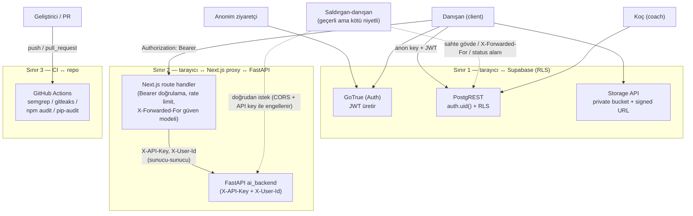

# Tehdit Modeli (STRIDE)

**Faz:** 1.5 — Güvenlik Denetimi ve Sertleştirme, Grup 6 (Dokümantasyon)
**Kapsam:** "Closed-Loop Coaching Hub" — Next.js 16 uygulaması, FastAPI `ai_backend` servisi,
Supabase (Postgres + RLS, Auth, Storage), CI (GitHub Actions).
**Tarih:** 2026-08-17
**Yöntem:** STRIDE kategorileri, her biri bu projenin gerçek güven sınırlarına ve
`docs/security/AUDIT.md` §2'deki birleşik bulgu tablosuna bağlanarak. Bu belge yeni bir denetim
**değildir** — mevcut denetimin (AC-xx, A-xx, T-xx) sonuçlarını tehdit modelleme çerçevesine
oturtur ve her tehdit için somut kanıt (dosya/migration/test adı) verir.

Genel/şablon STRIDE metni yazılmamıştır; her satır bu repodaki bir dosyaya, migration'a veya
bulguya bağlıdır. Bulgu ID'lerinin güncel durumu (`fixed` / `open`) için tek doğruluk kaynağı
`docs/security/AUDIT.md` §2'dir — bu belge o tabloyu kopyalamaz, referans verir.

---

## 1. Aktörler

| Aktör                  | Tanım                                                                                                                                                                                                                                                                                                                                                                                                                                                                                                 |
| ---------------------- | ----------------------------------------------------------------------------------------------------------------------------------------------------------------------------------------------------------------------------------------------------------------------------------------------------------------------------------------------------------------------------------------------------------------------------------------------------------------------------------------------------- |
| **Anonim ziyaretçi**   | Kimlik doğrulamasız istemci. `anon` rolünden `public` şemasındaki tüm tablo/fonksiyon yetkileri `revoke` edilmiştir (`supabase/migrations/20260816090200_rls_policies.sql`); tek verilen yetki `grant usage on schema public to anon` — bu yalnızca şema görünürlüğüdür, satır erişimi vermez. `[auth].enable_signup = false` (`supabase/config.toml`) nedeniyle kendi kendine kayıt da kapalıdır.                                                                                                    |
| **Danışan (`client`)** | Kimliği doğrulanmış, meşru bir kullanıcı. Kendi `client_id = auth.uid()` satırlarına RLS altında erişir; koç profilini görebilir (ADR-0010); kendi beslenme/antrenman planını doğrudan yazabilir (ADR-0014, planlı sapma).                                                                                                                                                                                                                                                                            |
| **Koç (`coach`)**      | Platformdaki **tek** koç (ADR-0007 — tek koçluk modeli, `coach_id` eşleştirmesi yok). `is_coach()` (`SECURITY DEFINER`) ile RLS'te ayrıcalıklı; tüm danışanların verisine erişir.                                                                                                                                                                                                                                                                                                                     |
| **Saldırgan-danışan**  | Geçerli bir `client` JWT'sine sahip ama kötü niyetli aktör — bu belgedeki tehditlerin **çoğunun** kaynağı budur. `docs/security/findings-access-control.md`'deki canlı SQL testleri (`set local role authenticated` + `set local request.jwt.claims`) tam olarak bu aktörü simüle eder.                                                                                                                                                                                                               |
| **`service_role`**     | RLS'i tamamen bypass eder (`rolbypassrls = t`). **Uygulama çalışma zamanında hiç kullanılmıyor** — onu kullanan `src/lib/supabase/admin.ts` ve dört server action hiçbir yerden çağrılmadığı için kaldırıldı (`docs/ARCHITECTURE.md` §3, `docs/DISCOVERY.md` §2.5/§15.2). Faz 2'de koç-danışan hesap oluşturma akışıyla geri gelmesi planlı; o noktada "çağıranın gerçekten koç olduğu" kontrolü RLS'ten uygulama koduna taşınacak — bu belgenin kapsamındaki bir **gelecek** risk, bugün için değil. |

---

## 2. Varlıklar

| Varlık                                   | Nerede                                                                                | Hassasiyet                                        |
| ---------------------------------------- | ------------------------------------------------------------------------------------- | ------------------------------------------------- |
| Danışan sağlık/ölçüm verisi              | `daily_logs` (su, sodyum, makrolar), `form_checks.current_weight`, `workout_logs`     | Yüksek — sağlık verisi                            |
| Vücut fotoğrafları                       | `form-checks-media` bucket (private), `form_checks.front_pose_path`/`back_pose_path`  | Yüksek — mahrem, kişisel görüntü                  |
| Beslenme/antrenman planları              | `nutrition_plans`/`nutrition_plan_meals`, `workout_plans`/`workout_plan_exercises`    | Orta — kişisel program verisi                     |
| Mesajlar                                 | `messages` (`sender_id`/`receiver_id`, 1-4000 karakter)                               | Orta — özel yazışma                               |
| Oturum token'ları (access + refresh)     | Tarayıcı `localStorage` (`sb-*-auth-token`, A-05)                                     | Yüksek — ele geçirilirse tam hesap devri          |
| `profiles` PII (email, ad soyad)         | `profiles` tablosu; koç satırı **tüm** authenticated kullanıcılara görünür (ADR-0010) | Orta                                              |
| `program_approvals` onay kaydı           | `program_approvals` (denetim izi niteliğinde: kim, ne zaman onayladı)                 | Orta — bütünlüğü bozulursa denetim izi güvenilmez |
| `AI_BACKEND_API_KEY` / FastAPI `API_KEY` | Yalnızca sunucu ortam değişkeni; tarayıcıya asla gönderilmez (`src/lib/api/proxy.ts`) | Yüksek — sızarsa AI backend'e doğrudan erişim     |
| Avatar görselleri                        | `avatars` bucket (private, `20260817100000_private_storage.sql`)                      | Düşük-Orta                                        |

---

## 3. Güven sınırları

| Sınır                                      | Uygulayan mekanizma                                                                                                                                                                                                                                   | Kanıt                                                                                                         |
| ------------------------------------------ | ----------------------------------------------------------------------------------------------------------------------------------------------------------------------------------------------------------------------------------------------------- | ------------------------------------------------------------------------------------------------------------- |
| **1 — Tarayıcı ↔ Supabase**                | RLS (satır seviyesi), sütun-guard trigger'ları (satır seviyesi RLS'in kapsamadığı sütun sözleşmeleri için), `SECURITY DEFINER` fonksiyonlarda sabit `search_path`, Storage private bucket + `createSignedUrl` TTL ≤ 1 saat                            | `supabase/migrations/*`, `docs/ARCHITECTURE.md` §2.1/§3                                                       |
| **2 — Tarayıcı ↔ Next.js proxy ↔ FastAPI** | Tarayıcı FastAPI'ye **hiçbir zaman doğrudan** erişemez (ADR-0004); proxy Bearer token'ı `auth.getUser()` ile canlı doğrular, sonra `X-API-Key` + doğrulanmış `X-User-Id` ile upstream'e geçer; FastAPI CORS allowlist yalnızca Next.js origin'i tanır | `src/lib/api/proxy.ts`, `ai_backend/app/core/security.py`, `ai_backend/app/core/rate_limit.py`, ADR-0004/0011 |
| **3 — CI ↔ repo**                          | Her push/PR'da statik tarama (semgrep), her PR'da secret taraması (gitleaks, yeni commit'ler) + haftalık tam geçmiş taraması, bağımlılık zafiyeti taraması (npm audit, pip-audit)                                                                     | `.github/workflows/ci.yml` `security` job'u (bu Faz 1.5 Grup 6 turunda eklendi, T-05'i kapatır)               |

---

## 4. STRIDE analizi

Her kategori: **somut tehdit** (bu projede) → **mevcut kontrol** → **kanıt** → **kalan risk**
(varsa, `AUDIT.md` bulgu ID'siyle).

### 4.1 Spoofing (Kimlik Sahtekârlığı)

| #   | Tehdit                                                                                                           | Kontrol                                                                                                                                                              | Kanıt                                                                 | Kalan risk                                                                                                                                                                                              |
| --- | ---------------------------------------------------------------------------------------------------------------- | -------------------------------------------------------------------------------------------------------------------------------------------------------------------- | --------------------------------------------------------------------- | ------------------------------------------------------------------------------------------------------------------------------------------------------------------------------------------------------- |
| S1  | Saldırgan çalınmış/sahte JWT ile başka bir kullanıcı gibi Postgres/Storage'a istek atar                          | Her istekte GoTrue JWT'si `auth.uid()` olarak Postgres oturumuna enjekte edilir; RLS `client_id = auth.uid()` / `is_coach()` karşılaştırması yapar                   | `docs/ARCHITECTURE.md` §3                                             | A-05 — token `localStorage`'da, XSS ile çalınabilir (bkz. Tampering S/T ile kesişim, A-14 CSP zayıflığı büyütür)                                                                                        |
| S2  | Saldırgan AI backend'e sahte `X-User-Id` göndererek başka kullanıcının rate-limit kotasını/kimliğini taklit eder | `X-User-Id`'ye yalnızca istek geçerli `X-API-Key` taşıyorsa güvenilir (`secrets.compare_digest`); anahtar yalnızca sunucuda bulunur, tarayıcı asla göremez           | `ai_backend/app/core/rate_limit.py` (`_rate_limit_key`)               | Yok — A-09 turu bu tam senaryoyu kapattı                                                                                                                                                                |
| S3  | Saldırgan sahte `X-Forwarded-For` ile hız sınırlayıcıyı farklı bir "istemci" gibi göstererek atlatır             | `TRUSTED_PROXY_COUNT` tabanlı güven modeli — varsayılan 0, hiçbir XFF başlığına güvenilmez; N>0 ise yalnızca sondan N'inci (istemcinin değiştiremeyeceği) hop okunur | `src/lib/api/client-ip.ts`                                            | Yok — A-02 kapatıldı; kanıt: 25 sahte XFF ile eski davranış 25/25 kabul, yeni davranış paylaşılan kovada sınırlı                                                                                        |
| S4  | Saldırgan `POST /auth/v1/signup` gövdesinde `role: "coach"` gönderip koç olarak kaydolur                         | `handle_new_user()` artık `raw_user_meta_data.role` okumuyor, rol her zaman `'client'`                                                                               | `supabase/migrations/20260817160100_signup_role_hardening.sql`        | AC-02 kod tarafı kapalı; ama bugünkü **tek gerçek engel** hâlâ `[auth].enable_signup = false` — hosted projede doğrulanmadı (AC-12, açık)                                                               |
| S5  | Saldırgan bilinen bir danışan e-postasına karşı sınırsız şifre denemesi yapar (credential stuffing)              | Uygulama katmanı, e-posta bazlı kova: 10 başarısız deneme / 15 dk, `429` + `Retry-After`                                                                             | `src/lib/api/auth-rate-limit.ts`, `src/app/api/auth/sign-in/route.ts` | A-01 kısmen açık — `supabase/config.toml`'daki `[auth.rate_limit]` upstream hatası nedeniyle (supabase/supabase#41947) fiilen koruma sağlamıyor; kabul edilen artık risk: hedefli 15 dk hesap kilitleme |

### 4.2 Tampering (Veri Bütünlüğü Bozma)

| #   | Tehdit                                                                                                                      | Kontrol                                                                                                                                                              | Kanıt                                                           | Kalan risk                                                                                                                                                                                  |
| --- | --------------------------------------------------------------------------------------------------------------------------- | -------------------------------------------------------------------------------------------------------------------------------------------------------------------- | --------------------------------------------------------------- | ------------------------------------------------------------------------------------------------------------------------------------------------------------------------------------------- |
| T1  | Danışan `program_approvals` satırını `status='approved'` + sahte `reviewed_by` ile INSERT eder ("koç onayladı" sahteciliği) | BEFORE INSERT/UPDATE trigger: INSERT her zaman `status='pending'` üretir, `status` yalnızca `is_coach()` değiştirebilir, `reviewed_by`/`reviewed_at` sunucuda ezilir | `supabase/migrations/20260817160000_program_approval_guard.sql` | Yok — AC-01/AC-07 kapatıldı; kırmızı-yeşil kanıt: trigger düşürülünce sahtecilik tekrar mümkün oldu (`AUDIT.md` §4b)                                                                        |
| T2  | Mesaj alıcısı mesaj gövdesini/`kind`/`created_at`'ı değiştirir, gönderen fark edemez                                        | `messages_guard_columns()`: UPDATE'te yalnızca `read_at`/`is_read` değişebilir; INSERT'te `kind='system'` reddedilir                                                 | `supabase/migrations/20260817160200_column_guards.sql`          | Yok — AC-04 kapatıldı                                                                                                                                                                       |
| T3  | Danışan koçun bildirim akışına kimlik avı/keyfi içerik enjekte eder                                                         | `notifications_guard_content()`: danışan→koç yolunda `title`/`message` sabit şablona zorunlu                                                                         | `20260817160200_column_guards.sql`                              | AC-05 kapalı ama **bilinen borç**: şablon metni hem trigger'da hem `src/hooks/useProgramApprovals.ts`'te — ikisi ayrışırsa gönderim gürültülü (`42501`) kırılır, RLS test paketiyle kilitli |
| T4  | Danışan kendi `current_streak`/`last_checkin_at`/`email` sütununu doğrudan UPDATE ile sahteler                              | `public.is_end_user_write()` (kasıtlı `SECURITY INVOKER`) ile bu sütunlar sunucu-sahipli; bir GUC bayrağına dayanmaz (taklit edilebilir olurdu)                      | `20260817160200_column_guards.sql`                              | Yok — AC-08/AC-09 kapatıldı                                                                                                                                                                 |
| T5  | `authenticated` rolü `TRUNCATE` ile RLS'i tamamen atlayıp tabloyu boşaltır                                                  | Yok — bugün `authenticated` rolüne `TRUNCATE` yetkisi verilmiş durumda                                                                                               | `findings-access-control.md` §3.3 (`role_table_grants` dökümü)  | **AC-03 — open.** RLS'e tabi olmayan toplu silme primitifi; bugün uygulama yüzeyinden erişilebilir bir yol tespit edilmedi ama savunma derinliği eksik                                      |
| T6  | Danışan koçun verdiği beslenme/antrenman planını değiştirir, koç fark edemez                                                | Yok — bu **kasıtlı bir tasarım kararı** (bkz. §5 Bilinçli kabul edilen riskler, ADR-0014)                                                                            | ADR-0014                                                        | Kabul edilen risk — denetim izi yok, `updated_at` dışında "kim değiştirdi" bilgisi tutulmuyor                                                                                               |
| T7  | `postgres`/`service_role` sahipliğindeki `BYPASSRLS` bir bağlantı ele geçirilirse tüm RLS anlamsızlaşır                     | `FORCE ROW LEVEL SECURITY` hiçbir tabloda açık değil — bugün etkisiz (sahip zaten `BYPASSRLS`) ama gelecekte sahiplik değişirse ek bir katman olurdu                 | `findings-access-control.md` §3.6                               | **AC-06 — open (Low).** Savunma derinliği eksikliği, bugün sömürülebilir bir yol yok                                                                                                        |

### 4.3 Repudiation (İnkâr)

| #   | Tehdit                                                                                                                             | Kontrol                                                                                                                                  | Kanıt                                             | Kalan risk                                                                   |
| --- | ---------------------------------------------------------------------------------------------------------------------------------- | ---------------------------------------------------------------------------------------------------------------------------------------- | ------------------------------------------------- | ---------------------------------------------------------------------------- |
| R1  | Koç "bu programı ben onaylamadım" der ama `reviewed_by` istemciden sahte bir uuid'le sızmış olabilir                               | `program_approvals` trigger'ı `reviewed_by := auth.uid()`, `reviewed_at := now()` sunucuda yazar, istemci değeri yok sayılır             | `20260817160000_program_approval_guard.sql`       | Yok — AC-07 kapatıldı                                                        |
| R2  | Bir isteğin uçtan uca (tarayıcı→Next.js→FastAPI) izi sürülemez, olay sonrası inceleme yapılamaz                                    | Her AI proxy isteğinde `crypto.randomUUID()` ile `requestId` üretilir; hem pino hem `structlog`'a aynı kimlikle yazılır (`X-Request-ID`) | `src/lib/api/proxy.ts`, `docs/ARCHITECTURE.md` §5 | Yalnızca AI proxy yolu için — genel `/api/*` trafiğinde aynı disiplin yok    |
| R3  | Brute-force / rate-limit aşımı / RLS reddi gibi güvenlik olayları hiç loglanmadığı için "saldırı hiç olmadı" savunması çürütülemez | Yok — `src/proxy.ts` 429 dönerken hiç log yazmıyor (dosyada `logger` importu yok)                                                        | `findings-app-surface.md` A-10 kanıtı             | **A-10 — open (Medium).** Olay müdahalesi için kritik bir görünürlük boşluğu |

### 4.4 Information Disclosure (Bilgi İfşası)

| #   | Tehdit                                                                                                                             | Kontrol                                                                                                                                                             | Kanıt                                                                                 | Kalan risk                                                                                             |
| --- | ---------------------------------------------------------------------------------------------------------------------------------- | ------------------------------------------------------------------------------------------------------------------------------------------------------------------- | ------------------------------------------------------------------------------------- | ------------------------------------------------------------------------------------------------------ |
| I1  | Kimliği doğrulanmamış biri dosya adı desenini (`<uid>-<uuid>.ext`) tahmin ederek vücut fotoğrafı indirir                           | `avatars`/`form-checks-media` bucket'ları private; `storage.objects` SELECT politikası "sahibi veya koç"; okuma yalnızca `createSignedUrl` (TTL ≤ 1 saat) üzerinden | `supabase/migrations/20260817100000_private_storage.sql`, `docs/ARCHITECTURE.md` §2.1 | Yok — canlı testle doğrulandı (`findings-access-control.md` §6b)                                       |
| I2  | Yüklenen dosyanın gerçek içeriği (magic byte) doğrulanmadığı için depoda aktif içerik (HTML/SVG) barınır                           | Yok — yalnızca `Content-Type` header'ına güveniliyor                                                                                                                | `findings-app-surface.md` A-07 kanıtı (HTML gövdesi `image/jpeg` etiketiyle 200)      | **A-07 — open (Medium).** Bugün stored XSS'e dönüşmüyor (MIME allowlist sıkı) ama tek katmanlı savunma |
| I3  | XSS durumunda saldırgan CSP'nin `connect-src https://*.supabase.co` wildcard'ını kullanarak kendi Supabase projesine veri sızdırır | Yok — wildcard bilinçli değil, dar bir gereklilik farkındalığı eksik                                                                                                | `next.config.mjs` CSP tanımı, `findings-app-surface.md` A-15                          | **A-15 — open (Low).** A-05 (localStorage token) ile birleşince etkisi büyür                           |
| I4  | `script-src 'unsafe-inline'` nedeniyle CSP'nin XSS'e karşı asıl değeri düşük                                                       | Next.js App Router hydration script'i inline çalıştığı için bugün `'unsafe-inline'` gerekli; nonce tabanlı geçiş yapılmadı                                          | `next.config.mjs` (TODO yorumu), `findings-app-surface.md` A-14                       | **A-14 — open (Low).** A-05/A-15 ile birlikte değerlendirilmeli                                        |
| I5  | Logger'a düşen bir profil/health nesnesi e-posta, kilo, makro, plan içeriğini düz metin sızdırır                                   | `src/lib/logger.ts` redact listesi yalnızca `password`/`token`/`apiKey`/`authorization` kapsıyor                                                                    | `findings-app-surface.md` A-11 kanıtı                                                 | **A-11 — open (Medium).** PII/sağlık verisi alanları redact listesinde yok                             |
| I6  | Sunucu ortam değişkeni **adları** (`SUPABASE_SERVICE_ROLE_KEY`, `AI_BACKEND_API_KEY`) client bundle'ında görünür                   | Değerler sızmıyor, yalnızca isimler görünür                                                                                                                         | `findings-access-control.md` AC-11 kanıtı                                             | **AC-11 — open (Low).** `serverSchema` henüz `import 'server-only'` ile ayrı modüle taşınmadı          |
| I7  | Koçun e-postası tüm authenticated kullanıcılara (tüm danışanlara) görünür                                                          | Kasıtlı — tek koçlu modelin bilinen bedeli                                                                                                                          | ADR-0010                                                                              | Kabul edilen risk (bkz. §5)                                                                            |
| I8  | Upstream/FastAPI hata mesajı ("Python AI sunucusuna ulaşılamadı...") teknoloji parmak izi verir                                    | Yok — mesaj doğrudan istemciye dönüyor                                                                                                                              | `findings-app-surface.md` A-16 kanıtı                                                 | **A-16 — open (Low).**                                                                                 |

### 4.5 Denial of Service

| #   | Tehdit                                                                                                      | Kontrol                                                                                                                                | Kanıt                                                                         | Kalan risk                                                                                       |
| --- | ----------------------------------------------------------------------------------------------------------- | -------------------------------------------------------------------------------------------------------------------------------------- | ----------------------------------------------------------------------------- | ------------------------------------------------------------------------------------------------ |
| D1  | Tek bir saldırgan AI backend'in 20/dk kotasını doldurup **tüm** kullanıcılar için AI'ı kilitler             | Doğrulanmış `X-User-Id` bazlı anahtar (`key_func`); IP'ye yalnızca doğrulama yoksa düşülür                                             | `ai_backend/app/core/rate_limit.py`, `src/lib/api/proxy.ts`                   | Yok — A-09 kapatıldı                                                                             |
| D2  | Saldırgan bilinen bir e-postaya 10 hatalı şifre göndererek o hesabı 15 dk kilitler (targeted lockout)       | Bilinçli — alternatif olan paylaşılan IP kovası tüm kullanıcıları kilitleyeceği için daha kötü bir takas olurdu                        | `src/lib/api/auth-rate-limit.ts` (karar notu)                                 | Kabul edilen artık risk — bkz. §5, A-01                                                          |
| D3  | 10 MB'a kadar büyük istek gövdeleri sessizce işlenir, bellek/CPU tüketilir; sınırsız tekrarla büyütülebilir | Yok — `Content-Length` kontrolü / 413 yanıtı yok                                                                                       | `findings-app-surface.md` A-08 kanıtı (9 MB tam parse, 10 MB'da sessiz kesme) | **A-08 — open (Medium).**                                                                        |
| D4  | Rate limiter tek instance/bellek içi olduğu için çoklu instance dağıtımda limit N katına çıkar              | Kısmen — taşmada `buckets.clear()` yerine LRU tahliyesi (bir saldırganın 10k sahte anahtarla **tüm** sayaçları sıfırlamasını engeller) | `src/lib/rate-limit.ts`, ADR-0005                                             | **A-19 — open (kısmi fix, Low).** Mimari hâlâ tek instance/bellek içi (bilinçli kısıt, ADR-0005) |
| D5  | `/api/health` sınırsız ping ile hafif bir DoS yüzeyi + sürüm parmak izi                                     | Artık hız sınırına tabi (120/dk), sürüm yalnızca kimlikli çağrıda dönüyor                                                              | `src/proxy.ts`                                                                | Yok — A-17 kapatıldı                                                                             |

### 4.6 Elevation of Privilege (Yetki Yükseltme)

| #   | Tehdit                                                                                                    | Kontrol                                                                                                                                     | Kanıt                                                       | Kalan risk                                                                                             |
| --- | --------------------------------------------------------------------------------------------------------- | ------------------------------------------------------------------------------------------------------------------------------------------- | ----------------------------------------------------------- | ------------------------------------------------------------------------------------------------------ |
| E1  | Danışan kendi `profiles` satırını güncelleyip `role: 'coach'` yazar                                       | `profiles` UPDATE politikasının `WITH CHECK`'i `role = public.profile_role(auth.uid())` şartını koyar (`profile_role()` `SECURITY DEFINER`) | `docs/ARCHITECTURE.md` §3                                   | Yok                                                                                                    |
| E2  | Signup açık kalırsa saldırgan `role: "coach"` metadata'sıyla doğrudan koç olarak kaydolur                 | `handle_new_user()` rolü artık sabit `'client'`                                                                                             | `20260817160100_signup_role_hardening.sql`                  | AC-02 kod tarafı kapalı; **gerçek engel hâlâ `enable_signup=false` yapılandırması** — bkz. S4          |
| E3  | Deprecated FastAPI uçları (`legacy_router`) API key guard'ından muaf olduğu için kimliksiz kullanılabilir | `dependencies=[Depends(api_key_guard)]` + `@limiter.limit("20/minute")` eklendi                                                             | `ai_backend/app/routers/workout.py`, `nutrition.py`         | Yok — A-03 kapatıldı; kırmızı-yeşil kanıt: guard kaldırılınca 4 pytest `assert 200 == 401` ile kırıldı |
| E4  | `API_KEY` ayarlanmadan servis production'a alınırsa guard no-op olur, tüm uçlar kimliksiz açılır          | `model_validator`: `ENVIRONMENT=production` iken `API_KEY` yoksa başlangıçta `ValueError`                                                   | `ai_backend/app/core/config.py` (`_enforce_api_key_policy`) | Yok — A-04 kapatıldı (fail-closed)                                                                     |
| E5  | `AI_BACKEND_API_KEY` Next.js tarafında opsiyonel olduğu için proxy sessizce anahtarsız çalışır            | zod `superRefine`: `NODE_ENV === 'production'`'da zorunlu                                                                                   | `src/env.ts`                                                | Yok — A-12 kapatıldı                                                                                   |
| E6  | Koç bir danışanı `coach` yapabilir (koçun kendi yetki genişletmesi)                                       | Bilinçli — koç zaten tüm veriye erişen güvenilir rol, bu bir yetki yükseltmesi sayılmıyor                                                   | `profiles_update_coach` politikası                          | Kabul edilen risk (bkz. §5)                                                                            |

---

## 5. Bulgu değil — bilinçli kabul edilen riskler

Bu bölüm `AUDIT.md` §6'nın (Bulgu değil — bilinçli kararlar) STRIDE'a bağlanmış özetidir; tam
gerekçe ve karar kaydı için oraya bakın. Kopyalanmaz, yalnızca hangi ADR'nin hangi STRIDE
kategorisiyle kesiştiği işaretlenir:

| Karar                                                                        | ADR      | STRIDE kesişimi                                                                                                     |
| ---------------------------------------------------------------------------- | -------- | ------------------------------------------------------------------------------------------------------------------- |
| Tek koçlu model — `coach_id` yok, koç tüm danışanları görür                  | ADR-0007 | Information Disclosure (koç kapsamı geniş, ama tasarım gereği)                                                      |
| Koç profili (e-posta dahil) tüm authenticated kullanıcılara görünür          | ADR-0010 | Information Disclosure (I7)                                                                                         |
| Danışan kendi beslenme/antrenman planını yazabilir, koç için denetim izi yok | ADR-0014 | Tampering (T6) — bilinçli sapma, dört RLS senaryosuyla sınırı kilitli                                               |
| Koç bir danışanı `coach` yapabilir                                           | —        | Elevation of Privilege (E6) — güvenilir rol içi eylem, yükseltme sayılmıyor                                         |
| `service_role` RLS'i bypass eder ama çalışma zamanında kullanılmıyor         | —        | Spoofing/Tampering/EoP hepsi teorik olarak etkilenir — bugün saldırı yüzeyi yok, Faz 2'de yeniden değerlendirilmeli |
| İmzalı Storage URL'lerinin 1 saatlik TTL'i                                   | Plan I-4 | Information Disclosure — kabul edilen pencere                                                                       |
| Anon key'in istemci paketinde bulunması                                      | —        | Spoofing/Information Disclosure değil — güvenlik sınırı RLS'tir, anahtarın gizliliği değil                          |
| Hedeflenen hesap kilitleme (A-01 artık riski)                                | —        | Denial of Service (D2) — paylaşılan IP kovasına göre daha iyi bir takas                                             |

---

## 6. Model dışı (kapsam dışı)

Aşağıdakiler bu tehdit modelinin **kapsamı dışındadır** — ne değerlendirilmiş ne de reddedilmiştir,
basitçe bu turun konusu değildir:

- **Fiziksel güvenlik** — cihaz hırsızlığı, omuz sörfü, veri merkezi fiziksel erişimi.
- **Supabase platformunun kendisi** — GoTrue/PostgREST/Storage'ın kendi iç güvenliği, Supabase'in
  altyapı/network güvenliği, hosted proje tarafındaki Dashboard erişim kontrolü. Bu denetim
  (`AUDIT.md` dahil) yalnızca **yerel** Supabase yığınında yapıldı; hosted proje ayrı doğrulama
  gerektirir (AC-12, açık).
- **Volumetrik/network seviyesi DDoS** — bu belgedeki DoS analizi yalnızca **uygulama** seviyesi
  (rate limiting, gövde boyutu) tehditleri kapsar; L3/L4 DDoS koruması platform/CDN sorumluluğundadır.
- **Tedarik zinciri saldırıları (geniş anlamda)** — CI'a bu Faz 1.5 Grup 6 turunda eklenen
  `security` job'u (semgrep/gitleaks/npm audit/pip-audit) yalnızca **bilinen** CVE'leri ve
  sızmış secret'ları yakalar; GitHub Actions runner güvenliği, npm/PyPI registry'nin kendisinin
  ele geçirilmesi veya bir bağımlılığın yayıncısının hesabının çalınması (ör. son dönemde görülen
  npm supply-chain saldırıları türünden) bu modelin dışındadır.
- **Sosyal mühendislik / phishing** — kullanıcıların (koç veya danışan) kimlik bilgilerini üçüncü
  bir tarafa ifşa etmesi senaryoları.
- **Mobil uygulama** — ADR-0009 ile Faz 4.5'e ertelendi, bugün mevcut değil.
- **Laboratuvar sonucu yorumlama motoru** — ADR-0019 ile reddedildi, bu belgede varlık olarak
  yer almaz.
- **`service_role`'ün Faz 2'deki geri dönüşü** — bugün kod tabanında hiç kullanılmadığı için bu
  belge onu bir "aktör" olarak listeler ama aktif tehdit yüzeyi değerlendirmez; o akış
  yazıldığında bu belge güncellenmelidir.

---

## 7. Bakım notu

Bu belge, `AUDIT.md` §2'deki bulgu ID'lerine referans vererek yazılmıştır — bulgu durumları
değiştikçe (`open` → `fixed`) bu belgenin "Kalan risk" sütunları da güncellenmelidir. Yeni bir
Faz 1.5 grubu (özellikle Grup 4/5) kapandığında, ilgili STRIDE satırları gözden geçirilmeli ve
"Kalan risk" ifadesi "Yok" olarak güncellenmelidir. Tek doğruluk kaynağı hâlâ `AUDIT.md`'dir; bu
belge onun STRIDE merceğinden okunuşudur, bağımsız bir bulgu deposu değildir.
